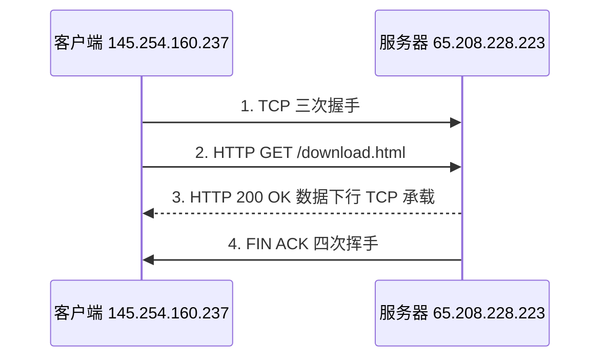
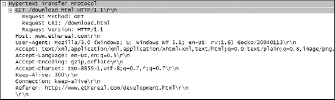
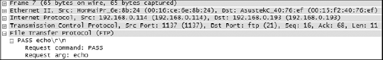
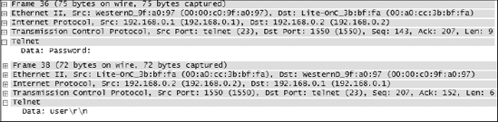

## 1. DNS：域名系统

**DNS（Domain Name System, 域名系统）**（RFC 1034/1035）把 `www.example.com` 这类域名翻译成 IP 地址——网络层只认 IP 地址，而用户记住的只有名字。

### 1.1 基本交互

最常见的查询只需两个包：客户端向**递归解析器**（通常是运营商或公司内网的 DNS 服务器）发出 query，解析器回 response 带上答案。抓包里一次浏览网页往往连着十几条 DNS——页面引用的每个域（主站、静态资源、统计脚本……）都要各自解析。

观察要点：

- Query 与 Response 以 **Transaction ID** 配对，响应的 ID 必须等于请求——ID 不匹配或迟迟无响应即是异常。
- 响应里的 **Answer RRs**（应答记录数）与具体记录类型：A（IPv4）、AAAA（IPv6）、CNAME（别名，先解析别名再解析真身，抓包里常见两跳）、PTR（反向解析）、MX（邮件）。
- 传输层：通常 UDP 53 端口；响应超长（如 DNSSEC 或大记录集）回落 TCP 53。DNS 是 UDP 协议的常驻代表。

*图 6-12｜DNS 一问一答：请求域名、响应 IP*

过滤器：`dns`；只看响应：`dns.flags.response==1`；找解析失败（响应码非 0）：`dns.flags.rcode != 0`。

〔《简单》·DNS 小科普〕原书把递归结构讲得通俗：你的解析器若本地没有答案，会替你从根服务器一路问下来（根 → 顶级域 → 权威服务器），并把结果缓存起来——所以"刚注册的域名要等缓存过期才生效""换了 IP 却还有人访问旧服务器"这类现象，都是 TTL 在起作用。抓包看响应里的 **Time to Live 字段**（注意与 IP 头的 TTL 是两回事）就能解释"为什么有的机器拿到新 IP、有的还是旧的"。

### 1.2 寻找 HttpDNS

〔《艺术》·寻找 HttpDNS〕传统 DNS 走 UDP 53，运营商解析器可天然介入（缓存、劫持、导流）。于是 App 圈流行 **HttpDNS**：把"域名→IP"的查询改用 HTTP 请求发给服务商的 HttpDNS 服务器，绕开运营商解析器。识别方法：抓包里没有对应的 UDP 53 查询，应用却直接连上了陌生 IP；或 HTTP 请求的 URL/host 中出现知名 HttpDNS 服务商域名。这条线索在"假宽带""劫持"类诊断里很重要——**先弄清应用通过什么途径拿 IP，才能判断解析环节有没有被动手脚**。

## 2. HTTP：超文本传输协议

**HTTP（Hypertext Transfer Protocol, 超文本传输协议）**（PPA 引 RFC 2616，即 HTTP/1.1）是浏览器与服务器的对话。一次完整的 HTTP over TCP 交互在抓包里分为四幕（PPA 以经典样例包逐步演示）：

### 2.1 请求与响应长什么样

请求包展开 HTTP 层可见：请求方法（`Request Method: GET`）、URI（`Request URI: /download.html`）、主机头（`Host:`）、字符集与 Referer 等。**紧跟 HTTP 请求的是成片的 TCP 数据包**——HTTP 负责说"我要什么"，搬运全部由 TCP 完成。

服务器先用一行状态行作答：`200 OK` 表示成功并开始传输数据。常见状态码的抓包读法：

*图 6-7｜Packet Details 里展开的 HTTP GET 请求：方法、URI、主机头一览无余*

| 状态码 | 含义 | 排查指向 |
|---|---|---|
| 200 | 成功 | — |
| 301/302 | 重定向 | 看 Location 头去了哪 |
| 403 | Forbidden 服务器拒绝 | 服务端权限/风控问题（PPA 案例） |
| 404 | 资源不存在 | URL 错误或资源已移除 |
| 5xx | 服务器内部错误 | 服务端排障 |

PPA 的"It's Not My Fault!"案例是 403 的标准用法：用户坚称提交表单失败是公司网络捣乱，抓包后 Follow TCP Stream——请求正常送达、服务器亲口回答 403。**一屏流重组，责任归位**。

过滤器：`http`；只看请求：`http.request`；按方法/主机：`http.request.method=="POST"`、`http.host=="www.example.com"`。

### 2.2 HTTPS 的边界

如今的流量多已是 HTTPS（TLS 加密）。抓包能看到的只剩：TCP 握手、TLS ClientHello、证书往返与加密数据流——URL 路径与内容不可见；唯一的例外是 ClientHello 里的 **SNI**（Server Name Indication, 服务器名称指示）字段，它明文携带目标域名。诊断手段随之变化：看握手是否完成（证书问题）、看 SNI（访问了哪个站点）、看连接时序与流量大小（行为分析）。HTTPS 不是抓包的终点，只是把"内容取证"换成了"行为取证"。

## 3. FTP：文件传输协议

**FTP（File Transfer Protocol, 文件传输协议）**（RFC 959）用 **21 端口**传控制命令、**20 端口**传数据。PPA 的样例抓包把一次完整会话拆解得非常清楚：

1. TCP 三次握手（21 端口）；
2. 服务器发欢迎信息（220），提示送出登录凭证；
3. 客户端 `USER csanders` / `PASS echo`——**全部明文**，抓包一览无余；

*图 6-16｜FTP 登录的密码在抓包里清晰可见*

4. 客户端发命令干活，常见三个：

| 命令 | 含义 | 抓包里的作用 |
|---|---|---|
| `CWD` | change working directory 切换目录 | 确认客户端所在路径 |
| `SIZE` | 询问文件大小，如 `SIZE Music.mp3` → `2130` 字节级应答 | 下载前的预期流量估算 |
| `RETR` | 请求下载，`RETR Music.mp3` | 紧随其后的 FTP-DATA 包就是文件内容 |

过滤器：`ftp`（控制通道）、`ftp-data`（数据通道）。两条安全结论：一是**绝不用 FTP 传敏感数据**（FTPES/SFTP 替代）；二是它的明文特性反过来服务排障与取证——密码爆破类攻击靠逐包读 USER/PASS 明文即可实锤。

## 4. Telnet：反面的教材

Telnet（RFC 854）是文本化的远程终端协议，历史上用于管理服务器、交换机、路由器。PPA 的样例抓包完整演示了它的不设防：

- 开头约 30 个包是两端协商选项（终端类型、速率等）；
- 第 27 包亮出服务器身份（OpenBSD），随后登录提示、用户名 `fake`、密码 `user`——**每敲一个字符就是一个包**，逐字符明文过网；

*图 6-22｜Telnet 传输的密码，逐字符明文可读*

- 登录后在该会话里执行的每条命令同样可见。

它的明文特性在渗透场景被演示到极致：攻击者经 ARP 投毒截获管理员的 Telnet 会话，逐包拼出路由器的用户名与密码。结论只有一句：**远程管理一律用 SSH**，Telnet 只配活在隔离的实验环境里。

## 5. NFS 与 CIFS：文件共享协议

〔《简单》·NFS 协议的解析〕〔《简单》·剖析 CIFS 协议〕两册中文书用整整两篇讲文件共享协议——它们在企业内网无处不在，也贡献了大量"莫名卡顿"的案例。

**NFS（Network File System, 网络文件系统）** 是 Unix/Linux 世界的文件共享协议（样例分析基于 NFSv3）：客户端把远端目录挂载为本地路径，读写操作转化为 RPC（Remote Procedure Call, 远程过程调用）调用飞过网络。抓包看点：

- `LOOKUP`（找路径）、`GETATTR`（取属性）、`READ`/`WRITE`（搬数据）逐条对应文件操作；
- **一次"打开文件"背后是一串 LOOKUP/GETATTR**，高延迟链路上每一次往返都被放大——这就是"挂载的盘在广域网上慢得难以忍受"的抓包解释；
- 无响应的 READ/WRITE 调用即卡顿点，看时间列定位。

**CIFS（Common Internet File System, 通用互联网文件系统）** 是 Windows 的 SMB 文件共享在抓包里的名字。观察点与 NFS 平行：会话建立（Negotiate/SessionSetup，含 NTLM 认证，见第 6 节）、`Tree Connect`（连共享）、`Read`/`Write`/`Find` 等命令。《简单》强调的通用方法论：**文件协议的问题常被误诊为"网络慢"，抓包后按"每一步操作耗时"拆账，卡在哪一条命令上一目了然**。

过滤器：`nfs`、`rpc`（NFS 的承载层）、`smb || smb2`。

## 6. Kerberos 与 NTLM：Windows 的认证双雄

PPA 的协议清单里有 **Kerberos**（《简单》·无懈可击的 Kerberos 同章对应），Windows 域环境几乎每台机器的登录都靠它：

- 流程轮廓：客户端先找 **KDC**（Key Distribution Center, 密钥分发中心，通常就是域控）拿 **TGT**（Ticket-Granting Ticket, 票据授予票据），再凭 TGT 向目标服务换取 **ST**（Service Ticket）——全程不传密码本身，靠对称加密验证身份；
- 抓包特征：登录瞬间的 UDP 88 端口风暴（AS-REQ/AS-REP 换 TGT，TGS-REQ/TGS-REP 换 ST），随后每访问一个新服务出现一次 TGS 交换；
- 诊断价值：域机器登录缓慢，抓包看 88 端口交互——TGT 拿不到（时间不同步、找不到域控）还是 ST 换不到（SPN，Service Principal Name，服务主体名称注册问题），分得很清。

〔《艺术》·NTLM 协议分析〕老环境或非域场景的备胎是 **NTLM（NT LAN Manager）**：质询-响应式认证，不用明文传密码，但设计年代久远。抓包里嵌在 SMB 会话 setup（Negotiate/Challenge/Authenticate 三条消息）。原书抓包演示的价值不在教破解，而在**看清认证交互的每一步**：Authenticate 消息迟迟不来、服务器反复 Challenge，这些时序特征直接指向认证配置问题。现代结论：能上 Kerberos 就别留 NTLM，能上 SMB3 加密就更进一步。

过滤器：`kerberos`、`ntlmssp`。

## 7. 小结

应用层协议抓包分析的三板斧，三本书用法惊人一致：

1. **对账**——请求发了没有？响应回了没有？（Transaction ID / 状态码 / RPC 应答）
2. **拆时序**——把一次逻辑操作（打开文件、提交表单）所拆出的每一个协议动作的耗时排开，卡点自现；
3. **读内容**——明文协议（HTTP、FTP、Telnet）直接 Follow TCP Stream；加密协议（HTTPS、Kerberos）退而读交互模式与时序。

协议篇至此完整。
