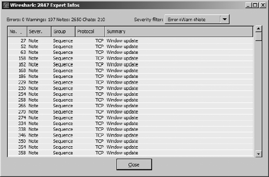
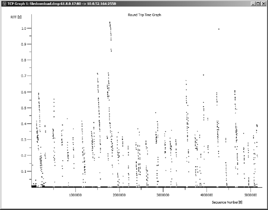
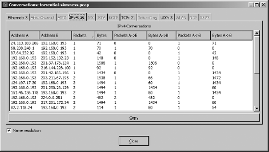
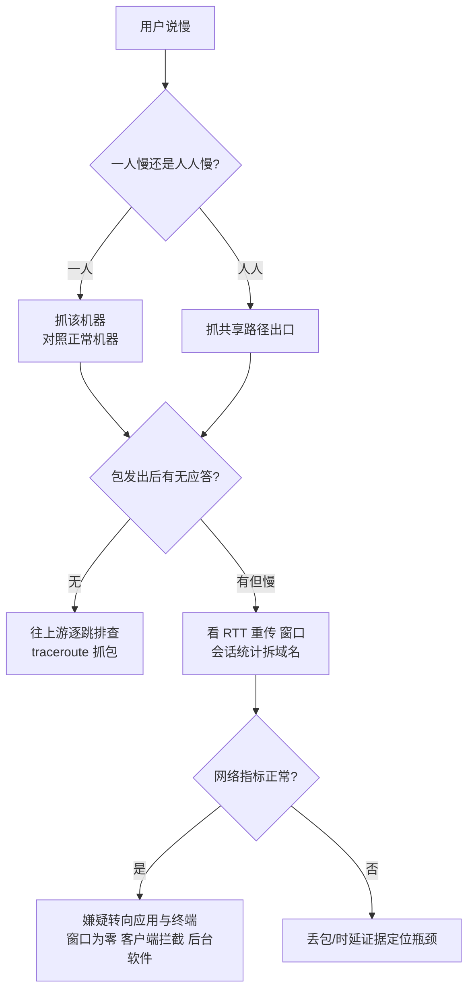

## 1. 案例框架：先想清楚，再抓包

PPA 的每个实战案例都套同一个模板，值得内化成条件反射：

| 步骤 | 问题 | 产出 |
|---|---|---|
| What We Know 已知条件 | 我们确定知道什么？哪些是推测？ | 事实清单，排除想象 |
| Tapping into the Wire 嗅探定位 | 问题涉及哪些设备？在谁身上抓？什么时候抓？ | 抓包方案(位置 × 时机 × 过滤器) |
| Analysis 分析 | 数据包显示了什么？与"正常"差在哪？ | 证据链 |
| Summary 结论 | 根因是什么？怎么修？怎么防复发？ | 处置与预防 |

两条铁律贯穿所有案例：**对照法**——找一台正常的机器或一次正常的会话做基线，差异处就是嫌疑处；**收窄法**——哪怕一轮分析没直接给出答案，只要把嫌疑范围从"全网几百台"缩到"某一台/某一段"，就是巨大胜利。

## 2. 入门案例：连不上的艺术

### 2.1 没有互联网连接：一次 ARP 的背叛

新装的两台相邻电脑，Barry 的能上网，Beth 的不能。已知：配置"完全一样"。对照抓包：

- Barry 的抓包：ARP 广播找**默认网关 192.168.0.10** → 收到应答 → TCP 握手 Web 服务器 → HTTP 数据，教科书式成功。
- Beth 的抓包：ARP 广播找的却是 **192.168.0.11**，无人应答；随后出现一大片 **NetBIOS 流量**。

两个教训。其一，ARP 找的地址不同 = 默认网关配错了（一查果然，手误多打了个 1）。其二，**NetBIOS 是"TCP/IP 不通才启用的备胎"**——正常流量里不该看见它，见到就是"主路径已死"的信号。配置类问题，对照一台正常的机器最快。

### 2.2 IE 里的幽灵：开机即上风的软件

用户 Chad 声称浏览器被"鬼附身"：主页每次重启都变回天气网站。抓包策略：问题只在开机后出现 → 在**开机时刻**抓（用 hubbing out，不装工具到嫌疑机）。

开机全程无人操作，抓包里却涌出成片 HTTP GET 与 DNS 查询——正常开机不该有这些。顺 DNS 查询看到 **weatherbug.com** 域名：一个天气桌面小程序在每次开机时联网拉取并改写主页。卸载，驱魔成功。

教训：**"闹鬼"型故障先怀疑后台软件**；数据包面前没有玄学。

### 2.3 拒人千里的 FTP：服务端三板斧

新 FTP 服务器，远程客户端连不上。双侧抓包对照：

- 客户端侧：SYN 发出 → 石沉大海 → 隔几秒再 SYN，共三次后放弃。客户端行为完全正确。
- 服务器侧：同一串 SYN 原样到达（仅源目的互换）——**包到了，服务器不理**。

服务端无视连接的三种可能，逐一排除：服务没启动？（确认在跑）负载过高缓冲爆满？（新机器零负载）**包被故意丢弃？——防火墙开着，挡了 FTP 端口。**定位就完成了。

教训：抓包不一定直接给出答案，但把嫌疑钉死到一台机器上，排障成本已骤降一个数量级。

## 3. 慢网络：三把解剖刀

"网络慢"是 IT 部门听得最多的抱怨。第一反应不该是修网，而是**先证明到底慢在哪**——很多"慢网络"其实是一台慢机器或一个慢应用。本节用三个案例演示三把解剖刀：Expert Info 体检、RTT 图量化、traceroute 定位。

### 3.1 Expert Info 先给体检报告

对一份慢下载的抓包（PPA `slowdownload.pcap` 案例流程）：打开 `Analyze ▸ Expert Info`，把 Severity filter 调到 Error+Warn+Note 滤掉闲聊，映入眼帘的是：

- **TCP Window Update** 成片——窗口在频繁调整本身中性，但说明吞吐在抖动；
- **TCP Previous segment lost**——传输途中段丢了；
- 紧跟其后的 **TCP Dup ACK** 串——客户端反复催促重传；
- 随后 **TCP Retransmission**——快速重传补缺。

*图 8-3｜Expert Info 汇总了整份抓包的异常：成片的窗口更新、丢段与重传*

下载初期 Dup ACK 一两个，越到后面越密——**丢包与恢复的循环在加速恶化**，这就是"越传越慢"的抓包指纹。

### 3.2 RTT 图把"慢"量化

`Statistics ▸ TCP Stream Graph ▸ Round Trip Time Graph` 画出该流全程的往返时延（RTT，Round-Trip Time）。健康基准（PPA 给的经验值）：下载类流量 RTT 不应超过 **0.1 秒**，理想在 **40 ms** 以内；这份抓包开局就冲过 1 秒——问题确凿且严重。RTT 图的价值在于把"感觉慢"变成"第几秒起、慢到多少毫秒"的可陈述证据。

*图 8-6｜往返时延图：开局就超过 1 秒，远超健康基准*

### 3.3 慢路由：traceroute + 抓包定位卡点

用户 Owen 抱怨上网慢，且同网段所有人都慢——问题在共享路径上。用 ICMP traceroute 探路并抓包分析：

- 探测包 **TTL（time-to-live，生存时间）**=1 发出，应回 ICMP **type 11（TTL exceeded）**，却**没有回应**——内网第一跳路由器无应答；
- 每个探测重试 3 次（间隔约 3 秒）后放弃，TTL=2 的探测正常收到 type 11——第二跳起全部健康。

结论：瓶颈锁定在内网出口路由器。抓包不负责修路由器，但把"网慢"这个大雾弹钉到了一台设备上——这正是"跨网段问题要在路由两侧取证"方法论的标准应用。

## 4. 重复包与子网掩码：Double Vision

新员工 Jeff 的新电脑，高峰期慢到服务不可用。打开抓包吓一跳：**每个包都有两份**。

*图 8-14｜包列表里成对出现的重复包*

重复包的两大成因：路由不一致、端口镜像配错。鉴别步骤：

1. **IP 头的 Identification 字段**配对：两份包的 ID 相同（如 `0xc509`）→ 确是真重复，非巧合；
2. **比对 TTL**：一份 TTL=47、另一份 TTL=46——差 1 说明第二份**多过了一台路由器被弹回来** → 路由问题，而非镜像问题。

唯一受害的只有 Jeff 的机器 → 问题在本机配置：**子网掩码错了一位**，本该直发的包全被绕行路由器一圈再弹回，流量翻倍，高峰期自然崩。对照 TTL 差值判重复包来源，这一手值得写进肌肉记忆。

## 5. 被弹窗拦截的会话：9 秒与 55 秒

Eric 打不开 Novell 网站的某个版块，浏览器无限转圈。抓包里 HTTP 事务进行到 27 包一直正常，**第 27、28 包之间突然出现 9 秒空窗**——除非在等用户输入，否则不可接受。9 秒后服务器放弃，发 **RST** 断连；客户端又过了 **55 秒** 才 ACK 这个 RST。

*图 8-19｜第 28、29 包之间 9 秒空窗后服务器 RST，客户端 55 秒后才确认*

Follow TCP Stream 逐行读：客户端在页面加载中发出了一个 **Flash 小程序的请求**，正是它被客户端的**弹窗拦截软件**挡住——页面主内容等这个组件，等到服务器超时。过滤法：`http.request.method=="GET"` 串起来读，卡点前最后一个请求就是病灶。

教训：**时序上的异常空窗 + 流重组的上下文**，两头一夹，浏览器自己都说不清的问题水落石出。

## 6. P2P 吃满带宽：两兄弟案例

### 6.1 BitTorrent：27 条会话的秘密

全公司上网慢，边界路由器 CPU 高企。在路由器上做 Port Mirroring（路由器装不了 Wireshark），抓 1 秒样包：

- 内网一台机器 `192.168.0.193` 反复出现，与大量外部 IP 建连；
- 多数包 **PSH 标志置位**（要求接收方跳过缓冲直接上送）——几乎所有 P2P 客户端的通病动作；
- Conversations 窗口显示这 1 秒内 **27 条并发 TCP 会话**——一台工作站的架势。
- WHOIS 查那些外部 IP？天涯海角无规律；Follow TCP Stream？全是乱码。高级手段全部哑火。

*图 8-22｜Conversations 视图：1 秒内 27 条并发会话*

最后用的是最笨也最可靠的一招：**逐包滚列表**。第 44 包的 Info 列明晃晃写着 BitTorrent 服务器——元凶落网：有人装了 BT 下载音乐，不限上传下载速率，一台机器吃掉整条出口带宽。

### 6.2 Gnutella：243 条会话与 6346 端口

同款症状 + 本机也卡的新线索，受害者是 Tina 的机器。为不给病重的机器添负担，改用镜像抓包。Conversations 窗口：**81 条 IP 会话、243 条 TCP 会话**，绝大多数只有一两个包（SYN 无应答或被 RST）——典型的 P2P 疯狂探测。

在 IPv4 页按包数排序，最活跃的会话与 `65.34.1.56` 的往来里现出 **Gnutel** 字样的包（Gnutella 网络），Packet Bytes 里赫然一条 GET 命令在下载不良内容；另一佐证：全部连接走 **6346 端口**——查 IANA 端口表即知身份。

两案例合起来的方法论：**会话数量异常 → 排序找最大会话 → 端口/字节窗格验明正身**。同时也承认：有时最快的路径就是老老实实滚列表。

## 7. 邮件服务器：POP 通道的洪水

全员抱怨邮件慢，内部互发也要 10–15 分钟。问题收敛到唯一邮件服务器，直接在服务器上抓包：

- 入站的 **POP**（Post Office Protocol, 邮局协议）包密集到离谱；
- 把时间格式调成"自抓包开始"，看最后一个包——短短两分钟的抓包容量惊人；
- Follow TCP Stream 读邮件内容：多封邮件带着 **`.pif` 附件**（Program Information File, 可执行程序——正经邮件不该有），发件人地址可疑。

结论：垃圾邮件（可能夹带病毒蠕虫）洪水灌站，邮件服务器忙于收垃圾，正常邮件跟着遭殃。处置：上企业级反垃圾网关。这个案例顺带示范了 POP 的明文属性——邮件正文在抓包里原样可读，与 FTP/Telnet 同列"勿传敏感内容"名单。

## 8. 中文世界的经典案例：主题式整理

两册林沛满著作的案例以故事见长，以下按其篇目主题整理分析套路（细节以原书为准）。

### 8.1 Linux 为什么卡住了

〔《艺术》·答读者问开篇〕症状：一台 Linux 机器"卡住/假死"。原书的切入点是先问一句：**是"死了"还是"活着但慢"？** 抓包一验便知——网络栈还能按序回应，说明内核活着，慢在某个具体环节；包都不回才是真死。把"卡"翻译成"哪一步的时延异常"，是这类案例的通用第一步；文件服务器类卡顿再按"每一步操作的往返耗时"逐条拆账，卡点常在高延迟链路上的串行往返。

### 8.2 微博为什么会卡

〔《艺术》〕"某 App 很卡"的抓包拆法：如今的 App 一次刷新要从**几十个域名**拉内容。分析顺序：DNS 解析耗时（有没有解析慢、解析失败、被 HttpDNS 绕行——即应用不走常规 DNS、改用 HTTP 请求向服务商拿 IP）→ 每个域名的建连成本（TCP 握手 + TLS 握手各多少 RTT）→ 关键资源所在链路的 RTT 与重传。App 卡常常不是"网络慢"，而是**串行的多次往返 × 高 RTT** 的乘法。IO Graph 与会话统计先定位"时间花在哪个域名"，再下潜到包。

### 8.3 假宽带真相

〔《艺术》·生活中的 Wireshark〕"办的 100M 宽带跑不出 100M"的验证套路：本机抓包跑测速，IO Graph 看实测吞吐曲线——是稳定顶格、持续爬不上去，还是被打回？再配合 traceroute 看流量实际走向。原书借此讨论运营商侧的缓存与代理介入对"实际体验"的影响。方法论要点：**承诺带宽是对"接口速率"的承诺，不等于你访问的每个目标都能跑满**；抓包把"宽带不假"还是"路径不济"分开举证。

### 8.4 举重若轻的工程师素养

〔《简单》·举重若轻〕这一辑的六篇故事（"一小时内给你答复""午夜铃声""深藏功与名"等）技术细节让位于叙事，但反复敲打同一组职业品格，与 PPA 的案例框架互为表里：

- **响应有节奏**：接报先给"何时有结论"的预期，再动手取证；
- **半夜的告警靠平时的基线**：没有健康时的抓包存档，事故时的抓包无从对比；
- **把分析沉淀成文档**：结论要能被别人复核，证据（抓包文件 + 过滤器 + 时序图）要随结论一起归档。

## 9. 小结

性能案例的通用决策树：

记住这章案例反复验证的一句话：**大多数"网络慢"最终不是网络的问题——但只有抓过包的人才有资格下这个结论。**
