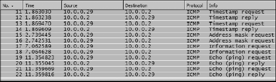
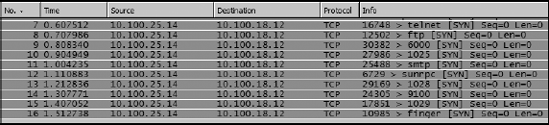
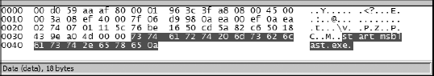
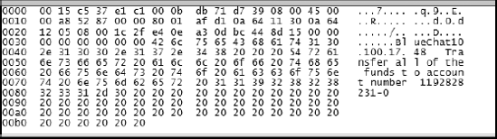
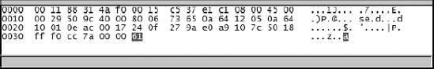

## 1. 安全视角：嗅探是把双刃剑

PPA 在安全篇的开场设了一个思想实验：**如果一位懂抓包的攻击者看向你的网络，他能看见什么？** 答案取决于两件事——你的网络里有多少明文协议在跑，以及谁有能力把嗅探器放到正确的位置（端口镜像、集线器接出、ARP 投毒，这三种手法在攻击者手里一个不差）。本篇先看防御者如何用抓包发现入侵，最后再借"黑客视角"理解对手。

先立三个安全分析的常备过滤器：

```text
icmp.type==13 || icmp.type==15 || icmp.type==17   # 罕见 ICMP 探测
tcp.flags.syn==1 && tcp.flags.ack==0               # 所有建连尝试
ftp.request.command == "USER" || ftp.request.command == "PASS"  # FTP 登录
```

## 2. OS Fingerprinting：操作系统指纹

**OS Fingerprinting（操作系统指纹探测）** 是攻击者摸底的手段：向目标发一组特殊的探测包，从应答特征推断其操作系统，进而检索对应漏洞。

抓包里的长相（PPA `osfingerprinting.pcap` 案例）：成片的 ICMP 流量里，Echo request/reply 属正常，混在其间的 **Timestamp request（type 13）、Information request（type 15）、Address mask request（type 17）** 才是警报——正常业务几乎不产生这三类包。用第 1 节的第一个过滤器一秒筛出。发现后：追查源地址、在边界拦掉该类探测、确认目标主机是否已有后续异常访问。



*图 9-1｜混在正常 ping 里的 Timestamp、Information、Address mask 请求——探测的痕迹*

## 3. 端口扫描：敲门声一片

**端口扫描（port scan）** 用建连尝试逐个试探目标端口，摸清哪些服务在听——**每个开放的端口都是一条通往城堡的秘道**（PPA 语）。

抓包特征一目了然：

- 单一外部源 IP 向本机**一个接一个的不同端口**发 SYN（21 FTP、23 Telnet、445 microsoft-ds、25 SMTP……）；
- 目标端口恰好集中在**常被利用的知名端口**上；
- 端口未开放则回 RST，开放则完成握手——扫描器靠回应差异绘制端口地图。

用过滤器 `tcp.flags.syn==1 && tcp.flags.ack==0 && ip.src==嫌疑 IP` 拉出全部建连尝试，看目的端口序列即实锤。防火墙层面的根治办法是默认拒绝、按需开放。



*图 9-2｜端口扫描现场：同一来源逐个试探本机端口*

## 4. 字典攻击：FTP 爆破现场

场景（PPA `ftp-crack.pcap`）：内部 FTP 服务器夜间流量异常，且服务器软件没有日志功能——只有抓包能破案。

在服务器侧镜像抓包，应用第 1 节的登录过滤器，真相浮现：

- **密集的 USER/PASS 失败**，一次失败紧接下一次尝试；
- 猜的密码按**字母表顺序**推进——典型的字典爆破工具行为；
- 相邻尝试间隔**短于人类手速**——机器干的。

顺藤摸瓜：攻击源是**内网一台机器**（`10.234.125.254`）。下一步的抉择与抓包无关但必须做：是该机器的使用者监守自盗，还是机器已被入侵沦为跳板？处置：封账号、换强密码、给 FTP 服务加认证失败锁定，并排查源头主机。

这个案例的方法论价值：**没有日志的服务器，抓包文件本身就是日志**。

## 5. 蠕虫与间谍软件：三个现场

### 5.1 打印机的洪水：SPOOLS 找源头

公司网络打印机不停吐垃圾文件，清空队列立刻再满。打印机经服务器共享、无日志——在服务器上抓包：海量 **SPOOLS**（打印队列协议）包来自内网某客户端 `10.100.17.47`。Follow TCP Stream 直接读出打印内容出自 Microsoft Word、用户名 `csanders`。源头锁定，剩下的判断是该用户在恶作剧还是其机器已被攻陷——无论哪种，这台客户端都需要体检。

### 5.2 Blaster 蠕虫：60 秒倒计时

Eddy 的电脑每次开机 60 秒后被强制重启，循环往复——2003 年震荡波/冲击波家族的招牌症状。**怀疑恶意软件时不要把嗅探器装在嫌疑机上**（恶意程序会干扰嗅探器），改用镜像抓包，从开机抓到强制关机：

- 倒计时期间机器理应无事可做，却持续向内网其他机器的 **1793、4444 端口**发包——异常网络活动；
- 逐包翻 Packet Bytes 窗格找原文：某包引用了 `C:\WINNT\System32`（系统核心目录，出现在网络包里即为警报），另一包赫然写着 **`msblast.exe`**——Blaster 蠕虫的主体文件名。



*图 9-12｜Packet Bytes 窗格里现形的 msblast.exe*

处置与研究并举：隔离查杀之外，**记录蠕虫使用的端口与服务**，在防火墙封堵，防止下一台机器中招——这正是 PPA 强调的"多走一步"：弄清"为什么发生"比"恢复运行"更有长期价值。

### 5.3 邪恶程序：从 RPC 到 virtumonde

Mandy 的浏览器主页被随机改写、弹窗不断（表象与"开机被后台软件改主页"的间谍软件同款，但这次更凶）。开机抓包逐段读：

1. 开机头两个包正常：DHCP 请求 + 免费 ARP（gratuitous ARP，上线时广播宣告自己、探测地址冲突）；
2. **TCP/IP 还没初始化完，就有外部主机来连 5554 端口**——此时任何入站连接都可疑；随后又试 9898；
3. 本机就绪后对这些敲门回以 **RST**（无服务在听，内核礼貌拒绝）；
4. 放行正常流量（过滤掉杀毒软件更新 `!ip.addr==216.49.88.118`）继续观察；
5. 第 357 包：外部主机发起 **DCEPRC（RPC, Remote Procedure Call, 远程过程调用）**——要求**远程启动本机程序**，性质骤变；
6. 顺流而下：本机竟向 `updates.virtumonde.com` 发起 DNS 查询并下载 `bkinst.exe`——搜索引擎一查，virtumonde 是知名间谍软件家族。

完整证据链：**RPC 漏洞被利用 → 下载恶意载荷 → 回连更新服务器**。比查杀更重要的是给防火墙封堵这组端口与域名。

## 6. 隐蔽信道：藏在 ICMP 里的情报

场景（PPA `covertinfo.pcap`）：安全官怀疑两名员工在密谋转移公司资产，需要在**对方毫无察觉**的前提下监看两台机器——同样用镜像（不惊动机器），对每台各设一条镜像。

日常流量里用过滤器筛"不该出现的协议"（RPC、NetBIOS、ICMP 之类的点对点私通），命中：**两台工作机在上班时间互相 ping**。再看 Packet Bytes 窗格——这份 ping 的**载荷里藏着文字情报**。



*图 9-14｜"ping"的载荷里藏着密谋文字*

这套技术名为 **Loki**：把数据嵌进 ICMP 回显包的载荷里，借"无害的 ping"传递消息。隐蔽信道不限于 ICMP——TCP 头的保留位、ARP 包的字段都能夹带。方法论就一句话：**当流量"理由不充分"时（为什么这两台机器要互相 ping？），字节窗格是最后的验尸台。**

## 7. 谁动了我的网络

〔《艺术》〕"网络里有不速之客"类问题的排查套路，整理如下：

- **先问基线**：拿健康时段的协议分布（Protocol Hierarchy）与会话统计对比，占比突变的协议、新增的会话对象就是嫌疑人；
- **认设备**：ARP 表与抓包里出现陌生的 MAC（对照厂商前缀）、IP 冲突（出现免费 ARP **应答**即为冲突信号），说明有未登记的设备接入；
- **认流量**：出口方向出现与业务无关的目的地（批量 POST、陌生域名解析），顺着会话统计与 DNS 查询追；
- **验内容**：Packet Bytes 里读不出业务语义的载荷，按第 6 节的隐蔽信道思路深挖。

与 PPA 的安全案例殊途同归：**异常的定义来自基线，证据的落点在于字节。**

## 8. 黑客视角：一次完整的 ARP 投毒窃密

PPA 安全篇的压轴案例换到攻击者座位上，看防御体系的另一面：

- **手段**：Cain & Abel 做 ARP Cache Poisoning——伪造 ARP 应答，把"网关 IP 对应我的 MAC"灌给管理员的主机，使其发往网关的流量全部先流经攻击者再转发出去，即中间人位置；
- **猎物**：管理员与路由器之间的 **Telnet 会话**——明文协议；
- **过程**：Telnet 是逐字符传输的协议，抓包里用户名与密码**一个字母一个包**地滚过：`a`、`d`、`m`、`i`、`n`……密码同样逐字拼出。攻击全程对管理员不可见。



*图 9-17｜被截获的 Telnet 会话：一个包只有一个字母*

这个案例是全书安全篇的总结陈词：**只要还有明文协议与可投毒的二层环境，任何加密手段之外的防线都形同虚设。**反制清单因此明确：

1. 远程管理一律 SSH/TLS，明文协议（Telnet、HTTP、FTP、POP）出局；
2. 交换机开启动态 ARP 检测（DAI）、DHCP Snooping，封死投毒路径；
3. 敏感链路上加密（VPN/TLS），让中间人只能看见密文；
4. 定期用本篇的过滤器自查：罕见 ICMP、异常 SYN、明文凭证。

## 9. 小结

安全类抓包的通用语法与性能类一致——**基线定异常、过滤器聚焦、字节窗格定罪**——差别只在"异常"的定义换成了威胁情报：不该出现的 ICMP 类型、不该开放的端口、不该有的会话对象、不该明文的凭证。三本书在这一篇的原素材横跨 2003 年的 Blaster 与 2016 年的 HttpDNS，手法在变，方法论未变。
