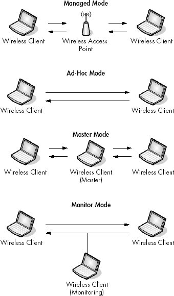
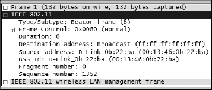
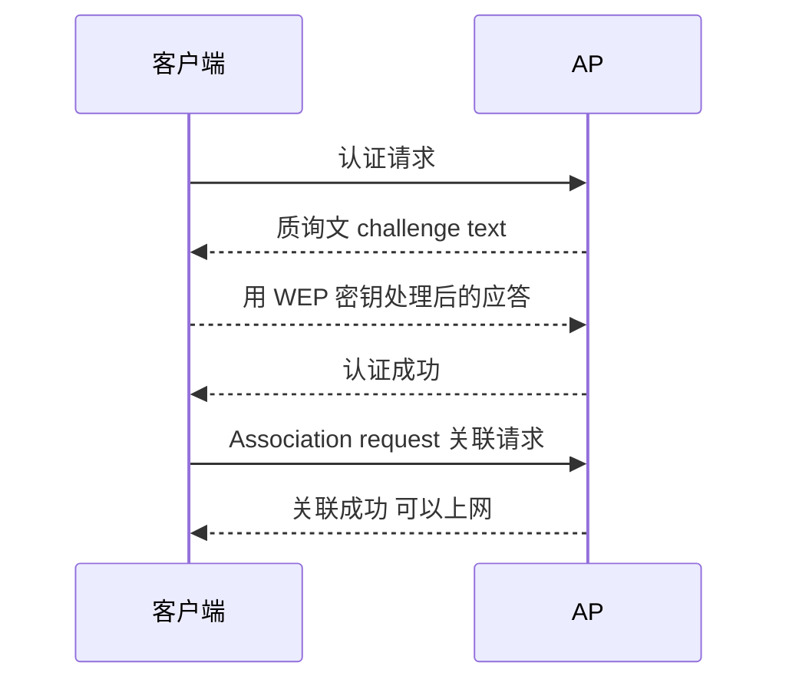
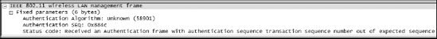

## 1. 无线抓包与有线的三个不同

无线网络的世界与有线截然不同，抓包方式也随之重构。PPA 总结的关键差异：

1. **一次只能听一个信道**。北美 802.11 有 11 个信道可用（更多地区更多），要抓某个客户端或接入点的流量，先得知道它在哪个信道上广播。土办法 **channel hopping**：开抓包，快速逐信道切换，看到目标流量就停——不优雅，但有效。
2. **信号干扰不可控**。空气中的数据天然可能被干扰：大反射面、大件刚性物体、微波炉、2.4 GHz 无绳电话、厚墙、高密度材质都是敌人。抓包时尽量**靠近目标设备**——隔一层楼就别指望收全包。
3. **需要监听模式**。有线抓包靠混杂模式（网卡不再丢弃目标非本机的帧），无线抓包的入场券是网卡的 monitor mode（见下节）。

## 2. 无线网卡的四种模式

| 模式 | 行为 | 谁在用 |
|---|---|---|
| Managed mode | 客户端连到接入点，由 AP 管理全部通信 | 绝大多数日常使用 |
| Ad-hoc mode | 两台客户端直连，自组网络，无 AP | 临时点对点 |
| Master mode | 网卡配合驱动扮演 AP | 高端网卡/软 AP |
| **Monitor mode**（又称 RFMON） | **只听不发**，捕获空中的所有帧 | 抓包专用 |

抓包的核心要求：**网卡与驱动都支持 monitor mode**。为此购置分析用网卡时，第一项检查就是它。



*图 10-2｜无线网卡的四种工作模式*

> 时效注解：PPA 时代 Windows 上无线抓包几乎唯一的选择是 CACE Technologies 的 **AirPcap** USB 适配器（配合 WinPcap 驱动与专属配置面板：选接口、选信道、是否保留 802.11 帧校验、802.11+Radio 头、WEP 解密密钥）。AirPcap 早已停产；如今 Npcap 在部分支持 monitor mode 的无线网卡上可直接开启监听（勾选抓包选项里的 Monitor Mode，并指定信道），macOS 的诊断工具亦可导出监听抓包。原理与下文的分析方法完全不变。

## 3. 在 Linux 上抓无线包

Linux 一直是最省事的无线抓包平台：开启 monitor mode 即可。PPA 给出的经典 `iwconfig` 流程（注意现代发行版已用 `iw` 取代，命令对照附后）：

```bash
# 查看无线接口与当前模式（旧工具 iwconfig）
iwconfig
# Eth1 显示 IEEE 802.11g Mode:Managed 说明是普通客户端模式

# 切换为监听模式（需 root）
su
iwconfig eth1 mode monitor
iwconfig eth1 up

# 换信道(可边抓边换,也可写成脚本自动跳信道)
iwconfig eth1 channel 3
```

现代等效命令：

```bash
ip link set wlan0 down
iw dev wlan0 set type monitor
ip link set wlan0 up
iw dev wlan0 set channel 6
```

配置完成，打开 Wireshark 选该接口开始抓包。

## 4. 802.11 帧的额外字段

无线帧比有线帧多出一个 **802.11 头**，承载介质与帧本身的元信息。展开后重点关注：

- **Type/Subtype**：帧类型三大家族——**管理帧（management）**、**控制帧（control）**、**数据帧（data）**，各自再细分类型（如管理帧下的 beacon、认证请求、解除关联）；
- **Address 字段与 BSS Id**：源地址、目的地址之外还有 BSS Id（基本服务集标识，通常就是 AP 的 MAC）——多 AP 环境里区分"这是哪个塔下的流量"全靠它；
- **Fragment/Sequence Number**：无线帧自己的分片与排序号（与 IP 分片、TCP 序号是三套独立体系）。

**Flags 标志位**里高频使用的几个：

| 标志 | 含义 |
|---|---|
| From DS / To DS | 帧的方向：AP→客户端 / 客户端→AP / 双 0 多为 AP 发出的广播 |
| More Fragments | 还有后续分片 |
| Retry | 重传帧标记 |
| PWR MGT | 客户端进入省电状态 |
| More Data | AP 提醒客户端还有包在排队 |
| **Protected** | **是否加密**——区分加密与明文流量的开关 |
| Order | 要求按序处理，禁止重排优化 |

## 5. Beacon 帧：AP 的自我介绍

**Beacon 帧（信标帧）** 是管理帧里信息量最大的一种：AP 周期性广播，宣告"我存在，连我要满足这些条件"。一份 beacon 帧读出整座 AP 的档案：

- **SSID parameter set**：广播的网络名；
- **Supported rates / Extended supported rates**：支持的速率集，顺带暴露 802.11b/g 代际；
- **DS parameter set**：所在信道——**找信道最省力的办法就是抓一个 beacon**，不用 hop；
- **Vendor-specific information**：芯片厂商等私有信息（芯片商不等于 AP 品牌商）。



*图 10-9｜Beacon 帧详情：SSID、支持速率、信道、厂商信息一样不缺*

过滤器：`wlan.fc.type_subtype == 8`。

## 6. 无线专用列与过滤器

### 6.1 给包列表加两列

无线抓包建议在 Packet List 加两列（Edit ▸ Preferences ▸ Columns）：

- **RSSI**（Received Signal Strength Indication, 接收信号强度）——信号好坏看实测数字，别信客户端软件的"信号极佳"；
- **TX Rate**（发送速率）——该帧的实际速率。

排障实战中两者配合：客户端软件宣称满格信号，抓包一看 RSSI 惨淡、TX Rate 一路降档——谎言当场拆穿。


*图 10-10｜给包列表加上 RSSI 与 TX Rate 两列*

### 6.2 常用过滤器

共享介质上的抓包混着几十个客户端的流量，过滤是无线分析的主旋律。按帧类型：

```text
wlan.fc.type eq 0        # 管理帧
wlan.fc.type eq 1        # 控制帧
wlan.fc.type eq 2        # 数据帧
(wlan.fc.type eq 2) and !(wlan.fc.subtype eq 4)   # 数据帧且排除 NULL 帧
```

常用子类型（type_subtype 值速查）：

| 子类型 | 值 | 子类型 | 值 |
|---|---|---|---|
| Association request/response | 0 / 1 | Authentication / Deauthentication | 11 / 12 |
| Reassociation request/response | 2 / 3 | RTS / CTS | 27 / 28 |
| Probe request/response | 4 / 5 | ACK | 29 |
| **Beacon** | **8** | NULL data | 36 |
| Disassociate | 10 | QoS data | 40 |

NULL data 帧是网卡/AP 换信道前的通告，多数分析场景可滤掉。按目标 AP：

```text
wlan.bssid == 00:11:23:44:55:66    # 只看某个 AP 的流量
```

按加密状态（rogue AP 检测、明文敏感信息排查的利器）：

```text
wlan.fc.protected eq 0    # 未加密流量
wlan.fc.protected eq 1    # 加密流量
```

## 7. 案例：WEP 认证为什么失败

Justin 的笔记本连不上公司无线（WEP shared-key 认证，信道 1）。无线客户端软件的通病：**只报"连不上"，不说为什么**——抓包是唯一的显微镜。

先抓一份**成功的连接**做基线（PPA 的对照法在无线场景的标准应用）。WEP shared-key 认证是一场**质询-应答**：



失败样本里：质询发出（第 3 包）、客户端应答（第 5 包），然后等来的不是"成功"而是失败——**序号对不上**，说明应答内容不正确：**WEP 密钥没输或输错**。客户端软件给不出的原因，空中两秒的抓包给得清清楚楚。



*图 10-18｜认证失败的报文直接点名：序号未按预期出现*

> 时效注解：WEP（Wired Equivalent Privacy, 有线等效加密）早在 2001 年就被证实可暴力破解，如今出现在任何网络里都是事故本身。现实中的无线认证排障对象是 WPA2/WPA3（抓包特征为 4-Way Handshake），但"成功样本 + 失败样本逐帧对照"的方法论完全一致。

## 8. 小结

无线抓包的知识骨架：**一个信道一张抓包，monitor mode 是入场券，beacon 帧找信道，专用列看信号，按 type/subtype 与 BSS Id 过滤，认证问题靠成功样本对照**。工具生态与 PPA 成书时已天翻地覆（AirPcap 谢幕、WEP 入土），但"空气中的帧不撒谎"这件事从未改变。
