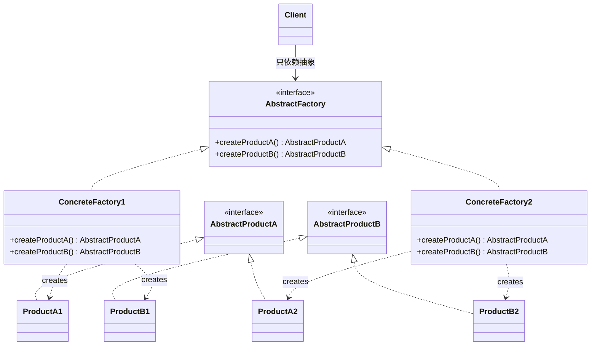
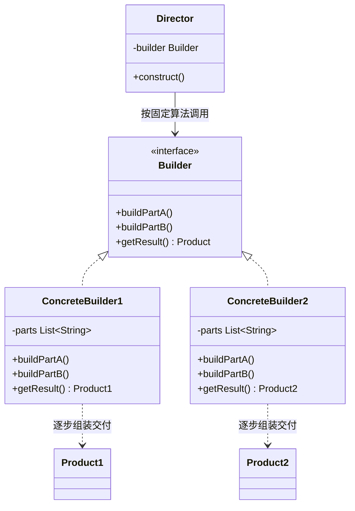
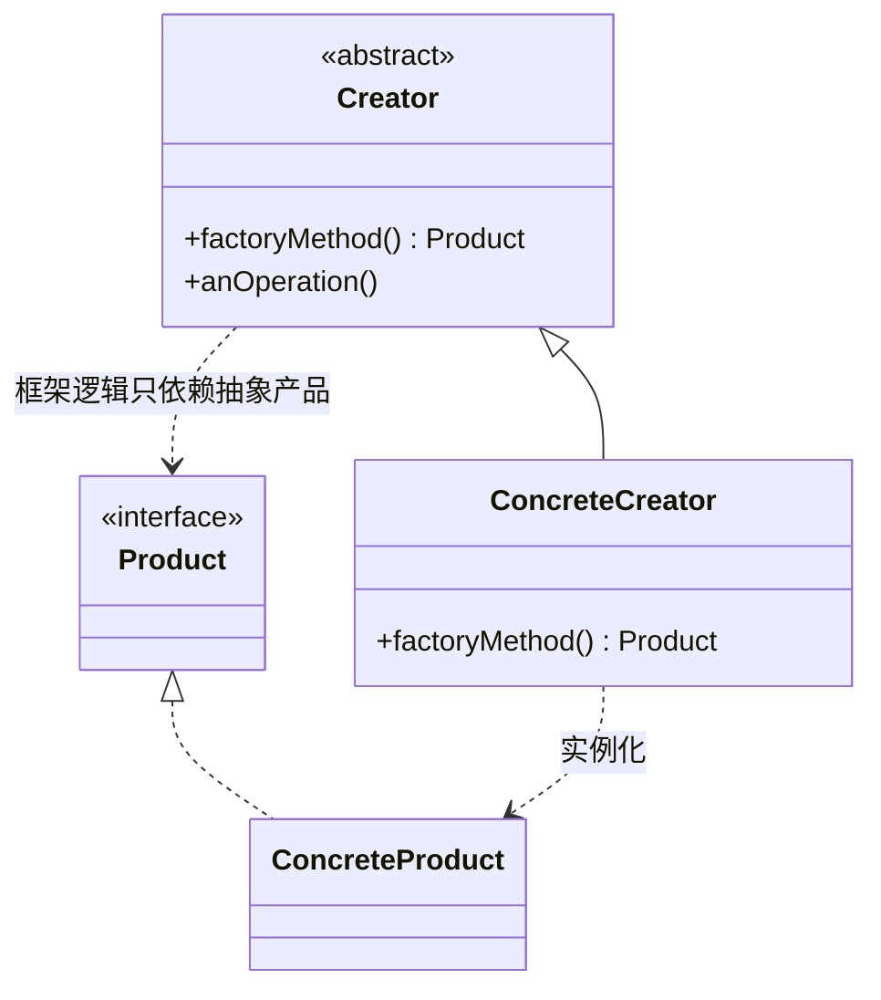
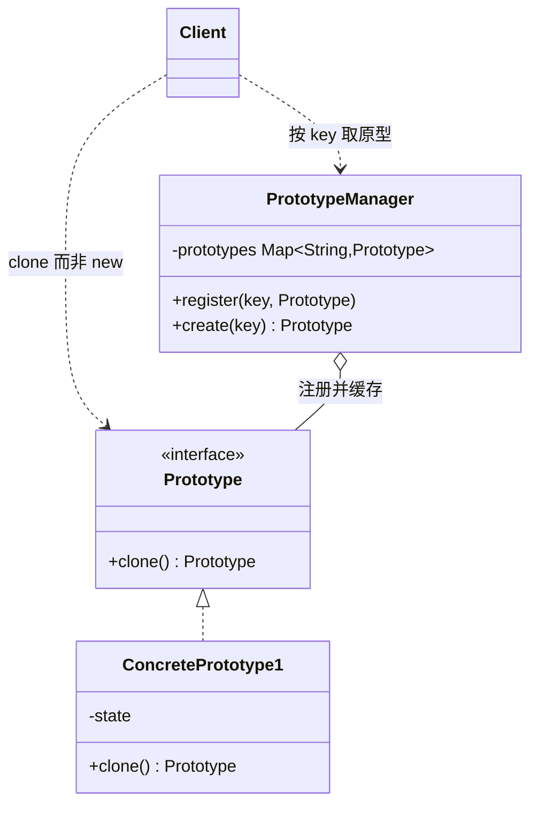
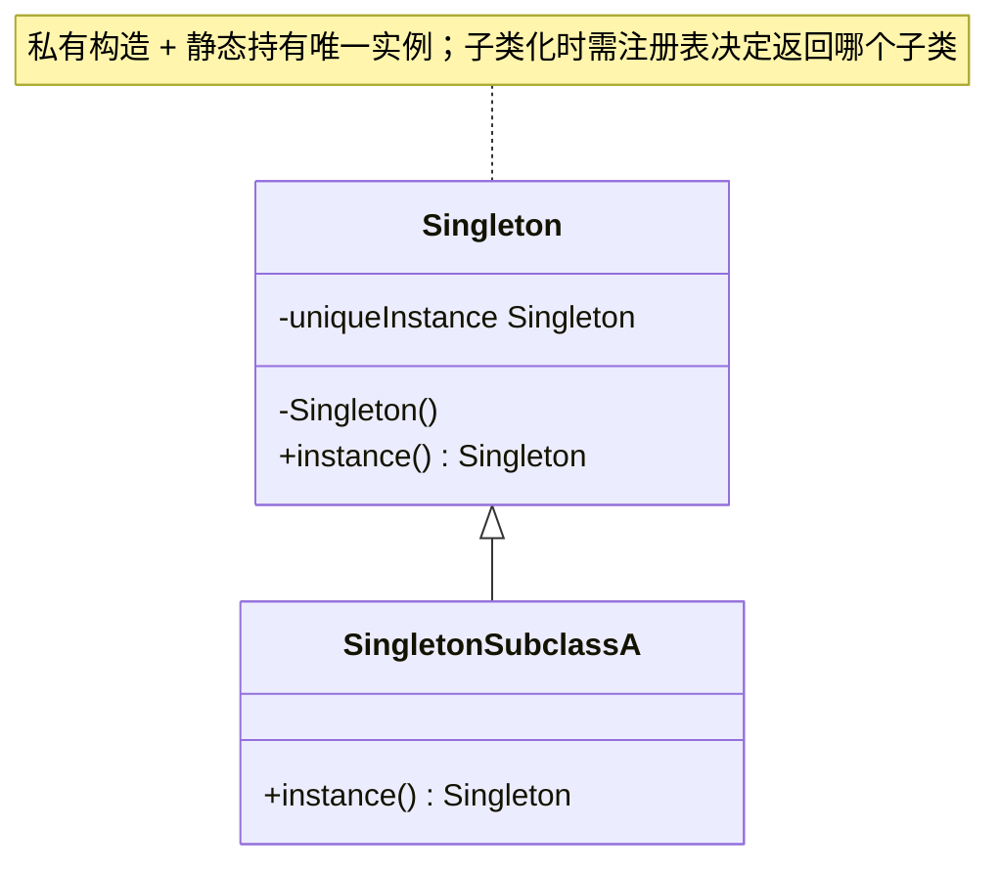

# Creational Patterns（创建型模式）

创建型模式抽象了**实例化过程**：它们把"系统如何创建、组合、表示它的对象"这一知识封装起来，让系统与具体类解耦。客户只操作抽象接口，由模式替它决定何时、如何、由谁创建具体对象。

5 个创建型模式：Abstract Factory、Builder、Factory Method、Prototype、Singleton。

> 类图为 mermaid；Sample Code 用 Java 还原原书的 Motivation 场景（原书为 C++/Smalltalk）。更多 Java 示例见上级目录《设计模式之一：Creational Pattern》。

## Abstract Factory（别名 Kit）

> 提供一个创建一系列相关或相互依赖对象的接口，而无需指定它们具体的类。
>
> Provide an interface for creating families of related or dependent objects without specifying their concrete classes.

### Motivation

一个 UI 工具包要同时支持多种 look-and-feel 标准（Motif、Presentation Manager、Mac）。如果客户代码直接 `new MotifScrollBar()`，换一种风格就要改动所有创建点。解法：为每族控件定义一个 **WidgetFactory**（MotifWidgetFactory、PMWidgetFactory……），客户只面向抽象的 WidgetFactory 与抽象控件编程，整个产品族的替换只需换一个工厂实例。

### Applicability

* 系统应独立于产品的创建、组合与表示方式
* 系统要在多个产品族中配置其一，并且这些产品族可整体切换
* 一族相关产品被设计为必须配套使用，需要强制这种约束
* 想提供一个只暴露接口、隐藏实现的产品类库

### Structure



### Participants

* **AbstractFactory**：声明创建抽象产品对象的操作接口
* **ConcreteFactory**：实现创建具体产品的操作
* **AbstractProduct**：为一类产品对象声明接口
* **ConcreteProduct**：具体产品，被对应的 ConcreteFactory 创建
* **Client**：只用 AbstractFactory 与 AbstractProduct 接口

### Collaborations

运行期创建一个 ConcreteFactory 实例；Client 通过它创建产品对象。Client 完全不知道拿到的是哪个具体产品类——它只看见抽象产品接口。

### Consequences

优点：

* **隔离了具体类**：Client 只依赖抽象接口，产品类名不进入客户代码
* **易于整体切换产品族**：换族 = 换一个工厂实例
* **促进产品一致性**：同一工厂产出的产品被约束为配套使用

代价：

* **难以支持新种类的产品**：新增一类产品（如加一个 Spinner）要改 AbstractFactory 接口及所有 ConcreteFactory——扩展产品族容易，扩展产品种类难

### Implementation

* ConcreteFactory 通常实现为 **Singleton**（整个系统只需一个实例）
* 创建产品最常见的方式：工厂里每个产品一个 **Factory Method**；也可用 **Prototype** 持有原型来克隆
* **参数化工厂**（`get(class)` 一个方法创建任意产品）：减少方法数量，但失去类型安全，且要求所有产品接口统一——一般不推荐
* 若必须支持新种类产品，可给工厂加"更少的创造方法 + 更参数化的产品"这类折中

### Sample Code（look-and-feel 的 WidgetFactory）

```java
// ---- AbstractProduct：一族抽象产品 ----
interface ScrollBar { void paint(); }
interface Window { void drawFrame(); }

// ---- ConcreteProduct：Motif / PM 两个产品族 ----
class MotifScrollBar implements ScrollBar {
    public void paint() { System.out.println("MotifScrollBar"); }
}
class MotifWindow implements Window {
    public void drawFrame() { System.out.println("MotifWindow"); }
}
class PMScrollBar implements ScrollBar {
    public void paint() { System.out.println("PMScrollBar"); }
}
class PMWindow implements Window {
    public void drawFrame() { System.out.println("PMWindow"); }
}

// ---- AbstractFactory / ConcreteFactory ----
interface WidgetFactory {
    ScrollBar createScrollBar();
    Window createWindow();
}
class MotifWidgetFactory implements WidgetFactory {
    public ScrollBar createScrollBar() { return new MotifScrollBar(); }
    public Window createWindow() { return new MotifWindow(); }
}
class PMWidgetFactory implements WidgetFactory {
    public ScrollBar createScrollBar() { return new PMScrollBar(); }
    public Window createWindow() { return new PMWindow(); }
}

// ---- Client：只依赖抽象，整族切换只改这一行 ----
public class Client {
    public static void main(String[] args) {
        WidgetFactory factory = new MotifWidgetFactory();
        factory.createScrollBar().paint();   // MotifScrollBar
        factory.createWindow().drawFrame();  // MotifWindow
    }
}
```

### Known Uses / 现代对应

* 书中：InterViews 的 inter-look 机制、ET++ 编辑器的 look-and-feel
* Java：`javax.xml.parsers.DocumentBuilderFactory`、`SAXParserFactory`，AWT 的 `Toolkit`

### Related Patterns

常以 **Factory Method** 实现每个创建操作；ConcreteFactory 可用 **Prototype** 实现、且常为 **Singleton**。

## Builder

> 将一个复杂对象的构建与它的表示分离，使同样的构建过程可以创建不同的表示。
>
> Separate the construction of a complex object from its representation so that the same construction process can create different representations.

### Motivation

一个 RTF（Rich Text Format）阅读器要把 RTF 文档转换为纯文本、TeX、带格式的文本控件等多种目标表示。转换**步骤**（解析 token 流、按序处理）是固定算法，但每一步**产出什么**因目标而异。解法：RTFReader（Director）按算法调用 TextConverter（Builder）接口，各 ConcreteBuilder（TeXConverter、TextWidgetConverter……）把同样的调用序列变成不同的产物。

### Applicability

* 创建复杂对象的算法应独立于对象的组成部分及它们的组装方式
* 构造过程必须允许不同的表示

### Structure



### Participants

* **Builder**：为创建 Product 对象的各个部件声明抽象接口
* **ConcreteBuilder**：实现接口，构造并装配部件；定义并跟踪所创建的表示；提供取回产品的接口
* **Director**：使用 Builder 接口按算法构建对象
* **Client**：创建 Director 与 Builder，启动构建，最后从 Builder 取回产品

### Collaborations

客户创建 Builder 交给 Director；Director 以合适的顺序调用 Builder 的部件构造操作；完成后客户向 Builder 要产品（Director 对产品通常一无所知）。

### Consequences

优点：

* **可以变化产品的内部表示**：Builder 提供抽象接口给 Director，具体表示由 ConcreteBuilder 决定
* **构造与表示的代码隔离**：每个 ConcreteBuilder 封装了该表示的全部细节
* **对构造过程精细控制**：其他创建型模式一步产出完整产品，Builder 在 Director 的指挥下逐步构建，可以精确控制顺序与内容

### Implementation

* Builder 接口要**足够细粒度**，否则难以支撑不同表示；反之不必为不常用的操作设复杂默认——书中让 Builder 的方法默认为空实现，ConcreteBuilder 只覆盖需要的
* **通常不定义公共的 Product 抽象类**：各表示差异太大，没有统一接口的意义，客户按具体 Builder 类型取回产品
* Director 可用同样方式构造多个产品（Builder 状态多次复用）

### Sample Code（RTF 转换器）

```java
// ---- Builder：为"构建文档的每个部分"声明接口，默认空实现 ----
abstract class TextConverter {
    void convertCharacter(char c) {}
    void convertFontChange(String font) {}
    void convertParagraphStart() {}
    void convertParagraphEnd() {}
}

// ---- ConcreteBuilder 1：目标表示为纯文本 ----
class PlainTextConverter extends TextConverter {
    private final StringBuilder text = new StringBuilder(); // Product
    @Override void convertCharacter(char c) { text.append(c); }
    @Override void convertParagraphEnd() { text.append('\n'); }
    String getText() { return text.toString(); }            // 取回产品
}

// ---- ConcreteBuilder 2：目标表示为 TeX ----
class TeXConverter extends TextConverter {
    private final StringBuilder tex = new StringBuilder();  // 另一种 Product
    @Override void convertCharacter(char c) { tex.append(c); }
    @Override void convertParagraphStart() { tex.append("\\begin{para}"); }
    @Override void convertParagraphEnd() { tex.append("\\end{para}"); }
    String getTeX() { return tex.toString(); }
}

// ---- Director：RTF 解析算法固定，只面向 Builder 接口 ----
class RTFReader {
    private final TextConverter builder;
    RTFReader(TextConverter builder) { this.builder = builder; }
    void parseRTF(String rtf) {
        // tokenize(rtf) 产出 Token 流（CHAR / FONT / PARA_END …，此处示意）
        for (Token token : tokenize(rtf)) {
            switch (token.kind) {
                case CHAR:     builder.convertCharacter(token.ch);    break;
                case FONT:     builder.convertFontChange(token.font); break;
                case PARA_END: builder.convertParagraphEnd();         break;
            }
        }
    }
}

// ---- Client：同一个 Director + 不同 Builder => 不同表示 ----
PlainTextConverter plain = new PlainTextConverter();
new RTFReader(plain).parseRTF(rtfSource);
String product = plain.getText();

TeXConverter tex = new TeXConverter();
new RTFReader(tex).parseRTF(rtfSource);           // 解析算法完全复用
String texProduct = tex.getTeX();
```

### 现代对应

`StringBuilder`/`StringJoiner`、`Stream.Builder`、OkHttp 的 `Request.Builder`、Lombok `@Builder`。

### Related Patterns

**Abstract Factory** 也创建复合对象，但强调"一族产品一次到位"；Builder 逐步构建、最后统一交付，常用于构建 **Composite** 结构。

## Factory Method（别名 Virtual Constructor）

> 定义一个创建对象的接口，让子类决定实例化哪一个类。Factory Method 使一个类的实例化延迟到其子类。
>
> Define an interface for creating an object, but let subclasses decide which class to instantiate.

### Motivation

框架类（如 Application、Document）无法预知应用要派生哪些子类（MyApplication、MyDocument），却又必须创建它们。解法：框架只提供工厂方法 `createDocument()`，把"创建什么"留给子类实现；框架代码调用工厂方法拿到抽象产品继续工作。

### Applicability

* 类无法预知它必须创建的对象的类
* 类希望由子类指定它所创建的对象
* 类把职责委托给多个辅助子类之一，并且希望把"是哪一个子类"这一知识局部化

### Structure



### Participants

* **Product**：工厂方法所创建对象的抽象接口
* **ConcreteProduct**：具体产品
* **Creator**：声明工厂方法，返回 Product 类型；可调用工厂方法实现其他操作
* **ConcreteCreator**：重写工厂方法，返回 ConcreteProduct

### Collaborations

Creator 依赖子类实现工厂方法，从而返回正确的 ConcreteProduct；Creator 中其他逻辑只依赖 Product 接口。

### Consequences

优点：

* **为子类提供 hook**：工厂方法给子类一个扩展点，可以不只是"创建对象"，还能定制创建时机与方式
* **连接平行的类层次**：Creator 层次与 Product 层次平行对应时，工厂方法把两者局部化地挂钩（如 GraphicTool↔Graphic）

代价：

* 客户端有时**只是为了指定产品而被迫子类化 Creator**——这是该模式的常见噪音

### Implementation

* 两种形态：Creator 是**抽象类且工厂方法纯虚**（必须子类化）；或 Creator 是**具体类且工厂方法有默认实现**（可选择性覆盖）
* **参数化工厂方法**：`create(Sticky) / create(Wide)`，一个方法创建多种产品——灵活但客户必须了解所有产品，且失去编译期类型检查
* 命名惯例：工厂方法常以 `Create…/Make…/New…` 前缀命名（Java 世界如 `createXxx`、`valueOf`、`getInstance`）
* C++ 中可用模板（template method + 模板参数）避免为每种产品派生 Creator

### Sample Code（框架的 Application/Document）

```java
// ---- Product ----
interface Document {
    void open();
    void save();
    void close();
}

class DrawingDocument implements Document {          // ConcreteProduct
    public void open()  { System.out.println("打开绘图文档"); }
    public void save()  { /* ... */ }
    public void close() { /* ... */ }
}

// ---- Creator：框架逻辑（newDocument）与具体文档解耦 ----
abstract class Application {
    private final List<Document> docs = new ArrayList<>();

    abstract Document createDocument();              // Factory Method

    void newDocument(String name) {                  // 框架代码，不关心具体文档类型
        Document doc = createDocument();             // 只依赖抽象 Product
        docs.add(doc);
        doc.open();
    }
}

// ---- ConcreteCreator：唯一需要知道具体产品类的地方 ----
class DrawingApplication extends Application {
    @Override Document createDocument() { return new DrawingDocument(); }
}

Application app = new DrawingApplication();
app.newDocument("架构图.vsd");   // 内部创建的是 DrawingDocument，框架无感知
```

### 现代对应

`java.util.Collection#iterator()`（每个具体集合决定返回哪种 Iterator）、`Calendar#getInstance()`、各类 `valueOf()`。

### Related Patterns

**Abstract Factory** 常用一组 Factory Method 实现；工厂方法常被 **Template Method** 调用；**Prototype** 无需子类化 Creator 即可变换产品。

## Prototype

> 用原型实例指定创建对象的种类，并通过克隆（clone）这些原型来创建新对象。
>
> Specify the kinds of objects to create using a prototypical instance, and create new objects by copying this prototype.

### Motivation

乐谱编辑器的 GraphicTool（工具栏工具）要能为每种图形（音符、休止符……）创建对象。若为每种图形派生一个 GraphicTool 子类，会产生庞大的平行类层次。解法：给 GraphicTool 一个**原型实例**，工具被使用时 `clone()` 原型得到新对象——工具本身只有一个类。

### Applicability

* 系统应独立于产品的创建、组合与表示
* 要实例化的类在运行期才确定（如动态加载）
* 避免创建与产品层次平行的工厂层次
* 类的实例只处于少数几种状态组合之一，预置对应原型并克隆它们比反复初始化更方便

### Structure



### Participants

* **Prototype**：声明克隆自身的接口
* **ConcretePrototype**：实现克隆操作
* **Client**：让原型克隆自身来创建新对象

### Consequences

优点：

* **运行期增删产品**：向客户注册一个新原型即可
* **通过改变值定义新对象**：克隆后修改少量变量即得"预配置"的对象
* **通过改变结构定义新对象**：把多个原型组合成一个复合原型再克隆
* **减少子类化**：不需要 Creator 平行层次
* **可以用动态加载的类扩充应用**

代价：

* **实现 clone 不容易**：尤其深拷贝（deep copy）与浅拷贝（shallow copy）的取舍；含循环引用的组合对象克隆尤其困难

### Implementation

* **Prototype Manager（原型管理器）**：当系统中原型数量不固定、按 key 动态注册/查找时，用一个注册表管理原型——客户不再直接持有原型
* `clone()` 的实现：基本类型直接复制；对象成员需决定浅/深拷贝；C++ 用拷贝构造、Smalltalk 用 `copy`，Java 实现 `Cloneable` 并重写 `clone()`
* 克隆后常用 `Initialize(参数)` 重新初始化状态，避免为每种配置准备一个原型

### Sample Code（乐谱编辑器的 GraphicTool）

```java
// ---- Prototype ----
interface Graphic {
    Graphic clone();
    void draw(int x, int y);
}

class MusicalNote implements Graphic {               // ConcretePrototype
    private final String note;                       // 需要深拷贝的成员
    MusicalNote(String note) { this.note = note; }
    @Override public Graphic clone() { return new MusicalNote(note); }
    public void draw(int x, int y) {
        System.out.println(note + " @(" + x + "," + y + ")");
    }
}

// ---- Client（书中场景）：工具持原型，用克隆代替 new ----
class GraphicTool {
    private final Graphic prototype;
    GraphicTool(Graphic prototype) { this.prototype = prototype; }
    Graphic apply(int x, int y) {
        Graphic g = prototype.clone();               // 克隆，不依赖具体类
        g.draw(x, y);
        return g;
    }
}

// ---- PrototypeManager：运行期动态注册/查找原型 ----
class PrototypeManager {
    private final Map<String, Graphic> prototypes = new HashMap<>();
    void register(String key, Graphic p) { prototypes.put(key, p); }
    Graphic create(String key) { return prototypes.get(key).clone(); }
}

PrototypeManager mgr = new PrototypeManager();
mgr.register("quarter-note", new MusicalNote("♩"));
Graphic g1 = mgr.create("quarter-note");   // 两次 create 得到两个
Graphic g2 = mgr.create("quarter-note");   // 相互独立的实例（区别于 Flyweight 的共享）
```

### 现代对应

`Object#clone()`/`Cloneable`、Apache Commons `SerializationUtils.clone()`、Kotlin data class 的 `copy()`——都是"以复制代替重新构造"。（注意与 Flyweight 区分：Prototype 是复制出**独立实例**，Flyweight 是**共享同一实例**。）

### Related Patterns

与 **Abstract Factory** 密切相关：Concrete Factory 可以持有并克隆 Prototype 来生产对象，从而免去为每个产品写工厂子类。

## Singleton

> 保证一个类仅有一个实例，并提供一个访问它的全局访问点。
>
> Ensure a class only one instance, and provide a global point of access to it.

### Motivation

一个系统只应有一个窗口管理器、一个文件系统、一个打印后台（print spooler）。全局变量虽然"唯一"，但不能防止客户创建第二个实例，也污染命名空间。

### Applicability

* 类只能有一个实例，且客户必须从一个众所周知的访问点访问它
* 唯一实例应可通过子类化扩展，且客户无需改代码即可使用扩展的实例

### Structure



### Participants

* **Singleton**：定义 `Instance()` 操作，允许客户访问唯一实例；可能自己负责创建该实例

### Consequences

* **受控访问唯一实例**：Singleton 封装了唯一性，不让任何他人再创建
* **缩小命名空间**：比全局变量干净——Singleton 是"有行为的对象"，全局变量只是名字
* **允许细化与扩展**（refinement）：可以子类化 Singleton，按需选择/替换实现（配合注册表）
* **允许可变数目的实例**：想放宽到 N 个实例时只改一处
* **比类操作（static 方法）更灵活**：static 方法无法多态、难以替换实现

### Implementation

* 保证唯一性：构造器私有（或保护），静态方法 `Instance()` 惰性创建并返回唯一实例（C++ 用函数内 static，Java 用 `private static` 字段 + `getInstance()`，多线程需同步或 holder/enum 方案——详见上级目录的 Java 版三种写法）
* **子类化 Singleton** 的问题：`Instance()` 必须决定返回哪个子类的实例——常用 **注册表**（按名字查找已注册的 Singleton 子类）解决；实例的真正类型在编译期不再固定

### Sample Code（MazeFactory 及其注册表式子类化）

```java
// 基本形态：静态持有 + 私有构造 + 全局访问点
class MazeFactory {
    private static final MazeFactory INSTANCE = new MazeFactory();

    static MazeFactory instance() { return INSTANCE; }

    protected MazeFactory() {}        // 外部无法 new；protected 允许子类化
    // makeMaze()/makeWall()/makeRoom() ...
}

// 子类化 + 注册表：instance(key) 返回不同子类的唯一实例
class BombedMazeFactory extends MazeFactory { }
class EnchantedMazeFactory extends MazeFactory { }

class MazeFactoryRegistry {
    private static final Map<String, MazeFactory> REGISTRY = new HashMap<>();
    static {  // 或由子类静态代码块自注册：MazeFactory.register("bombed", this)
        REGISTRY.put("bombed",    new BombedMazeFactory());
        REGISTRY.put("enchanted", new EnchantedMazeFactory());
    }
    static void register(String key, MazeFactory f) { REGISTRY.put(key, f); }
    static MazeFactory instance(String key) { return REGISTRY.get(key); }
}

MazeFactory factory = MazeFactoryRegistry.instance("bombed"); // 运行期选择实现
```

> Java 平台上更完备的线程安全写法（饿汉式 / 静态内部类 holder / volatile DCL / 单元素 enum）见上级目录《设计模式之一：Creational Pattern》的 Singleton 一节。

### 现代对应

`java.lang.Runtime#getRuntime()`、`Spring` 容器默认的单例 Bean、`Logger` 的 named singleton。

### Related Patterns

**Abstract Factory**、**Builder**、**Prototype** 的实现常用 Singleton——它们在整个系统中往往只需一个实例。
