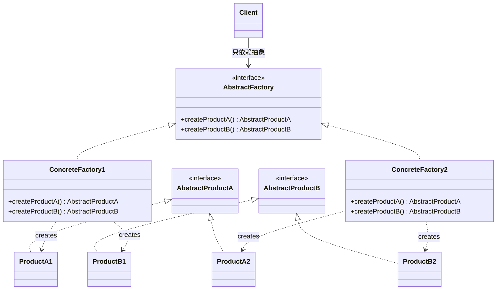
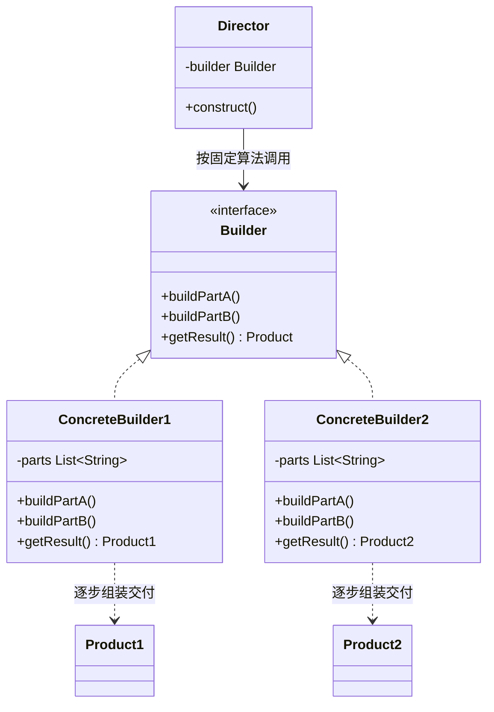
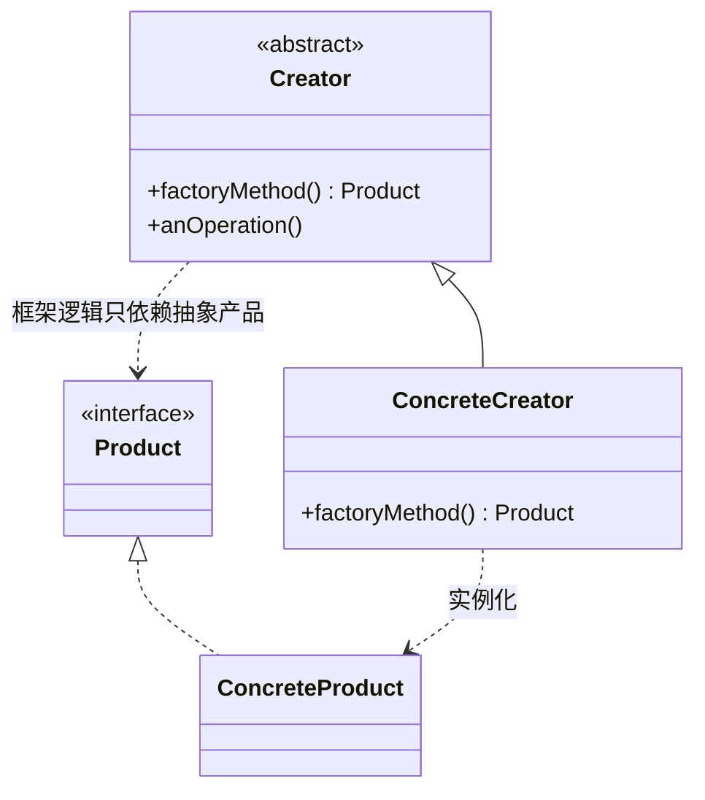
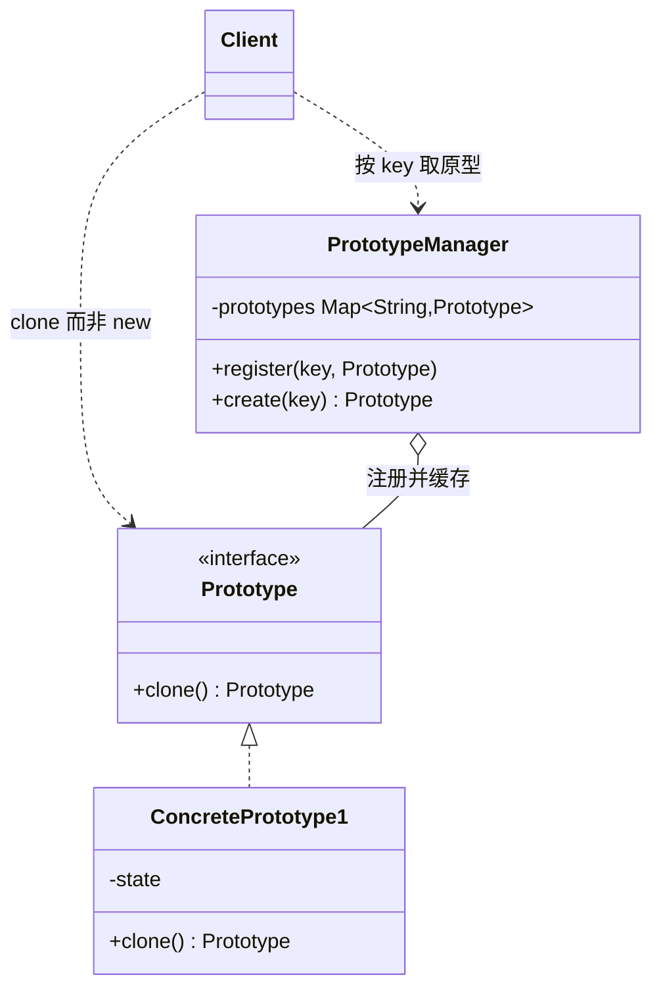
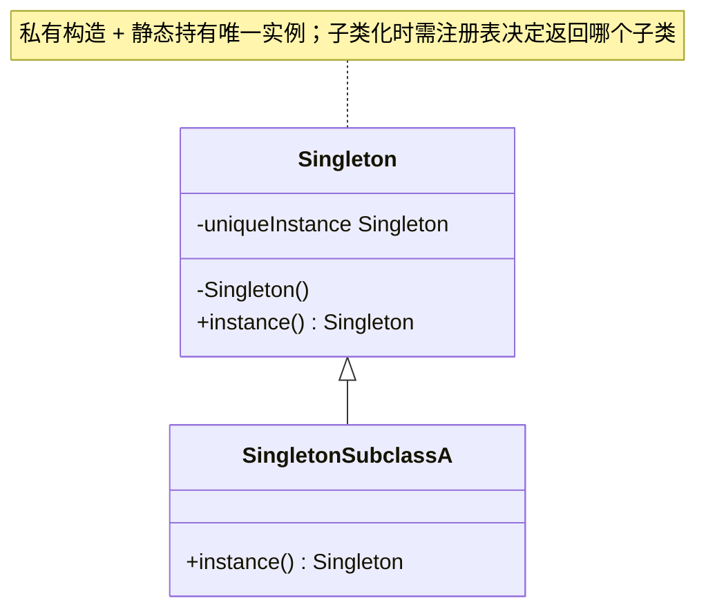

# Creational Patterns（创建型模式）

> Intent 中文以中译本《设计模式：可复用面向对象软件的基础（典藏版）》（机械工业出版社）译法为准。

创建型模式抽象了**实例化过程**：它们把"系统如何创建、组合、表示它的对象"这一知识封装起来，让系统与具体类解耦。客户只操作抽象接口，由模式替它决定何时、如何、由谁创建具体对象。

5 个创建型模式：Abstract Factory、Builder、Factory Method、Prototype、Singleton。

> 类图为 mermaid。Sample Code 依据原书代码示例摘编：保留主干与推进顺序，代码与解说交替；原书为 C++/Smalltalk，一般以 Java 摘编呈现。更多 Java 示例见上级目录《设计模式之一：Creational Pattern》。

## Abstract Factory（别名 Kit）

> 提供一个接口以创建一系列相关或相互依赖的对象，而无须指定它们具体的类。
>
> Provide an interface for creating families of related or dependent objects without specifying their concrete classes.

### Motivation

一个 UI 工具包要同时支持多种 look-and-feel 标准（Motif、Presentation Manager、Mac）。如果客户代码直接 `new MotifScrollBar()`，换一种风格就要改动所有创建点。解法：为每族控件定义一个 **WidgetFactory**（MotifWidgetFactory、PMWidgetFactory……），客户只面向抽象的 WidgetFactory 与抽象控件编程，整个产品族的替换只需换一个工厂实例。

### Applicability

* 系统应独立于产品的创建、组合与表示方式
* 系统要在多个产品族中配置其一，并且这些产品族可整体切换
* 一族相关产品被设计为必须配套使用，需要强制这种约束
* 想提供一个只暴露接口、隐藏实现的产品类库

### Structure



### Participants

* **AbstractFactory**：声明创建抽象产品对象的操作接口
* **ConcreteFactory**：实现创建具体产品的操作
* **AbstractProduct**：为一类产品对象声明接口
* **ConcreteProduct**：具体产品，被对应的 ConcreteFactory 创建
* **Client**：只用 AbstractFactory 与 AbstractProduct 接口

### Collaborations

运行期创建一个 ConcreteFactory 实例；Client 通过它创建产品对象。Client 完全不知道拿到的是哪个具体产品类——它只看见抽象产品接口。

### Consequences

优点：

* **隔离了具体类**：Client 只依赖抽象接口，产品类名不进入客户代码
* **易于整体切换产品族**：换族 = 换一个工厂实例
* **促进产品一致性**：同一工厂产出的产品被约束为配套使用

代价：

* **难以支持新种类的产品**：新增一类产品（如加一个 Spinner）要改 AbstractFactory 接口及所有 ConcreteFactory——扩展产品族容易，扩展产品种类难

### Implementation

* ConcreteFactory 通常实现为 **Singleton**（整个系统只需一个实例）
* 创建产品最常见的方式：工厂里每个产品一个 **Factory Method**；也可用 **Prototype** 持有原型来克隆
* **参数化工厂**（`get(class)` 一个方法创建任意产品）：减少方法数量，但失去类型安全，且要求所有产品接口统一——一般不推荐
* 若必须支持新种类产品，可给工厂加"更少的创造方法 + 更参数化的产品"这类折中

### Sample Code（迷宫工厂，Java 摘编）

原书用"造迷宫"一套例子贯穿全部创建型模式。先看 AbstractFactory——MazeFactory 为每类迷宫构件声明一个创建操作，缺省产出普通构件：

```java
class MazeFactory {
    Maze makeMaze() { return new Maze(); }
    Wall makeWall() { return new Wall(); }
    Room makeRoom(int n) { return new Room(n); }
    Door makeDoor(Room r1, Room r2) { return new Door(r1, r2); }
}
```

客户代码以工厂为参数，创建流程中**不再出现任何具体类名**：

```java
Maze createMaze(MazeFactory factory) {
    Maze maze = factory.makeMaze();
    Room r1 = factory.makeRoom(1);
    Room r2 = factory.makeRoom(2);
    Door door = factory.makeDoor(r1, r2);

    maze.addRoom(r1);
    maze.addRoom(r2);

    r1.setSide(Direction.NORTH, factory.makeWall());
    r1.setSide(Direction.EAST, door);
    // ……其余各面类似，略
    return maze;
}
```

换产品族 = 换工厂子类。施了魔法的迷宫只覆盖需要变化的两个操作：

```java
class EnchantedMazeFactory extends MazeFactory {
    @Override Room makeRoom(int n) {
        return new EnchantedRoom(n, castSpell());  // 房间带一道咒语
    }
    @Override Door makeDoor(Room r1, Room r2) {
        return new DoorNeedingSpell(r1, r2);       // 门需要咒语才能打开
    }
    protected Spell castSpell() { return new Spell(); }
}
```

带炸弹的迷宫同理，只覆盖墙与房间：

```java
class BombedMazeFactory extends MazeFactory {
    @Override Wall makeWall() { return new BombedWall(); }       // 被炸会损坏的墙
    @Override Room makeRoom(int n) { return new RoomWithABomb(n); }
}

Maze maze = createMaze(new BombedMazeFactory());
// 同一个 createMaze，换传 EnchantedMazeFactory 即产出施魔迷宫
```

createMaze 与具体构件双向解耦——"换族只换一个工厂实例"落到了实处。MazeFactory 在整个应用中通常只需一份，因此它常与 Singleton（3.5）配合。

### Known Uses / 现代对应

* 书中：InterViews 用 "Kit" 后缀表示 Abstract Factory 类——`WidgetKit`、`DialogKit` 抽象工厂生成与特定视感风格相关的界面对象，`LayoutKit` 按所需布局生成不同的组合对象；ET++ 用 Abstract Factory 实现跨窗口系统（X Windows、SunView）的可移植性——`WindowSystem` 抽象基类定义 `MakeWindow`/`MakeFont`/`MakeColor` 等创建接口，具体子类为特定窗口系统实现
* Java：`javax.xml.parsers.DocumentBuilderFactory`、`SAXParserFactory`，AWT 的 `Toolkit`

### Related Patterns

常以 **Factory Method** 实现每个创建操作；ConcreteFactory 可用 **Prototype** 实现、且常为 **Singleton**。

## Builder

> 将一个复杂对象的构建与它的表示分离，使得同样的构建过程可以创建不同的表示。
>
> Separate the construction of a complex object from its representation so that the same construction process can create different representations.

### Motivation

一个 RTF（Rich Text Format）阅读器要把 RTF 文档转换为纯文本、TeX、带格式的文本控件等多种目标表示。转换**步骤**（解析 token 流、按序处理）是固定算法，但每一步**产出什么**因目标而异。解法：RTFReader（Director）按算法调用 TextConverter（Builder）接口，各 ConcreteBuilder（TeXConverter、TextWidgetConverter……）把同样的调用序列变成不同的产物。

### Applicability

* 创建复杂对象的算法应独立于对象的组成部分及它们的组装方式
* 构造过程必须允许不同的表示

### Structure



### Participants

* **Builder**：为创建 Product 对象的各个部件声明抽象接口
* **ConcreteBuilder**：实现接口，构造并装配部件；定义并跟踪所创建的表示；提供取回产品的接口
* **Director**：使用 Builder 接口按算法构建对象
* **Client**：创建 Director 与 Builder，启动构建，最后从 Builder 取回产品

### Collaborations

客户创建 Builder 交给 Director；Director 以合适的顺序调用 Builder 的部件构造操作；完成后客户向 Builder 要产品（Director 对产品通常一无所知）。

### Consequences

优点：

* **可以变化产品的内部表示**：Builder 提供抽象接口给 Director，具体表示由 ConcreteBuilder 决定
* **构造与表示的代码隔离**：每个 ConcreteBuilder 封装了该表示的全部细节
* **对构造过程精细控制**：其他创建型模式一步产出完整产品，Builder 在 Director 的指挥下逐步构建，可以精确控制顺序与内容

### Implementation

* Builder 接口要**足够细粒度**，否则难以支撑不同表示；反之不必为不常用的操作设复杂默认——书中让 Builder 的方法默认为空实现，ConcreteBuilder 只覆盖需要的
* **通常不定义公共的 Product 抽象类**：各表示差异太大，没有统一接口的意义，客户按具体 Builder 类型取回产品
* Director 可用同样方式构造多个产品（Builder 状态多次复用）

### Sample Code（MazeBuilder，Java 摘编）

原书的 Builder 示例仍是迷宫，但换了一个问题：不但要能建"普通/施魔/炸弹"迷宫，还想**数一数**迷宫里有几个房间几扇门。Builder 只声明构建步骤，全部给空实现：

```java
abstract class MazeBuilder {
    void buildMaze() { }
    void buildRoom(int room) { }
    void buildDoor(int roomFrom, int roomTo) { }
    Maze getMaze() { return null; }
}
```

Director（这里是 MazeGame 的方法）按固定算法逐step调用 builder，与产品内部表示完全隔离：

```java
Maze createMaze(MazeBuilder builder) {
    builder.buildMaze();
    builder.buildRoom(1);
    builder.buildRoom(2);
    builder.buildDoor(1, 2);
    return builder.getMaze();
}
```

第一个 ConcreteBuilder 真的建迷宫——它知道迷宫的内部结构（房间的四面墙、公共墙上开门）：

```java
class StandardMazeBuilder extends MazeBuilder {
    private Maze currentMaze;

    @Override void buildMaze() { currentMaze = new Maze(); }

    @Override void buildRoom(int n) {
        if (currentMaze.roomNo(n) != null) return;   // 已建过则忽略
        Room room = new Room(n);
        currentMaze.addRoom(room);
        room.setSide(Direction.NORTH, new Wall());   // 四面先设墙，
        // ……SOUTH/EAST/WEST 同法，略
    }

    @Override void buildDoor(int n1, int n2) {
        Room r1 = currentMaze.roomNo(n1);
        Room r2 = currentMaze.roomNo(n2);
        Door door = new Door(r1, r2);
        r1.setSide(commonWall(r1, r2), door);        // 公共墙上开门
        r2.setSide(commonWall(r2, r1), door);
    }

    @Override Maze getMaze() { return currentMaze; }

    private Direction commonWall(Room a, Room b) { /* 找两房间的公共墙面 */ return null; }
}
```

第二个 ConcreteBuilder 什么迷宫都不建，只数数——注意它的产物**根本不是迷宫**：

```java
class CountingMazeBuilder extends MazeBuilder {
    private int rooms, doors;

    @Override void buildMaze() { rooms = doors = 0; }
    @Override void buildRoom(int n) { rooms++; }
    @Override void buildDoor(int from, int to) { doors++; }
    @Override Maze getMaze() { return null; }        // 故意返回 null
}
```

同一个 createMaze 驱动两种 builder，得到完全不同的结果：

```java
Maze maze = createMaze(new StandardMazeBuilder());  // 建出两房一门的迷宫
createMaze(new CountingMazeBuilder());              // 只得到 rooms=2, doors=1 的计数
```

这就是 Builder 与工厂一族的本质差别：**Director 掌握算法、Builder 决定每个步骤落到什么上**——步骤可以建迷宫、可以计数、甚至可以什么也不做；产物的内部表示（Room 四面墙、公共墙开门）被完全封装在 StandardMazeBuilder 里。原书还指出：需要更复杂的迷宫时，Director 侧加一个 `createComplexMaze(MazeBuilder)` 即可复用全部 builder。

### 现代对应

`StringBuilder`/`StringJoiner`、`Stream.Builder`、OkHttp 的 `Request.Builder`、Lombok `@Builder`。

### Related Patterns

**Abstract Factory** 也创建复合对象，但强调"一族产品一次到位"；Builder 逐步构建、最后统一交付，常用于构建 **Composite** 结构。

## Factory Method（别名 Virtual Constructor）

> 定义一个用于创建对象的接口，让子类决定实例化哪一个类。Factory Method 使一个类的实例化延迟到其子类。
>
> Define an interface for creating an object, but let subclasses decide which class to instantiate.

### Motivation

框架类（如 Application、Document）无法预知应用要派生哪些子类（MyApplication、MyDocument），却又必须创建它们。解法：框架只提供工厂方法 `createDocument()`，把"创建什么"留给子类实现；框架代码调用工厂方法拿到抽象产品继续工作。

### Applicability

* 类无法预知它必须创建的对象的类
* 类希望由子类指定它所创建的对象
* 类把职责委托给多个辅助子类之一，并且希望把"是哪一个子类"这一知识局部化

### Structure



### Participants

* **Product**：工厂方法所创建对象的抽象接口
* **ConcreteProduct**：具体产品
* **Creator**：声明工厂方法，返回 Product 类型；可调用工厂方法实现其他操作
* **ConcreteCreator**：重写工厂方法，返回 ConcreteProduct

### Collaborations

Creator 依赖子类实现工厂方法，从而返回正确的 ConcreteProduct；Creator 中其他逻辑只依赖 Product 接口。

### Consequences

优点：

* **为子类提供 hook**：工厂方法给子类一个扩展点，可以不只是"创建对象"，还能定制创建时机与方式
* **连接平行的类层次**：Creator 层次与 Product 层次平行对应时，工厂方法把两者局部化地挂钩（如 GraphicTool↔Graphic）

代价：

* 客户端有时**只是为了指定产品而被迫子类化 Creator**——这是该模式的常见噪音

### Implementation

* 两种形态：Creator 是**抽象类且工厂方法纯虚**（必须子类化）；或 Creator 是**具体类且工厂方法有默认实现**（可选择性覆盖）
* **参数化工厂方法**：`create(Sticky) / create(Wide)`，一个方法创建多种产品——灵活但客户必须了解所有产品，且失去编译期类型检查
* 命名惯例：工厂方法常以 `Create…/Make…/New…` 前缀命名（Java 世界如 `createXxx`、`valueOf`、`getInstance`）
* C++ 中可用模板（template method + 模板参数）避免为每种产品派生 Creator

### Sample Code（框架的 Application/Document，Java 摘编）

原书示例是一个框架类：Application 管理文档并在合适时机创建它们，但它**无法预知**应用会派生什么文档。先看框架侧——`createDocument()` 就是工厂方法，纯抽象：

```java
abstract class Application {
    private final List<Document> docs = new ArrayList<>();

    abstract Document createDocument();              // Factory Method：留给子类

    void openDocument(String name) {                 // 框架逻辑（OpenDocument）
        if (!canOpenDocument(name)) {                // 检查能否打开（如类型/权限）
            System.out.println("无法打开: " + name);
            return;
        }
        Document doc = createDocument();             // 只依赖抽象 Product
        docs.add(doc);
        aboutToOpenDocument(doc);                    // hook：默认空实现
        doc.doRead();                                // 读入内容
        doc.doRestoreView();                         // 恢复视图
    }

    protected boolean canOpenDocument(String name) { return name != null; }
    protected void aboutToOpenDocument(Document doc) { }
}
```

注意 openDocument 的骨架与具体文档的耦合点只有一处——`createDocument()` 调用。Document 侧同样是抽象骨架：

```java
abstract class Document {
    abstract void doRead();
    void doRestoreView() { }                         // hook
    void save() { doSerialize(); }
    abstract void doSerialize();
}
```

应用子类只需填空——这是"知道具体产品类"的唯一地方：

```java
class DrawingDocument extends Document {             // ConcreteProduct
    void doRead() { System.out.println("读入绘图文档"); }
    void doSerialize() { }
}

class DrawingApplication extends Application {       // ConcreteCreator
    @Override Document createDocument() { return new DrawingDocument(); }
}

new DrawingApplication().openDocument("架构图.vsd");
// 框架无感知：内部创建的是 DrawingDocument
```

换一个电子表格应用，只需再派生 SpreadsheetApplication/SpreadsheetDocument——Application 的全部逻辑原样复用。原书还把同一个例子用于 Template Method（5.10）：openDocument 的骨架本身就是一个模板方法，工厂方法则是它调用的原语操作之一。

### 现代对应

`java.util.Collection#iterator()`（每个具体集合决定返回哪种 Iterator）、`Calendar#getInstance()`、各类 `valueOf()`。

### Related Patterns

**Abstract Factory** 常用一组 Factory Method 实现；工厂方法常被 **Template Method** 调用；**Prototype** 无需子类化 Creator 即可变换产品。

## Prototype

> 用原型实例指定创建对象的种类，并且通过拷贝（clone）这些原型创建新的对象。
>
> Specify the kinds of objects to create using a prototypical instance, and create new objects by copying this prototype.

### Motivation

乐谱编辑器的 GraphicTool（工具栏工具）要能为每种图形（音符、休止符……）创建对象。若为每种图形派生一个 GraphicTool 子类，会产生庞大的平行类层次。解法：给 GraphicTool 一个**原型实例**，工具被使用时 `clone()` 原型得到新对象——工具本身只有一个类。

### Applicability

* 系统应独立于产品的创建、组合与表示
* 要实例化的类在运行期才确定（如动态加载）
* 避免创建与产品层次平行的工厂层次
* 类的实例只处于少数几种状态组合之一，预置对应原型并克隆它们比反复初始化更方便

### Structure



### Participants

* **Prototype**：声明克隆自身的接口
* **ConcretePrototype**：实现克隆操作
* **Client**：让原型克隆自身来创建新对象

### Consequences

优点：

* **运行期增删产品**：向客户注册一个新原型即可
* **通过改变值定义新对象**：克隆后修改少量变量即得"预配置"的对象
* **通过改变结构定义新对象**：把多个原型组合成一个复合原型再克隆
* **减少子类化**：不需要 Creator 平行层次
* **可以用动态加载的类扩充应用**

代价：

* **实现 clone 不容易**：尤其深拷贝（deep copy）与浅拷贝（shallow copy）的取舍；含循环引用的组合对象克隆尤其困难

### Implementation

* **Prototype Manager（原型管理器）**：当系统中原型数量不固定、按 key 动态注册/查找时，用一个注册表管理原型——客户不再直接持有原型
* `clone()` 的实现：基本类型直接复制；对象成员需决定浅/深拷贝；C++ 用拷贝构造、Smalltalk 用 `copy`，Java 实现 `Cloneable` 并重写 `clone()`
* 克隆后常用 `Initialize(参数)` 重新初始化状态，避免为每种配置准备一个原型

### Sample Code（MazePrototypeFactory，Java 摘编）

原型版迷宫工厂不再为每族构件派生子类，而是**持有一族原型，克隆它们产出产品**：

```java
class MazePrototypeFactory extends MazeFactory {
    private final Maze prototypeMaze;
    private final Wall prototypeWall;
    private final Room prototypeRoom;
    private final Door prototypeDoor;

    MazePrototypeFactory(Maze m, Wall w, Room r, Door d) {
        prototypeMaze = m; prototypeWall = w;        // 存的就是"原型"
        prototypeRoom = r; prototypeDoor = d;
    }

    @Override Maze makeMaze() { return prototypeMaze.clone(); }
    @Override Wall makeWall() { return prototypeWall.clone(); }

    @Override Room makeRoom(int n) {
        Room room = prototypeRoom.clone();           // 克隆原型
        room.initialize(n);                          // 再用参数重初始化
        return room;
    }

    @Override Door makeDoor(Room r1, Room r2) {
        Door door = prototypeDoor.clone();
        door.initialize(r1, r2);                     // 重新接线两端的房间
        return door;
    }
}
```

换产品族变成换一组原型，**零子类**：

```java
MazeFactory factory = new MazePrototypeFactory(
        new Maze(), new Wall(), new Room(0), new Door(null, null));
Maze maze = createMaze(factory);                    // 复用 Abstract Factory 一节的 createMaze

// 炸弹迷宫：不需要 BombedMazeFactory 子类了
factory = new MazePrototypeFactory(
        new Maze(), new BombedWall(), new RoomWithABomb(0), new Door(null, null));
```

`door.initialize(r1, r2)` 这一步值得注意：clone 是浅拷贝，Door 原型里指向的两个房间引用会被一并复制——所以克隆后必须**重新接线**（原书对每个实现 Clone 的类都有类似约定：克隆自己是浅的，凡是指向"这一次不该共享"的成员都要在克隆后修正，必要时做深拷贝；含循环引用的组合对象克隆尤其困难）。

对照乐谱编辑器的 Motivation：GraphicTool 持有一个 Graphic 原型、被使用时 `clone()` 它——同一个思想在"工具"和"工厂"两个场合都消掉了平行子类层次。

### 现代对应

`Object#clone()`/`Cloneable`、Apache Commons `SerializationUtils.clone()`、Kotlin data class 的 `copy()`——都是"以复制代替重新构造"。（注意与 Flyweight 区分：Prototype 是复制出**独立实例**，Flyweight 是**共享同一实例**。）

### Related Patterns

与 **Abstract Factory** 密切相关：Concrete Factory 可以持有并克隆 Prototype 来生产对象，从而免去为每个产品写工厂子类。

## Singleton

> 保证一个类仅有一个实例，并提供一个访问它的全局访问点。
>
> Ensure a class only one instance, and provide a global point of access to it.

### Motivation

一个系统只应有一个窗口管理器、一个文件系统、一个打印后台（print spooler）。全局变量虽然"唯一"，但不能防止客户创建第二个实例，也污染命名空间。

### Applicability

* 类只能有一个实例，且客户必须从一个众所周知的访问点访问它
* 唯一实例应可通过子类化扩展，且客户无需改代码即可使用扩展的实例

### Structure



### Participants

* **Singleton**：定义 `Instance()` 操作，允许客户访问唯一实例；可能自己负责创建该实例

### Consequences

* **受控访问唯一实例**：Singleton 封装了唯一性，不让任何他人再创建
* **缩小命名空间**：比全局变量干净——Singleton 是"有行为的对象"，全局变量只是名字
* **允许细化与扩展**（refinement）：可以子类化 Singleton，按需选择/替换实现（配合注册表）
* **允许可变数目的实例**：想放宽到 N 个实例时只改一处
* **比类操作（static 方法）更灵活**：static 方法无法多态、难以替换实现

### Implementation

* 保证唯一性：构造器私有（或保护），静态方法 `Instance()` 惰性创建并返回唯一实例（C++ 用函数内 static，Java 用 `private static` 字段 + `getInstance()`，多线程需同步或 holder/enum 方案——详见上级目录的 Java 版三种写法）
* **子类化 Singleton** 的问题：`Instance()` 必须决定返回哪个子类的实例——常用 **注册表**（按名字查找已注册的 Singleton 子类）解决；实例的真正类型在编译期不再固定

### Sample Code（MazeFactory 单件，Java 摘编）

最简形态。MazeFactory 把构造器藏起来，`instance()` 惰性创建并返回唯一实例：

```java
class MazeFactory {
    private static MazeFactory instance;

    protected MazeFactory() { }                      // 外部无法 new；protected 留给子类

    public static MazeFactory instance() {
        if (instance == null) {
            instance = new MazeFactory();            // 第一次调用才创建（惰性）
        }
        return instance;
    }
    // makeMaze()/makeWall()/makeRoom()/makeDoor() 同前
}
```

要支持子类化——instance() 该返回 BombedMazeFactory 还是 EnchantedMazeFactory 的实例？——必须有个地方知道答案。原书的办法是**注册表**：子类把自己的实例注册进来，instance() 按外部配置选择（原书用环境变量 `SINGLETON` 决定，此处以系统属性示意）：

```java
class MazeFactory {
    private static MazeFactory instance;
    private static final Map<String, MazeFactory> REGISTRY = new HashMap<>();

    protected MazeFactory() { }

    public static void register(String name, MazeFactory f) { REGISTRY.put(name, f); }

    public static MazeFactory instance() {
        if (instance == null) {
            String style = System.getProperty("MAZE_STYLE", "standard");
            instance = REGISTRY.get(style);          // 运行期决定实例的真正类型
        }
        return instance;
    }
}
```

子类用静态代码块自注册，注册发生在类加载时；客户代码永远只调 `instance()`：

```java
class BombedMazeFactory extends MazeFactory {
    static {
        MazeFactory.register("bombed", new BombedMazeFactory());
    }
    // 只覆盖 makeWall()/makeRoom()
}

MazeFactory factory = MazeFactory.instance();       // 编译期类型是 MazeFactory，
                                                    // 运行期可以是任何注册过的子类
```

代价也随之而来：instance() 的返回类型只能是 MazeFactory，客户拿到的具体类型在编译期不再确定——这正是"允许细化与扩展"换来的取舍。

> Java 平台上更完备的线程安全写法（饿汉式 / 静态内部类 holder / volatile DCL / 单元素 enum）见上级目录《设计模式之一：Creational Pattern》的 Singleton 一节。

### 现代对应

`java.lang.Runtime#getRuntime()`、`Spring` 容器默认的单例 Bean、`Logger` 的 named singleton。

### Related Patterns

**Abstract Factory**、**Builder**、**Prototype** 的实现常用 Singleton——它们在整个系统中往往只需一个实例。

## 创建型模式的讨论（原书 3.6）

用产品类对系统进行参数化，有两种常用方法，正好对应创建型模式的两个阵营。

**方法一：生成创建对象的类的子类**——即 **Factory Method**。主要缺点是：仅为了改变产品类，就可能需要创建一个新的子类，而且这种改变可能是级联的（cascade）——如果产品的创建者本身也是由工厂方法创建的，它的创建者也必须一并重定义。

**方法二：对象组合**——定义一个负责明确产品对象的"工厂对象"，把它作为系统的参数。这是 **Abstract Factory**、**Builder**、**Prototype** 的共同特征，三者都引入一个新的工厂对象：

| 模式 | 工厂对象如何产出产品 |
| --- | --- |
| Abstract Factory | 一次产出**多个类**的对象（一个产品族） |
| Builder | 按**相对复杂的协议**逐步创建一个复杂产品 |
| Prototype | **拷贝原型**创建产品——工厂对象与原型是同一个对象 |

原书用绘图编辑器的 GraphicTool 做了同一问题的三种解法对比（按产品类参数化 GraphicTool）：

* **Factory Method**：为选择板中每个 Graphic 子类创建一个 GraphicTool 子类，各自重定义 `NewGraphic`。最简单直接，但 GraphicTool 子类数目激增、且个个没做多少事
* **Abstract Factory**：建一个与 Graphic 子类一一对应的 GraphicsFactory 层次（CircleFactory 创建 Circle……）。并未改善多少——同样庞大的平行工厂层次；只有当系统其他部分本来就需要这个工厂层次（如 Smalltalk/Objective-C 编译器自动提供）时才略优
* **Prototype**：每个 Graphic 子类实现 `Clone`，GraphicTool 以它创建的 Graphic 的原型为参数。**通常最好**——每个 Graphic 只需实现一个 Clone，类的数目最少，且 Clone 还能挪作他用（如 Duplicate 菜单操作）

结论与演化路径：

* Factory Method 让设计可以定制且只略微增加复杂度——别的模式要新类，它只要一个新操作。但当被实例化的类根本不变化、或实例化发生在子类很容易重定义的操作（如初始化）中时，它就多余了
* Abstract Factory / Prototype / Builder 更灵活，但**也更复杂**。常见轨迹是：设计从 Factory Method 起步，发现需要更大灵活性时再向其他创建型模式演化。在多个设计标准之间权衡时，了解多个模式才有选择余地

## 附：创建型模式的讨论（3.6）英文原文

> 以下为原书 3.6 节英文原文，供与上文中文对照。

There are two common ways to parameterize a system by the classes of objects it  creates. One way is to subclass the class that creates the objects; this corresponds  to using the Factory Method (121) pattern. The main drawback of this approach is  that it can require creating a new subclass just to change the class of the product.  Such changes can cascade. For example, when the product creator is itself created by  a factory method, then you have to override its creator as well.

The other way to parameterize a system relies more on object composition: Define an  object that's responsible for knowing the class of the product objects, and make it  a parameter of the system. This is a key aspect of the Abstract Factory (99),  Builder (110), and Prototype (133) patterns. All three involve creating a new  "factory object" whose responsibility is to create product objects. Abstract Factory  has the factory object producing objects of several classes. Builder has the factory  object building a complex product incrementally using a correspondingly complex  protocol. Prototype has the factory object building a product by copying a prototype  object. In this case, the factory object and the prototype are the same object,  because the prototype is responsible for returning the product.

Consider the drawing editor framework described in the Prototype pattern. There are  several ways to parameterize a GraphicTool by the class of product: 

By applying the Factory Method pattern, a subclass of GraphicTool will be created  for each subclass of Graphic in the palette. GraphicTool will have a NewGraphic  operation that each GraphicTool subclass will redefine.  By applying the Abstract Factory pattern, there will be a class hierarchy of  GraphicsFactories, one for each Graphic subclass. Each factory creates just one  product in this case: CircleFactory will create Circles, LineFactory will create  Lines, and so on. A GraphicTool will be parameterized with a factory for creating  the appropriate kind of Graphics.

By applying the Prototype pattern, each subclass of Graphics will implement the  Clone operation, and a GraphicTool will be parameterized with a prototype of the  Graphic it creates. 

