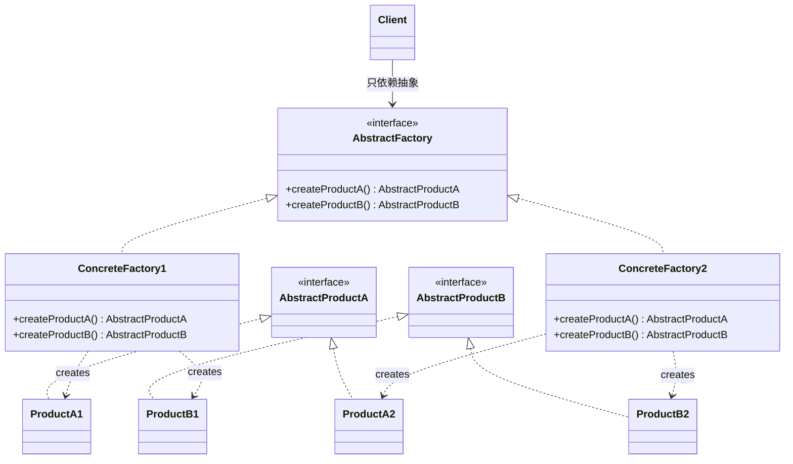
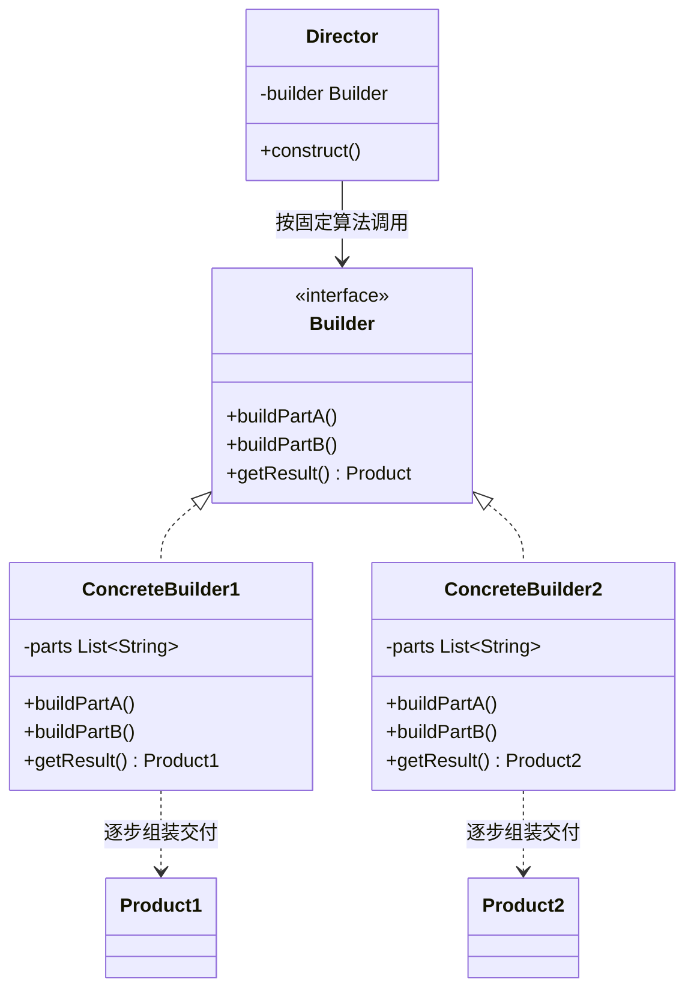
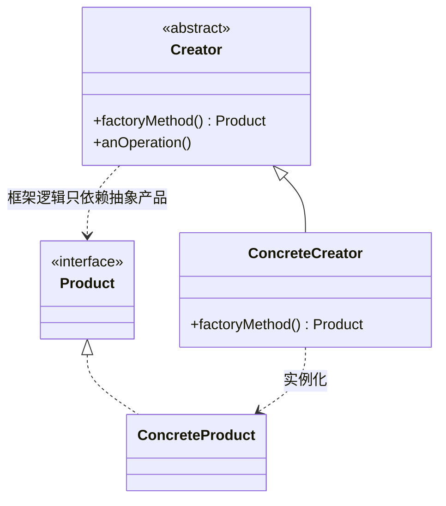
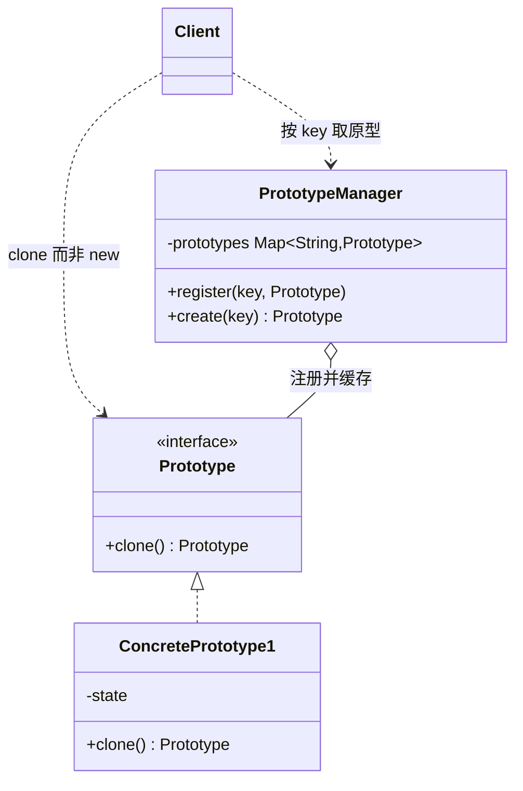
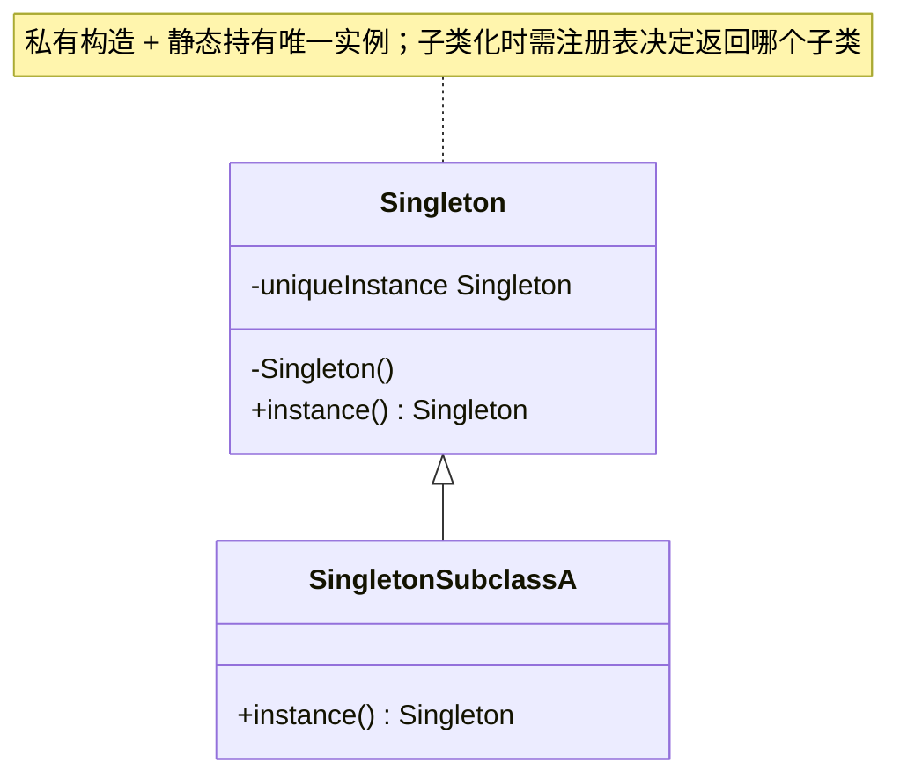

# Creational Patterns（创建型模式）

创建型模式抽象了**实例化过程**：它们把"系统如何创建、组合、表示它的对象"这一知识封装起来，让系统与具体类解耦。客户只操作抽象接口，由模式替它决定何时、如何、由谁创建具体对象。

5 个创建型模式：Abstract Factory、Builder、Factory Method、Prototype、Singleton。

## Abstract Factory（别名 Kit）

> 提供一个接口以创建一系列相关或相互依赖的对象，而无须指定它们具体的类。
>
> Provide an interface for creating families of related or dependent objects without specifying their concrete classes.

### Motivation

一个 UI 工具包要同时支持多种 look-and-feel 标准（Motif、Presentation Manager、Mac）。如果客户代码直接 `new MotifScrollBar()`，换一种风格就要改动所有创建点。解法：为每族控件定义一个 **WidgetFactory**（MotifWidgetFactory、PMWidgetFactory……），客户只面向抽象的 WidgetFactory 与抽象控件编程，整个产品族的替换只需换一个工厂实例。

### Applicability

* 系统应独立于产品的创建、组合与表示方式
* 系统要在多个产品族中配置其一，并且这些产品族可整体切换
* 一族相关产品被设计为必须配套使用，需要强制这种约束
* 想提供一个只暴露接口、隐藏实现的产品类库

### Structure


```mermaid
classDiagram
    class Client
    class AbstractFactory {
        <<interface>>
        +createProductA() AbstractProductA
        +createProductB() AbstractProductB
    }
    class ConcreteFactory1 {
        +createProductA() AbstractProductA
        +createProductB() AbstractProductB
    }
    class ConcreteFactory2 {
        +createProductA() AbstractProductA
        +createProductB() AbstractProductB
    }
    class AbstractProductA {
        <<interface>>
    }
    class AbstractProductB {
        <<interface>>
    }
    class ProductA1
    class ProductA2
    class ProductB1
    class ProductB2
    Client --> AbstractFactory : 只依赖抽象
    AbstractFactory <|.. ConcreteFactory1
    AbstractFactory <|.. ConcreteFactory2
    AbstractProductA <|.. ProductA1
    AbstractProductA <|.. ProductA2
    AbstractProductB <|.. ProductB1
    AbstractProductB <|.. ProductB2
    ConcreteFactory1 ..> ProductA1 : creates
    ConcreteFactory1 ..> ProductB1 : creates
    ConcreteFactory2 ..> ProductA2 : creates
    ConcreteFactory2 ..> ProductB2 : creates
```

### Participants

* **AbstractFactory**：声明创建抽象产品对象的操作接口
* **ConcreteFactory**：实现创建具体产品的操作
* **AbstractProduct**：为一类产品对象声明接口
* **ConcreteProduct**：具体产品，被对应的 ConcreteFactory 创建
* **Client**：只用 AbstractFactory 与 AbstractProduct 接口

### Collaborations

运行期创建一个 ConcreteFactory 实例；Client 通过它创建产品对象。Client 完全不知道拿到的是哪个具体产品类——它只看见抽象产品接口。

### Consequences

优点：

* **隔离了具体类**：Client 只依赖抽象接口，产品类名不进入客户代码
* **易于整体切换产品族**：换族 = 换一个工厂实例
* **促进产品一致性**：同一工厂产出的产品被约束为配套使用

代价：

* **难以支持新种类的产品**：新增一类产品（如加一个 Spinner）要改 AbstractFactory 接口及所有 ConcreteFactory——扩展产品族容易，扩展产品种类难

### Implementation

* ConcreteFactory 通常实现为 **Singleton**（整个系统只需一个实例）
* 创建产品最常见的方式：工厂里每个产品一个 **Factory Method**；也可用 **Prototype** 持有原型来克隆
* **参数化工厂**（`get(class)` 一个方法创建任意产品）：减少方法数量，但失去类型安全，且要求所有产品接口统一——一般不推荐
* 若必须支持新种类产品，可给工厂加"更少的创造方法 + 更参数化的产品"这类折中

### Sample Code（原书迷宫示例，C++）

原书用"造迷宫"一套例子贯穿全部创建型模式。MazeFactory 为每类迷宫构件声明一个创建操作，缺省实现返回普通构件：

```cpp
class MazeFactory {
public:
    MazeFactory();

    virtual Maze* MakeMaze() const
        { return new Maze; }
    virtual Wall* MakeWall() const
        { return new Wall; }
    virtual Room* MakeRoom(long n) const
        { return new Room(n); }
    virtual Door* MakeDoor(Room* r1, Room* r2) const
        { return new Door(r1, r2); }
};
```

客户代码以工厂为参数，创建流程中**不再出现任何具体构件类名**：

```cpp
Maze* MazeGame::CreateMaze (MazeFactory& factory) {
    Maze* aMaze = factory.MakeMaze();
    Room* r1 = factory.MakeRoom(1);
    Room* r2 = factory.MakeRoom(2);
    Door* aDoor = factory.MakeDoor(r1, r2);

    aMaze->AddRoom(r1);
    aMaze->AddRoom(r2);

    r1->SetSide(North, factory.MakeWall());
    r1->SetSide(East, aDoor);
    // ...

    return aMaze;
}
```

换产品族 = 换工厂子类。施了魔法的迷宫只覆盖需要变化的两个操作——EnchantedRoom 需要房间号与一道咒语，DoorNeedingSpell 只有用咒语才能打开：

```cpp
class EnchantedMazeFactory : public MazeFactory {
public:
    EnchantedMazeFactory();

    virtual Room* MakeRoom(long n) const
        { return new EnchantedRoom(n, CastSpell()); }
    virtual Door* MakeDoor(Room* r1, Room* r2) const
        { return new DoorNeedingSpell(r1, r2); }

protected:
    Spell* CastSpell() const;
};
```

带炸弹的迷宫同理，只覆盖 MakeWall 与 MakeRoom：

```cpp
class BombedMazeFactory : public MazeFactory {
public:
    BombedMazeFactory();

    virtual Wall* MakeWall() const
        { return new BombedWall; }
    virtual Room* MakeRoom(long n) const
        { return new RoomWithABomb(n); }
};
```

客户侧只需换一个工厂实例，CreateMaze 一字不改：

```cpp
Maze* maze;
MazeGame game;
BombedMazeFactory bombedMazeFactory;

maze = game.CreateMaze(bombedMazeFactory);
```

原书指出：MazeFactory 不过是一组工厂方法的集合；它同时充当缺省实现的"落脚点"——子类只需覆盖有变化的操作。MazeFactory 在整个应用中通常只需一份，因此它常与 Singleton（3.5）配合。

### Known Uses / 现代对应

* 书中：InterViews 用 "Kit" 后缀表示 Abstract Factory 类——`WidgetKit`、`DialogKit` 抽象工厂生成与特定视感风格相关的界面对象，`LayoutKit` 按所需布局生成不同的组合对象；ET++ 用 Abstract Factory 实现跨窗口系统（X Windows、SunView）的可移植性——`WindowSystem` 抽象基类定义 `MakeWindow`/`MakeFont`/`MakeColor` 等创建接口，具体子类为特定窗口系统实现
* Java：`javax.xml.parsers.DocumentBuilderFactory`、`SAXParserFactory`，AWT 的 `Toolkit`

### Related Patterns

常以 **Factory Method** 实现每个创建操作；ConcreteFactory 可用 **Prototype** 实现、且常为 **Singleton**。

## Builder

> 将一个复杂对象的构建与它的表示分离，使得同样的构建过程可以创建不同的表示。
>
> Separate the construction of a complex object from its representation so that the same construction process can create different representations.

### Motivation

一个 RTF（Rich Text Format）阅读器要把 RTF 文档转换为纯文本、TeX、带格式的文本控件等多种目标表示。转换**步骤**（解析 token 流、按序处理）是固定算法，但每一步**产出什么**因目标而异。解法：RTFReader（Director）按算法调用 TextConverter（Builder）接口，各 ConcreteBuilder（TeXConverter、TextWidgetConverter……）把同样的调用序列变成不同的产物。

### Applicability

* 创建复杂对象的算法应独立于对象的组成部分及它们的组装方式
* 构造过程必须允许不同的表示

### Structure


```mermaid
classDiagram
    class Director {
        -builder Builder
        +construct()
    }
    class Builder {
        <<interface>>
        +buildPartA()
        +buildPartB()
        +getResult() Product
    }
    class ConcreteBuilder1 {
        -parts List~String~
        +buildPartA()
        +buildPartB()
        +getResult() Product1
    }
    class ConcreteBuilder2 {
        -parts List~String~
        +buildPartA()
        +buildPartB()
        +getResult() Product2
    }
    class Product1
    class Product2
    Director --> Builder : 按固定算法调用
    Builder <|.. ConcreteBuilder1
    Builder <|.. ConcreteBuilder2
    ConcreteBuilder1 ..> Product1 : 逐步组装交付
    ConcreteBuilder2 ..> Product2 : 逐步组装交付
```

### Participants

* **Builder**：为创建 Product 对象的各个部件声明抽象接口
* **ConcreteBuilder**：实现接口，构造并装配部件；定义并跟踪所创建的表示；提供取回产品的接口
* **Director**：使用 Builder 接口按算法构建对象
* **Client**：创建 Director 与 Builder，启动构建，最后从 Builder 取回产品

### Collaborations

客户创建 Builder 交给 Director；Director 以合适的顺序调用 Builder 的部件构造操作；完成后客户向 Builder 要产品（Director 对产品通常一无所知）。

### Consequences

优点：

* **可以变化产品的内部表示**：Builder 提供抽象接口给 Director，具体表示由 ConcreteBuilder 决定
* **构造与表示的代码隔离**：每个 ConcreteBuilder 封装了该表示的全部细节
* **对构造过程精细控制**：其他创建型模式一步产出完整产品，Builder 在 Director 的指挥下逐步构建，可以精确控制顺序与内容

### Implementation

* Builder 接口要**足够细粒度**，否则难以支撑不同表示；反之不必为不常用的操作设复杂默认——书中让 Builder 的方法默认为空实现，ConcreteBuilder 只覆盖需要的
* **通常不定义公共的 Product 抽象类**：各表示差异太大，没有统一接口的意义，客户按具体 Builder 类型取回产品
* Director 可用同样方式构造多个产品（Builder 状态多次复用）

### Sample Code（原书迷宫示例，C++）

原书的 Builder 示例仍是迷宫，但换了一个问题：不但要能建出迷宫，还想**统计**迷宫里有几个房间几扇门。Builder 只声明构建步骤，全部操作给空实现：

```cpp
class MazeBuilder {
public:
    virtual void BuildMaze() { }
    virtual void BuildRoom(int room) { }
    virtual void BuildDoor(int roomFrom, int roomTo) { }

    virtual Maze* GetMaze() { return 0; }
protected:
    MazeBuilder();
};
```

Director（这里是 MazeGame 的方法）按固定算法逐步调用 builder，与产品的内部表示完全隔离：

```cpp
Maze* MazeGame::CreateMaze (MazeBuilder& builder) {
    builder.BuildMaze();

    builder.BuildRoom(1);
    builder.BuildRoom(2);
    builder.BuildDoor(1, 2);

    return builder.GetMaze();
}
```

第一个 ConcreteBuilder 真的建迷宫——迷宫的内部结构（房间的四面墙、公共墙上开门）被封装在它这里：

```cpp
class StandardMazeBuilder : public MazeBuilder {
public:
    StandardMazeBuilder();

    virtual void BuildMaze();
    virtual void BuildRoom(int room);
    virtual void BuildDoor(int roomFrom, int roomTo);
    virtual Maze* GetMaze();

private:
    Direction CommonWall(Room*, Room*);
    Maze* _currentMaze;
};
```

```cpp
void StandardMazeBuilder::BuildMaze () {
    _currentMaze = new Maze;
}

void StandardMazeBuilder::BuildRoom (int n) {
    if (!_currentMaze->RoomNo(n)) {
        Room* room = new Room(n);

        _currentMaze->AddRoom(room);

        room->SetSide(North, new Wall);
        room->SetSide(South, new Wall);
        room->SetSide(East, new Wall);
        room->SetSide(West, new Wall);
    }
}

void StandardMazeBuilder::BuildDoor (int n1, int n2) {
    Room* r1 = _currentMaze->RoomNo(n1);
    Room* r2 = _currentMaze->RoomNo(n2);
    Door* d = new Door(r1, r2);

    r1->SetSide(CommonWall(r1,r2), d);
    r2->SetSide(CommonWall(r2,r1), d);
}

Maze* StandardMazeBuilder::GetMaze () {
    return _currentMaze;
}
```

第二个 ConcreteBuilder 什么迷宫都不建，只做计数——注意它的产物**根本不是迷宫**（GetMaze 继承基类缺省实现，返回 0）：

```cpp
class CountingMazeBuilder : public MazeBuilder {
public:
    CountingMazeBuilder();

    virtual void BuildMaze();
    virtual void BuildRoom(int room);
    virtual void BuildDoor(int roomFrom, int roomTo);
    virtual Maze* GetMaze();

    void GetCounts(int& rooms, int& doors) const;

private:
    int _doors;
    int _rooms;
};
```

```cpp
CountingMazeBuilder::CountingMazeBuilder () {
    _doors = _rooms = 0;
}

void CountingMazeBuilder::BuildRoom (int) {
    _rooms++;
}

void CountingMazeBuilder::BuildDoor (int, int) {
    _doors++;
}

void CountingMazeBuilder::GetCounts (int& rooms, int& doors) const {
    rooms = _rooms;
    doors = _doors;
}
```

同一个 CreateMaze 驱动两种 builder，得到完全不同的结果：

```cpp
int rooms, doors;
MazeGame game;
CountingMazeBuilder builder;

game.CreateMaze(builder);
builder.GetCounts(rooms, doors);
```

这就是 Builder 与工厂一族的差别：**Director 掌握算法、Builder 决定每个步骤落到什么上**——步骤可以建迷宫、可以计数、甚至可以什么也不做。Director 侧还可以加一个更复杂的算法复用全部 builder：

```cpp
Maze* MazeGame::CreateComplexMaze (MazeBuilder& builder) {
    builder.BuildRoom(1);
    // ...
    builder.BuildRoom(1001);

    return builder.GetMaze();
}
```

### 现代对应

`StringBuilder`/`StringJoiner`、`Stream.Builder`、OkHttp 的 `Request.Builder`、Lombok `@Builder`。

### Related Patterns

**Abstract Factory** 也创建复合对象，但强调"一族产品一次到位"；Builder 逐步构建、最后统一交付，常用于构建 **Composite** 结构。

## Factory Method（别名 Virtual Constructor）

> 定义一个用于创建对象的接口，让子类决定实例化哪一个类。Factory Method 使一个类的实例化延迟到其子类。
>
> Define an interface for creating an object, but let subclasses decide which class to instantiate.

### Motivation

框架类（如 Application、Document）无法预知应用要派生哪些子类（MyApplication、MyDocument），却又必须创建它们。解法：框架只声明工厂方法 `DoMakeDocument()`，把"创建什么"留给子类实现；框架的 OpenDocument 骨架调用工厂方法拿到抽象产品继续工作。

### Applicability

* 类无法预知它必须创建的对象的类
* 类希望由子类指定它所创建的对象
* 类把职责委托给多个辅助子类之一，并且希望把"是哪一个子类"这一知识局部化

### Structure


```mermaid
classDiagram
    class Creator {
        <<abstract>>
        +factoryMethod() Product
        +anOperation()
    }
    class ConcreteCreator {
        +factoryMethod() Product
    }
    class Product {
        <<interface>>
    }
    class ConcreteProduct
    Creator <|-- ConcreteCreator
    Product <|.. ConcreteProduct
    Creator ..> Product : 框架逻辑只依赖抽象产品
    ConcreteCreator ..> ConcreteProduct : 实例化
```

### Participants

* **Product**：工厂方法所创建对象的抽象接口
* **ConcreteProduct**：具体产品
* **Creator**：声明工厂方法，返回 Product 类型；可调用工厂方法实现其他操作
* **ConcreteCreator**：重写工厂方法，返回 ConcreteProduct

### Collaborations

Creator 依赖子类实现工厂方法，从而返回正确的 ConcreteProduct；Creator 中其他逻辑只依赖 Product 接口。

### Consequences

优点：

* **为子类提供 hook**：工厂方法给子类一个扩展点，可以不只是"创建对象"，还能定制创建时机与方式
* **连接平行的类层次**：Creator 层次与 Product 层次平行对应时，工厂方法把两者局部化地挂钩（如 GraphicTool↔Graphic）

代价：

* 客户端有时**只是为了指定产品而被迫子类化 Creator**——这是该模式的常见噪音

### Implementation

* 两种形态：Creator 是**抽象类且工厂方法纯虚**（必须子类化）；或 Creator 是**具体类且工厂方法有默认实现**（可选择性覆盖）
* **参数化工厂方法**：`create(Sticky) / create(Wide)`，一个方法创建多种产品——灵活但客户必须了解所有产品，且失去编译期类型检查
* 命名惯例：工厂方法常以 `Create…/Make…/New…` 前缀命名（Java 世界如 `createXxx`、`valueOf`、`getInstance`）
* C++ 中可用模板（template method + 模板参数）避免为每种产品派生 Creator

### Sample Code（原书迷宫示例，C++）

原书的示例回到迷宫：本章开头的 `CreateMaze` 对迷宫、房间、门和墙的类做了硬编码，引入工厂方法让子类来选择这些构件。MazeGame 为每类构件声明一个工厂方法，并提供返回最普通构件的缺省实现：

```cpp
class MazeGame {
public:
    MazeGame();

    virtual Maze* MakeMaze() const
        { return new Maze; }
    virtual Room* MakeRoom(long n) const
        { return new Room(n); }
    virtual Wall* MakeWall() const
        { return new Wall; }
    virtual Door* MakeDoor(Room* r1, Room* r2) const
        { return new Door(r1, r2); }

    virtual Maze* CreateMaze();
};
```

CreateMaze 与 Abstract Factory 一节的版本结构相同，差别在于它不再接收工厂参数，而是**调用成员工厂方法**——不同的游戏创建 MazeGame 的子类、重定义需要的工厂方法即可：

```cpp
Maze* MazeGame::CreateMaze () {
    Maze* aMaze = MakeMaze();

    Room* r1 = MakeRoom(1);
    Room* r2 = MakeRoom(2);
    Door* theDoor = MakeDoor(r1, r2);

    aMaze->AddRoom(r1);
    aMaze->AddRoom(r2);

    r1->SetSide(North, MakeWall());
    r1->SetSide(East, theDoor);
    r1->SetSide(South, MakeWall());
    r1->SetSide(West, MakeWall());

    r2->SetSide(North, MakeWall());
    r2->SetSide(East, MakeWall());
    r2->SetSide(South, MakeWall());
    r2->SetSide(West, theDoor);

    return aMaze;
}
```

带炸弹的游戏只重定义 MakeWall 与 MakeRoom：

```cpp
class BombedMazeGame : public MazeGame {
public:
    BombedMazeGame();

    virtual Wall* MakeWall() const
        { return new BombedWall; }

    virtual Room* MakeRoom(long n) const
        { return new RoomWithABomb(n); }
};
```

施了魔法的游戏重定义 MakeRoom 与 MakeDoor：

```cpp
class EnchantedMazeGame : public MazeGame {
public:
    EnchantedMazeGame();

    virtual Room* MakeRoom(long n) const
        { return new EnchantedRoom(n, CastSpell()); }

    virtual Door* MakeDoor(Room* r1, Room* r2) const
        { return new DoorNeedingSpell(r1, r2); }

protected:
    Spell* CastSpell() const;
};
```

对照 Motivation 里的框架例子：Application 声明纯虚的 `DoMakeDocument()`，把"创建什么文档"留给 MyApplication 这样的子类；这里的 MazeGame 则给出缺省实现、允许子类只覆盖有变化的操作——工厂方法在两种形态（纯虚 vs 缺省实现）下的用法都齐了。原书还把这个例子带到 Template Method（5.10）：Application::OpenDocument 的骨架本身就是一个模板方法，工厂方法则是它调用的原语操作之一。

### 现代对应

`java.util.Collection#iterator()`（每个具体集合决定返回哪种 Iterator）、`Calendar#getInstance()`、各类 `valueOf()`。

### Related Patterns

**Abstract Factory** 常用一组 Factory Method 实现；工厂方法常被 **Template Method** 调用；**Prototype** 无需子类化 Creator 即可变换产品。

## Prototype

> 用原型实例指定创建对象的种类，并且通过拷贝（clone）这些原型创建新的对象。
>
> Specify the kinds of objects to create using a prototypical instance, and create new objects by copying this prototype.

### Motivation

乐谱编辑器的 GraphicTool（工具栏工具）要能为每种图形（音符、休止符……）创建对象。若为每种图形派生一个 GraphicTool 子类，会产生庞大的平行类层次。解法：给 GraphicTool 一个**原型实例**，工具被使用时 `clone()` 原型得到新对象——工具本身只有一个类。

### Applicability

* 系统应独立于产品的创建、组合与表示
* 要实例化的类在运行期才确定（如动态加载）
* 避免创建与产品层次平行的工厂层次
* 类的实例只处于少数几种状态组合之一，预置对应原型并克隆它们比反复初始化更方便

### Structure


```mermaid
classDiagram
    class Client
    class Prototype {
        <<interface>>
        +clone() Prototype
    }
    class ConcretePrototype1 {
        -state
        +clone() Prototype
    }
    class PrototypeManager {
        -prototypes Map~String,Prototype~
        +register(key, Prototype)
        +create(key) Prototype
    }
    Prototype <|.. ConcretePrototype1
    Client ..> Prototype : clone 而非 new
    PrototypeManager o-- Prototype : 注册并缓存
    Client ..> PrototypeManager : 按 key 取原型
```

### Participants

* **Prototype**：声明克隆自身的接口
* **ConcretePrototype**：实现克隆操作
* **Client**：让原型克隆自身来创建新对象

### Consequences

优点：

* **运行期增删产品**：向客户注册一个新原型即可
* **通过改变值定义新对象**：克隆后修改少量变量即得"预配置"的对象
* **通过改变结构定义新对象**：把多个原型组合成一个复合原型再克隆
* **减少子类化**：不需要 Creator 平行层次
* **可以用动态加载的类扩充应用**

代价：

* **实现 clone 不容易**：尤其深拷贝（deep copy）与浅拷贝（shallow copy）的取舍；含循环引用的组合对象克隆尤其困难

### Implementation

* **Prototype Manager（原型管理器）**：当系统中原型数量不固定、按 key 动态注册/查找时，用一个注册表管理原型——客户不再直接持有原型
* `clone()` 的实现：基本类型直接复制；对象成员需决定浅/深拷贝；C++ 用拷贝构造、Smalltalk 用 `copy`，Java 实现 `Cloneable` 并重写 `clone()`
* 克隆后常用 `Initialize(参数)` 重新初始化状态，避免为每种配置准备一个原型

### Sample Code（原书迷宫示例，C++）

原型版迷宫工厂不再为每族构件派生子类，而是**持有一族原型，克隆它们产出产品**：

```cpp
class MazePrototypeFactory : public MazeFactory {
public:
    MazePrototypeFactory(Maze*, Wall*, Room*, Door*);

    virtual Maze* MakeMaze() const;
    virtual Room* MakeRoom(long n) const;
    virtual Wall* MakeWall() const;
    virtual Door* MakeDoor(Room* r1, Room* r2) const;

private:
    Maze* _prototypeMaze;
    Room* _prototypeRoom;
    Wall* _prototypeWall;
    Door* _prototypeDoor;
};
```

```cpp
MazePrototypeFactory::MazePrototypeFactory (
    Maze* m, Wall* w, Room* r, Door* d
) {
    _prototypeMaze = m;
    _prototypeWall = w;
    _prototypeRoom = r;
    _prototypeDoor = d;
}

Maze* MazePrototypeFactory::MakeMaze () const {
    return _prototypeMaze->Clone();
}

Room* MazePrototypeFactory::MakeRoom (long n) const {
    Room* room = _prototypeRoom->Clone();

    room->Initialize(n);

    return room;
}

Wall* MazePrototypeFactory::MakeWall () const {
    return _prototypeWall->Clone();
}

Door* MazePrototypeFactory::MakeDoor (Room* r1, Room* r2) const {
    Door* door = _prototypeDoor->Clone();

    door->Initialize(r1, r2);

    return door;
}
```

前提是 Maze、Wall、Room、Door 都要实现 `Clone`；克隆出的对象还要能用 `Initialize` 重新初始化——克隆 Room 后必须重新设定房间号，克隆 Door 后必须重新绑定两端的房间（这两个 Initialize 调用就出现在上面的 MakeRoom / MakeDoor 里）。

换产品族变成换一组原型，**零子类**——直接复用 Abstract Factory 一节的 CreateMaze：

```cpp
MazeGame game;
MazePrototypeFactory simpleMazeFactory(
    new Maze, new Wall, new Room, new Door
);
Maze* maze = game.CreateMaze(simpleMazeFactory);
```

带炸弹的迷宫不再需要 BombedMazeFactory 子类：

```cpp
MazePrototypeFactory bombedMazeFactory(
    new Maze, new BombedWall,
    new RoomWithABomb, new Door
);
```

施了魔法的迷宫同理，而且连"带参数构造"的问题都消失了——原型只管用无参构造造一次，EnchantedRoom 所需的咒语等差异交给克隆后的修正：

```cpp
MazePrototypeFactory enchantedMazeFactory(
    new Maze, new Wall, new EnchantedRoom, new DoorNeedingSpell
);
```

对照乐谱编辑器的 Motivation：GraphicTool 持有一个 Graphic 原型、被使用时 `Clone()` 它——同一个思想在"工具"和"工厂"两个场合都消掉了平行子类层次。

### 现代对应

`Object#clone()`/`Cloneable`、Apache Commons `SerializationUtils.clone()`、Kotlin data class 的 `copy()`——都是"以复制代替重新构造"。（注意与 Flyweight 区分：Prototype 是复制出**独立实例**，Flyweight 是**共享同一实例**。）

### Related Patterns

与 **Abstract Factory** 密切相关：Concrete Factory 可以持有并克隆 Prototype 来生产对象，从而免去为每个产品写工厂子类。

## Singleton

> 保证一个类仅有一个实例，并提供一个访问它的全局访问点。
>
> Ensure a class only one instance, and provide a global point of access to it.

### Motivation

一个系统只应有一个窗口管理器、一个文件系统、一个打印后台（print spooler）。全局变量虽然"唯一"，但不能防止客户创建第二个实例，也污染命名空间。

### Applicability

* 类只能有一个实例，且客户必须从一个众所周知的访问点访问它
* 唯一实例应可通过子类化扩展，且客户无需改代码即可使用扩展的实例

### Structure


```mermaid
classDiagram
    class Singleton {
        -uniqueInstance Singleton
        -Singleton()
        +instance() Singleton
    }
    class SingletonSubclassA {
        +instance() Singleton
    }
    note for Singleton "私有构造 + 静态持有唯一实例；子类化时需注册表决定返回哪个子类"
    Singleton <|-- SingletonSubclassA
```

### Participants

* **Singleton**：定义 `Instance()` 操作，允许客户访问唯一实例；可能自己负责创建该实例

### Consequences

* **受控访问唯一实例**：Singleton 封装了唯一性，不让任何他人再创建
* **缩小命名空间**：比全局变量干净——Singleton 是"有行为的对象"，全局变量只是名字
* **允许细化与扩展**（refinement）：可以子类化 Singleton，按需选择/替换实现（配合注册表）
* **允许可变数目的实例**：想放宽到 N 个实例时只改一处
* **比类操作（static 方法）更灵活**：static 方法无法多态、难以替换实现

### Implementation

* 保证唯一性：构造器保护（protected），静态方法 `Instance()` 惰性创建并返回唯一实例（C++ 静态成员初始化为 0 + Instance 里判空创建；Java 用 `private static` 字段 + `getInstance()`，多线程需同步或 holder/enum 方案）
* **删除操作**（C++）：单件通常不删除——删除时机难以确定，全局销毁期其他对象可能还要用它；可以注册一个销毁例程集中处理
* **子类化 Singleton** 的问题：`Instance()` 必须决定返回哪个子类的实例——把 Instance 放到子类（链接期决定）、在 Instance 里写条件判断、或用**注册表**（按名字查找已注册的 Singleton 子类）解决；实例的真正类型在编译期不再固定

注册表方案的原书代码——Singleton 类把 Register/Lookup 和注册表作为公共接口的一部分：

```cpp
#include <string.h>
#include "List.h"
#include "MazeParts.h"

class NameSingletonPair {
public:
    NameSingletonPair(const char* name, Singleton*);

private:
    const char* _name;
    Singleton* _singleton;
};

class Singleton {
public:
    static void Register(const char*, Singleton*);
    static Singleton* Instance();

private:
    static Singleton* Lookup(const char* name);

private:
    static List<NameSingletonPair*>* _registry;
};

Singleton* Singleton::Instance () {
    if (_instance == 0) {
        const char* singletonName = getenv("SINGLETON");
        // user or environment supplies this at start-up

        _instance = Lookup(singletonName);
        // _instance is defined in the base class
    }
    return _instance;
}
```

Singleton 子类在哪里注册自己？一种可能是在构造器中：

```cpp
MySingleton::MySingleton() {
    Singleton::Register("MySingleton", this);
}
```

当然，不实例化类这个构造器就不会被调用——这恰恰是 Singleton 模式要解决的问题。C++ 中可以在包含 MySingleton 实现的文件里定义一个 MySingleton 的静态实例来规避。静态对象方法也有缺点：所有可能的 Singleton 子类的实例都必须被创建，否则它们不会被注册。

### Sample Code（原书迷宫工厂示例，C++）

原书仍用迷宫工厂做例子：Maze 应用只需要一个 MazeFactory 实例，且要对建造迷宫任何部件的代码可用——把 MazeFactory 做成 Singleton。先看模式的最简形态：

```cpp
class Singleton {
public:
    static Singleton* Instance();
protected:
    Singleton();
private:
    static Singleton* _instance;
};

Singleton* Singleton::_instance = 0;

Singleton* Singleton::Instance () {
    if (_instance == 0) {
        _instance = new Singleton;
    }
    return _instance;
}
```

套到 MazeFactory 上——加静态 Instance 操作、静态成员 `_instance`，构造器保护起来防止意外实例化：

```cpp
class MazeFactory {
public:
    static MazeFactory* Instance();

    // existing interface goes here
protected:
    MazeFactory();
private:
    static MazeFactory* _instance;
};
```

存在多个 MazeFactory 子类、应用必须决定用哪个时，选择逻辑放进 Instance——原书用环境变量指定迷宫种类：

```cpp
MazeFactory* MazeFactory::_instance = 0;

MazeFactory* MazeFactory::Instance () {
    if (_instance == 0) {
        const char* mazeStyle = getenv("MAZESTYLE");

        if (strcmp(mazeStyle, "bombed") == 0) {
            _instance = new BombedMazeFactory;

        } else if (strcmp(mazeStyle, "enchanted") == 0) {
            _instance = new EnchantedMazeFactory;

        // ... other possible subclasses

        } else {        // default
            _instance = new MazeFactory;
        }
    }
    return _instance;
}
```

原书随之指出其局限：**每定义一个新的 MazeFactory 子类，Instance 都必须修改**。对独立应用这或许无所谓，但对框架中的抽象工厂就是问题了——此时改用 Implementation 一节的注册表方案，Singleton 基类不再负责创建单件，主要职责变成让被选中的单件对象在系统中可被访问。

### 现代对应

`java.lang.Runtime#getRuntime()`、`Spring` 容器默认的单例 Bean、`Logger` 的 named singleton。

### Related Patterns

**Abstract Factory**、**Builder**、**Prototype** 的实现常用 Singleton——它们在整个系统中往往只需一个实例。

## 创建型模式的讨论（原书 3.6）

用一个系统所创建对象的类来对系统进行参数化，有两种常用方法。

一种方法是生成创建对象的类的子类，这对应于使用 **Factory Method** 模式。这种方法的主要缺点是：仅仅为了改变产品的类，就可能需要创建一个新的子类，而且这种改变可能是级联的（cascade）——如果产品的创建者本身也是由工厂方法创建的，那么你还必须重定义它的创建者。

另一种方法更多地依赖对象组合：定义一个**负责知道产品对象的类**的对象，并把它作为系统的一个参数。这是 **Abstract Factory**、**Builder** 和 **Prototype** 模式的关键特征。三者都要创建一个新的"工厂对象"，其职责就是创建产品对象，但方式各不相同：**Abstract Factory** 让工厂对象生产多个类的对象；**Builder** 让工厂对象按一套相对复杂的协议逐步构建一个复杂产品；**Prototype** 让工厂对象通过拷贝一个原型对象来构建产品——在这种情况下工厂对象和原型是同一个对象，因为原型自己就负责返回产品。

原书以绘图编辑器框架（见 Prototype 的 Motivation）为例，演示了用产品类参数化 GraphicTool 的几种途径：

* 用 **Factory Method**：为选择板中的每个 Graphic 子类创建一个 GraphicTool 子类，GraphicTool 声明一个 `NewGraphic` 操作，每个子类各自重定义它
* 用 **Abstract Factory**：建一个与 Graphic 子类一一对应的 GraphicsFactory 类层次——此时每个工厂只创建一种产品：CircleFactory 创建 Circle、LineFactory 创建 Line，依此类推；GraphicTool 以一个能创建合适种类 Graphic 的工厂作为参数
* 用 **Prototype**：每个 Graphic 子类实现 `Clone` 操作，GraphicTool 以它要创建的 Graphic 的原型作为参数

究竟哪种模式最好，取决于诸多因素。在绘图编辑器框架里，乍看之下 **Factory Method** 最简单：定义一个新的 GraphicTool 子类很容易，而且只有当选择板被定义的时候，GraphicTool 的实例才会被创建。它的主要缺点在于 GraphicTool 子类的数目会激增，而且这些子类个个都没做多少事情。

**Abstract Factory** 并没有很大的改善，因为它需要一个同样庞大的 GraphicsFactory 类层次。只有当 GraphicsFactory 层次**早已存在**时，Abstract Factory 才比 Factory Method 好一点——或是因为编译器自动提供了它（像在 Smalltalk 或 Objective-C 中），或是因为系统的其他部分本来就需要这个类层次。

总的来说，**Prototype** 对绘图编辑器框架可能是最好的：每个 Graphic 类只需实现一个 Clone 操作，这就减少了类的数目；而且 Clone 还可以用于纯粹的实例化以外的目的（例如实现 Duplicate 菜单操作）。

Factory Method 使一个设计可以定制，且只略微增加一些复杂度。其他创建型模式都需要新的类，而 Factory Method 只需要一个新的操作。人们通常把 Factory Method 当作创建对象的标准做法。但是，当被实例化的类根本不会发生变化时，或者当实例化发生在子类很容易重定义的操作（比如初始化操作）之中时，这样做就多余了。

使用 Abstract Factory、Prototype 或 Builder 的设计甚至比使用 Factory Method 的设计更灵活，但它们也更加复杂。通常，设计以 Factory Method 起步，当设计者发现需要更大的灵活性时，设计便会向其他创建型模式演化。当你在设计标准之间进行权衡的时候，了解多个模式可以给你提供更多的选择余地。

## 附：创建型模式的讨论（3.6）英文原文

> 以下为原书 3.6 节英文原文，供与上文中文对照。

There are two common ways to parameterize a system by the classes of objects it  creates. One way is to subclass the class that creates the objects; this corresponds  to using the Factory Method (121) pattern. The main drawback of this approach is  that it can require creating a new subclass just to change the class of the product.  Such changes can cascade. For example, when the product creator is itself created by  a factory method, then you have to override its creator as well.

The other way to parameterize a system relies more on object composition: Define an  object that's responsible for knowing the class of the product objects, and make it  a parameter of the system. This is a key aspect of the Abstract Factory (99),  Builder (110), and Prototype (133) patterns. All three involve creating a new  "factory object" whose responsibility is to create product objects. Abstract Factory  has the factory object producing objects of several classes. Builder has the factory  object building a complex product incrementally using a correspondingly complex  protocol. Prototype has the factory object building a product by copying a prototype  object. In this case, the factory object and the prototype are the same object,  because the prototype is responsible for returning the product.

Consider the drawing editor framework described in the Prototype pattern. There are  several ways to parameterize a GraphicTool by the class of product: 

By applying the Factory Method pattern, a subclass of GraphicTool will be created  for each subclass of Graphic in the palette. GraphicTool will have a NewGraphic  operation that each GraphicTool subclass will redefine.  By applying the Abstract Factory pattern, there will be a class hierarchy of  GraphicsFactories, one for each Graphic subclass. Each factory creates just one  product in this case: CircleFactory will create Circles, LineFactory will create  Lines, and so on. A GraphicTool will be parameterized with a factory for creating  the appropriate kind of Graphics.

By applying the Prototype pattern, each subclass of Graphics will implement the  Clone operation, and a GraphicTool will be parameterized with a prototype of the  Graphic it creates. 

