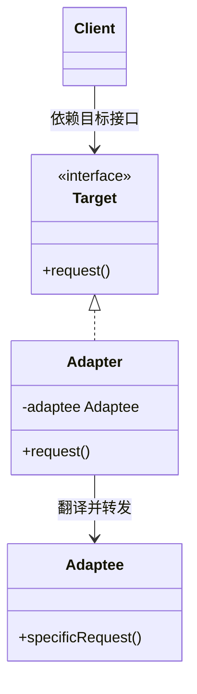
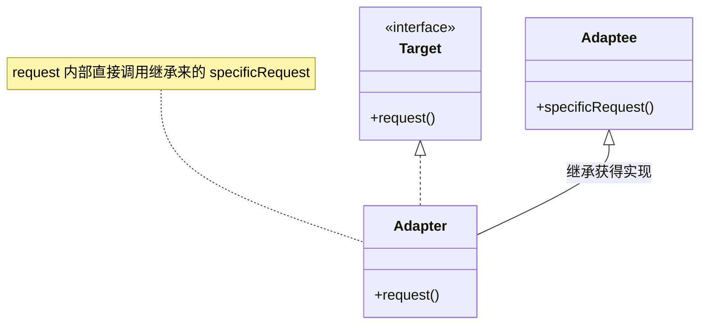
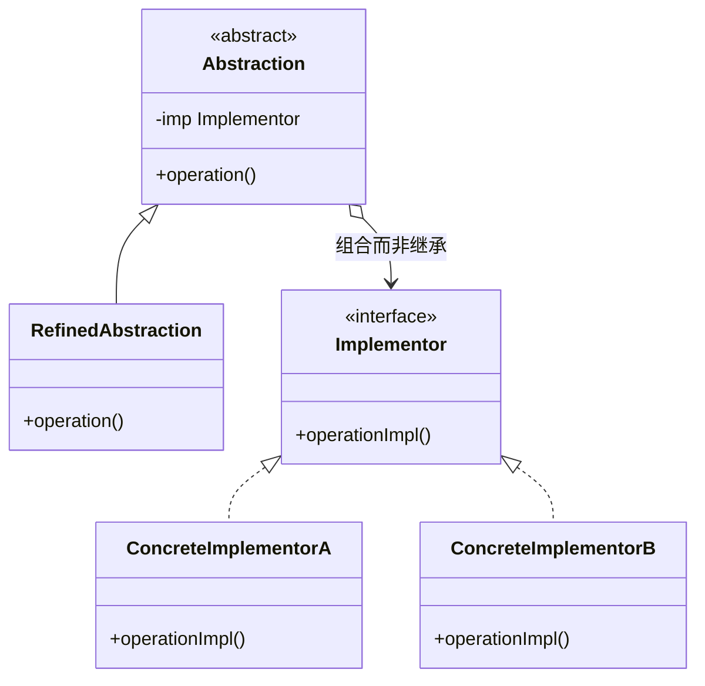
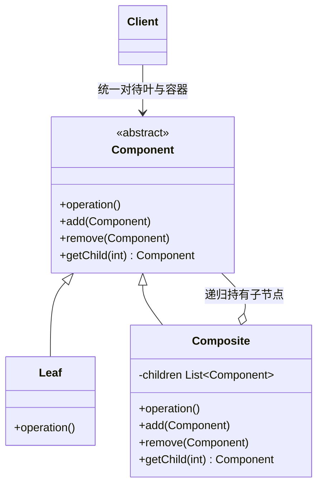
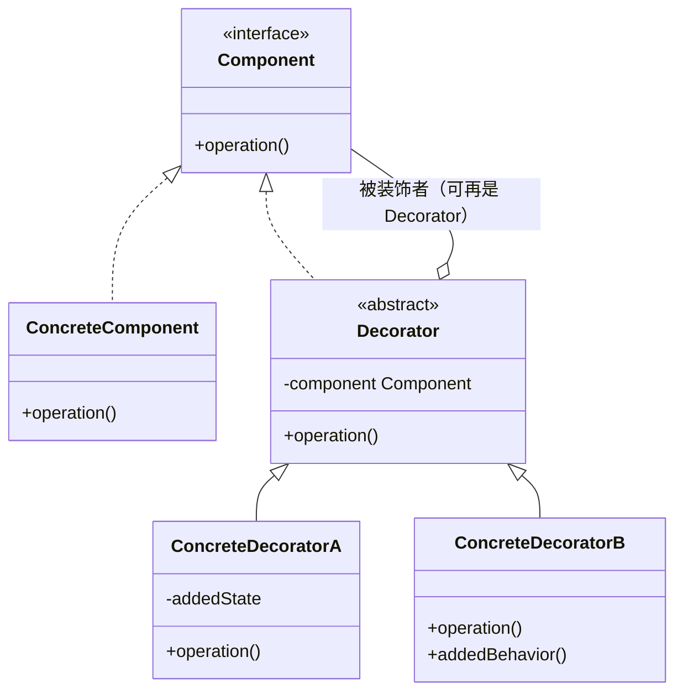
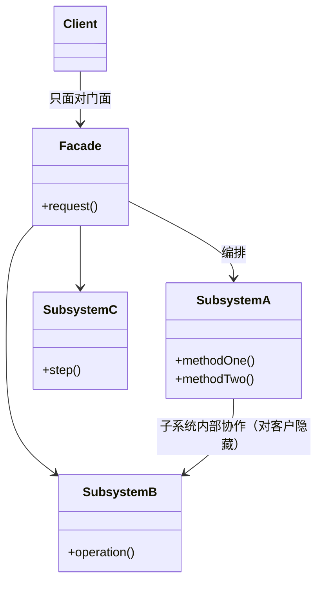
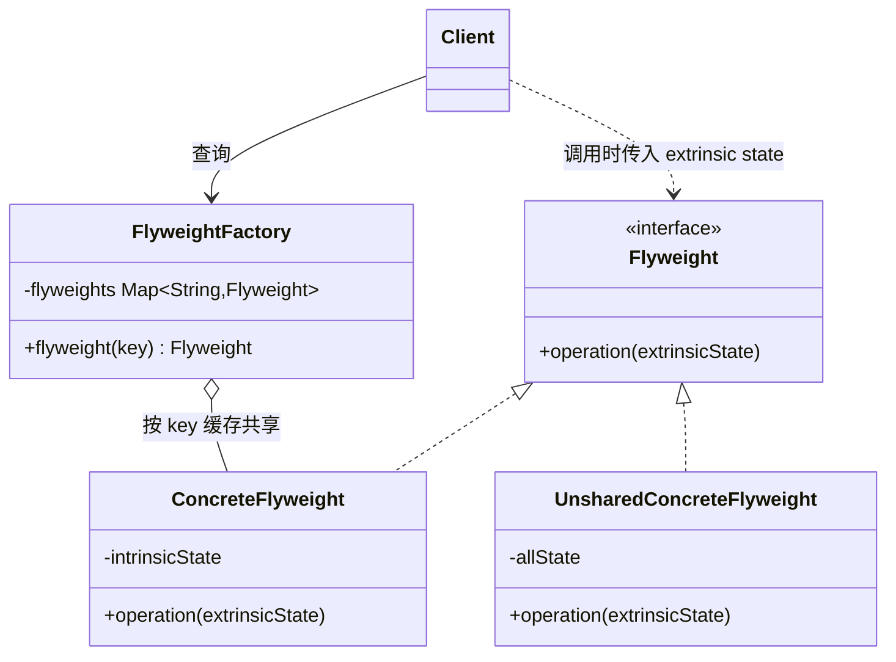
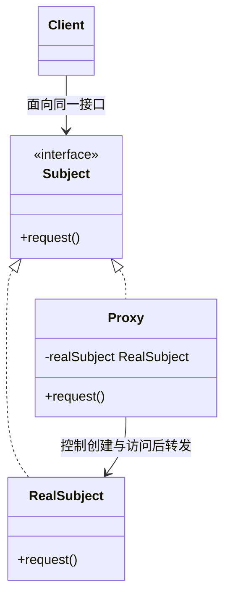

# Structural Patterns（结构型模式）

结构型模式关注**如何组合类与对象**以获得更大的结构：一类用继承来组合接口或实现（class pattern，如 Adapter 的类适配器），另一类用对象组合来组合出新的功能（object pattern）。

7 个结构型模式：Adapter、Bridge、Composite、Decorator、Facade、Flyweight、Proxy。

> 类图为 mermaid；Sample Code 用 Java 还原原书的 Motivation 场景（原书为 C++/Smalltalk）。更多 Java 示例见上级目录《设计模式之二：Structural Pattern》。

## Adapter（别名 Wrapper）

> 将一个类的接口转换成客户期望的另一个接口。Adapter 使原本接口不兼容而不能一起工作的类可以协同工作。
>
> Convert the interface of a class into another interface clients expect.

### Motivation

图形编辑器已有 `TextView`（来自界面工具包），但编辑器统一操作 `Shape` 接口（`boundingBox`、`createManipulator`…）。解法：`TextShape` **适配** TextView——作为类适配器（继承 TextView 并实现 Shape）或对象适配器（持有 TextView 并实现 Shape），编辑器即可像对待 Shape 一样对待文本。

两种形态：

* **class adapter**：多重继承（实现 Target 接口 + 继承 Adaptee），静态绑定
* **object adapter**：组合（实现 Target 接口 + 持有 Adaptee），可适配 Adaptee 及其子类

### Applicability

* 想使用一个现有的类，但它的接口不符合你的需要
* 想创建一个可复用的类，能与无关的、事先无法预见的类（即接口不一定兼容的类）协作
* 想同时使用多个现有的子类，但为每一个子类派生子类去适配接口并不现实。object adapter 可以直接适配其父类的接口
* 大量使用第三方库的应用，会用 adapter 作为应用与第三方库之间的中间层来解耦。这样换库时只需为新库写一个 adapter，无需改动应用代码

### Structure（object adapter）



class adapter 的结构（Java 无多重继承，用"实现接口 + 继承被适配者"近似）：



### Participants

* **Target**：Client 使用的领域相关接口
* **Client**：与符合 Target 接口的对象协作
* **Adaptee**：被适配的已有接口（需要被转换的类）
* **Adapter**：把 Adaptee 的接口适配成 Target 接口

### Collaborations

Client 调用 Adapter 的 Target 操作；Adapter 把请求翻译（可能改参数、换语义）后转给 Adaptee。

### Consequences

class adapter：

* 绑定到具体 Adaptee 类，无法适配 Adaptee 的子类
* Adapter 可以覆盖 Adaptee 的行为
* 只引入一个对象，无额外间接

object adapter：

* 一个 Adapter 可以适配多个 Adaptee（Adaptee 本体及其子类），还可以一次性为它们添加功能
* 更难覆盖 Adaptee 的行为（需要派生 Adaptee 再让 Adapter 引用派生类）

其他代价：适配工作量通常不大，但**逐个适配大量相似接口**会令人厌倦——此时应考虑重新审视抽象边界。

### Implementation（书中亮点：Pluggable Adapter）

* **Pluggable Adapter（可插拔适配器）**：让 Adapter 不写死对 Adaptee 的调用。三种手段——
  1. 用**抽象操作**：Adapter 声明抽象方法，由子类提供与 Adaptee 的实际绑定
  2. 用**委托对象**：Adapter 把"取数据/发请求"委托给内部的 delegate，换 delegate 即换被适配者
  3. **参数化的适配**：调用方传入"该调用 Adaptee 的什么操作"的信息
* **Two-way adapter（双向适配器）**：同时实现 Target 与 Adaptee 两个接口，可站在任一侧使用——依赖多重继承（class adapter）

### Sample Code（Shape 与 TextView）

```java
// ---- Target：编辑器的统一接口 ----
// （BoundingBox/Point/Manipulator 等辅助类型为示意，从略）
interface Shape {
    BoundingBox boundingBox();
    Manipulator createManipulator();
}

// ---- Adaptee：界面工具包已有类，接口不同 ----
class TextView {
    Point origin() { return new Point(0, 0); }
    Point extent() { return new Point(80, 24); }
    boolean isEmpty() { return false; }
}

// ---- 对象适配器：实现 Target + 持有 Adaptee，逐个翻译 ----
class TextShape implements Shape {
    private final TextView textView;               // Adaptee

    TextShape(TextView textView) { this.textView = textView; }

    @Override
    public BoundingBox boundingBox() {             // 用 Adaptee 的两个点拼出 Target 的结果
        Point bottomLeft = textView.origin();
        Point topRight = textView.extent();
        return new BoundingBox(bottomLeft, topRight);
    }

    @Override
    public Manipulator createManipulator() {
        return new TextManipulator(this);          // 适配器自己的实现
    }
}

// ---- 编辑器（Client）：TextShape 当普通 Shape 使用 ----
Shape shape = new TextShape(new TextView());
shape.boundingBox();                               // 编辑器无感知 TextView 的存在
```

```java
// ---- class adapter（Java 近似：继承 Adaptee + 实现 Target）----
class TextShapeClassAdapter extends TextView implements Shape {
    @Override
    public BoundingBox boundingBox() {
        return new BoundingBox(origin(), extent()); // 直接用继承来的方法
    }
    @Override
    public Manipulator createManipulator() {
        return new TextManipulator(this);
    }
}
```

### 现代对应

`java.util.Arrays#asList()`、`java.io.InputStreamReader/OutputStreamWriter`（字节流接口 ↔ 字符流接口）。

### Related Patterns

与 **Bridge** 结构相似但意图不同：Bridge 事先把抽象与实现分离以便独立变化，Adapter 事后让不相关的东西协同；与 **Decorator** 比，Decorator 不改接口只加职责，Adapter 改接口；与 **Proxy** 比，Proxy 保持接口不变、代表真实对象。

## Bridge（别名 Handle/Body）

> 将抽象部分与它的实现部分分离，使它们都可以独立地变化。
>
> Decouple an abstraction from its implementation so that the two can vary independently.

### Motivation

Window 抽象要在 X Window System 与 Presentation Manager 两个平台上实现，又有 IconWindow、TransientWindow 等扩展。用继承会得到 2×N 的类组合（类爆炸）。解法：把"平台实现"维度抽出来——`Window`（Abstraction，含扩展子类）只持有 `WindowImp`（Implementor）接口，XWindowImp/PMWindowImp 各自实现；两个层次独立扩展，运行期还能换实现。

### Applicability

* 不希望在抽象与其实现之间有永久的静态绑定（如运行期选择实现）
* 抽象与实现都应可通过子类化扩展，且二者可独立变化
* 实现的改变不应对客户产生影响（实现细节对客户透明）
* 想在多个对象间共享一个实现
* 需要在两个独立维度上扩展类层次（避免 n×m 类爆炸）

### Structure



### Participants

* **Abstraction**：定义抽象类接口，维护对 Implementor 的引用
* **RefinedAbstraction**：扩展 Abstraction
* **Implementor**：定义实现类接口（不必与 Abstraction 接口一致，通常只提供原语操作）
* **ConcreteImplementor**：实现 Implementor 接口，定义具体实现

### Collaborations

Abstraction 把客户请求转发给 Implementor 对象完成；Abstraction 高层策略，Implementor 底层细节。

### Consequences

* **接口与实现分离**：实现不绑定在接口上，可实现"运行期切换实现"，对客户隐藏实现细节（平台 API 等）
* **提高可扩展性**：两个层次独立扩展，新增 RefinedAbstraction 或 ConcreteImplementor 互不影响
* **实现细节对客户透明**（hiding implementation），实现可在多个对象间共享

### Implementation

* **只有一个 Implementor 时**值不值得做 Bridge？值得——分离本身就是解耦，日后加实现无需改动抽象侧
* **创建正确的 Implementor**：Abstraction 构造时选择并装配 Implementor；若 Abstraction 不知道具体实现，可用 Abstract Factory 创建
* **共享 Implementor**：多个 Abstraction 实例可引用同一 Implementor（引用计数管理生命期）
* C++ 中可用 **private 继承**复用 Implementor 的机制而不暴露其接口

### Sample Code（Window 与 WindowImp）

```java
// ---- Implementor：平台实现接口（原语操作，接口与 Window 不必一致）----
interface WindowImp {
    void deviceText(String text, int x, int y);
    void deviceRect(int x0, int y0, int x1, int y1);
}

class XWindowImp implements WindowImp {            // ConcreteImplementor A
    public void deviceText(String text, int x, int y) {
        System.out.println("XWindow 绘制文本: " + text);        // 实际调用 Xlib
    }
    public void deviceRect(int x0, int y0, int x1, int y1) { }
}
class PMWindowImp implements WindowImp {           // ConcreteImplementor B
    public void deviceText(String text, int x, int y) {
        System.out.println("PM 窗口绘制文本: " + text);          // 实际调用 Presentation Manager
    }
    public void deviceRect(int x0, int y0, int x1, int y1) { }
}

// ---- Abstraction：窗口的高层接口 ----
class Window {
    protected WindowImp imp;                       // 关键：持有实现维度的引用

    protected Window() {
        // 装配正确的实现：WindowSystemFactory 为示意（按当前平台产出 X/PM 实现），
        // 实际项目可由 Abstract Factory 决定——两个维度从此解耦
        this.imp = WindowSystemFactory.current().createWindowImp();
    }

    void drawText(String text, int x, int y) {     // 高层策略
        imp.deviceText(text, x, y);                // 转发给底层实现
    }
}

// ---- RefinedAbstraction：窗口语义的扩展，不涉及任何平台代码 ----
class IconWindow extends Window {
    private final String iconName = "close-icon";

    void drawBorder() {
        drawText(iconName, 0, 0);                  // 复用高层接口
        imp.deviceRect(0, 0, 16, 16);              // 需要时也可直接用原语
    }
}

// 新增平台 = 新增一个 WindowImp；新增窗口种类 = 新增一个 Window 子类
// 2 个平台 × 3 种窗口只需 2 + 3 个类，而不是 6 个
```

### 现代对应

JDBC：`Connection/Statement`（抽象侧）与各数据库 Driver（实现侧）分离，新增数据库实现不影响抽象侧 API。

### Related Patterns

**Abstract Factory** 可用来创建并配置一对 Bridge 的两侧；与 **Adapter** 的区别——Adapter 事后让无关类协同，Bridge 事先分离抽象与实现。

## Composite

> 将对象组合成树形结构以表示「部分—整体」的层次结构。Composite 使客户对单个对象和组合对象的使用具有一致性。
>
> Compose objects into tree structures to represent part-whole hierarchies.

### Motivation

图形编辑器里图元（直线、多边形、文本）与图组（Picture，本身可再嵌套图组）应有一致的操作（draw、resize、reorder）。解法：定义 `Graphic` 抽象，`Picture` 实现 Graphic 并**持有 Graphic 子节点列表**，把请求转发（forward）给所有孩子——递归组合出任意深度。

### Applicability

* 想表示对象的「部分—整体」层次结构
* 希望客户忽略组合对象与单个对象的差别，统一使用层次中的所有对象

### Structure



### Participants

* **Component**：为 Leaf 与 Composite 声明公共接口；可为管理子节点等操作声明默认行为
* **Leaf**：叶子对象，无孩子
* **Composite**：容器，存储子 Component，实现与孩子相关的操作
* **Client**：通过 Component 接口统一操作

### Collaborations

客户请求到达 Composite 时，Composite 把请求转发给它的子节点并可能附加前后处理；递归到 Leaf 为止。

### Consequences

* **定义了包含基本对象与组合对象的类层次**：基本对象可以组合成复合对象，复合对象又可以再组合——递归嵌套
* **简化客户代码**：客户统一面向 Component，无需区分叶与容器
* **易于增加新组件类型**：新 Leaf/Composite 无需改动现有代码
* **使设计过于一般化**：很难"限制"组合的成分类型（无法在编译期保证某容器只含某类叶子），需要运行期检查

### Implementation（关键权衡：透明性 vs 安全性）

* **在哪声明孩子管理操作（add/remove/getChild）**——本模式最经典的权衡：
  * 放在 **Component**：对客户**透明**（统一接口），但对 Leaf 来说不安全（空实现或抛异常）
  * 只放在 **Composite**：**安全**（类型保证），但客户必须区分对待、丧失透明性
  * 书中倾向透明性（牺牲安全），这是设计权衡而非定论
* **显式父指针**：子节点持父引用便于 `Parent()` 上溯；变更时须维护一致性
* **共享组件**：孩子常被多方共享，配合 **Flyweight**；父指针与共享冲突（谁的父亲？）
* **最大化 Component 接口 vs 单一职责**：接口塞入过多子类操作会污染叶子；可用"缺省失败（报错）"的折中
* **孩子顺序**：需要有序遍历时让孩子列表维护顺序；可配合 Iterator 遍历
* **谁删除孩子**：通常 Composite 删除孩子时递归析构未共享的子树（语言 GC 则无此忧）

### Sample Code（Lexi 的 Glyph 树）

```java
// ---- Component：排版元素的统一接口（书中采用"透明优先"折中）----
abstract class Glyph {
    private Glyph parent;                           // 显式父指针，便于上溯

    Glyph parent() { return parent; }
    void setParent(Glyph p) { this.parent = p; }

    void draw() { }                                 // 缺省为空，叶子/容器各自覆盖

    void add(Glyph glyph) {                         // 叶子不支持：透明性折中的代价
        throw new UnsupportedOperationException();
    }
    void remove(Glyph glyph) {
        throw new UnsupportedOperationException();
    }
}

// ---- Leaf 1：字符（书中为 Character，避开 java.lang.Character 改名）----
class CharacterGlyph extends Glyph {
    private final char code;                        // 书中此角色由 Flyweight 共享
    CharacterGlyph(char code) { this.code = code; }
    @Override void draw() { System.out.print(code); }
}

// ---- Composite：行、列都是容器，请求转发给孩子 ----
class Row extends Glyph {
    private final List<Glyph> children = new ArrayList<>();

    @Override void add(Glyph glyph) { glyph.setParent(this); children.add(glyph); }
    @Override void remove(Glyph glyph) { children.remove(glyph); }

    @Override void draw() {                         // 转发：递归直至叶子
        for (Glyph child : children) child.draw();
    }
}
class Column extends Glyph {                        // 与 Row 同构，可换行距等策略
    private final List<Glyph> children = new ArrayList<>();
    @Override void add(Glyph glyph) { glyph.setParent(this); children.add(glyph); }
    @Override void draw() { for (Glyph child : children) { child.draw(); System.out.println(); } }
}

// ---- Client：对叶与容器一视同仁 ----
Column page = new Column();
Row line = new Row();
line.add(new CharacterGlyph('H'));
line.add(new CharacterGlyph('i'));
page.add(line);
page.add(new Row());                                // 空行也是 Row
page.draw();                                        // 递归输出整页
```

### 现代对应

`java.awt.Container/Component`、Swing `JComponent` 树、DOM/XML 节点树、文件系统目录树。

### Related Patterns

**Decorator** 常与 Composite 一起用（同为递归组合，但 Decorator 只包一个孩子且加职责）；叶节点可用 **Flyweight** 共享；遍历用 **Iterator**；对整棵树分发操作用 **Visitor**；父—子通知可用 **Observer**；父链请求转发即 **Chain of Responsibility**。

## Decorator（别名 Wrapper）

> 动态地给一个对象添加额外的职责。就增加功能而言，Decorator 比生成子类更为灵活。
>
> Attach additional responsibilities to an object dynamically.

### Motivation

文本视图有时要加边框、有时要加滚动条、有时两者都要。为每种组合派生子类（BorderTextView、ScrollTextView、BorderScrollTextView……）会组合爆炸。解法：`MonoGlyph`（Decorator）实现 Glyph 接口并**内嵌一个 Glyph**——BorderDecorator 在转发 `draw()` 前画边框，ScrollDecorator 在转发时处理滚动，层层包装按需组合。

### Applicability

* 动态、透明地给单个对象添加职责（不影响其他对象），且职责可以撤销
* 用子类扩展不可行：组合爆炸，或类定义被隐藏/不能用于继承

### Structure



### Participants

* **Component**：声明接口，Decorator 与被装饰者共同实现它
* **ConcreteComponent**：被装饰的原始对象
* **Decorator**：维持对 Component 的引用，并实现 Component 接口（默认转发）
* **ConcreteDecorator**：向组件添加职责

### Collaborations

Decorator 在转发请求给内嵌组件**前后**附加自己的行为；多重 Decorator 层层嵌套。

### Consequences

* **比静态继承灵活**：职责在运行期叠加/拆除，任意组合
* **避免在层次上层堆满功能的类**（pay-as-you-go，用多少功能付多少开销），不给不需要它的对象付代价
* 代价一：**Decorator ≠ 被装饰对象**（身份不同），依赖对象同一性（identity）的代码会失效
* 代价二：**大量小对象**：装饰链上的对象都很小、外观相似，排查与学习成本升高

### Implementation

* **接口一致性**：Decorator 必须完全实现 Component 接口，否则前功尽弃
* **保持 Component 类轻量**：不要把数据存进 Component（每个装饰层都要包一遍）；Component 只定义接口，数据放 ConcreteComponent
* 装饰策略只有一层（如仅"画边框"）时 Decorator 也可只提供简化形式的子类

### Sample Code（Lexi 的 MonoGlyph：Border / Scroll 装饰）

```java
// ---- Component（沿用上节的 Glyph）----
abstract class Glyph2 {
    void draw() { }
    BoundingBox bounds() { return new BoundingBox(); }
}

// ---- ConcreteComponent：文本视图 ----
class TextViewGlyph extends Glyph2 {
    private final String text;
    TextViewGlyph(String text) { this.text = text; }
    @Override void draw() { System.out.print(text); }
    @Override BoundingBox bounds() { return new BoundingBox(0, 0, 100, 20); }
}

// ---- Decorator 基类：持有一个 Glyph 并默认转发 ----
abstract class MonoGlyph extends Glyph2 {
    protected final Glyph2 component;               // 被装饰者（可再是一个 Decorator）
    MonoGlyph(Glyph2 component) { this.component = component; }
    @Override void draw() { component.draw(); }     // 默认：原样转发
}

// ---- ConcreteDecorator 1：边框 ----
class BorderDecorator extends MonoGlyph {
    private final int width;
    BorderDecorator(Glyph2 g, int width) { super(g); this.width = width; }
    @Override void draw() {
        System.out.print("[");                      // 附加职责（前）
        super.draw();                               // 转发给内层
        System.out.print("]");                      // 附加职责（后）
    }
    @Override BoundingBox bounds() {
        BoundingBox inner = component.bounds();
        return inner.expand(width);                 // 职责带来的语义变化
    }
}

// ---- ConcreteDecorator 2：滚动条 ----
class ScrollDecorator extends MonoGlyph {
    ScrollDecorator(Glyph2 g) { super(g); }
    @Override void draw() {
        super.draw();
        System.out.print("(scrollbar)");            // 附加职责（后）
    }
}

// ---- Client：按需层层包装，任意组合 ----
Glyph2 plain    = new TextViewGlyph("hello");
Glyph2 bordered = new BorderDecorator(plain, 1);                 // 只要边框
Glyph2 full     = new BorderDecorator(                           // 边框 + 滚动条
                    new ScrollDecorator(plain), 1);
full.draw();   // [hello(scrollbar)]  —— 没有为组合派生任何子类
```

### Known Uses / 现代对应

* 书中：InterViews 的 MonoGlyph 等界面工具包的装饰机制、许多 iostream 库的流抽象
* Java：`java.io` 流族——`BufferedInputStream`/`DataInputStream`（Decorator）包装 `InputStream`（Component），是教科书级实现

### Related Patterns

**Adapter** 结构相似但意图不同：Decorator 不改接口只加职责，Adapter 改接口；Decorator 是退化的 **Composite**（只有单孩子）；**Proxy** 结构也相似，但 Proxy 控制访问而非加职责；与 **Strategy** 的分工——**Decorator 改"外壳"（skin，对象外观上的职责），Strategy 改"内脏"（guts，对象内部的算法）**。

## Facade

> 为子系统中的一组接口提供一个一致的高层界面，使这一子系统更加容易使用。
>
> Provide a unified interface to a set of interfaces in a subsystem.

### Motivation

编译器子系统包含 Scanner、Parser、ProgramNode、CodeGenerator 等众多类，彼此协作方式复杂。绝大多数客户只需要"编译一个源文件"。解法：定义 **Compiler** 门面类，提供 `compile(source, target)` 一个高层方法，内部编排子系统各对象——客户不必与子系统内部类打交道。

### Applicability

* 要为一个复杂子系统提供简单接口
* 客户程序与抽象类的实现部分之间存在着依赖关系，引入 Facade 将子系统与客户及其他子系统分离，可提高独立性与可移植性
* 需要分层构建子系统——每层一个 Facade 作为入口

### Structure



### Participants

* **Facade**：知道哪些子系统类负责处理请求；把客户的请求代理给适当的子系统对象
* **Subsystem classes**：实现子系统功能，处理 Facade 指派的任务；不知道 Facade 的存在

### Consequences

* **屏蔽了子系统组件**，客户要打交道的对象变少、使用方式变简单
* **实现子系统与客户解耦**（weak coupling）：子系统内部变化不影响客户；便于把子系统当整体替换/移植
* 代价：**并不阻止**客户绕过 Facade 直接使用子系统具体类——想强制就得配合接口隔离/包私有

### Implementation

* **降低客户—子系统耦合**：Facade 的方法对客户"够用即可"，必要时用参数传递细节
* **抽象 Facade 类**：需要多种子系统实现时，可把 Facade 做成抽象类 + 每种子系统一个具体 Facade 子类（另一种做法是直接换不同的 Facade 对象/配置，组合优先）
* **子系统私有化**：语言允许时（package/C++ namespace），把子系统类对 Facade 之外的世界隐藏

### Sample Code（编译器子系统）

```java
// ---- 子系统：一组相互协作的类，客户直接使用它们会非常繁琐 ----
class Scanner {
    Scanner(InputStream source) { }
    Token scan() { return null; }
}
class Parser {
    private final ProgramNodeBuilder builder;
    Parser(ProgramNodeBuilder builder) { this.builder = builder; }
    void parse(Scanner scanner) { /* 逐 token 构建语法树 */ }
}
class ProgramNodeBuilder {
    ProgramNode getProgramNode() { return new ProgramNode(); }
}
class ProgramNode {
    void traverse(CodeGenerator g) { /* 遍历语法树，驱动代码生成 */ }
}
abstract class CodeGenerator { abstract void generate(); }
class RISCCodeGenerator extends CodeGenerator {
    RISCCodeGenerator(BytecodeStream target) { }
    void generate() { }
}
class BytecodeStream { }

// ---- Facade：一个方法收口全部子系统交互 ----
class Compiler {
    // 客户只需调用 compile()；Scanner/Parser/Builder/Generator 的编排被封装在这里
    void compile(InputStream source, BytecodeStream target) {
        Scanner scanner = new Scanner(source);
        ProgramNodeBuilder builder = new ProgramNodeBuilder();
        Parser parser = new Parser(builder);

        parser.parse(scanner);                       // 子系统内部协作 1：解析建树

        RISCCodeGenerator generator = new RISCCodeGenerator(target);
        builder.getProgramNode().traverse(generator); // 子系统内部协作 2：遍历生成代码
    }
}

// ---- Client ----
new Compiler().compile(new FileInputStream("a.c"), new BytecodeStream());
```

### 现代对应

Spring 的 `JdbcTemplate`（把 JDBC 的连接/语句/异常处理收进一个入口）、`java.net.URL`（简化 socket/DNS/协议栈细节）。

### Related Patterns

与 **Mediator** 的对比——Facade 是**单向**抽象（客户→子系统，子系统不知 Facade），Mediator 是**多向**协调（同事对象知道 Mediator 并双向互动）；**Abstract Factory** 可与 Facade 搭配以配置子系统；Facade 常实现为 **Singleton**。

## Flyweight

> 运用共享技术有效地支持大量细粒度的对象。
>
> Use sharing to support large numbers of fine-grained objects efficiently.

### Motivation

文档编辑器为每个字符建一个 Glyph 对象，一篇文档动辄几十万个对象——不可行。观察：同一个字符（如"a"）反复出现，它的字形、度量是**不变/与位置无关**的；可共享。而位置、样式随出现而变，**不能**进共享对象。解法：把状态分成 **intrinsic state**（内蕴，可共享，存 Flyweight 内）与 **extrinsic state**（外蕴，不共享，由客户在调用时作为参数传入 context）。每种字符一个 Glyph 实例，画的时候再把坐标/样式传进去。

### Applicability

* 应用使用大量对象，存储开销巨大
* 对象的大多数状态可变为外蕴（extrinsic）
* 按外蕴状态分组后，多组对象可被较少的共享对象代替
* 应用不依赖对象同一性（identity）——共享后"概念上不同的对象"会共用同一实例

### Structure



### Participants

* **Flyweight**：声明接口，通过它 Flyweight 可接收外蕴状态
* **ConcreteFlyweight**：实现接口，存储内蕴状态；必须可共享
* **UnsharedConcreteFlyweight**：不被共享的 Flyweight（常作为共享叶节点的容器）
* **FlyweightFactory**：创建并管理 Flyweight，确保合理共享
* **Client**：持有/引用 Flyweight，计算/存储外蕴状态并传入调用

### Consequences

节省多少取决于：减少的实例数量、内蕴状态的多少、外蕴状态是计算出来还是仍要存储。外蕴状态**可以计算**时节省最大；**必须存储**则只是把开销转移给客户。总体是以时间换空间（调用时传递/计算外蕴状态的运行期成本）。依赖同一性的场合不可用。

### Implementation

* **移除外蕴状态**：模式成败的关键在于多少状态能外蕴化——设计时常把"坐标、样式、容器关系"外移
* **管理共享对象**：Factory 内维护 `key → flyweight` 表；享元不引用 Factory（避免循环）；不再使用的享元的回收（引用计数/GC，或干脆不回收——数量有限）
* 共享的范围：常按"字符/图元类别"共享，容器（行、列）不共享（UnsharedConcreteFlyweight），构成 Composite

### Sample Code（字符 Glyph 的共享与 GlyphContext）

```java
// ---- Flyweight：接口多带一个 extrinsic 上下文参数 ----
abstract class Glyph3 {
    abstract void draw(Window w, GlyphContext ctx);
    void insert(Glyph3 g, GlyphContext ctx) { }
}

// ---- ConcreteFlyweight：只存 intrinsic state（字符编码），必须可共享 ----
class CharacterGlyph3 extends Glyph3 {
    private final char code;                        // intrinsic：与位置无关
    CharacterGlyph3(char code) { this.code = code; }
    @Override void draw(Window w, GlyphContext ctx) {
        // extrinsic（位置、字体）不在对象里，画的时候向 ctx 要
        Font font = ctx.getFont();
        int x = ctx.getX(), y = ctx.getY();
        System.out.println("draw '" + code + "' @" + x + "," + y + " font=" + font);
    }
}

// ---- UnsharedConcreteFlyweight：行/列不共享，作为共享叶的容器 ----
class Row3 extends Glyph3 {
    private final List<Glyph3> children = new ArrayList<>();
    @Override void insert(Glyph3 g, GlyphContext ctx) { children.add(g); }
    @Override void draw(Window w, GlyphContext ctx) {
        for (Glyph3 child : children) { child.draw(w, ctx); ctx.next(1); }
    }
}

// ---- FlyweightFactory：按字符缓存，每种字符只有一个实例 ----
class GlyphFactory {
    private final CharacterGlyph3[] cache = new CharacterGlyph3[128];
    CharacterGlyph3 characterGlyph(char c) {
        if (cache[c] == null) cache[c] = new CharacterGlyph3(c);
        return cache[c];                            // 命中即共享
    }
    Row3 row() { return new Row3(); }               // 不共享的类型每次新建
}

// ---- Client 侧：外蕴状态（当前字体/游标）由 GlyphContext 持有 ----
class GlyphContext {
    private int x = 0, y = 0;
    private Font font = new Font("Serif");
    Font getFont() { return font; }
    int getX() { return x; }  int getY() { return y; }
    void next(int step) { x += step * 8; }
}

GlyphFactory factory = new GlyphFactory();
Row3 row = factory.row();
row.insert(factory.characterGlyph('g'), null);     // 两个 'o' 命中同一个缓存实例
row.insert(factory.characterGlyph('o'), null);
row.insert(factory.characterGlyph('o'), null);
row.draw(new Window(), new GlyphContext());        // Window 见 Bridge 一节（示意）
```

### Known Uses / 现代对应

* 书中：字符 Glyph 共享（文档编辑器场景）、InterViews 的 glyph/Style
* Java：`Integer#valueOf` 的 `-128~127` 缓存、`String` 常量池、`Boolean` 等包装类——虽然不是类库层面显式的 FlyweightFactory，思想一致

### Related Patterns

Flyweight 的共享叶 + 不共享容器 = **Composite**；**State** 与 **Strategy** 的对象通常无内蕴状态、天然适合作为 Flyweight 共享。

## Proxy（别名 Surrogate）

> 为其他对象提供一个代理，以控制对这个对象的访问。
>
> Provide a surrogate or placeholder for another object to control access to it.

### Motivation

文档里嵌入的图像，多数从不被查看，加载全部图像代价高昂。解法：先用 **ImageProxy** 占位（画个占位框），当图像真正需要绘制时，Proxy 才加载真实 Image 并把请求转给它——之后 Proxy 与 Image 行为一致。

书中列出四种代理：

* **Remote proxy（远程代理）**：为不同地址空间的对象提供本地代表（如 RPC stub）
* **Virtual proxy（虚拟代理）**：为创建开销大的对象按需创建（惰性加载）
* **Protection proxy（保护代理）**：控制对原始对象的访问（权限检查）
* **Smart reference（智能引用）**：取代裸指针，在访问时做附加工作（引用计数、首次加载持久对象、加锁等）

### Applicability

* Remote proxy：为不同地址空间的对象提供本地代表
* Virtual proxy：为创建开销大的对象做按需加载与延迟初始化
* Protection proxy：控制对原始对象的访问权限
* Smart reference：在访问对象时附加内务操作（引用计数、加载持久对象、加锁）

### Structure



### Participants

* **Proxy**：维持对 RealSubject 的引用以转发请求；实现与 Subject 相同的接口以便替代它；控制 RealSubject 的创建/删除与访问
* **Subject**：为 RealSubject 与 Proxy 的公共接口
* **RealSubject**：Proxy 所代表的真实对象

### Consequences

* Remote proxy 隐藏"对象在别处"这一事实
* Virtual proxy 完成**按需加载/拷贝优化**（copy-on-write：只在真正修改时才复制，可大幅节省）
* Protection proxy 与 smart reference 在访问前后统一做权限/计数/锁等内务
* 代价：请求多一跳间接；某些代理（protection）需要额外配置权限模型

### Implementation

* **Proxy 重载运算符**（C++ 的 `operator->`/`operator*`）让"透过代理访问"与直接访问写法一致；Java 无运算符重载，动态代理 `java.lang.reflect.Proxy` 在运行期生成实现类
* **Copy-on-write**：Proxy 先与原对象共享，写操作时才真正复制——用 Proxy 实现"惰性复制"，配合引用计数管理
* Proxy 与 RealSubject 的创建时机解耦：真实对象在代理首次需要时才创建

### Sample Code（ImageProxy：Virtual Proxy）

```java
// ---- Subject ----
interface Graphic {
    void draw(Position pos);
    BoundingBox extent();
    void store();
}

// ---- RealSubject：加载开销大（读入整幅图像）----
class Image implements Graphic {
    private final String fileName;
    private byte[] pixels;                          // 体积大

    Image(String fileName) {
        this.fileName = fileName;
        this.pixels = readFromFile(fileName);       // 构造即加载 —— 昂贵
    }
    public void draw(Position pos) { System.out.println("绘制图像 " + fileName); }
    public BoundingBox extent() { return readExtent(pixels); }
    public void store() { }
    private static byte[] readFromFile(String f) { return new byte[0]; }
    private static BoundingBox readExtent(byte[] p) { return new BoundingBox(); }
}

// ---- Proxy：与 Image 同接口，先占位、真正需要时才加载 ----
class ImageProxy implements Graphic {
    private Graphic image;                          // 延迟到首次使用才创建
    private final String fileName;
    private BoundingBox extent;                     // 代理自己的小状态

    ImageProxy(String fileName) { this.fileName = fileName; }

    public BoundingBox extent() {
        if (image != null) extent = image.extent(); // 已加载：直接转发
        else if (extent == null)
            extent = readExtentFromSidecar(fileName); // 未加载：从旁侧信息取尺寸，不动真图
        return extent;
    }

    public void draw(Position pos) {
        if (image == null) image = new Image(fileName); // Virtual Proxy 的核心：按需加载
        image.draw(pos);
    }
    public void store() { if (image != null) image.store(); }

    private static BoundingBox readExtentFromSidecar(String f) { return new BoundingBox(); }
}

// ---- Client：文档里放的是 Proxy，多数图像从未被加载 ----
Graphic image1 = new ImageProxy("cover.png");
Graphic image2 = new ImageProxy("figure-1.png");
image1.extent();      // 不触发加载
image1.draw(new Position(0, 0)); // 此时才真正读文件
```

### 现代对应

`java.lang.reflect.Proxy`（动态代理）、RMI stub、Spring AOP 的代理 Bean、Android 的 `IBinder` 远端代理。

### Related Patterns

与 **Adapter**：Adapter 提供不同的接口，Proxy 提供相同的接口；与 **Decorator**：结构相同，但 Decorator 任意叠加职责、Proxy 侧重控制访问（创建、权限、远端化）；Virtual proxy 的实现常和 **Singleton** 式的惰性初始化同源。
