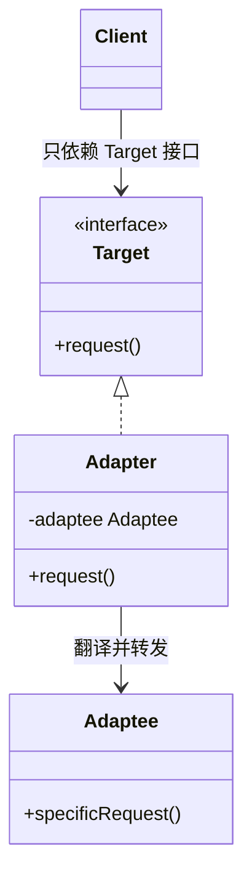
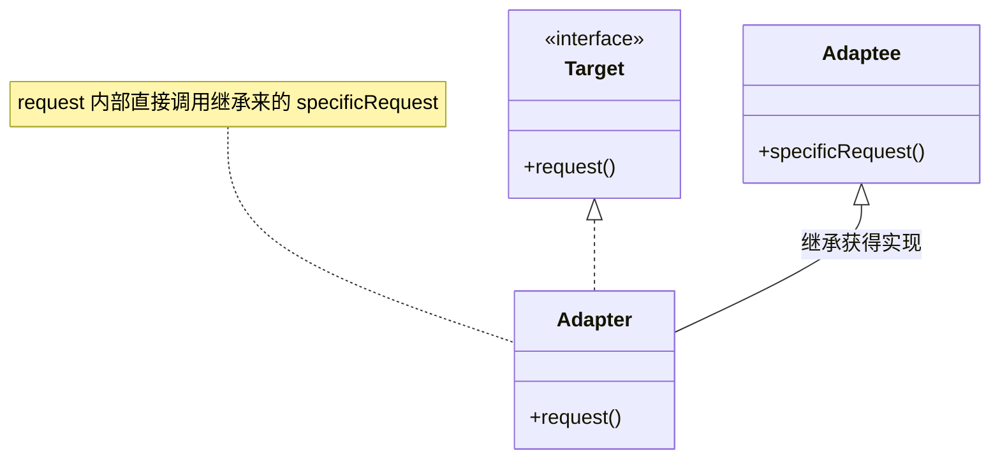
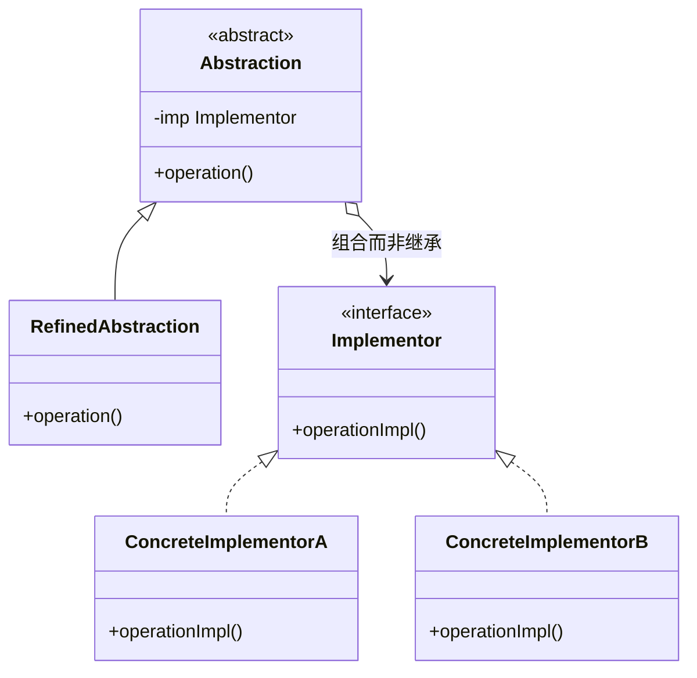
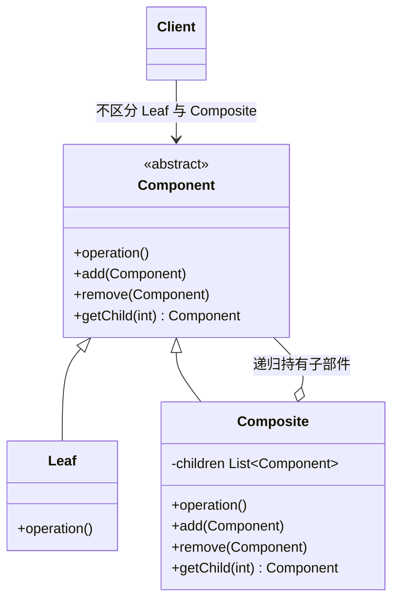
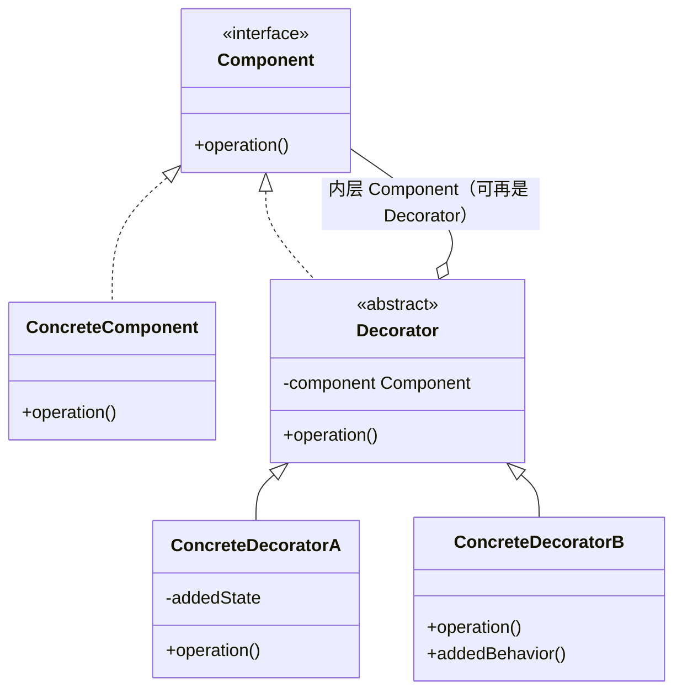
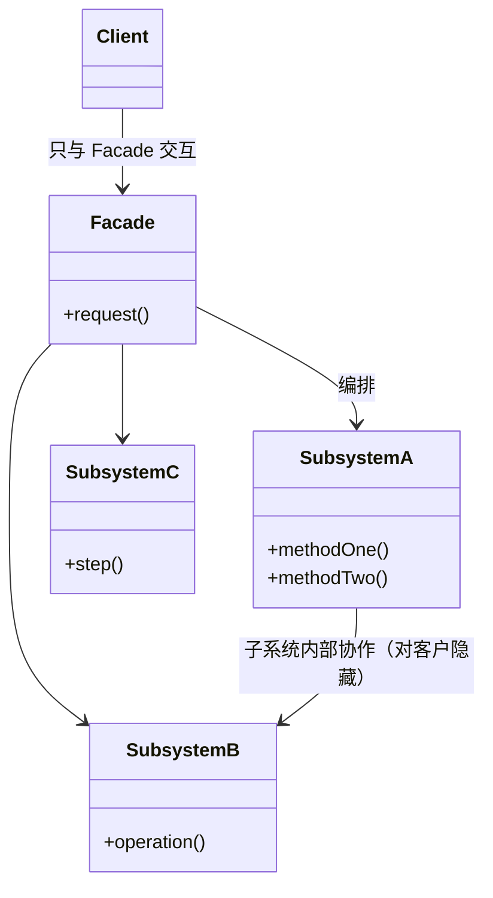
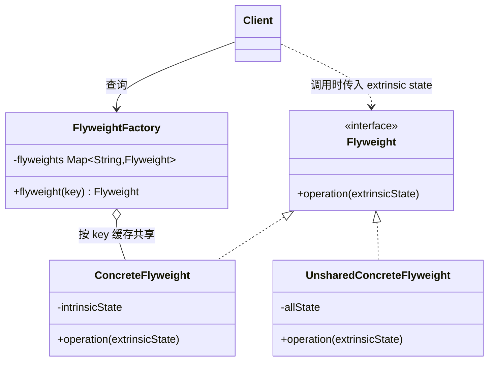
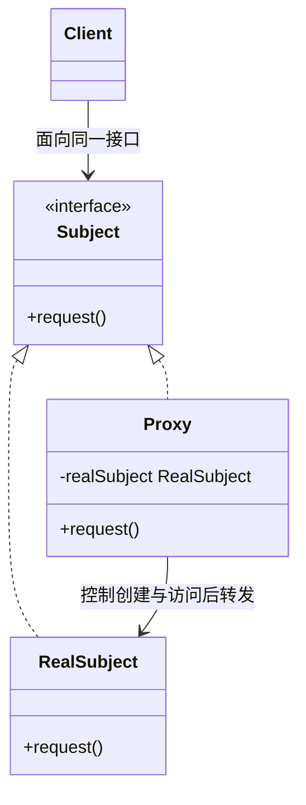

# Structural Patterns（结构型模式）

结构型模式关注**如何组合类与对象**以获得更大的结构：一类用继承来组合接口或实现（class pattern，如 Adapter 的类适配器），另一类用对象组合来组合出新的功能（object pattern）。

7 个结构型模式：Adapter、Bridge、Composite、Decorator、Facade、Flyweight、Proxy。

## Adapter（别名 Wrapper）

> 将一个类的接口转换成客户希望的另外一个接口。Adapter 模式使得原本由于接口不兼容而不能一起工作的那些类可以一起工作。
>
> Convert the interface of a class into another interface clients expect.

### Motivation

图形编辑器统一用 `Shape` 接口操纵所有图元（`boundingBox`、`createManipulator`……）。现在编辑器要支持文本，而显示与编辑文本的能力早已存在于界面工具包的 `TextView` 中——直接复用它最理想。问题在于 TextView 的接口与 Shape 不兼容：它不是图元，不按 Shape 的协议响应请求。

那就改 TextView 让它实现 Shape？不可行也不合适：TextView 属于工具包，我们控制不了（甚至拿不到源码），也不该为了某个编辑器的特殊需要去改动一个通用组件。Adapter 模式的做法是引入 `TextShape`：它实现 Shape 接口，把收到的 Shape 请求**转换**成 TextView 能理解的操作，由 TextView 完成实际工作。编辑器从此拿它当普通 Shape 用，TextView 一行不改。

TextShape 实现这种转换有两条路，对应 Adapter 的两种形态：

* **class adapter**：多重继承——同时继承 Adaptee（TextView）获得现成实现、继承 Target（Shape）接口获得编辑器所需的多态类型。C++ 用多重继承直接表达；Java 没有类的多重继承，但"继承 Adaptee + 实现 Target 接口"组合起来表达的是同一个结构
* **object adapter**：组合——只实现 Target 接口，内部持有一个 Adaptee 引用，把请求转发给它。因为引用声明为 Adaptee 类型而非某个具体子类，一个适配器实例就能配合 Adaptee 及其所有子类工作

适配不是简单转发，常常要做接口之间的**换算**——例如 `Shape#boundingBox` 需要 `bottomLeft`、`topRight` 两个点，而 TextView 提供的是 `origin()`（原点）与 `extent()`（宽高），适配器要把后者换算成前者（见 Sample Code）。

### Applicability

* 想使用一个现有的类，但它的接口不符合你的需要
* 想创建一个可复用的类，能与无关的、事先无法预见的类（即接口不一定兼容的类）协作
* 想同时使用某个已有类层次中的**多个子类**——用 class adapter 就得为每个子类派生一个适配器子类，不现实；object adapter 持有 Adaptee（父类）引用，一个适配器就能适配全部子类
* 大量使用第三方库的应用，会用 adapter 作为应用与第三方库之间的中间层来解耦。这样换库时只需为新库写一个 adapter，无需改动应用代码

### Structure（object adapter）


```mermaid
classDiagram
    class Client
    class Target {
        <<interface>>
        +request()
    }
    class Adapter {
        -adaptee Adaptee
        +request()
    }
    class Adaptee {
        +specificRequest()
    }
    Client --> Target : 只依赖 Target 接口
    Target <|.. Adapter
    Adapter --> Adaptee : 翻译并转发
```

class adapter 的结构（Java 中以"继承 Adaptee + 实现 Target 接口"表达多重继承）：


```mermaid
classDiagram
    class Target {
        <<interface>>
        +request()
    }
    class Adaptee {
        +specificRequest()
    }
    class Adapter {
        +request()
    }
    Target <|.. Adapter
    Adaptee <|-- Adapter : 继承获得实现
    note for Adapter "request 内部直接调用继承来的 specificRequest"
```

### Participants

* **Target**：Client 使用的领域相关接口
* **Client**：与符合 Target 接口的对象协作
* **Adaptee**：被适配的已有接口（需要被转换的类）
* **Adapter**：把 Adaptee 的接口适配成 Target 接口

### Collaborations

Client 在 Adapter 实例上调用 Target 操作；Adapter 把该请求转换为对 Adaptee 相应操作的调用，由 Adaptee 完成实际工作。

### Consequences

class adapter：

* 绑定到具体 Adaptee 类，无法适配 Adaptee 的子类
* Adapter 可以覆盖 Adaptee 的行为
* 只引入一个对象，无额外间接

object adapter：

* 一个 Adapter 可以适配多个 Adaptee（Adaptee 本体及其子类），还可以一次性为它们添加功能
* 更难覆盖 Adaptee 的行为（需要派生 Adaptee 再让 Adapter 引用派生类）

> Adapter 只转换接口而不增加功能，化解的是「Adaptee 不该改、Client 依赖的 Target 接口又是既定」的两难。

### Implementation（书中亮点：Pluggable Adapter）

* **Pluggable Adapter（可插拔适配器）**：让 Adapter 不写死对 Adaptee 的调用。三种手段——
  1. 用**抽象操作**：Adapter 声明抽象方法，由子类提供与 Adaptee 的实际绑定
  2. 用**委托对象**：Adapter 把"取数据/发请求"委托给内部的 delegate，换 delegate 即换 Adaptee
  3. **参数化的适配**：调用方传入"该调用 Adaptee 的什么操作"的信息
* **Two-way adapter（双向适配器）**：同时实现 Target 与 Adaptee 两个接口，可站在任一侧使用——依赖多重继承（class adapter）

### Sample Code（原书 TextShape 示例，C++）

先看 Target 与 Adaptee——编辑器统一操纵 Shape，而文本显示能力已在工具包的 TextView 里：

```cpp
class Shape {                                      // Target：编辑器的统一图元接口
public:
    virtual void BoundingBox(Point& bottomLeft, Point& topRight) const;
    virtual bool IsEmpty() const;
    virtual Manipulator* CreateManipulator() const;
};

class TextView {                                   // Adaptee：工具包已有类
public:
    TextView();                                    // 创建并不便宜：建缓冲、查字形表……
    void GetOrigin(Coord& x, Coord& y) const;
    void GetExtent(Coord& width, Coord& height) const;
    virtual bool IsEmpty() const;
};
```

对象适配器：TextShape 实现 Shape、持有 TextView。构造函数只做一件事——保存 Adaptee 指针，适配器从不重新实现 TextView 的功能：

```cpp
class TextShape : public Shape {
public:
    TextShape(TextView*);
    virtual void BoundingBox(Point& bottomLeft, Point& topRight) const;
    virtual bool IsEmpty() const;
    virtual Manipulator* CreateManipulator() const;
private:
    TextView* _text;
};

TextShape::TextShape(TextView* t) { _text = t; }
```

BoundingBox 完成接口之间的换算——Shape 要两点坐标，TextView 给的是原点加宽高：

```cpp
void TextShape::BoundingBox(Point& bottomLeft, Point& topRight) const {
    Coord bottom, left, width, height;
    _text->GetOrigin(left, bottom);
    _text->GetExtent(width, height);
    bottomLeft = Point(left, bottom);
    topRight = Point(left + width, bottom + height);   // 换算：适配 ≠ 转发
}

bool TextShape::IsEmpty() const {                    // 语义一致的操作：纯转发
    return _text->IsEmpty();
}

Manipulator* TextShape::CreateManipulator() const {  // Target 有而 Adaptee 没有：
    return new TextManipulator(this);                // 适配器自己补上
}
```

类适配器改为多重继承——同时继承 TextView（拿实现）与 Shape（拿接口），这正是 Java 表达不了的形态：

```cpp
class TextShape : public TextView, public Shape {
public:
    TextShape(TextView*);
    virtual void BoundingBox(Point& bottomLeft, Point& topRight) const;
    virtual bool IsEmpty() const;
    virtual Manipulator* CreateManipulator() const;
};

void TextShape::BoundingBox(Point& bottomLeft, Point& topRight) const {
    Coord bottom, left, width, height;
    GetOrigin(left, bottom);                        // 继承来的 TextView 操作，直接调用
    GetExtent(width, height);
    bottomLeft = Point(left, bottom);
    topRight = Point(left + width, bottom + height);
}

bool TextShape::IsEmpty() const {
    return TextView::IsEmpty();                     // 两个基类都声明了 IsEmpty，
}                                                   // 用域运算符消歧并复用 Adaptee 的实现
```

聪明的适配器。GetOrigin/GetExtent 这类查询最终要落到窗口系统，代价不小；聪明的 TextShape 可以缓存换算结果、只在文本变化后才重算：

```cpp
void TextShape::BoundingBox(Point& bottomLeft, Point& topRight) const {
    if (!_cacheValid) {
        // 重新执行上面的换算，把结果存进 _bottomLeft/_topRight；
        // 何时失效需要 TextView 额外告知——这正是代价所在
        _cacheValid = true;
    }
    bottomLeft = _bottomLeft;
    topRight = _topRight;
}
```

但这笔交易有代价：想知道缓存何时失效，适配器必须从 Adaptee 获取**额外信息**（文本是否变化过），因此更了解 Adaptee 的内部状态，耦合变紧。机械的适配简单且通用（换一个 TextView 子类照样工作），聪明的适配省运行时开销但与具体 Adaptee 绑定得更死——把适配做到什么粒度，是设计 Adapter 时真正要回答的问题。

最后看客户侧：编辑器始终面向 Shape 编程，用哪种适配器它都无感知。

```cpp
Shape* textShape = new TextShape(new TextView);
textShape->BoundingBox(bottomLeft, topRight);
```

### 现代对应

`java.util.Arrays#asList()`、`java.io.InputStreamReader/OutputStreamWriter`（字节流接口 ↔ 字符流接口）。

### Related Patterns

与 **Bridge** 结构相似但意图不同：Bridge 事先把抽象与实现分离以便独立变化，Adapter 事后让不相关的东西协同；与 **Decorator** 比，Decorator 不改接口只加职责，Adapter 改接口；与 **Proxy** 比，Proxy 保持接口不变、代表真实对象。

## Bridge（别名 Handle/Body）

> 将抽象部分与它的实现部分分离，使它们可以独立地变化。
>
> Decouple an abstraction from its implementation so that the two can vary independently.

### Motivation

Window 抽象要在 X Window System 与 Presentation Manager 两个平台上实现，又有 IconWindow、TransientWindow 等扩展。用继承会得到 2×N 的类组合（类爆炸）。解法：把"平台实现"维度抽出来——`Window`（Abstraction，含扩展子类）只持有 `WindowImp`（Implementor）接口，XWindowImp/PMWindowImp 各自实现；两个层次独立扩展，运行期还能换实现。

### Applicability

* 不希望在抽象与其实现之间有永久的静态绑定（如运行期选择实现）
* 抽象与实现都应可通过子类化扩展，且二者可独立变化
* 实现的改变不应对客户产生影响（实现细节对客户透明）
* 想在多个对象间共享一个实现
* 需要在两个独立维度上扩展类层次（避免 n×m 类爆炸）

### Structure


```mermaid
classDiagram
    class Abstraction {
        <<abstract>>
        -imp Implementor
        +operation()
    }
    class RefinedAbstraction {
        +operation()
    }
    class Implementor {
        <<interface>>
        +operationImpl()
    }
    class ConcreteImplementorA {
        +operationImpl()
    }
    class ConcreteImplementorB {
        +operationImpl()
    }
    Abstraction <|-- RefinedAbstraction
    Abstraction o--> Implementor : 组合而非继承
    Implementor <|.. ConcreteImplementorA
    Implementor <|.. ConcreteImplementorB
```

### Participants

* **Abstraction**：定义抽象类接口，维护对 Implementor 的引用
* **RefinedAbstraction**：扩展 Abstraction
* **Implementor**：定义实现类接口（不必与 Abstraction 接口一致，通常只提供原语操作）
* **ConcreteImplementor**：实现 Implementor 接口，定义具体实现

### Collaborations

Abstraction 把客户请求转发给 Implementor 对象完成；Abstraction 高层策略，Implementor 底层细节。

### Consequences

* **接口与实现分离**：实现不绑定在接口上，可实现"运行期切换实现"，对客户隐藏实现细节（平台 API 等）
* **提高可扩展性**：两个层次独立扩展，新增 RefinedAbstraction 或 ConcreteImplementor 互不影响
* **实现细节对客户透明**（hiding implementation），实现可在多个对象间共享

### Implementation

* **只有一个 Implementor 时**值不值得做 Bridge？值得——分离本身就是解耦，日后加实现无需改动抽象侧
* **创建正确的 Implementor**：Abstraction 构造时选择并装配 Implementor；若 Abstraction 不知道具体实现，可用 Abstract Factory 创建
* **共享 Implementor**：多个 Abstraction 实例可引用同一 Implementor（引用计数管理生命期）
* C++ 中可用 **private 继承**复用 Implementor 的机制而不暴露其接口

### Sample Code（原书 Window 示例，C++）

原书的例子是一个可移植的 Window 抽象与 X Window、Presentation Manager 两种实现。先看抽象侧——Window 的接口分两组：窗口自己处理的请求，与**转发给实现部分**的请求：

```cpp
class Window {
public:
    Window(View* contents);

    // requests handled by window
    virtual void DrawContents();

    virtual void Open();
    virtual void Close();
    virtual void Iconify();
    virtual void Deiconify();

    // requests forwarded to implementation
    virtual void SetOrigin(const Point& at);
    virtual void SetExtent(const Point& extent);
    virtual void Raise();
    virtual void Lower();
    virtual void DrawLine(const Point&, const Point&);
    virtual void DrawRect(const Point&, const Point&);
    virtual void DrawPolygon(const Point[], int n);
    virtual void DrawText(const char*, const Point&);

protected:
    WindowImp* GetWindowImp();
    View* GetView();

private:
    WindowImp* _imp;
    View* _contents; // the window's contents
};
```

实现维度先行——WindowImp 只声明平台相关的原语操作：

```cpp
class WindowImp {
public:
    virtual void DeviceText(const char*, Coord x, Coord y) = 0;
    virtual void DeviceBitmap(const char*, Coord x, Coord y) = 0;
    // ... lots more
};
```

每份实现内部转调各自平台库——X 版转调 Xlib（XDrawImageString），PM 版转调 Presentation Manager（GpiText）：

```cpp
class XWindowImp : public WindowImp {
public:
    virtual void DeviceText(const char*, Coord x, Coord y);
    virtual void DeviceBitmap(const char*, Coord x, Coord y);
    // ...

private:
    // lots of X window system-specific state
    // Display* _dpy;
    // Drawable _winID;      // window id;
    // GC _gc;               // window graphics context
};

void XWindowImp::DeviceText (const char* s, Coord x, Coord y) {
    int font_height = ...;

    XDrawImageString(
        _dpy, _winID, _gc, int(x), int(y - font_height / 2), s, strlen(s)
    );
}
```

```cpp
class PMWindowImp : public WindowImp {
public:
    virtual void DeviceText(const char*, Coord x, Coord y);
    virtual void DeviceBitmap(const char*, Coord x, Coord y);
    // ...

private:
    // lots of PM window system-specific state
    // HPS _hps;
};

void PMWindowImp::DeviceText (const char* s, Coord x, Coord y) {
    GpiText(
        _hps, int(x), int(y), s, strlen(s)
    );
}
```

Window 的高层操作把请求转发给实现维度持有的原语：

```cpp
void Window::DrawRect (const Point& p1, const Point& p2) {
    WindowImp* imp = GetWindowImp();
    imp->DeviceRect(p1.X(), p1.Y(), p2.X(), p2.Y());
}
```

窗口怎样拿到正确的 WindowImp 子类实例？原书让 Window 的 GetWindowImp 从一个抽象工厂获取——WindowSystemFactory::Instance() 返回的工厂封装了所有窗口系统细节，做成 Singleton 供 Window 直接访问：

```cpp
WindowImp* Window::GetWindowImp () {
    if (_imp == 0) {
        _imp = WindowSystemFactory::Instance()->MakeWindowImp();
    }
    return _imp;
}
```

窗口语义的扩展落在 Window 子类——IconWindow 画图标位图，全程只用抽象侧的操作，不含一行平台代码：

```cpp
class IconWindow : public Window {
public:
    virtual void DrawContents();
private:
    Bitmap* _bitmap;
};

void IconWindow::DrawContents () {
    WindowImp* imp = GetWindowImp();
    if (imp != 0) {
        imp->DeviceBitmap(_bitmap);
    }
}
```

两个维度从此独立扩展：新增平台 = 新增一个 WindowImp 子类；新增窗口种类 = 新增一个 Window 子类。2 个平台 × 3 种窗口只需要 2 + 3 个类，而不是 2 × 3 = 6 个。原书补充：这个例子来自 ET++，其中 WindowImp 称为 WindowPort（有 XWindowPort、SunWindowPort 等子类），并且 WindowPort 保留一个指回 Window 的指针，用来向抽象侧通知输入事件、窗口调整大小等——Bridge 的双向变体。

### 现代对应

JDBC：`Connection/Statement`（抽象侧）与各数据库 Driver（实现侧）分离，新增数据库实现不影响抽象侧 API。

### Related Patterns

**Abstract Factory** 可用来创建并配置一对 Bridge 的两侧；与 **Adapter** 的区别——Adapter 事后让无关类协同，Bridge 事先分离抽象与实现。

## Composite

> 将对象组合成树形结构以表示「部分—整体」的层次结构。Composite 使客户对单个对象和复合对象的使用具有一致性。
>
> Compose objects into tree structures to represent part-whole hierarchies.

### Motivation

图形编辑器里图元（直线、多边形、文本）与图组（Picture，本身可再嵌套图组）应有一致的操作（draw、resize、reorder）。解法：定义 `Graphic` 抽象，`Picture` 实现 Graphic 并**持有 Graphic 子部件列表**，把请求转发（forward）给所有子部件——递归组合出任意深度。

### Applicability

* 想表示对象的「部分—整体」层次结构
* 希望客户忽略组合对象与单个对象的差别——拿到手都用同样的方式调用，无须关心面前是 Leaf 还是 Composite

### Structure


```mermaid
classDiagram
    class Component {
        <<abstract>>
        +operation()
        +add(Component)
        +remove(Component)
        +getChild(int) Component
    }
    class Leaf {
        +operation()
    }
    class Composite {
        -children List~Component~
        +operation()
        +add(Component)
        +remove(Component)
        +getChild(int) Component
    }
    class Client
    Component <|-- Leaf
    Component <|-- Composite
    Composite o-- Component : 递归持有子部件
    Client --> Component : 不区分 Leaf 与 Composite
```

### Participants

* **Component**：为 Leaf 与 Composite 声明公共接口；可为管理子部件等操作声明默认行为
* **Leaf**：没有子部件（如 FloppyDisk）
* **Composite**：存储子 Component，实现与子部件相关的操作
* **Client**：通过 Component 接口统一操作

### Collaborations

客户请求到达 Composite 时，Composite 把请求转发给它的子部件并可能附加前后处理；递归到 Leaf 为止。

### Consequences

* **定义了包含基本对象与组合对象的类层次**：基本对象可以组合成复合对象，复合对象又可以再组合——递归嵌套
* **简化客户代码**：客户统一面向 Component，无需区分 Leaf 与 Composite
* **易于增加新组件类型**：新 Leaf/Composite 无需改动现有代码
* **使设计过于一般化**：很难"限制"组合的成分类型（无法在编译期保证某 Composite 只含某类 Leaf），需要运行期检查

### Implementation（关键权衡：透明性 vs 安全性）

* **在哪声明子部件管理操作（add/remove/getChild）**——本模式最经典的权衡：
  * 放在 **Component**：对客户**透明**（统一接口），但对 Leaf 来说不安全（空实现或抛异常）
  * 只放在 **Composite**：**安全**（类型保证），但客户必须先判断类型再调用、丧失透明性
  * 书中倾向透明性（牺牲安全），这是设计权衡而非定论
* **显式父指针**：子部件持父引用便于 `Parent()` 上溯；变更时须维护一致性
* **共享组件**：子部件常被多方共享，配合 **Flyweight**；父指针与共享冲突（它属于哪个父部件？）
* **最大化 Component 接口 vs 单一职责**：接口塞入过多子类操作会污染 Leaf；可用"缺省失败（报错）"的折中
* **子部件的顺序**：需要有序遍历时让子部件列表维护顺序；可配合 Iterator 遍历
* **谁删除子部件**：通常 Composite 删除子部件时递归析构未共享的子树（语言 GC 则无此忧）

### Sample Code（原书 Equipment 示例，C++）

原书用一套"设备"层次示范：FloppyDisk 与 Bus 直接继承 Equipment（Leaf 角色），Chassis 继承 CompositeEquipment（Composite 角色），Composite 可以再嵌套 Composite。Watt 与 Currency 只是两个 int 别名：

```cpp
typedef int Watt;
typedef int Currency;
```

公共基类为所有设备声明统一接口——**子部件管理操作也声明在这里**（透明性优先的折中，Leaf 侧实现会失败或空操作）：

```cpp
class Equipment {
public:
    virtual ~Equipment();

    const char* Name() { return _name; }

    virtual Watt Power();
    virtual Currency NetPrice();
    virtual Currency DiscountPrice();

    virtual void Add(Equipment*);
    virtual void Remove(Equipment*);
    virtual Iterator<Equipment*>* CreateIterator();

protected:
    Equipment(const char*);

private:
    const char* _name;
};
```

Leaf 与 Composite 的差别只在这些操作的**实现**上。FloppyDisk、Bus 直接继承 Equipment，只报告自己的量：

```cpp
class FloppyDisk : public Equipment {
public:
    FloppyDisk(const char*);
    virtual ~FloppyDisk();

    virtual Watt Power();
    virtual Currency NetPrice();
    virtual Currency DiscountPrice();
};

class Bus : public Equipment {
public:
    Bus(const char*);
    virtual ~Bus();

    virtual Watt Power();
    virtual Currency NetPrice();
    virtual Currency DiscountPrice();
};
```

CompositeEquipment 同样继承 Equipment，但持有子部件列表并重定义管理操作；Chassis 是它的子类——Composite 嵌套 Composite 就从这里来：

```cpp
class CompositeEquipment : public Equipment {
public:
    virtual ~CompositeEquipment();

    virtual Watt Power();
    virtual Currency NetPrice();
    virtual Currency DiscountPrice();

    virtual void Add(Equipment*);
    virtual void Remove(Equipment*);
    virtual Iterator<Equipment*>* CreateIterator();

protected:
    CompositeEquipment(const char*);

private:
    List<Equipment*> _equipment;
};

class Chassis : public CompositeEquipment {
public:
    Chassis(const char*);
    virtual ~Chassis();

    virtual Watt Power();
    virtual Currency NetPrice();
    virtual Currency DiscountPrice();
};
```

CompositeEquipment::NetPrice 用迭代器累加所有子部件的价格——请求转发给子部件，递归到 Leaf 为止：

```cpp
Currency CompositeEquipment::NetPrice () {
    Iterator<Equipment*>* i = CreateIterator();
    Currency total = 0;

    for (i->First(); !i->IsDone(); i->Next()) {
        total += i->CurrentItem()->NetPrice();
    }
    delete i;
    return total;
}
```

Add/Remove/CreateIterator 则是对子部件列表的封装：

```cpp
void CompositeEquipment::Add (Equipment* anEquipment) {
    _equipment.Append(anEquipment);
}

void CompositeEquipment::Remove (Equipment* anEquipment) {
    _equipment.Remove(anEquipment);
}

Iterator<Equipment*>* CompositeEquipment::CreateIterator () {
    return new ListIterator<Equipment*>(_equipment);
}
```

客户对 Leaf 与 Composite 一视同仁——组装与计价不需要知道里面装了什么、套了几层：

```cpp
Chassis chassis("PC chassis");
chassis.Add(new FloppyDisk("3.5in Floppy"));
chassis.Add(new Bus("ISA Bus"));
// etc.

Currency total = chassis.NetPrice();
```

### 现代对应

`java.awt.Container/Component`、Swing `JComponent` 树、DOM/XML 节点树、文件系统目录树。

### Related Patterns

**Decorator** 常与 Composite 一起用（同为递归组合，但 Decorator 只包一个子部件且加职责）；Leaf 可用 **Flyweight** 共享；遍历用 **Iterator**；对整棵树分发操作用 **Visitor**；父—子通知可用 **Observer**；父链请求转发即 **Chain of Responsibility**。

## Decorator（别名 Wrapper）

> 动态地给一个对象添加一些额外的职责。就增加功能来说，Decorator 模式相比生成子类更为灵活。
>
> Attach additional responsibilities to an object dynamically.

### Motivation

文本视图有时要加边框、有时要加滚动条、有时两者都要。为每种组合派生子类（BorderTextView、ScrollTextView、BorderScrollTextView……）会组合爆炸。解法：`MonoGlyph`（Decorator）实现 Glyph 接口并**内嵌一个 Glyph**——BorderDecorator 在转发 `draw()` 前画边框，ScrollDecorator 在转发时处理滚动，层层包装按需组合。

### Applicability

* 动态、透明地给单个对象添加职责（不影响其他对象），且职责可以撤销
* 用子类扩展不可行：组合爆炸，或类定义被隐藏/不能用于继承

### Structure


```mermaid
classDiagram
    class Component {
        <<interface>>
        +operation()
    }
    class ConcreteComponent {
        +operation()
    }
    class Decorator {
        <<abstract>>
        -component Component
        +operation()
    }
    class ConcreteDecoratorA {
        +operation()
        -addedState
    }
    class ConcreteDecoratorB {
        +operation()
        +addedBehavior()
    }
    Component <|.. ConcreteComponent
    Component <|.. Decorator
    Decorator <|-- ConcreteDecoratorA
    Decorator <|-- ConcreteDecoratorB
    Decorator o-- Component : 内层 Component（可再是 Decorator）
```

### Participants

* **Component**：声明接口，Decorator 与内层 Component 共同实现它
* **ConcreteComponent**：被装饰的原始对象
* **Decorator**：维持对 Component 的引用，并实现 Component 接口（默认转发）
* **ConcreteDecorator**：向组件添加职责

### Collaborations

Decorator 在转发请求给内嵌组件**前后**附加自己的行为；多重 Decorator 层层嵌套。

### Consequences

* **比静态继承灵活**：职责在运行期叠加/拆除，任意组合
* **避免在层次上层堆满功能的类**（pay-as-you-go，用多少功能付多少开销），不给不需要它的对象付代价
* 代价一：**Decorator ≠ 被装饰对象**（身份不同），依赖对象同一性（identity）的代码会失效
* 代价二：**大量小对象**：装饰链上的对象都很小、外观相似，排查与学习成本升高

### Implementation

* **接口一致性**：Decorator 必须完全实现 Component 接口，否则前功尽弃
* **保持 Component 类轻量**：不要把数据存进 Component（每个装饰层都要包一遍）；Component 只定义接口，数据放 ConcreteComponent
* 装饰策略只有一层（如仅"画边框"）时 Decorator 也可只提供简化形式的子类

### Sample Code（原书 VisualComponent 示例，C++）

先看被装饰的组件层次——VisualComponent 是组件的公共接口：

```cpp
class VisualComponent {
public:
    VisualComponent();

    virtual void Draw();
    virtual void Resize();

    // ...
};
```

Decorator 基类是关键一笔：它与组件实现**同一接口**，并持有一个组件：

```cpp
class Decorator : public VisualComponent {
public:
    Decorator(VisualComponent*);

    virtual void Draw();
    virtual void Resize();

    // ...

private:
    VisualComponent* _component;
};
```

Decorator 的操作除转发外什么都不做：

```cpp
void Decorator::Draw () {
    _component->Draw();
}

void Decorator::Resize () {
    _component->Resize();
}
```

具体 Decorator 在转发前后附加职责。BorderDecorator 画边框——先让 Decorator 转发给内层组件，再画自己宽度为 _width 的边框：

```cpp
class BorderDecorator : public Decorator {
public:
    BorderDecorator(VisualComponent*, int borderWidth);

    virtual void Draw();

private:
    void DrawBorder(int);

private:
    int _width;
};

void BorderDecorator::Draw () {
    Decorator::Draw();
    DrawBorder(_width);
}
```

ScrollDecorator 附加滚动条（原书只给出声明，实现方式与 BorderDecorator 同理）：

```cpp
class TextView : public VisualComponent {
    // ...
};

class ScrollDecorator : public Decorator {
public:
    ScrollDecorator(VisualComponent*);
    // ...
};
```

客户按需层层包装——要"带滚动条再加边框"的文本视图，不必派生 BorderScrollTextView，包两层即可；窗口始终只认 VisualComponent：

```cpp
Window* window = new Window;
TextView* textView = new TextView;

window->SetContents(
    new BorderDecorator(
        new ScrollDecorator(textView), 1
    )
);
```

Decorator 自己也是组件，所以可以继续被包装；职责在运行期叠加或拆除，这是静态继承给不了的灵活性。

### Known Uses / 现代对应

* 书中：InterViews、ET++ 和 ObjectWorks\Smalltalk 类库都用装饰为窗口组件添加图形装饰。较特殊的应用有 InterViews 的 `DebuggingGlyph`（向组件转发布局请求的前后打印调试信息，用于分析复杂组合中的布局行为）和 ParcPlace Smalltalk 的 `PassivityWrapper`（允许/禁止用户与组件交互）；ET++ 的 streaming 类用 Decorator 做 I/O 流的压缩（行程编码、Lempel-Ziv）与 7 位 ASCII 转换——说明装饰不限于图形界面
* Java：`java.io` 流族——`BufferedInputStream`/`DataInputStream`（Decorator）包装 `InputStream`（Component），是教科书级实现

### Related Patterns

**Adapter** 结构相似但意图不同：Decorator 不改接口只加职责，Adapter 改接口；Decorator 是退化的 **Composite**（只有单个子部件）；**Proxy** 结构也相似，但 Proxy 控制访问而非加职责；与 **Strategy** 的分工——**Decorator 改"外壳"（skin，对象外观上的职责），Strategy 改"内脏"（guts，对象内部的算法）**。

## Facade

> 为子系统中的一组接口提供一个一致的界面，Facade 模式定义了一个高层接口，这个接口使得这一子系统更加容易使用。
>
> Provide a unified interface to a set of interfaces in a subsystem.

### Motivation

编译器子系统包含 Scanner、Parser、ProgramNode、CodeGenerator 等众多类，彼此协作方式复杂。绝大多数客户只需要"编译一个源文件"。解法：定义一个 Facade 类 **Compiler**，提供 `compile(source, target)` 一个高层方法，内部编排子系统各对象——客户不必与子系统内部类打交道。

### Applicability

* 要为一个复杂子系统提供简单接口
* 客户程序与抽象类的实现部分之间存在着依赖关系，引入 Facade 将子系统与客户及其他子系统分离，可提高独立性与可移植性
* 需要分层构建子系统——每层一个 Facade 作为入口

### Structure


```mermaid
classDiagram
    class Facade {
        +request()
    }
    class SubsystemA {
        +methodOne()
        +methodTwo()
    }
    class SubsystemB {
        +operation()
    }
    class SubsystemC {
        +step()
    }
    class Client
    Client --> Facade : 只与 Facade 交互
    Facade --> SubsystemA : 编排
    Facade --> SubsystemB
    Facade --> SubsystemC
    SubsystemA --> SubsystemB : 子系统内部协作（对客户隐藏）
```

### Participants

* **Facade**：知道哪些子系统类负责处理请求；把客户的请求代理给适当的子系统对象
* **Subsystem classes**：实现子系统功能，处理 Facade 指派的任务；不知道 Facade 的存在

### Consequences

* **屏蔽了子系统组件**，客户要打交道的对象变少、使用方式变简单
* **实现子系统与客户解耦**（weak coupling）：子系统内部变化不影响客户；便于把子系统当整体替换/移植
* 代价：**并不阻止**客户绕过 Facade 直接使用子系统具体类——想强制就得配合接口隔离/包私有

### Implementation

* **降低客户—子系统耦合**：Facade 的方法对客户"够用即可"，必要时用参数传递细节
* **抽象 Facade 类**：需要多种子系统实现时，可把 Facade 做成抽象类 + 每种子系统一个具体 Facade 子类（另一种做法是直接换不同的 Facade 对象/配置，组合优先）
* **子系统私有化**：语言允许时（package/C++ namespace），把子系统类对 Facade 之外的世界隐藏

### Sample Code（原书编译器子系统示例，C++）

子系统是一组相互协作的类——Scanner 从输入流逐 token 扫描，Parser 配合 ProgramNodeBuilder 构建语法树，ProgramNode 的层次（语法树节点）通过 Traverse 遍历驱动代码生成：

```cpp
class Scanner {
public:
    Scanner(istream&);
    virtual ~Scanner();

    virtual Token& Scan();

private:
    istream& _inputStream;
};


class Parser {
public:
    Parser();
    virtual ~Parser();

    void Parse(Scanner&, ProgramNodeBuilder&);
};


class ProgramNodeBuilder {
public:
    ProgramNodeBuilder();

    virtual ProgramNode* NewVariable(const char* variableName) const;
    virtual ProgramNode* NewAssignment(ProgramNode* variable,
                                       ProgramNode* expression) const;
    virtual ProgramNode* NewReturnStatement(ProgramNode* value) const;
    virtual ProgramNode* NewCondition(ProgramNode* condition,
                                      ProgramNode* truePart,
                                      ProgramNode* falsePart) const;
    // ...

    ProgramNode* GetRootNode();

private:
    ProgramNode* _node;
};


class ProgramNode {
public:
    // ...

    // traverses this node's children
    virtual void Traverse(CodeGenerator&);
};
```

Facade 把这套编排收进一个高层方法。客户只调 `Compile(istream&, BytecodeStream&)`——Scanner、Builder、Parser、生成器的协作次序全部被封装在 Facade 内：

```cpp
class Compiler {
public:
    Compiler();

    virtual void Compile(istream&, BytecodeStream&);
};

void Compiler::Compile (istream& input, BytecodeStream& output) {
    Scanner scanner(input);
    Builder builder;
    Parser parser;

    parser.Parse(scanner, builder);

    RISCCodeGenerator generator(output);
    ParseTree* parseTree = builder.GetParseTree();
    parseTree->Traverse(generator);
}
```

客户要打交道的对象从"六个类一套协作次序"变成"一个类一个方法"；子系统内部的重构（换 parser、换生成器）不再波及客户。

### 现代对应

Spring 的 `JdbcTemplate`（把 JDBC 的连接/语句/异常处理收进一个入口）、`java.net.URL`（简化 socket/DNS/协议栈细节）。

### Related Patterns

与 **Mediator** 的对比——Facade 是**单向**抽象（客户→子系统，子系统不知 Facade），Mediator 是**多向**协调（Colleague 知道 Mediator 并双向互动）；**Abstract Factory** 可与 Facade 搭配以配置子系统；Facade 常实现为 **Singleton**。

## Flyweight

> 运用共享技术有效地支持大量细粒度的对象。
>
> Use sharing to support large numbers of fine-grained objects efficiently.

### Motivation

文档编辑器为每个字符建一个 Glyph 对象，一篇文档动辄几十万个对象——不可行。观察：同一个字符（如"a"）反复出现，它的字形、度量是**不变/与位置无关**的；可共享。而位置、样式随出现而变，**不能**进共享对象。解法：把状态分成 **intrinsic state**（内蕴，可共享，存 Flyweight 内）与 **extrinsic state**（外蕴，不共享，由客户在调用时作为参数传入 context）。每种字符一个 Glyph 实例，画的时候再把坐标/样式传进去。

### Applicability

* 应用使用大量对象，存储开销巨大
* 对象的大多数状态可变为外蕴（extrinsic）
* 按外蕴状态分组后，多组对象可被较少的共享对象代替
* 应用不依赖对象同一性（identity）——共享后"概念上不同的对象"会共用同一实例

### Structure


```mermaid
classDiagram
    class Flyweight {
        <<interface>>
        +operation(extrinsicState)
    }
    class ConcreteFlyweight {
        -intrinsicState
        +operation(extrinsicState)
    }
    class UnsharedConcreteFlyweight {
        -allState
        +operation(extrinsicState)
    }
    class FlyweightFactory {
        -flyweights Map~String,Flyweight~
        +flyweight(key) Flyweight
    }
    class Client
    Flyweight <|.. ConcreteFlyweight
    Flyweight <|.. UnsharedConcreteFlyweight
    FlyweightFactory o-- ConcreteFlyweight : 按 key 缓存共享
    Client --> FlyweightFactory : 查询
    Client ..> Flyweight : 调用时传入 extrinsic state
```

### Participants

* **Flyweight**：声明接口，通过它 Flyweight 可接收外蕴状态
* **ConcreteFlyweight**：实现接口，存储内蕴状态；必须可共享
* **UnsharedConcreteFlyweight**：不被共享的 Flyweight（常作为持有共享 Leaf 的 Composite 节点）
* **FlyweightFactory**：创建并管理 Flyweight，确保合理共享
* **Client**：持有/引用 Flyweight，计算/存储外蕴状态并传入调用

### Consequences

节省多少取决于：减少的实例数量、内蕴状态的多少、外蕴状态是计算出来还是仍要存储。外蕴状态**可以计算**时节省最大；**必须存储**则只是把开销转移给客户。总体是以时间换空间（调用时传递/计算外蕴状态的运行期成本）。依赖同一性的场合不可用。

### Implementation

* **移除外蕴状态**：模式成败的关键在于多少状态能外蕴化——设计时常把"坐标、样式、所属组合的引用"外移
* **管理共享对象**：Factory 内维护 `key → flyweight` 表；Flyweight 不引用 Factory（避免循环）；不再使用的 Flyweight 的回收（引用计数/GC，或干脆不回收——数量有限）
* 共享的范围：常按"字符/图元类别"共享，组合节点（行、列）不共享（UnsharedConcreteFlyweight），构成 Composite

### Sample Code（原书字符 Glyph 示例，C++）

Flyweight 的关键先体现在接口的形状上：Glyph 的操作多带一个 **GlyphContext** 参数——外蕴状态（位置、字体等）不存进 Flyweight，调用时从外部传入：

```cpp
class Glyph {
public:
    virtual ~Glyph();

    virtual void Draw(Window*, GlyphContext&);

    virtual void SetFont(Font*, GlyphContext&);
    virtual Font* GetFont(GlyphContext&);

    virtual void First(GlyphContext&);
    virtual void Next(GlyphContext&);
    virtual bool IsDone(GlyphContext&);
    virtual Glyph* Current(GlyphContext&);

    virtual void Insert(Glyph*, GlyphContext&);
    virtual void Remove(GlyphContext&);

protected:
    Glyph();
};
```

ConcreteFlyweight 只保存内蕴状态。字符 Glyph 除字符编码外什么都不存，因此同一个实例可以代表文档中任意位置的这个字符：

```cpp
class Character : public Glyph {
public:
    Character(char);

    virtual void Draw(Window*, GlyphContext&);

private:
    char _charcode;
};
```

GlyphContext 是外蕴状态的持有者——`_index` 跟踪文本流中的当前位置，`_fonts`（一棵 BTree）记录该位置上生效的字体。BTree 的结构使得字体的设置可以覆盖一段区间（span），而不必为每个字符存一份字体：

```cpp
class GlyphContext {
public:
    GlyphContext();
    virtual ~GlyphContext();

    virtual void Next(int step = 1);
    virtual void Insert(int quantity = 1);

    virtual Font* GetFont();
    virtual void SetFont(Font*, int span = 1);

private:
    int _index;
    BTree* _fonts;
};
```

```cpp
GlyphContext::GlyphContext () {
    _index = 1;
    _fonts = new BTree;
}

GlyphContext::~GlyphContext () {
    delete _fonts;
}

void GlyphContext::Next (int step) {
    _index = _index + step;
}

void GlyphContext::Insert (int quantity) {
    _fonts->Insert(_index, quantity);
}
```

GlyphFactory 负责共享：`_character[128]` 按字符编码缓存实例，同一字符永远只建一次；Row、Column 则每次新建——它们是不共享的（unshared），作为持有共享字符的组合节点：

```cpp
const int NCHARCODES = 128;

class GlyphFactory {
public:
    GlyphFactory();
    virtual ~GlyphFactory();

    virtual Character* CreateCharacter(char);
    virtual Row* CreateRow();
    virtual Column* CreateColumn();

private:
    Character* _character[NCHARCODES];
};

GlyphFactory::GlyphFactory () {
    for (int i = 0; i < NCHARCODES; i++) {
        _character[i] = 0;
    }
}

Character* GlyphFactory::CreateCharacter (char c) {
    if (!_character[c]) {
        _character[c] = new Character(c);
    }

    return _character[c];
}

Row* GlyphFactory::CreateRow () {
    return new Row;
}

Column* GlyphFactory::CreateColumn () {
    return new Column;
}
```

### Known Uses / 现代对应

* 书中：字符 Glyph 共享（文档编辑器场景）、InterViews 的 glyph/Style
* Java：`Integer#valueOf` 的 `-128~127` 缓存、`String` 常量池、`Boolean` 等包装类——虽然不是类库层面显式的 FlyweightFactory，思想一致

### Related Patterns

Flyweight 的共享 Leaf + 不共享的组合节点 = **Composite**；**State** 与 **Strategy** 的对象通常无内蕴状态、天然适合作为 Flyweight 共享。

## Proxy（别名 Surrogate）

> 为其他对象提供一种代理以控制对这个对象的访问。
>
> Provide a surrogate or placeholder for another object to control access to it.

### Motivation

文档里嵌入的图像，多数从不被查看，加载全部图像代价高昂。解法：先用 **ImageProxy** 占位（画个占位框），当图像真正需要绘制时，Proxy 才加载真实 Image 并把请求转给它——之后 Proxy 与 Image 行为一致。

书中列出四种代理：

* **Remote proxy（远程代理）**：为不同地址空间的对象提供本地代表（如 RPC stub）
* **Virtual proxy（虚拟代理）**：为创建开销大的对象按需创建（惰性加载）
* **Protection proxy（保护代理）**：控制对原始对象的访问（权限检查）
* **Smart reference（智能引用）**：取代裸指针，在访问时做附加工作（引用计数、首次加载持久对象、加锁等）

### Applicability

* Remote proxy：为不同地址空间的对象提供本地代表
* Virtual proxy：为创建开销大的对象做按需加载与延迟初始化
* Protection proxy：控制对原始对象的访问权限
* Smart reference：在访问对象时附加内务操作（引用计数、加载持久对象、加锁）

### Structure


```mermaid
classDiagram
    class Subject {
        <<interface>>
        +request()
    }
    class RealSubject {
        +request()
    }
    class Proxy {
        -realSubject RealSubject
        +request()
    }
    class Client
    Subject <|.. RealSubject
    Subject <|.. Proxy
    Proxy --> RealSubject : 控制创建与访问后转发
    Client --> Subject : 面向同一接口
```

### Participants

* **Proxy**：维持对 RealSubject 的引用以转发请求；实现与 Subject 相同的接口以便替代它；控制 RealSubject 的创建/删除与访问
* **Subject**：为 RealSubject 与 Proxy 的公共接口
* **RealSubject**：Proxy 所代表的真实对象

### Consequences

* Remote proxy 隐藏"对象在别处"这一事实
* Virtual proxy 完成**按需加载/拷贝优化**（copy-on-write：只在真正修改时才复制，可大幅节省）
* Protection proxy 与 smart reference 在访问前后统一做权限/计数/锁等内务
* 代价：请求多一跳间接；某些代理（protection）需要额外配置权限模型

### Implementation

* **Proxy 重载运算符**（C++ 的 `operator->`/`operator*`）让"透过代理访问"与直接访问写法一致；Java 无运算符重载，动态代理 `java.lang.reflect.Proxy` 在运行期生成实现类
* **Copy-on-write**：Proxy 先与原对象共享，写操作时才真正复制——用 Proxy 实现"惰性复制"，配合引用计数管理
* Proxy 与 RealSubject 的创建时机解耦：真实对象在代理首次需要时才创建

### Sample Code（原书 ImageProxy：Virtual Proxy，C++）

先看 Subject 与 RealSubject。Graphic 是图形的公共接口：

```cpp
class Graphic {
public:
    virtual ~Graphic();

    virtual void Draw(const Point& at) = 0;
    virtual void HandleMouse(Event& event) = 0;
    virtual const Point& GetExtent() = 0;

    virtual void Load(istream& from) = 0;
    virtual void Save(ostream& to) = 0;

protected:
    Graphic();
};
```

Image 从文件加载图像（构造开销大），并实现 Graphic 的全部接口。Proxy 与 Image 同接口，但构造函数只记下文件名——**不加载**：

```cpp
class ImageProxy : public Graphic {
public:
    ImageProxy(const char* imageFile);
    virtual ~ImageProxy();

    virtual void Draw(const Point& at);
    virtual void HandleMouse(Event& event);

    virtual const Point& GetExtent();

    virtual void Load(istream& from);
    virtual void Save(ostream& to);

private:
    Image* GetImage();

private:
    Image* _image;
    Point _extent;
    char* _fileName;
};
```

```cpp
ImageProxy::ImageProxy (const char* imageFile) {
    _image = 0;
    _extent = Point::Zero;
    _fileName = strdup(imageFile);
}
```

GetImage 是 Virtual Proxy 的核心——第一次真正用到时才创建真实对象，之后它就在场了：

```cpp
Image* ImageProxy::GetImage () {
    if (_image == 0) {
        _image = new Image(_fileName);
    }
    return _image;
}
```

各操作把请求转发给真实对象；Draw 与 HandleMouse 都经由 GetImage，因此第一次调用即触发加载：

```cpp
void ImageProxy::Draw (const Point& at) {
    return GetImage()->Draw(at);
}

void ImageProxy::HandleMouse (Event& event) {
    GetImage()->HandleMouse(event);
}
```

GetExtent 例外——尺寸取过一次后缓存在 `_extent` 里。注意：未加载时取尺寸同样要**通过 GetImage 加载真图**才能拿到，不是从别处旁取：

```cpp
const Point& ImageProxy::GetExtent () {
    if (_extent == Point::Zero) {
        _extent = GetImage()->GetExtent();
    }
    return _extent;
}
```

Save/Load 只序列化代理自己的 _extent 与 _fileName，不碰真图：

```cpp
void ImageProxy::Save (ostream& to) {
    to << _extent << _fileName;
}

void ImageProxy::Load (istream& from) {
    from >> _extent >> _fileName;
}
```

客户侧：文档里放的是 Proxy。多数图像从不被查看，就从不付出加载代价：

```cpp
class TextDocument {
public:
    TextDocument();

    void Insert(Graphic*);
    // ...
};

TextDocument* text = ...;
text->Insert(new ImageProxy("anImageFileName"));
```

### 现代对应

`java.lang.reflect.Proxy`（动态代理）、RMI stub、Spring AOP 的代理 Bean、Android 的 `IBinder` 远端代理。

### Related Patterns

与 **Adapter**：Adapter 提供不同的接口，Proxy 提供相同的接口；与 **Decorator**：结构相同，但 Decorator 任意叠加职责、Proxy 侧重控制访问（创建、权限、远端化）；Virtual proxy 的实现常和 **Singleton** 式的惰性初始化同源。

## 结构型模式的讨论（原书 4.8）

你可能已经注意到结构型模式之间的相似性，尤其是它们的参与者和协作之间的相似。这可能是因为结构型模式都依赖同一个很小的语言机制集合来构造代码和对象：基于类的模式靠单继承和多重继承机制，对象模式靠对象组合机制。但这些相似性掩盖了这些模式的不同意图。本节对比这些结构型模式，帮助你了解它们各自的优点。

### Adapter 与 Bridge

Adapter 和 Bridge 具有一些共同的特征：它们都给另一对象提供了一定程度的**间接性**，因而有利于系统的灵活性；它们都涉及把请求从自身以外的一个接口转发给这个对象。

两个模式的不同主要在于各自的**用途**。Adapter 主要是为了解决两个**已有接口**之间不匹配的问题——它不关心这些接口是怎样实现的，也不考虑它们各自可能会如何演化；这种方式不需要对两个独立设计的类中的任何一个进行重新设计，就能使它们协同工作，目的一般是避免代码重复。Bridge 则是对抽象接口与它的（可能是多个）实现部分进行桥接——虽然这一模式允许你修改实现它的类，但它始终为用户提供一个稳定的接口，并且在系统演化时能够适应新的实现。

由于这些不同点，Adapter 和 Bridge 通常被用于软件生命周期的**不同阶段**。当你发现两个不兼容的类必须一起工作时，就有必要使用 Adapter，此时耦合是不可预见的；相反，Bridge 的使用者必须**事先**知道：一个抽象将有多个实现部分，并且抽象和实现两者是独立演化的。**Adapter 在类已经设计好之后实施，而 Bridge 在设计类之前实施。**这并不意味着 Adapter 不如 Bridge，只是它们针对了不同的问题。

你可能认为 Facade 是另外一组对象的适配器。但这种解释忽视了一个事实：**Facade 定义一个新的接口，而 Adapter 复用一个原有的接口**——记住，适配器使两个已有的接口协同工作，而不是定义一个全新的接口。

### Composite、Decorator 与 Proxy

Composite 和 Decorator 具有类似的结构图，这说明它们都基于**递归组合**来组织数目可变的对象。这一共同点可能会使你认为 decorator 对象是一个退化的 composite，但这种观点没有领会 Decorator 模式的要点：相似仅止于递归组合，两个模式的目的不同。Decorator 旨在使你**不需要生成子类**即可给对象添加职责，这就避免了为静态实现所有功能组合而导致子类急剧增加；Composite 的目的则是构造类，使**多个相关的对象能够以统一的方式处理**——多个对象可以被当作一个对象来处理。它的重点不在于修饰，而在于**表示**。

尽管两个模式的目的截然不同，它们却具有**互补性**，因此通常协同使用。同时使用这两种模式进行设计时，无须定义新的类，仅需要把一些对象组合在一起即可构建应用：系统中将有一个抽象类，它既有 composite 子类又有 decorator 子类，共用同一个接口。从 Decorator 模式的角度看，composite 是一个 ConcreteComponent；而从 Composite 模式的角度看，decorator 则是一个 Leaf。当然它们不一定要同时使用——正如所见，它们的目的有很大差别。

另一种与 Decorator 结构相似的模式是 Proxy。两种模式都描述了怎样为对象提供一定程度上的间接引用：proxy 和 decorator 对象的实现部分都保留了指向另一个对象的引用，并向它发送请求；它们都为用户提供一致的接口。但它们同样具有不同的设计目的。

像 Decorator 一样，Proxy 构成一个对象并为用户提供一致的接口。但与 Decorator 不同的是，**Proxy 不能动态地添加或分离性质，它也不是为递归组合而设计的**。Proxy 的目的是：当直接访问一个实体不方便或不符合需求时，为这个实体提供一个替代者——例如实体在远程设备上、访问受到限制、或者实体是持久存储的。

职责的分工也不一样：在 Proxy 模式中，**实体定义了关键功能，而 Proxy 提供（或拒绝）对它的访问**；在 Decorator 模式中，**组件仅提供了部分功能，一个或多个 decorator 负责完成其余的功能**。

Decorator 适用于编译时不能（至少不方便）确定对象全部功能的情况，这种开放性使递归组合成为 Decorator 中必不可少的部分；而在 Proxy 中则不是这样，因为 Proxy 强调的是一种**可以静态表达的关系**（Proxy 与它的实体之间的关系）。

模式间的这些差异非常重要，因为它们分别针对面向对象设计过程中一些特定的、经常发生的问题。但这并不意味着这些模式不能结合使用——可以设想一个 proxy-decorator 用来给 proxy 添加功能，或是一个 decorator-proxy 用来修饰一个远程对象。尽管这种混合可能有用（原书坦言手边还没有现成的例子），但它们可以拆分成一些有用的模式。
