# Behavioral Patterns（行为型模式）

行为型模式关注**算法与对象间职责的分配**：不仅描述对象/类的模式，还刻画它们之间的通信模式。它们把"谁做什么、何时做、怎么互相找到对方"从硬编码的关系中解放出来。

11 个行为型模式：Chain of Responsibility、Command、Interpreter、Iterator、Mediator、Memento、Observer、State、Strategy、Template Method、Visitor。

> 类图为 mermaid；Sample Code 用 Java 还原原书的 Motivation 场景（原书为 C++/Smalltalk）。更多 Java 示例见上级目录《设计模式之三：Behavioral Patterns》。

## Chain of Responsibility

> 使多个对象都有机会处理请求，从而避免请求的发送者与接收者之间的耦合关系。将这些对象连成一条链，沿着链传递请求，直到有一个对象处理它为止。
>
> Avoid coupling the sender of a request to its receiver by giving more than one object a chance to handle the request.

### Motivation

上下文相关帮助系统：点按钮的帮助请求应先由按钮自身响应（若它有帮助），否则交给包含它的对话框，再不行给应用级帮助——发起者不知道谁会处理。

### Applicability

* 有多个对象可以处理一个请求，哪个对象处理由运行期决定
* 想在不明确指定接收者的情况下向多个对象中的一个提交请求
* 可处理请求的对象集合应能动态配置

### Structure

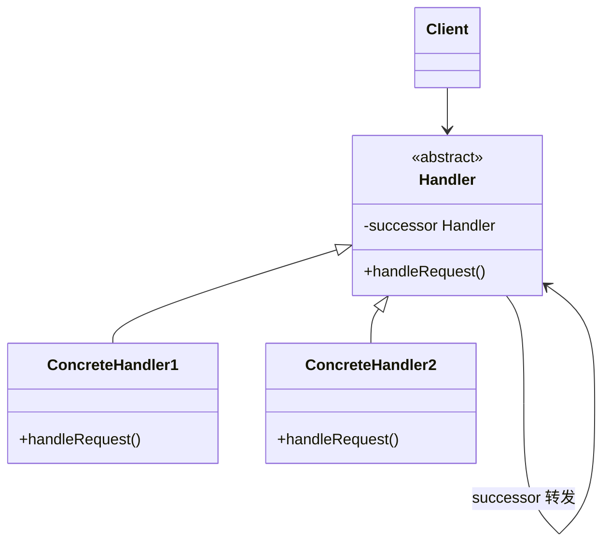

### Participants

* **Handler**：定义处理请求的接口；（可选）实现指向后继的链接
* **ConcreteHandler**：处理自己负责的请求；可访问后继；不能处理则转发
* **Client**：向链上的某个 Handler 发起请求

### Consequences

* **降低耦合**：发起者不知道谁处理、接收者不知道发起者是谁，双方只认识后继
* **动态增减/重组职责**：改链即改职责分配
* 代价：**不保证请求被处理**——链上无人认领时请求"掉出"链尾，客户必须考虑这种情况

### Implementation

* **如何组织链**：可用专门的链对象；更常见的是**复用已有的对象结构**（如 Composite 的父链，或 Smalltalk 用 `doesNotUnderstand:` 消息自动转发机制）
* **连接后继**：Handler 定义统一接口设置/获取 successor
* **请求的表示**：硬编码调用（简单高效）；用字符串/编码 key（需查表）；或定义独立的 Request 对象携带参数（灵活、可扩展新请求类型）

### Sample Code（上下文相关帮助：按钮 → 对话框 → 应用）

```java
// ---- Handler：帮助请求的公共接口，默认转发给后继 ----
abstract class HelpHandler {
    private final HelpHandler successor;            // 链的下一环

    HelpHandler(HelpHandler successor) { this.successor = successor; }

    void handleHelp() {
        if (successor != null) successor.handleHelp(); // 默认：自己不处理，上抛
    }
    Topic topic() { return Topic.NO_HELP_TOPIC; }   // 请求的可选表示
}

// ---- ConcreteHandler 1：按钮（多数按钮自己没有帮助，转给对话框）----
class Button extends HelpHandler {
    private final Topic helpTopic;
    Button(HelpHandler successor, Topic topic) {
        super(successor);
        this.helpTopic = topic;
    }
    @Override void handleHelp() {
        if (helpTopic != Topic.NO_HELP_TOPIC) show(helpTopic); // 自己能处理
        else super.handleHelp();                               // 否则上抛
    }
    private void show(Topic t) { System.out.println("Button help: " + t); }
}

// ---- ConcreteHandler 2：对话框（处理一般性帮助，也可继续上抛）----
class Dialog extends HelpHandler {
    private final Topic topic;
    Dialog(HelpHandler successor, Topic topic) { super(successor); this.topic = topic; }
    @Override void handleHelp() {
        if (topic != Topic.NO_HELP_TOPIC) System.out.println("Dialog help: " + topic);
        else super.handleHelp();
    }
}

// ---- 链尾：应用级兜底——保证请求最终有人响应（若无兜底，请求将"掉出"链尾）----
class Application extends HelpHandler {
    Application() { super(null); }
    @Override void handleHelp() { System.out.println("Show general help index"); }
}

enum Topic { NO_HELP_TOPIC, PRINT_TOPIC, PAPER_ORIENTATION_TOPIC }

// ---- 组链：按钮 → 打印对话框 → 应用（链常直接复用父/容器关系）----
Application application = new Application();
Dialog printDialog = new Dialog(application, Topic.PRINT_TOPIC);
Button printButton = new Button(printDialog, Topic.NO_HELP_TOPIC);

printButton.handleHelp();   // 按钮无帮助 → 对话框处理（PRINT_TOPIC）
```

### 现代对应

`javax.servlet.Filter` 过滤器链、`java.util.logging.Logger` 的层级日志传播、OkHttp Interceptor。

### Related Patterns

Composite 的父链本身就是一条现成的 Chain of Responsibility；请求"无人处理"的兜底常落到链尾的默认 Handler。

## Command（别名 Action、Transaction）

> 将一个请求封装为一个对象，从而使你可用不同的请求对客户进行参数化；对请求排队或记录请求日志，以及支持可撤销的操作。
>
> Encapsulate a request as an object, thereby letting you parameterize clients with different requests, queue or log requests, and support undoable operations.

### Motivation

菜单项、按钮、快捷键都应触发"打开文档"这类动作，且同一动作可绑定到多个触发器。把"动作"做成对象（Command）：界面组件（Invoker）只持有 Command 并调用 `execute()`，不关心动作具体做什么、由谁做——回调的面向对象替代品。

### Applicability

* 按要执行的动作给对象参数化。过程式语言可以用回调函数（callback）表达这种参数化——先注册、稍后调用；Command 就是回调的面向对象替代品
* 在不同时刻指定、排队并执行请求。Command 对象的生命周期可以独立于原始请求；如果请求的接收者能以与地址空间无关的方式表示，还可以把 command 对象传给另一个进程，在那里完成请求
* 支持 undo。execute 时把逆转其效果所需的状态存进 command 自身；接口增加一个 unexecute 操作即可逆转效果；已执行的命令存入 history list，前后遍历并分别调用 unexecute/execute，即可实现无限级的撤销与重做
* 支持变更日志，系统崩溃后可重放。给 Command 接口加上 load/store 操作即可持久化变更日志；恢复时从磁盘重载日志中的命令并重新 execute
* 用建立在 primitive operations 之上的高层操作来构建系统。这在支持事务的信息系统中很常见：事务封装了一组数据变更，Command 提供了建模事务的方式——所有命令有统一接口，任何事务都以同一种方式调用，扩展新事务也很容易

### Structure

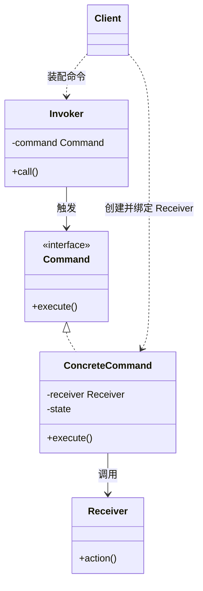

### Participants

* **Command**：声明执行操作的接口
* **ConcreteCommand**：绑定 Receiver 与动作；实现 `execute()`（调用 Receiver 的相应操作）
* **Client**：创建 ConcreteCommand 并设定其 Receiver
* **Invoker**：要求 Command 执行请求
* **Receiver**：知道如何实施与请求相关的操作（真正干活的对象）

### Consequences

* **调用与执行解耦**：Invoker 只依赖 Command 抽象
* **Command 是一等对象**：可被传递、排队、存储、参数化、在运行期组装
* **易于组合**（宏命令 MacroCommand = Composite 聚合多个命令）、**易于新增命令**（新增子类即可）

### Implementation

* **智能命令 vs 普通命令**：智能命令不设 Receiver、自己完成全部工作——解耦彻底但与"Receiver 负责干活"的模型不一致；普通命令薄、复用 Receiver 的既有能力
* **支持 undo**：`execute()` 前保存逆转所需状态，`unexecute()` 逆操作；`history` 列表存已执行命令，前进/后退遍历分别调 `unexecute/execute` 即得无限级 undo/redo
* **误差累积问题**：基于"反向操作"的 undo 反复执行会累积误差；改用 **Memento** 快照恢复可避免，代价是存储
* 多级 undo 中命令对象的生命期与状态管理是主要复杂度来源

### Sample Code（菜单命令 + 宏命令）

```java
// ---- Command ----
interface Command { void execute(); }

// ---- ConcreteCommand 1：普通命令，复用 Receiver（Application/Document）的能力 ----
class OpenCommand implements Command {
    private final Application app;                  // Receiver
    OpenCommand(Application app) { this.app = app; }
    public void execute() {
        String name = app.askUser();                // 询问要打开的文档
        if (name == null) return;
        Document doc = new Document(name);
        app.add(doc);
        doc.open();
    }
}

class PasteCommand implements Command {
    private final Document document;                // Receiver
    PasteCommand(Document document) { this.document = document; }
    public void execute() { document.paste(); }
}

// ---- ConcreteCommand 2：宏命令 = Command 的 Composite ----
class MacroCommand implements Command {
    private final List<Command> commands = new ArrayList<>();
    void add(Command c) { commands.add(c); }
    void remove(Command c) { commands.remove(c); }
    public void execute() { for (Command c : commands) c.execute(); }
}

// ---- Invoker：菜单项对命令一无所知，只负责触发 ----
class MenuItem {
    private Command command;
    MenuItem(Command command) { this.command = command; }
    void clicked() { command.execute(); }           // 触发点与动作解耦
}

// ---- Client：自由装配"触发器 → 命令"（Application/Document 为应用领域类，示意）----
Document doc = new Document("notes.txt");
MenuItem openItem = new MenuItem(new OpenCommand(app));
MenuItem pasteItem = new MenuItem(new PasteCommand(doc));

MacroCommand macro = new MacroCommand();            // 一个动作 = 一串命令
macro.add(new PasteCommand(doc));
macro.add(new PasteCommand(doc));
new MenuItem(macro).clicked();
```

### 现代对应

`java.lang.Runnable`（线程池排队执行的就是 Command 对象）、Swing `Action`、事务日志/操作队列。

### Related Patterns

宏命令用 **Composite**；undo 状态可用 **Memento**；命令可被 **Prototype** 复制；"队列里等待的命令 + 进程间传递"是 Command 的分布式延伸。

## Interpreter

> 给定一个语言，定义它的文法的一种表示，并定义一个解释器，该解释器使用该表示来解释语言中的句子。
>
> Given a language, define a represention for its grammar along with an interpreter that uses the representation to interpret sentences in the language.

### Motivation

正则匹配、SQL 子集、表达式语言……当一种"简单语言"的句子可以表示成**抽象语法树（AST）**、且语法规则不多时，可以为每条文法规则建一个类，解释 = 沿树递归求值。原书以布尔表达式语言（and/or/not/常量/变量）为例。

### Applicability

* 有一门语言要解释，且能把句子表示为 AST；**文法简单**（复杂文法应改用 parser generator 等工具）、**效率不是关键**时最合适

### Structure

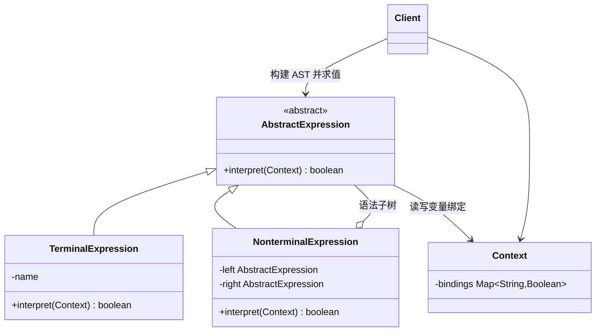

### Participants

* **AbstractExpression**：声明 `interpret(Context)` 抽象操作
* **TerminalExpression**：实现终结符（变量、常量）的解释
* **NonterminalExpression**：实现非终结符（and/or/not）的解释，通常递归调用子表达式
* **Context**：解释器之外的全程可见的状态（如变量绑定表）
* **Client**：构建（或让 parser 构建）代表句子的 AST，调用 interpret

### Consequences

* **易于改变/扩展文法**：一条规则一个类，加规则 = 加类；用继承改变/扩展文法也直接
* **实现简单**：解释就是遍历树、调用各节点的方法；易于直接求值
* 代价：**复杂文法的类层次会大到失控**（此时应换工具）；**大 AST 直接解释效率低**（高效实现常先转换成另一种形式，如正则 → 状态机）

### Implementation

* **建语法树**：AST 由 Client 手工构建或由语法分析器产出（书中的示例是逐字符扫描构建）
* **跳过 AST 的变体**：一边解析一边解释（不建树）可省空间，但失去"结构可复用、可多次解释"的能力
* 终结符共享、加 `Print`/`Visit` 等辅助操作时与其他模式联动（Flyweight/Visitor）

### Sample Code（布尔表达式语言）

```java
// ---- Context：变量绑定表，解释全程可读写 ----
class Context {
    private final Map<String, Boolean> bindings = new HashMap<>();
    boolean lookup(String name) { return bindings.get(name); }
    void assign(VariableExp exp, boolean value) { bindings.put(exp.name(), value); }
}

// ---- AbstractExpression ----
abstract class BooleanExp {
    abstract boolean evaluate(Context ctx);
}

// ---- TerminalExpression：常量与变量 ----
class ConstantExp extends BooleanExp {
    private final boolean value;
    ConstantExp(boolean value) { this.value = value; }
    boolean evaluate(Context ctx) { return value; }
}
class VariableExp extends BooleanExp {
    private final String name;
    VariableExp(String name) { this.name = name; }
    String name() { return name; }
    boolean evaluate(Context ctx) { return ctx.lookup(name); }
}

// ---- NonterminalExpression：and / or / not，递归求子树 ----
class AndExp extends BooleanExp {
    private final BooleanExp left, right;
    AndExp(BooleanExp left, BooleanExp right) { this.left = left; this.right = right; }
    boolean evaluate(Context ctx) { return left.evaluate(ctx) && right.evaluate(ctx); }
}
class OrExp extends BooleanExp {
    private final BooleanExp left, right;
    OrExp(BooleanExp left, BooleanExp right) { this.left = left; this.right = right; }
    boolean evaluate(Context ctx) { return left.evaluate(ctx) || right.evaluate(ctx); }
}
class NotExp extends BooleanExp {
    private final BooleanExp exp;
    NotExp(BooleanExp exp) { this.exp = exp; }
    boolean evaluate(Context ctx) { return !exp.evaluate(ctx); }
}

// ---- Client：手写 AST —— (true and x) or (not y) ----
Context ctx = new Context();
VariableExp x = new VariableExp("X");
VariableExp y = new VariableExp("Y");
BooleanExp expression = new OrExp(
        new AndExp(new ConstantExp(true), x),
        new NotExp(y));

ctx.assign(x, false);
ctx.assign(y, true);
expression.evaluate(ctx);   // (true && false) || (!true) => false

// 同一 Context 换组绑定可重复解释，这就是保留 AST 的意义
ctx.assign(x, true);
expression.evaluate(ctx);   // true
```

### 现代对应

`java.util.regex.Pattern`（正则先编译成内部结构再匹配）、Spring SpEL / JEXL 等表达式语言、`java.text.Format` 族。

### Related Patterns

AST 本身是 **Composite**；终结符节点可用 **Flyweight** 共享；遍历解释可用 **Iterator**/**Visitor**。

## Iterator（别名 Cursor）

> 提供一种方法顺序访问一个聚合对象中的各个元素，而又不暴露该对象的内部表示。
>
> Provide a way to access the elements of an aggregate object sequentially without exposing its underlying representation.

### Motivation

聚合（List、Tree、HashTable）内部结构各异，但客户都想要"逐个取元素"。把遍历逻辑抽成独立对象（Iterator），聚合只负责提供创建迭代器的方法——遍历算法与聚合结构解耦，同一聚合可并存多种遍历。

### Applicability

* 访问一个聚合对象的内容而不暴露其内部表示
* 支持对聚合对象的多种遍历方式
* 为遍历不同的聚合结构提供统一的接口

### Structure

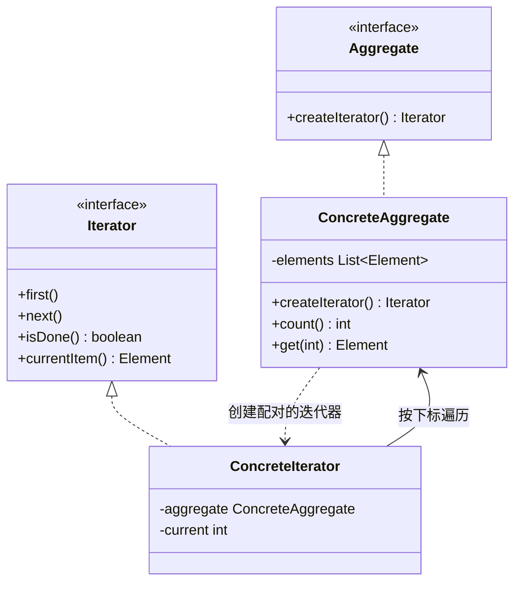

### Participants

* **Iterator**：声明遍历接口（`first/next/isDone/currentItem`）
* **ConcreteIterator**：实现接口，记录遍历位置
* **Aggregate**：声明创建迭代器的接口
* **ConcreteAggregate**：实现该接口，返回配对的 ConcreteIterator

### Consequences

* **可变化遍历算法**：同一聚合可有不同 Iterator（正序、逆序、过滤、跳跃表）
* **简化 Aggregate 接口**：遍历操作外移，聚合不必为每种遍历提供一堆方法
* **同一时刻可有多个遍历**并存（各自有独立 Iterator 与游标）
* 代价：额外的对象与间接调用

### Implementation（外部 vs 内部迭代器是关键）

* **External iterator（外部迭代器）**：客户驱动 `next()`，客户显式控制推进——灵活，可比较/交错两个遍历；Java 的 `java.util.Iterator` 即此类
* **Internal iterator（内部迭代器）**：迭代器自己驱动，对每个元素回调客户传入的操作——使用简单，但不易"同时跑两个遍历"，也不易中断
* **谁定义遍历算法**：Iterator 定义则易支持多种遍历（书中取向）；Aggregate 定义（Iterator 只存游标）则暴露更少内部信息——二选一
* **健壮性（robustness）**：遍历中聚合被改怎么办——常见方案是聚合带**版本号/修改计数**，Iterator 每步核对，不匹配即失效（fail-fast，Java 集合的 `modCount` 正是此法；也可用 **Memento** 快照）
* **额外操作**：`previous()/skip(n)` 等按需增加
* **多态迭代器的创建**：`createIterator()` 返回 new 出的对象，C++ 需明确释放责任

### Sample Code（外部迭代器 + fail-fast 健壮性）

```java
// ---- Aggregate ----
class MyList<E> {
    private final List<E> items = new ArrayList<>();
    int modCount = 0;                               // 包内可见：供配对的迭代器核对版本

    void add(E e) { items.add(e); modCount++; }
    int count() { return items.size(); }
    E get(int i) { return items.get(i); }

    Iterator2<E> createIterator() {                  // 创建配对的迭代器
        return new ListIterator2<>(this);
    }
}

// ---- Iterator（外部迭代器：客户驱动推进）----
class ListIterator2<E> implements Iterator2<E> {
    private final MyList<E> aggregate;
    private int current = 0;
    private final int expectedModCount;             // 创建时的版本

    ListIterator2(MyList<E> aggregate) {
        this.aggregate = aggregate;
        this.expectedModCount = aggregate.modCount;
    }

    public void first() { check(); current = 0; }
    public void next()  { check(); current++; }
    public boolean isDone() { check(); return current >= aggregate.count(); }
    public E currentItem() { check(); return aggregate.get(current); }

    private void check() {                          // fail-fast：遍历中聚合被改即失效
        if (expectedModCount != aggregate.modCount)
            throw new ConcurrentModificationException();
    }
}
interface Iterator2<E> { void first(); void next(); boolean isDone(); E currentItem(); }

// ---- 同一聚合可并存多个独立遍历 ----
MyList<String> list = new MyList<>();
list.add("a"); list.add("b"); list.add("c");

for (Iterator2<String> it = list.createIterator(); !it.isDone(); it.next()) {
    System.out.println(it.currentItem());           // a b c
}

// 内部迭代器变体（示意）：迭代器自己驱动，对每个元素回调客户传入的操作
// list.forEach(e -> System.out.println(e));        // MyList 另行提供，语义等价
```

### 现代对应

`java.lang.Iterable/Iterator`（for-each 语法的基石）、`ListIterator`（双向）、`Spliterator`（并行遍历）。

### Related Patterns

遍历 **Composite** 常需外部迭代器（递归结构）；多态迭代器用 **Factory Method** 创建；健壮性可用 **Memento** 实现快照。

## Mediator

> 用一个中介对象来封装一系列的对象交互。中介者使各对象不需要显式地相互引用，从而使其耦合松散，而且可以独立地改变它们之间的交互。
>
> Define an object that encapsulates how a set of objects interact.

### Motivation

字体对话框里字体列表、输入框、确认/取消按钮互相联动：选了字体要更新输入框、输入为空要禁用确认……若对象间两两直接引用，复用任何一个都困难。解法：**FontDialogDirector** 做 Mediator，各控件（Colleague）只与 Mediator 通信，由它编排联动规则。

### Applicability

* 一组对象以复杂但**定义良好**的方式通信，产生的相互依赖结构混乱、难以理解
* 对象因相互引用过多而难以复用
* 想把分布于多个类中的行为**定制化**，又不想生成太多子类——行为集中在 Mediator，改 Mediator 即改交互

### Structure

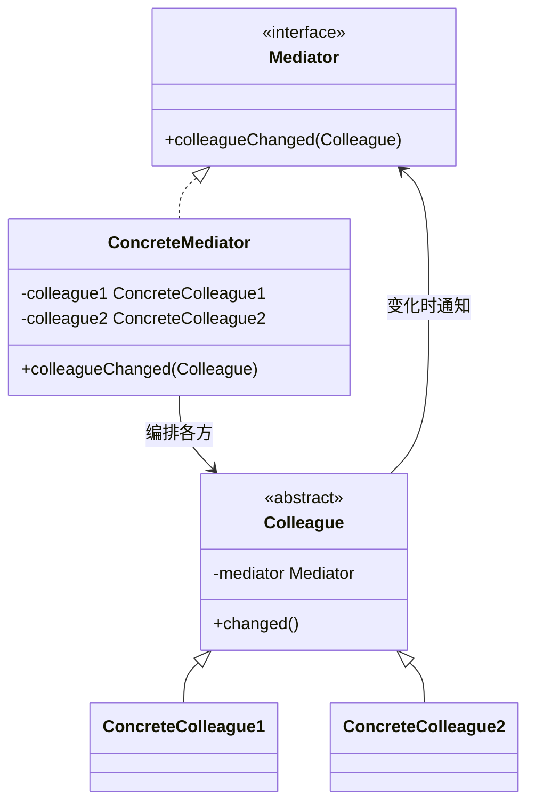

### Participants

* **Mediator**：定义与 Colleague 通信的接口
* **ConcreteMediator**：协调各 Colleague 实现协作行为；了解并维护各 Colleague
* **Colleague classes**：每个 Colleague 知道自己的 Mediator；与 Mediator 而非其他 Colleague 通信

### Consequences

* **将协作行为局部化**：多方交互的规则集中在一处，替代"分散在各同事里"的网状逻辑
* **同事对象解耦**：Colleague 变得通用、可复用（不含特例联动逻辑）
* **简化对象协议**：把多对多的相互作用替换为一对多（Colleague↔Mediator）
* **抽象了协作方式**：从"谁调用谁"变为"发生了什么事件"
* 代价：**Mediator 可能过度集中**成为无所不知的复杂对象（god object）——交互逻辑本身复杂时这是模式固有代价

### Implementation

* Mediator 通常保留一个"同事注册/colleagueChanged"的**单一通知入口**，再分发到具体处理——同事侧接口极简
* 同事与 Mediator 的通信可配合 **Observer**：同事作为 Subject 发事件，Mediator 订阅
* 交互规则多的 Mediator 可进一步拆分或用表驱动

### Sample Code（字体对话框的 DialogDirector）

```java
// ---- Colleague 基类：只认识 Mediator，不认识其他同事 ----
abstract class Widget {
    protected final DialogDirector director;
    Widget(DialogDirector director) { this.director = director; }
    void changed() { director.colleagueChanged(this); }  // 变化一律报告中介
}

class ListBox extends Widget {
    private String selection = "";
    ListBox(DialogDirector d) { super(d); }
    String getSelection() { return selection; }
    void select(String item) { this.selection = item; changed(); } // 触发联动
}
class EntryField extends Widget {
    private String text = "";
    EntryField(DialogDirector d) { super(d); }
    void setText(String t) { this.text = t; }
    String getText() { return text; }
}
class Button extends Widget {
    private boolean enabled = true;
    Button(DialogDirector d) { super(d); }
    void setEnabled(boolean e) { this.enabled = e; }
    void click() { changed(); }
}

// ---- Mediator：联动规则全部集中在这里 ----
abstract class DialogDirector {
    abstract void colleagueChanged(Widget widget);  // 单一通知入口
}
class FontDialogDirector extends DialogDirector {
    private ListBox fontList;
    private EntryField fontName;
    private Button ok, cancel;

    FontDialogDirector() {                          // 创建并接线全部同事
        fontList = new ListBox(this);
        fontName = new EntryField(this);
        ok = new Button(this);
        cancel = new Button(this);
    }

    @Override void colleagueChanged(Widget widget) {
        if (widget == fontList) {                   // 选中字体 → 同步输入框、激活确认
            fontName.setText(fontList.getSelection());
            ok.setEnabled(true);
        } else if (widget == ok) {
            System.out.println("应用字体: " + fontName.getText());
        } else if (widget == cancel) {
            ok.setEnabled(false);
        }
    }
}

// ---- Client：只知道 Mediator，同事间零引用 ----
DialogDirector dialog = new FontDialogDirector();
// 用户操作由框架回调触发（示意）：
// dialog 内部的 fontList.select("Serif") → ok 联动启用
```

### 现代对应

GUI 对话框/表单联动（如 Android 用一个 Activity/ViewModel 充当 Mediator）、消息总线/EventBus、机场塔台调度（概念例子）。

### Related Patterns

与 **Facade** 的区别：Facade 单向（客户→子系统、子系统无感），Mediator 多向协调（同事知道 Mediator 并双向交互、按需替换同事）；Mediator 常借助 **Observer** 实现同事到中介的通知；ConcreteMediator 可用 **Observer** 事件解耦。

## Memento（别名 Token）

> 在不破坏封装性的前提下，捕获一个对象的内部状态，并在该对象之外保存这个状态。这样以后可将该对象恢复到原先保存的状态。
>
> Without violating encapsulation, capture and externalize an object's internal state.

### Motivation

约束求解器/编辑器做 checkpoint：需要把对象内部状态存档以便回滚，但把内部结构公开给外界存取会破坏封装。解法：对象自己把状态打包成 **Memento** 交给外界保管，外界"只许保存、不许查看"——窄接口对 Caretaker，宽接口只对 Originator。

### Applicability

* 必须保存一个对象在某时刻的（部分）状态快照，且之后需要恢复
* 直接用接口读取/保存内部状态会暴露实现细节、破坏封装

### Structure

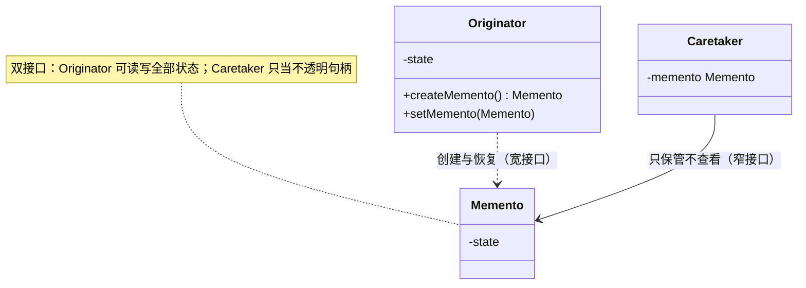

### Participants

* **Memento**：存储 Originator 内部状态；除 Originator 外不能访问其内容（宽接口 vs 窄接口）
* **Originator**：创建记载自身状态的 Memento，并用 Memento 恢复状态
* **Caretaker**：负责保管 Memento，但不检查其内容；在恰当时机交回 Originator

### Consequences

* **保持封装边界**：外界不必（也不允许）了解 Originator 内部即可存档/恢复，避免暴露实现细节
* **简化 Originator**：状态快照的管理外移给 Caretaker，Originator 只管打包/复原
* 代价：**快照可能昂贵**（大对象的深拷贝）；**长期保管大量 Memento 的内存开销**（undo 深度、checkpoint 频率的权衡）
* 适用语言差异：C++ 用 friend 精确授权；Java/Smalltalk 无 friend，用内部类/双接口近似实现窄接口

### Implementation

* **宽/窄双接口**：Memento 提供 Originator 可用的全套存取（宽）与 Caretaker 可用的不透明句柄（窄）
* **增量 vs 全量快照**：只存差异（delta）可省内存，但恢复逻辑复杂
* Memento 与 Command 配合时，"反向操作（易累积误差） vs 快照恢复（费内存）"是常见取舍

### Sample Code（求解器/编辑器的 checkpoint 与回滚）

```java
// ---- Memento：状态不透明，只对 Originator 开放读写（Java 用包内可见近似宽窄双接口）----
class Memento {
    String state;                                   // 包内可见 = 只有同包的 Originator 能动
    Memento(String state) { this.state = state; }
}

// ---- Originator：自己打包/复原，外界不经手内部结构 ----
class ConstraintSolver {
    private String variables;                       // 真实系统是大量约束变量

    Memento createMemento() {                       // 打包快照（宽接口）
        return new Memento(variables);
    }
    void setMemento(Memento memento) {              // 从快照复原（宽接口）
        this.variables = memento.state;
    }
    void solve(String input) {                      // 求解会改动内部状态
        this.variables = "solved(" + input + ")";
    }
}

// ---- Caretaker：只存取快照，绝不查看内容（窄接口）----
class SolverCaretaker {
    private Memento checkpoint;
    void checkpoint(ConstraintSolver solver) { checkpoint = solver.createMemento(); }
    void rollback(ConstraintSolver solver) { solver.setMemento(checkpoint); }
}

// ---- Client ----
ConstraintSolver solver = new ConstraintSolver();
SolverCaretaker caretaker = new SolverCaretaker();

caretaker.checkpoint(solver);   // 存档
solver.solve("A+B=C");          // 修改
caretaker.rollback(solver);     // 回滚到存档点，Caretaker 始终不知道里面存了什么
```

### 现代对应

编辑器 undo/redo 的状态快照、游戏存档、事务回滚（rollback）前的镜像；Java 中用序列化/不可变值对象实现快照。

### Related Patterns

常与 **Command** 配合（命令的 undo 状态）；与 **Iterator** 配合做健壮遍历（遍历前快照、期间检测修改）。

## Observer（别名 Dependents、Publish-Subscribe）

> 定义对象间的一对多依赖，当一个对象的状态发生改变时，所有依赖于它的对象都得到通知并被自动更新。
>
> Define a one-to-many dependency between objects so that when one object changes state, all its dependents are notified.

### Motivation

同一份数据（电子表格单元）同时驱动表格、柱状图、饼图——数据变，视图都要刷新。让数据做 **Subject**，各视图做 **Observer** 注册订阅，Subject 变化时广播通知，视图再自行拉取所需数据。Smalltalk MVC 的 Model/View 正是此结构。

### Applicability

* 一个抽象有两个方面，其一依赖于另一个——把二者封装在独立对象里独立变化复用
* 一个对象的改变需要同时改变其他对象，且不知道有多少对象待改变
* 对象应能在不假设对方是谁的前提下通知其他对象

### Structure

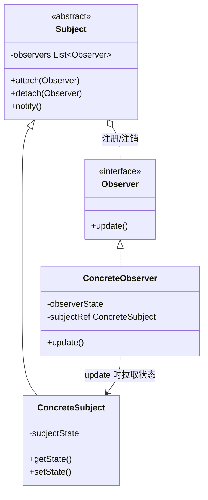

### Participants

* **Subject**：知道其 Observer（任意多个）；提供注册/注销接口；状态变化时通知所有 Observer
* **Observer**：声明 `update()` 更新接口
* **ConcreteSubject**：存储状态，状态变化时发出通知
* **ConcreteObserver**：实现 update，向 Subject 查询以同步自身状态

### Consequences

* **抽象耦合**：Subject 只知道 Observer 的抽象接口，双方可在各自一侧独立扩展
* **支持广播通信**：一次通知到达任意多观察者，Subject 不需要知道"谁、有多少"
* 代价：**意外的级联更新**：观察者的 update 又改别的 Subject，可能触发不可预期的连锁，更新链难以追踪
* 代价：观察者**悬空引用**——Subject 持有的 Observer 未注销（尤其对象销毁时），C++ 侧还要防 Subject 删除后 Observer 悬空

### Implementation（push vs pull 是核心）

* **谁触发通知**：由 Subject 的状态修改方法统一调用 `notify()`（保证不漏发）或由客户在合适时机调用（减少碎发）——一致性 vs 粒度的权衡；通知前保证 Subject 状态**自洽**
* **Push 模型 vs Pull 模型**：push——Subject 把变化细节作为参数广播（观察者省事，但 Subject 臆测了观察者的需要）；pull——只发"变了"，观察者回调时自行查询（Subject 接口要提供查询，观察者多做一次交互）。两者可混用
* **按方面（aspect）订阅**：attach 时带上感兴趣的事件类别，通知时只发给相关观察者，减少无效更新
* **ChangeManager**：当 Subject 与 Observer 是多对多、更新次序有要求时，引入专职对象维护映射与更新顺序——它本身是 **Mediator**（常做成 **Singleton**）
* 多重继承（C++）：ConcreteObserver 常同时继承"领域对象"与"Observer 基类"

### Sample Code（电子表格数据与多个视图）

```java
// ---- Observer / Subject ----
interface Observer { void update(); }
interface Subject {
    void attach(Observer o);
    void detach(Observer o);
    void notifyObservers();
}

// ---- ConcreteSubject：数据源，状态变化统一触发 notify ----
class Data implements Subject {
    private final List<Observer> observers = new ArrayList<>();
    private int value;

    public void attach(Observer o) { observers.add(o); }
    public void detach(Observer o) { observers.remove(o); }
    public void notifyObservers() { for (Observer o : observers) o.update(); }

    int getValue() { return value; }                // 供 Observer pull
    void setValue(int v) {
        this.value = v;
        notifyObservers();                          // 状态先改，再广播（保证自洽）
    }
}

// ---- ConcreteObserver：表格/柱状图，update 时自行拉取（pull 模型）----
class SpreadsheetView implements Observer {
    private final Data subject;
    SpreadsheetView(Data subject) { this.subject = subject; subject.attach(this); }
    public void update() {
        int v = subject.getValue();                 // 拉取自己关心的数据
        System.out.println("表格刷新: " + v);
    }
}
class BarChartView implements Observer {
    private final Data subject;
    BarChartView(Data subject) { this.subject = subject; subject.attach(this); }
    public void update() { System.out.println("柱状图重绘: " + subject.getValue()); }
}

// ---- Client ----
Data data = new Data();
new SpreadsheetView(data);
new BarChartView(data);
data.setValue(42);   // 一次修改 => 两个视图同时更新，Data 不知道视图的具体类型
```

### Known Uses / 现代对应

* 书中：Smalltalk MVC 的 Model/View 依赖更新机制、InterViews 等工具包中的变化通知
* Java/现代：Swing 与 Android 的各类 Listener、`java.beans.PropertyChangeListener`、RxJava 的 `Observable/Observer`、Spring 事件、消息中间件的 Publish/Subscribe

### Related Patterns

ChangeManager 扮演 **Mediator** 并常为 **Singleton**；Observer 的"一对多广播"与 **Mediator** 的"多方协调"可以互相配合（同事通过事件通知中介）。

## State（别名 Objects for States）

> 允许一个对象在其内部状态改变时改变它的行为，对象看起来似乎修改了它的类。
>
> Allow an object to alter its behavior when its internal state changes.

### Motivation

TCPConnection 的行为随连接状态（LISTEN、ESTABLISHED、CLOSED）而变：同一个 `open()/close()/acknowledge()`，在不同状态下语义完全不同甚至非法。把每个状态做成对象（TCPState 子类），连接把请求委托给当前状态对象——状态迁移即"换当前状态对象"。

### Applicability

* 对象的行为随状态改变而改变，且状态在运行期切换
* 操作中出现**庞大而分散的多部分条件语句**（大量 `switch(state)` 散布各方法），每个分支其实是"某状态下的行为"

### Structure

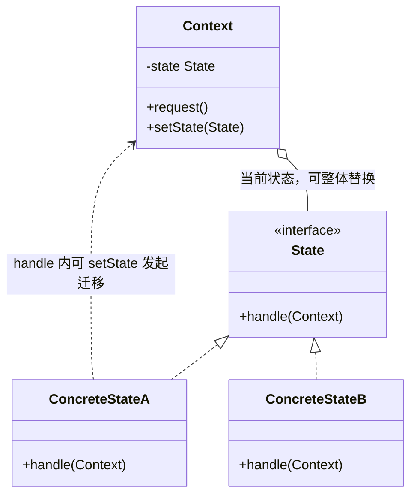

### Participants

* **Context**：面向客户的接口；维护一个 ConcreteState 实例作为当前状态
* **State**：声明封装上下文某状态行为的接口
* **ConcreteState subclasses**：实现状态相关行为；（可选）执行状态迁移——决定"下一个状态是谁"

### Consequences

* **将与状态相关的行为局部化**：每个状态一个类，替代散落各方法中的条件分支；新增状态 = 新增类
* **状态迁移显式化**：原来"散在条件里的隐式状态"变成明确的对象切换，迁移路径可读可查
* **状态对象可共享**：无实例字段的状态（大多数）可全局共享一个实例（配合 Flyweight/Singleton）

### Implementation

* **谁定义迁移**：Context 定义（简单、集中，但状态类不自知）；或 State 定义（`Context.setState(this)`，灵活、迁移知识就地局部化——书中倾向后者）
* **表驱动替代**：状态迁移表（当前状态 × 事件 → 次状态/动作）适合迁移规则密集的系统；牺牲类型安全与类的多态表达
* **状态对象的创建**：按需创建后丢弃（状态有实例数据时）；或预先建好共享（无状态时最常见）
* 状态迁移可以发生在 Context 或 State；请求处理前后皆可切换

### Sample Code（TCPConnection，书中场景）

```java
// ---- Context：面向客户的连接对象，请求全部委托当前状态 ----
class TCPConnection {
    private TCPState state;

    TCPConnection() { state = TCPClosed.instance(); } // 初始状态：CLOSED

    void activeOpen()  { state.activeOpen(this);  }   // 主动打开（发 SYN）
    void passiveOpen() { state.passiveOpen(this); }   // 被动打开（监听）
    void close()       { state.close(this);       }   // 关闭（发 FIN）
    void send(byte[] data) { state.send(this, data); }

    void setState(TCPState s) {                       // 状态迁移：整体换对象
        this.state = s;
        System.out.println("  -> " + s.name());
    }
}

// ---- State：为每个事件声明缺省行为（非法/忽略），子类按状态覆盖 ----
abstract class TCPState {
    void activeOpen(TCPConnection c)  { illegal("activeOpen"); }
    void passiveOpen(TCPConnection c) { illegal("passiveOpen"); }
    void close(TCPConnection c)       { illegal("close"); }
    void send(TCPConnection c, byte[] d) { illegal("send"); }
    String name() { return getClass().getSimpleName(); }
    private void illegal(String op) {
        System.out.println("非法操作: " + op + " in " + name());
    }
}

// ---- ConcreteState：无实例字段 => 单例共享（Flyweight 思想）----
class TCPClosed extends TCPState {
    private static final TCPClosed INSTANCE = new TCPClosed();
    static TCPState instance() { return INSTANCE; }
    @Override void activeOpen(TCPConnection c) {
        // 发 SYN，收到 ACK 后进入 ESTABLISHED（示意：直接迁移）
        c.setState(TCPEstablished.instance());
    }
    @Override void passiveOpen(TCPConnection c) { c.setState(TCPListen.instance()); }
}
class TCPListen extends TCPState {
    private static final TCPListen INSTANCE = new TCPListen();
    static TCPState instance() { return INSTANCE; }
    @Override void activeOpen(TCPConnection c)  { c.setState(TCPEstablished.instance()); }
}
class TCPEstablished extends TCPState {
    private static final TCPEstablished INSTANCE = new TCPEstablished();
    static TCPState instance() { return INSTANCE; }
    @Override void close(TCPConnection c) { c.setState(TCPClosed.instance()); } // 发 FIN
    @Override void send(TCPConnection c, byte[] d) { System.out.println("发送 " + d.length + " 字节"); }
}

// ---- Client：同一操作在不同状态下行为不同 ----
TCPConnection conn = new TCPConnection();
conn.send(new byte[]{1});   // CLOSED 下非法
conn.activeOpen();          // CLOSED -> ESTABLISHED
conn.send(new byte[]{1});   // ESTABLISHED 下真正发送
conn.close();               // -> CLOSED
```

### 现代对应

订单/工单流转、游戏 AI 状态机、TCP 连接管理（书中动机本身）；工作流引擎的状态建模。

### Related Patterns

无状态的状态对象常用 **Flyweight** 共享、常实现为 **Singleton**；与 **Strategy** 结构相同（Context 持有一个可替换的行为对象），但意图不同：**Strategy 由客户选择算法，State 由状态自身驱动迁移**。

## Strategy（别名 Policy）

> 定义一系列的算法，把它们一个个封装起来，并且使它们可相互替换。此模式使得算法可以独立于使用它的客户而变化。
>
> Define a family of algorithms, encapsulate each one, and make them interchangeable.

### Motivation

文本排版器可以有多种断行（linebreaking）算法：简单快速、TeX 风格高质量、按列……算法还会继续增加。把每种算法封装为 Compositor（Strategy），排版器（Composition，Context）持有一个 Compositor 并在合适的时机调用——换算法换实例即可，排版器自身不变。

### Applicability

* 许多相关类只是行为有异——用 Strategy 按需配置行为，替代"每行为一个子类"
* 需要一个算法的不同变体（空间换时间等）
* 算法使用了客户不应知道的数据
* 一个类中定义了多种行为且以条件语句切换——把分支搬进各自的 Strategy 类

### Structure

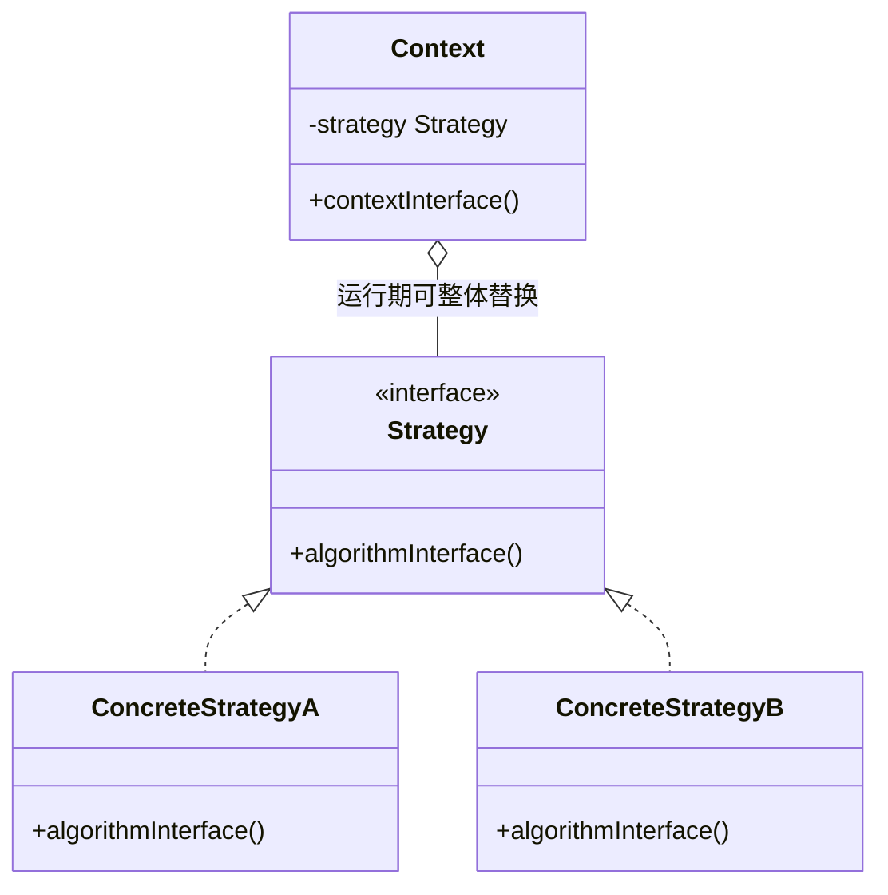

### Participants

* **Strategy**：声明所有具体算法的公共接口
* **ConcreteStrategy**：以该接口实现具体算法
* **Context**：持有 Strategy 引用；把工作委托给它（可传自身或数据）

### Consequences

* **算法族**：相关算法形成继承层次，可统一替换
* **替代子类化**：Context 的行为变体用组合注入，避免 Context 子类膨胀
* **消除条件语句**：分支选择变为对象选择
* **提供实现选择**：同一问题可用不同时间/空间权衡的实现
* 代价：**客户必须了解各 Strategy 的差异**才能选择——把实现细节暴露给了客户；对象间通信的开销；策略数量增长

### Implementation

* **Strategy 与 Context 的接口**：算法需要的数据从哪来——参数传入（解耦但接口变化频繁）或把 Context 自身传入（Strategy 调 Context 的查询接口，紧耦合但灵活）——视稳定度选择
* **C++ 模板参数**：把 Strategy 作为模板参数在编译期绑定（静态 Strategy），免去虚调用开销，但失去运行期替换
* Strategy 对象常无状态，最适合做成共享的（Flyweight/无状态单例）

### Sample Code（排版器的 Compositor 族）

```java
// ---- Strategy：断行算法的公共接口 ----
interface Compositor {
    // 返回断点：components 在 lineWidth 下应在哪里换行
    List<Integer> compose(List<String> components, int lineWidth);
}

// ---- ConcreteStrategy 1：简单断行——填满一行就断 ----
class SimpleCompositor implements Compositor {
    public List<Integer> compose(List<String> cs, int lineWidth) {
        List<Integer> br = new ArrayList<>();
        int w = 0;
        for (int i = 0; i < cs.size(); i++) {
            w += cs.get(i).length();
            if (w > lineWidth) { br.add(i - 1); w = cs.get(i).length(); }
        }
        return br;
    }
}

// ---- ConcreteStrategy 2：TeX 式——全局权衡（段内整体最优）----
class TeXCompositor implements Compositor {
    public List<Integer> compose(List<String> cs, int lineWidth) {
        // 简化示意：真正的 TeX 断行会做整段动态规划权衡
        List<Integer> br = new ArrayList<>();
        for (int i = 0; i < cs.size(); i += 4) br.add(i + 3);
        return br;
    }
}

// ---- Context：排版器只依赖抽象算法，可运行期换策略 ----
class Composition {
    private Compositor compositor;                  // 可替换的 Strategy
    private final List<String> components;

    Composition(List<String> components, Compositor compositor) {
        this.components = components;
        this.compositor = compositor;
    }

    void setCompositor(Compositor c) { this.compositor = c; } // 换算法不动排版器

    void repair() {                                 // 排版主流程
        List<Integer> breaks = compositor.compose(components, 20);
        int from = 0;
        for (int to : breaks) {
            System.out.println(String.join(" ", components.subList(from, to)));
            from = to;
        }
    }
}

// ---- Client：同一份内容，不同策略产出不同排版 ----
List<String> words = List.of("Design", "Patterns", "are", "reusable",
                             "object", "oriented", "solutions");
Composition c = new Composition(words, new SimpleCompositor());
c.repair();                       // 简单断行
c.setCompositor(new TeXCompositor());  // 运行期整体替换
c.repair();                       // TeX 式断行
```

### 现代对应

`Comparator`（排序策略注入）、`ThreadPoolExecutor` 的四种 `RejectedExecutionHandler`、`Map` 的遍历策略参数化。

### Related Patterns

与 **State** 结构相同、意图不同（客户选算法 vs 状态自动迁移）；Strategy 对象适合作为 **Flyweight** 共享。

## Template Method

> 定义一个操作中的算法骨架，而将一些步骤延迟到子类中。Template Method 使得子类可以不改变一个算法的结构即可重定义该算法的某些特定步骤。
>
> Define the skeleton of an algorithm in an operation, deferring some steps to subclasses.

### Motivation

框架的 Application 打开文档流程固定：检查类型 → 创建文档 → 读入内容 → 恢复视图。步骤顺序是稳定骨架，但"创建什么文档、怎么读"由应用子类决定。把流程写成 `openDocument()`（Template Method），其中的可变步骤留成原语操作（工厂方法/抽象方法）交给子类。

### Applicability

* 一次性实现算法的不变部分，把可变行为留给子类
* 各子类的公共行为应提取、集中到一处（避免代码重复；便于维护时"改一处动全局"）
* 控制子类扩展——模板方法调用的原语操作是受控的扩展点，子类只在该处扩展

### Structure

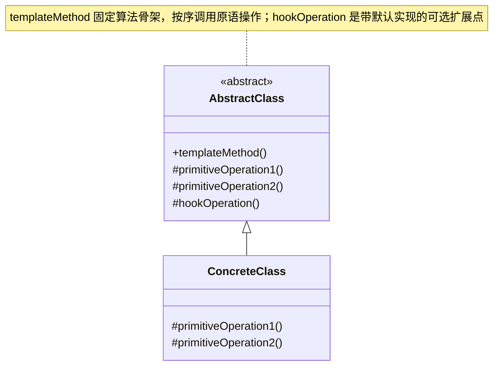

### Participants

* **AbstractClass**：定义抽象原语操作；实现一个模板方法给出算法骨架（调用原语操作）
* **ConcreteClass**：实现原语操作，完成算法中与自身相关的步骤

### Consequences

* **代码复用的基本技术**：不变部分一次性写好（常在框架/基类一侧），可变部分留空给子类——"自顶向下"构造复用
* **反向控制结构（inverted control）**：父类调用子类的操作——即 **Hollywood Principle：*"Don't call us, we'll call you."*（别调用我们，我们会调用你）**——框架掌握流程，应用填空
* 集中了一个算法的可变与不可变部分，每个变体只需覆盖关心的原语

### Implementation

* **C++ 访问控制**：原语操作设为 `protected`（只有模板方法需要调用它们），模板方法设为 `public` 非虚，约定不再被子类覆盖（C++ 无 `final` 的年代靠惯例，Java 应加 `final`）
* **最小化原语操作**：模板方法定义得越多，子类要实现的越多——定义"必要操作"为抽象原语，其余尽量给出默认
* **命名约定**：给"子类应覆盖的原语"一个统一前缀，一眼可辨哪些是扩展点
* **Hook operations（钩子操作）**：提供**默认实现**的原语——子类可覆盖也可不覆盖；比纯抽象原语更宽松，常用于"可选的参与点"

### Sample Code（Application.openDocument 骨架）

```java
// ---- AbstractClass：框架的 Application ----
abstract class Application2 {
    private final List<Document> docs = new ArrayList<>();

    // Template Method：固定"打开文档"的算法骨架（final：子类不得改结构）
    final void openDocument(String name) {
        if (!canOpenDocument(name)) {               // 步骤 1：检查（有默认）
            System.out.println("无法打开: " + name);
            return;
        }
        Document doc = doCreateDocument(name);      // 步骤 2：原语（抽象，子类定）
        if (doc != null) {
            docs.add(doc);
            aboutToOpenDocument(doc);               // 步骤 3：钩子（默认空实现）
            doc.doRead();                           // 步骤 4：读入内容
            doc.doRestoreView();                    // 步骤 5：恢复视图
        }
    }

    protected boolean canOpenDocument(String name) { return name != null; }
    protected abstract Document doCreateDocument(String name);  // 必须实现的原语
    protected void aboutToOpenDocument(Document doc) { }        // hook：可不覆盖
}

abstract class Document {                           // Document 侧同构的模板
    abstract void doRead();
    void doRestoreView() { }                        // hook
}
class DrawingDocument extends Document {            // 示意的具体文档
    DrawingDocument(String name) { }
    @Override void doRead() { System.out.println("读入文档内容"); }
}

// ---- ConcreteClass：填空即可，不触碰算法结构 ----
class DrawingApplication2 extends Application2 {
    @Override protected Document doCreateDocument(String name) {
        return new DrawingDocument(name);
    }
    @Override protected void aboutToOpenDocument(Document doc) { // 可选参与
        System.out.println("加载绘图工具栏");
    }
}

// ---- Client：调的是模板方法，流程由框架（父类）主导 ----
new DrawingApplication2().openDocument("架构图.vsd");
// 输出：加载绘图工具栏 → 读入文档 → 恢复视图（顺序由 openDocument 骨架锁死）
```

### 现代对应

`HttpServlet#service()` 分发到 `doGet()/doPost()`、`AbstractList` 把 `iterator`/`equals` 等骨架留给具体实现、Spring `JdbcTemplate` 与 Android `AsyncTask` 的回调骨架。

### Related Patterns

模板方法里**调用工厂方法**是常见配合（骨架中的"创建对象"步骤）；与 **Strategy** 都能变化算法——**Template Method 用继承变化（编译期），Strategy 用组合变化（运行期）**。

## Visitor

> 表示一个作用于某对象结构中的各元素的操作。Visitor 使你可以在不改变各元素的类的前提下定义作用于这些元素的新操作。
>
> Represent an operation to be performed on the elements of an object structure without changing the classes.

### Motivation

编译器的 AST 节点（AssignmentNode、VariableRefNode…）上要不断添加操作：类型检查、代码生成、格式化打印……每次加操作都要给**所有**节点类加方法，还必须重编译。反转方向：把"操作"做成 Visitor 对象，节点只实现固定的 `accept(visitor)`，新操作 = 新 Visitor 类。原书另一个例子是设备定价/盘点。

### Applicability

* 一个对象结构包含很多类的对象，想对它们实施不依赖具体类的操作
* 需要对结构中的元素做很多**不同且互不相关**的操作，且不想让这些操作"污染"元素类
* 对象结构（元素类）**很少变化**，而作用于其上的**操作经常新增**

### Structure

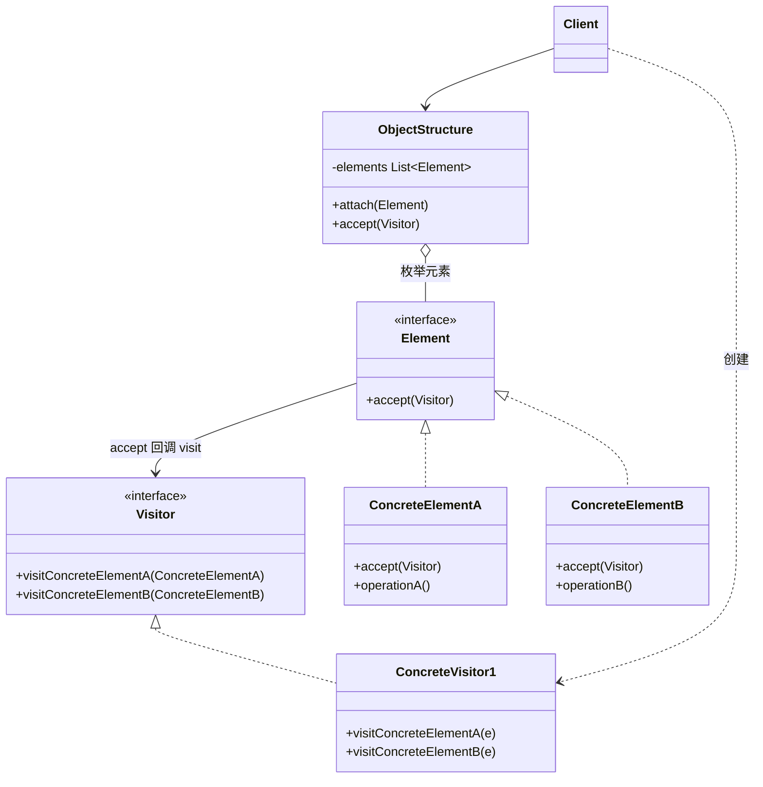

### Participants

* **Visitor**：为每个 Element 类声明一个 `visitConcreteElementX()` 操作
* **ConcreteVisitor**：实现这些操作，即作用的具体行为；可累积局部状态
* **Element**：声明 `accept(Visitor)` 接口
* **ConcreteElement**：实现 accept——通常就是一行 `v.visit(this)`
* **ObjectStructure**：能枚举元素的结构（如 Composite），提供高层的 accept 入口
* **Client**：创建 Visitor 并让结构接受它

### Collaborations（double dispatch）

客户让结构迭代元素并调用 `accept(visitor)`；元素在 accept 里回调 `visitor.visit(this)`。两级分派：`accept` 的虚调用由**元素的运行期类型**决定进入哪个 ConcreteElement；其中的 `visit(this)` 因 `this` 的静态类型就是该具体元素类，编译期便选中正确的 visit **重载**，再由 **visitor 的运行期类型**决定执行哪个 ConcreteVisitor 的实现——合起来等价于按「元素类型 × 访问者类型」两个维度定位操作（double dispatch）。

### Consequences

* **易于新增操作**：一个新 Visitor 类即可，无需触碰任何元素类
* **相关操作集中、无关操作分离**：一个操作的全部逻辑在一个 Visitor 内（局部性好），元素类保持纯净
* 代价：**新增 ConcreteElement 困难**：每加一种元素，Visitor 抽象及所有 Visitor 都要加 `visit` 方法——元素层次稳定是前提
* **可跨类层次访问**：Visitor 只依赖元素接口，可统一处理结构中**不同层次/接口不相关**的元素
* **可累积状态**：Visitor 一边遍历一边收集信息，遍历结束一次性给出结果（而非把中间状态塞进元素）
* 代价：**破坏封装**：Visitor 需要访问元素的状态/内部信息，可能被迫给元素加上本应私有的访问器

### Implementation

* **双分派是实现核心**：accept/visit 的配合替代了 `instanceof` 链
* **由谁遍历**：结构迭代元素逐个 accept（可用 Iterator）；或元素自身递归 accept 子节点（配合 Composite）
* Visitor 的接口按元素具体类型逐一定义——元素越多接口越宽，这正是"元素常变则不宜用 Visitor"的原因

### Sample Code（设备结构上的定价与盘点）

```java
// ---- Visitor：为每种元素声明一个 visit ----
interface EquipmentVisitor {
    void visitFloppyDisk(FloppyDisk d);
    void visitChassis(Chassis c);
    void visitBus(Bus b);
}

// ---- Element ----
abstract class Equipment {
    abstract int price();
    abstract String name();
    abstract void accept(EquipmentVisitor v);       // 关键：回调 visitor
}

// ---- ConcreteElement（结构稳定：FloppyDisk/Chassis/Bus）----
class FloppyDisk extends Equipment {
    int price() { return 70; }
    String name() { return "FloppyDisk"; }
    void accept(EquipmentVisitor v) { v.visitFloppyDisk(this); }  // 一行回调
}
class Bus extends Equipment {
    int price() { return 30; }
    String name() { return "Bus"; }
    void accept(EquipmentVisitor v) { v.visitBus(this); }
}
class Chassis extends Equipment {                   // 组合节点（Composite）
    private final List<Equipment> parts = new ArrayList<>();
    void add(Equipment e) { parts.add(e); }
    int price() { return 45; }                      // 机箱自身价格；配件价格由 visitor 遍历时累加
    String name() { return "Chassis"; }
    void accept(EquipmentVisitor v) {
        v.visitChassis(this);                       // 先访问自己
        for (Equipment e : parts) e.accept(v);      // 再递归访问孩子
    }
}

// ---- ConcreteVisitor 1：定价（跨元素累积状态）----
class PricingVisitor implements EquipmentVisitor {
    private int total = 0;
    public void visitFloppyDisk(FloppyDisk d) { total += d.price(); }
    public void visitChassis(Chassis c)  { total += c.price(); }
    public void visitBus(Bus b)          { total += b.price(); }
    int total() { return total; }
}

// ---- ConcreteVisitor 2：盘点（新操作 = 新 Visitor，元素类零改动）----
class InventoryVisitor implements EquipmentVisitor {
    private final List<String> inventory = new ArrayList<>();
    public void visitFloppyDisk(FloppyDisk d) { inventory.add(d.name()); }
    public void visitChassis(Chassis c)  { inventory.add(c.name()); }
    public void visitBus(Bus b)          { inventory.add(b.name()); }
    List<String> inventory() { return inventory; }
}

// ---- Client：一个结构，按需"接待"不同访问者 ----
Chassis chassis = new Chassis();
chassis.add(new FloppyDisk());
chassis.add(new Bus());

PricingVisitor pricing = new PricingVisitor();
chassis.accept(pricing);
System.out.println("总价: " + pricing.total());     // 145 = 机箱 45 + 软驱 70 + 总线 30

InventoryVisitor inventory = new InventoryVisitor();
chassis.accept(inventory);
System.out.println("清单: " + inventory.inventory()); // [Chassis, FloppyDisk, Bus]
```

### 现代对应

`javax.lang.model.element.ElementVisitor`（注解处理的元素模型）、ASM/Javac 的 AST Visitor、编译器/规则引擎中的结构遍历分析。

### Related Patterns

典型应用对象是 **Composite** 与 **Interpreter** 的 AST；遍历可借 **Iterator** 完成；Visitor 与 **Decorator** 的区别——Decorator 给结构中的对象逐个加职责，Visitor 给整个结构横切地加操作。
