# Behavioral Patterns（行为型模式）

行为型模式关注**算法与对象间职责的分配**：不仅描述对象/类的模式，还刻画它们之间的通信模式。它们把"谁做什么、何时做、怎么互相找到对方"从硬编码的关系中解放出来。

11 个行为型模式：Chain of Responsibility、Command、Interpreter、Iterator、Mediator、Memento、Observer、State、Strategy、Template Method、Visitor。

## Chain of Responsibility

> 使多个对象都有机会处理请求，从而避免请求的发送者和接收者之间的耦合关系。将这些对象连成一条链，并沿着这条链传递该请求，直到有一个对象处理它为止。
>
> Avoid coupling the sender of a request to its receiver by giving more than one object a chance to handle the request.

### Motivation

上下文相关帮助系统：点按钮的帮助请求应先由按钮自身响应（若它有帮助），否则交给包含它的对话框，再不行给应用级帮助——发送者不知道谁会处理。

### Applicability

* 有多个对象可以处理一个请求，哪个对象处理由运行期决定
* 想在不明确指定接收者的情况下向多个对象中的一个提交请求
* 可处理请求的对象集合应能动态配置

### Structure

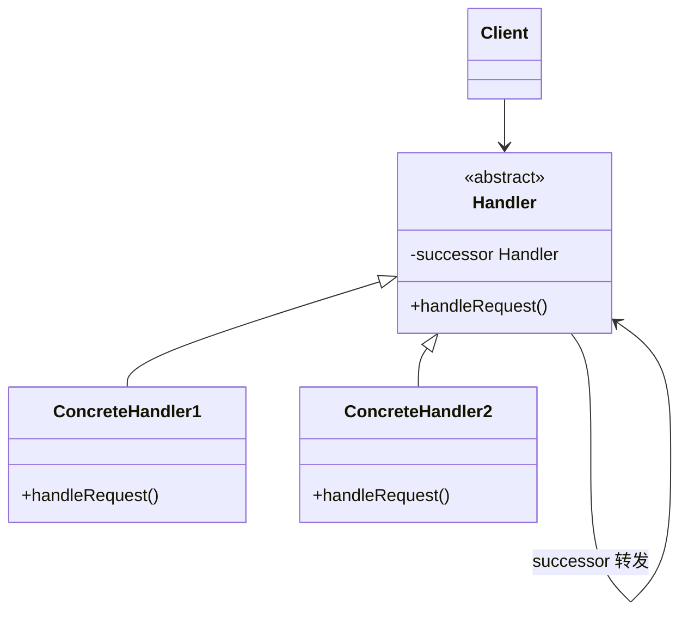
```mermaid
classDiagram
    class Handler {
        <<abstract>>
        -successor Handler
        +handleRequest()
    }
    class ConcreteHandler1 {
        +handleRequest()
    }
    class ConcreteHandler2 {
        +handleRequest()
    }
    class Client
    Handler <|-- ConcreteHandler1
    Handler <|-- ConcreteHandler2
    Handler --> Handler : successor 转发
    Client --> Handler
```

### Participants

* **Handler**：定义处理请求的接口；（可选）实现指向后继的链接
* **ConcreteHandler**：处理自己负责的请求；可访问后继；不能处理则转发
* **Client**：向链上的某个 Handler 发起请求

### Consequences

* **降低耦合**：发送者不知道谁处理、接收者不知道发送者是谁，双方只认识后继
* **动态增减/重组职责**：改链即改职责分配
* 代价：**不保证请求被处理**——链上无人认领时请求"掉出"链尾，客户必须考虑这种情况

### Implementation

* **如何组织链**：可用专门的链对象；更常见的是**复用已有的对象结构**（如 Composite 的父链，或 Smalltalk 用 `doesNotUnderstand:` 消息自动转发机制）
* **连接后继**：Handler 定义统一接口设置/获取 successor
* **请求的表示**：硬编码调用（简单高效）；用字符串/编码 key（需查表）；或定义独立的 Request 对象携带参数（灵活、可扩展新请求类型）

### Sample Code（原书上下文相关帮助示例，C++）

先看 Handler 基类。它维护一个帮助主题（默认为空）和链中后继者的引用；HandleHelp 是链的关键操作，缺省行为就是转发——"自己不处理"这一默认正是链的语义：

```cpp
typedef int Topic;
const int NO_HELP_TOPIC = -1;

class HelpHandler {
public:
    HelpHandler(HelpHandler* = 0, Topic = NO_HELP_TOPIC);

    virtual bool HasHelp();
    virtual void SetHandler(HelpHandler*, Topic);
    virtual void HandleHelp();

private:
    HelpHandler* _successor;
    Topic _topic;
};

void HelpHandler::HandleHelp () {
    if (_successor) {
        _successor->HandleHelp();
    }
}
```

窗口组件都是 Widget 的子类，而 Widget 是 HelpHandler 的子类——所有的用户界面元素都可以在链中传递帮助请求：

```cpp
class Widget : public HelpHandler {
protected:
    Widget(HelpHandler* h, Topic t = NO_HELP_TOPIC);
};
```

具体处理者要么自己解决，要么交给基类转发。Button 版的 HandleHelp 先检查自己有没有帮助主题——有就显示它、搜索结束，没有就转发给后继：

```cpp
class Button : public Widget {
public:
    Button(HelpHandler* h, Topic t = NO_HELP_TOPIC);

    virtual void HandleHelp();

    // Widget operations that Button overrides ...
};

void Button::HandleHelp () {
    if (HasHelp()) {
        // offer help on the button
    } else {
        HelpHandler::HandleHelp();
    }
}
```

Dialog 实现同样的策略，只不过它的后继者不必是窗口组件而是任意的帮助处理对象。链的末端是 Application 的实例——它不是窗口组件，因此不是 Widget 的子类；帮助请求传到这一层时，应用提供一般性信息：

```cpp
class Dialog : public Widget {
public:
    Dialog(HelpHandler* h = 0, Topic t = NO_HELP_TOPIC);

    virtual void HandleHelp();

    // Widget operations that Dialog overrides ...

private:
    // ...
};

class Application : public HelpHandler {
public:
    Application(Topic t) : HelpHandler(0, t) { }

    virtual void HandleHelp();

    // Application-specific operations ...
};

void Application::HandleHelp () {
    // show a list of help topics
}
```

下面的代码创建并连接这些对象。此处的对话框涉及打印，因此对象被赋给与打印相关的主题：

```cpp
Application* application = new Application(PRINT_TOPIC);

Dialog* dialog = new Dialog(application, PRINT_TOPIC);

Button* printButton = new Button(dialog, PAPER_ORIENTATION_TOPIC);

printButton->HandleHelp();
```

我们可对链上的任意对象调用 HandleHelp 以触发帮助请求。此处按钮有自己的帮助主题（纸张方向），会立即处理该请求；若按钮没有主题，请求将沿链传给对话框。注意任何 HelpHandler 都可作为 Dialog 的后继，且后继可动态改变——不管对话框用在何处，都能得到正确的上下文相关帮助。

### 现代对应

`javax.servlet.Filter` 过滤器链、`java.util.logging.Logger` 的层级日志传播、OkHttp Interceptor。

### Related Patterns

Composite 的父链本身就是一条现成的 Chain of Responsibility；请求"无人处理"的兜底常落到链尾的默认 Handler。

## Command（别名 Action、Transaction）

> 将一个请求封装为一个对象，从而使你可用不同的请求对客户进行参数化，对请求排队或记录请求日志，以及支持可撤销的操作。
>
> Encapsulate a request as an object, thereby letting you parameterize clients with different requests, queue or log requests, and support undoable operations.

### Motivation

菜单项、按钮、快捷键都应触发"打开文档"这类动作，且同一动作可绑定到多个触发器。把"动作"做成对象（Command）：界面组件（Invoker）只持有 Command 并调用 `execute()`，不关心动作具体做什么、由谁做——回调的面向对象替代品。

### Applicability

* 按要执行的动作给对象参数化。过程式语言可以用回调函数（callback）表达这种参数化——先注册、稍后调用；Command 就是回调的面向对象替代品
* 在不同时刻指定、排队并执行请求。Command 对象的生命周期可以独立于原始请求；如果请求的接收者能以与地址空间无关的方式表示，还可以把 command 对象传给另一个进程，在那里完成请求
* 支持 undo。execute 时把逆转其效果所需的状态存进 command 自身；接口增加一个 unexecute 操作即可逆转效果；已执行的命令存入 history list，前后遍历并分别调用 unexecute/execute，即可实现无限级的撤销与重做
* 支持变更日志，系统崩溃后可重放。给 Command 接口加上 load/store 操作即可持久化变更日志；恢复时从磁盘重载日志中的命令并重新 execute
* 用建立在 primitive operations 之上的高层操作来构建系统。这在支持事务的信息系统中很常见：事务封装了一组数据变更，Command 提供了建模事务的方式——所有命令有统一接口，任何事务都以同一种方式调用，扩展新事务也很容易

### Structure

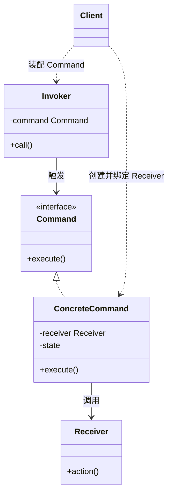
```mermaid
classDiagram
    class Command {
        <<interface>>
        +execute()
    }
    class ConcreteCommand {
        -receiver Receiver
        -state
        +execute()
    }
    class Invoker {
        -command Command
        +call()
    }
    class Receiver {
        +action()
    }
    class Client
    Command <|.. ConcreteCommand
    Invoker --> Command : 触发
    ConcreteCommand --> Receiver : 调用
    Client ..> ConcreteCommand : 创建并绑定 Receiver
    Client ..> Invoker : 装配 Command
```

### Participants

* **Command**：声明执行操作的接口
* **ConcreteCommand**：绑定 Receiver 与动作；实现 `execute()`（调用 Receiver 的相应操作）
* **Client**：创建 ConcreteCommand 并设定其 Receiver
* **Invoker**：要求 Command 执行请求
* **Receiver**：知道如何实施与请求相关的操作（真正干活的对象）

### Consequences

* **调用与执行解耦**：Invoker 只依赖 Command 抽象
* **Command 是一等对象**：可被传递、排队、存储、参数化、在运行期组装
* **易于组合**（宏命令 MacroCommand = Composite 聚合多个命令）、**易于新增命令**（新增子类即可）

### Implementation

* **智能命令 vs 普通命令**：智能命令不设 Receiver、自己完成全部工作——解耦彻底但与"Receiver 负责干活"的模型不一致；普通命令薄、复用 Receiver 的既有能力
* **支持 undo**：`execute()` 前保存逆转所需状态，`unexecute()` 逆操作；`history` 列表存已执行命令，前进/后退遍历分别调 `unexecute/execute` 即得无限级 undo/redo
* **误差累积问题**：基于"反向操作"的 undo 反复执行会累积误差；改用 **Memento** 快照恢复可避免，代价是存储
* 多级 undo 中 Command 对象的生命期与状态管理是主要复杂度来源

### Sample Code（原书菜单命令示例，C++）

Command 接口极小——"可执行"本身就是一个对象：

```cpp
class Command {
public:
    virtual ~Command();

    virtual void Execute() = 0;

protected:
    Command();
};
```

触发器更简单：MenuItem 持有一个 Command，被点击时触发它，对命令做什么一无所知：

```cpp
class MenuItem : public Widget {
public:
    virtual void HandleClick();

private:
    Command* _command;
};

void MenuItem::HandleClick () {
    _command->Execute();
}
```

普通命令是薄壳：绑一个 Receiver，Execute 转发给它。OpenCommand 的 Receiver 是 Application，它向用户要一个文档名、创建并打开文档：

```cpp
class OpenCommand : public Command {
public:
    OpenCommand(Application*);

    virtual void Execute();
private:
    Application* _application;

    const char* AskUser();
};

void OpenCommand::Execute () {
    const char* name = AskUser();

    if (name != 0) {
        Document* document = new Document(name);

        _application->Add(document);

        document->Open();
    }
}
```

PasteCommand 换一个 Receiver（Document），同样薄：

```cpp
class PasteCommand : public Command {
public:
    PasteCommand(Document*);

    virtual void Execute();
private:
    Document* _document;
};

void PasteCommand::Execute () {
    _document->Paste();
}
```

原书还给出一个 C++ 模板技巧 SimpleCommand——用一个类适配任意 Receiver 的无参操作，免去为每个操作写一个命令子类（成员函数指针）：

```cpp
template <class Receiver>
class SimpleCommand : public Command {
public:
    typedef void (Receiver::* Action)();

    SimpleCommand(Receiver* r, Action a) :
        _receiver(r), _action(a) { }

    virtual void Execute();
private:
    Action _action;

    Receiver* _receiver;
};

template <class Receiver>
void SimpleCommand<Receiver>::Execute () {
    (_receiver->*_action)();
}
```

客户侧把 receiver 与操作绑成一个命令：

```cpp
MyClass* receiver = new MyClass;
Command* aCommand =
    new SimpleCommand<MyClass>(receiver, &MyClass::Action);
aCommand->Execute();
```

宏命令是 Command 的 Composite——Execute 依次执行子命令，因此宏可以嵌套宏：

```cpp
class MacroCommand : public Command {
public:
    MacroCommand();

    virtual ~MacroCommand();

    virtual void Add(Command*);
    virtual void Remove(Command*);

    virtual void Execute();
private:
    List<Command*>* _commands;
};

void MacroCommand::Execute () {
    ListIterator<Command*> i(_commands);

    for (i.First(); !i.IsDone(); i.Next()) {
        i.Current()->Execute();
    }
}

void MacroCommand::Add (Command* aCommand) {
    _commands->Append(aCommand);
}

void MacroCommand::Remove (Command* aCommand) {
    _commands->Remove(aCommand);
}
```

原书还提到 Smalltalk 的变体：不建命令类，直接用闭包块（block）做命令——代码块本身就是可传递、可稍后执行的一等对象；这正是"命令 = 面向对象的回调"的另一面。

### 现代对应

`java.lang.Runnable`（线程池排队执行的就是 Command 对象）、Swing `Action`、事务日志/操作队列。

### Related Patterns

宏命令用 **Composite**；undo 状态可用 **Memento**；命令可被 **Prototype** 复制；"队列里等待的命令 + 进程间传递"是 Command 的分布式延伸。

## Interpreter

> 给定一个语言，定义它的文法的一种表示，并定义一个解释器，这个解释器使用该表示来解释语言中的句子。
>
> Given a language, define a represention for its grammar along with an interpreter that uses the representation to interpret sentences in the language.

### Motivation

正则匹配、SQL 子集、表达式语言……当一种"简单语言"的句子可以表示成**抽象语法树（AST）**、且语法规则不多时，可以为每条文法规则建一个类，解释 = 沿树递归求值。原书以布尔表达式语言（and/or/not/常量/变量）为例。

### Applicability

* 有一门语言要解释，且能把句子表示为 AST；**文法简单**（复杂文法应改用 parser generator 等工具）、**效率不是关键**时最合适

### Structure

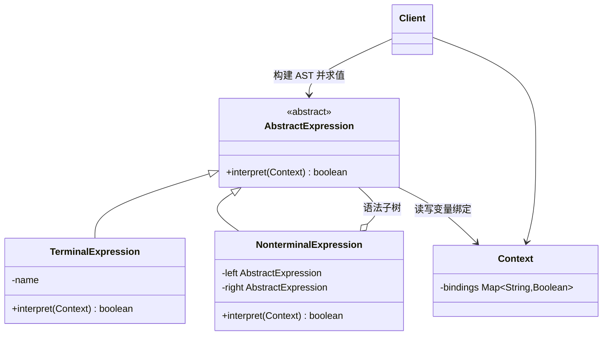
```mermaid
classDiagram
    class AbstractExpression {
        <<abstract>>
        +interpret(Context) boolean
    }
    class TerminalExpression {
        -name
        +interpret(Context) boolean
    }
    class NonterminalExpression {
        -left AbstractExpression
        -right AbstractExpression
        +interpret(Context) boolean
    }
    class Context {
        -bindings Map~String,Boolean~
    }
    class Client
    AbstractExpression <|-- TerminalExpression
    AbstractExpression <|-- NonterminalExpression
    NonterminalExpression o-- AbstractExpression : 语法子树
    AbstractExpression --> Context : 读写变量绑定
    Client --> AbstractExpression : 构建 AST 并求值
    Client --> Context
```

### Participants

* **AbstractExpression**：声明 `interpret(Context)` 抽象操作
* **TerminalExpression**：实现终结符（变量、常量）的解释
* **NonterminalExpression**：实现非终结符（and/or/not）的解释，通常递归调用子表达式
* **Context**：解释器之外的全程可见的状态（如变量绑定表）
* **Client**：构建（或让 parser 构建）代表句子的 AST，调用 interpret

### Consequences

* **易于改变/扩展文法**：一条规则一个类，加规则 = 加类；用继承改变/扩展文法也直接
* **实现简单**：解释就是遍历树、调用各节点的方法；易于直接求值
* 代价：**复杂文法的类层次会大到失控**（此时应换工具）；**大 AST 直接解释效率低**（高效实现常先转换成另一种形式，如正则 → 状态机）

### Implementation

* **建语法树**：AST 由 Client 手工构建或由语法分析器产出（书中的示例是逐字符扫描构建）
* **跳过 AST 的变体**：一边解析一边解释（不建树）可省空间，但失去"结构可复用、可多次解释"的能力
* 终结符共享、加 `Print`/`Visit` 等辅助操作时与其他模式联动（Flyweight/Visitor）

### Sample Code（原书布尔表达式语言示例，C++）

AbstractExpression 只声明三个操作：带着 Context 求值（Evaluate）、按变量替换子树（Replace）、复制自身（Copy）。Context 保存变量绑定，解释全程可读写：

```cpp
class BooleanExp {
public:
    BooleanExp();
    virtual ~BooleanExp();

    virtual bool Evaluate(Context&) = 0;
    virtual BooleanExp* Replace(const char*, BooleanExp&) = 0;
    virtual BooleanExp* Copy() const = 0;
};

class Context {
public:
    bool Lookup(const char*) const;
    void Assign(VariableExp*, bool);
};
```

终结符表达式 VariableExp——Evaluate 查 Context；Replace 命中变量名时返回替换子树的副本，否则复制自己：

```cpp
class VariableExp : public BooleanExp {
public:
    VariableExp(const char*);
    virtual ~VariableExp();

    virtual bool Evaluate(Context&);
    virtual BooleanExp* Replace(const char*, BooleanExp&);
    virtual BooleanExp* Copy() const;

private:
    char* _name;
};

VariableExp::VariableExp (const char* name) {
    _name = strdup(name);
}

bool VariableExp::Evaluate (Context& aContext) {
    return aContext.Lookup(_name);
}

BooleanExp* VariableExp::Copy () const {
    return new VariableExp(_name);
}

BooleanExp* VariableExp::Replace (const char* name, BooleanExp& exp) {
    if (strcmp(name, _name) == 0) {
        return exp.Copy();
    } else {
        return Copy();
    }
}
```

非终结符持有子表达式，求值即递归——一条文法规则一个类。AndExp 的三个操作都是对两个操作数的递归（OrExp、NotExp 与之同理）：

```cpp
class AndExp : public BooleanExp {
public:
    AndExp(BooleanExp*, BooleanExp*);
    virtual ~AndExp();

    virtual bool Evaluate(Context&);
    virtual BooleanExp* Replace(const char*, BooleanExp&);
    virtual BooleanExp* Copy() const;

private:
    BooleanExp* _operand1;
    BooleanExp* _operand2;
};

AndExp::AndExp (BooleanExp* op1, BooleanExp* op2) {
    _operand1 = op1;
    _operand2 = op2;
}

bool AndExp::Evaluate (Context& aContext) {
    return
        _operand1->Evaluate(aContext) &&
        _operand2->Evaluate(aContext);
}

BooleanExp* AndExp::Copy () const {
    return new AndExp(_operand1->Copy(), _operand2->Copy());
}

BooleanExp* AndExp::Replace (const char* name, BooleanExp& exp) {
    return
        new AndExp(
            _operand1->Replace(name, exp),
            _operand2->Replace(name, exp)
        );
}
```

客户手工构建 AST（原书假设由 parser 逐字符扫描产出），同一棵树配不同 Context 可反复求值：

```cpp
VariableExp* x = new VariableExp("X");
VariableExp* y = new VariableExp("Y");

// (true and x) or (not y)
BooleanExp* expression = new OrExp(
    new AndExp(new ConstantExp(true), x),
    new NotExp(y)
);

Context context;

context.Assign(x, false);
context.Assign(y, true);

bool result = expression->Evaluate(context);
```

Evaluate 求值后树完好无损，Replace 便能接着上场——把表达式中的 Y 替换成 (not Z)，返回**新的表达式**而原树不动：

```cpp
VariableExp* z = new VariableExp("Z");

// replace y with (not z)
expression = expression->Replace("Y", *new NotExp(z));

context.Assign(z, true);

bool result = expression->Evaluate(context);
```

Evaluate 与 Replace 的对比点出了这个模式的边界：**适合"操作多而文法稳定"的场景**；反过来，要是终结符种类经常增删，每加一种就得改所有非终结符——那是 Visitor 更擅长的方向。

### 现代对应

`java.util.regex.Pattern`（正则先编译成内部结构再匹配）、Spring SpEL / JEXL 等表达式语言、`java.text.Format` 族。

### Related Patterns

AST 本身是 **Composite**；终结符节点可用 **Flyweight** 共享；遍历解释可用 **Iterator**/**Visitor**。

## Iterator（别名 Cursor）

> 提供一种方法顺序访问一个聚合对象中的各个元素，而又不需要暴露该对象的内部表示。
>
> Provide a way to access the elements of an aggregate object sequentially without exposing its underlying representation.

### Motivation

聚合（List、Tree、HashTable）内部结构各异，但客户都想要"逐个取元素"。把遍历逻辑抽成独立对象（Iterator），聚合只负责提供创建迭代器的方法——遍历算法与聚合结构解耦，同一聚合可并存多种遍历。

### Applicability

* 访问一个聚合对象的内容而不暴露其内部表示
* 支持对聚合对象的多种遍历方式
* 为遍历不同的聚合结构提供统一的接口

### Structure

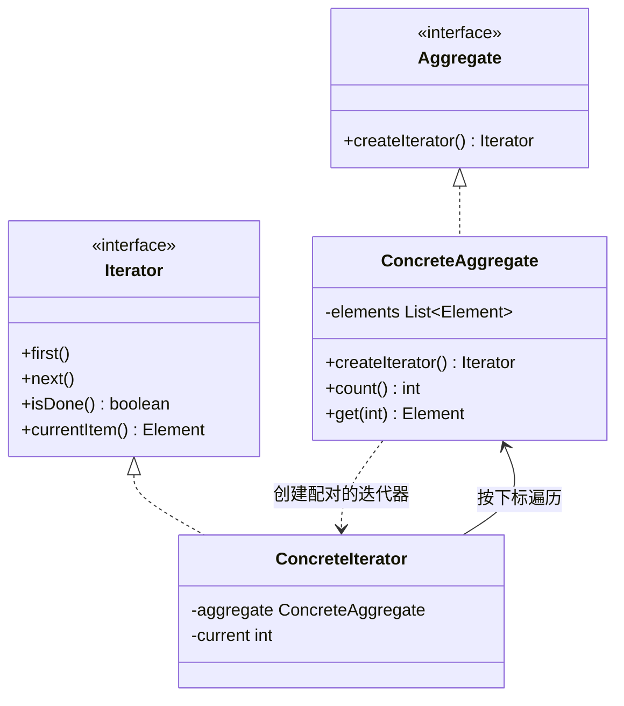
```mermaid
classDiagram
    class Aggregate {
        <<interface>>
        +createIterator() Iterator
    }
    class ConcreteAggregate {
        -elements List~Element~
        +createIterator() Iterator
        +count() int
        +get(int) Element
    }
    class Iterator {
        <<interface>>
        +first()
        +next()
        +isDone() boolean
        +currentItem() Element
    }
    class ConcreteIterator {
        -aggregate ConcreteAggregate
        -current int
    }
    Aggregate <|.. ConcreteAggregate
    Iterator <|.. ConcreteIterator
    ConcreteAggregate ..> ConcreteIterator : 创建配对的迭代器
    ConcreteIterator --> ConcreteAggregate : 按下标遍历
```

### Participants

* **Iterator**：声明遍历接口（`first/next/isDone/currentItem`）
* **ConcreteIterator**：实现接口，记录遍历位置
* **Aggregate**：声明创建迭代器的接口
* **ConcreteAggregate**：实现该接口，返回配对的 ConcreteIterator

### Consequences

* **可变化遍历算法**：同一聚合可有不同 Iterator（正序、逆序、过滤、跳跃表）
* **简化 Aggregate 接口**：遍历操作外移，聚合不必为每种遍历提供一堆方法
* **同一时刻可有多个遍历**并存（各自有独立 Iterator 与游标）
* 代价：额外的对象与间接调用

### Implementation（外部 vs 内部迭代器是关键）

* **External iterator（外部迭代器）**：客户驱动 `next()`，客户显式控制推进——灵活，可比较/交错两个遍历；Java 的 `java.util.Iterator` 即此类
* **Internal iterator（内部迭代器）**：迭代器自己驱动，对每个元素回调客户传入的操作——使用简单，但不易"同时跑两个遍历"，也不易中断
* **谁定义遍历算法**：Iterator 定义则易支持多种遍历（书中取向）；Aggregate 定义（Iterator 只存游标）则暴露更少内部信息——二选一
* **健壮性（robustness）**：遍历中聚合被改怎么办——常见方案是聚合带**版本号/修改计数**，Iterator 每步核对，不匹配即失效（fail-fast，Java 集合的 `modCount` 正是此法；也可用 **Memento** 快照）
* **额外操作**：`previous()/skip(n)` 等按需增加
* **多态迭代器的创建**：`createIterator()` 返回 new 出的对象，C++ 需明确释放责任

### Sample Code（原书 List 与 ListIterator 示例，C++）

先看聚合——它只暴露"按下标取元素"，内部表示（数组还是链表）不外泄：

```cpp
template <class Item>
class List {
public:
    List(long size = DEFAULT_LIST_CAPACITY);

    long Count() const;
    Item& Get(long index) const;

    // ...
};
```

迭代器接口只有四个操作，推进由**客户**驱动（external iterator）：

```cpp
template <class Item>
class Iterator {
public:
    virtual void First() = 0;
    virtual void Next() = 0;
    virtual bool IsDone() const = 0;
    virtual Item CurrentItem() const = 0;

protected:
    Iterator();
};
```

实现的关键是游标 `_current` 与对聚合的引用——遍历状态全部在迭代器里，聚合自己不记进度，所以同一聚合可以并存任意多个遍历：

```cpp
template <class Item>
class ListIterator {
public:
    ListIterator(const List<Item>* aList);

    void First();
    void Next();
    bool IsDone() const;
    Item CurrentItem() const;

private:
    const List<Item>* _list;
    long _current;
};
```

```cpp
template <class Item>
ListIterator<Item>::ListIterator (const List<Item>* aList) :
    _list(aList), _current(0) {
}

template <class Item>
void ListIterator<Item>::First () {
    _current = 0;
}

template <class Item>
void ListIterator<Item>::Next () {
    _current++;
}

template <class Item>
bool ListIterator<Item>::IsDone () const {
    return _current >= _list->Count();
}

template <class Item>
Item ListIterator<Item>::CurrentItem () const {
    if (IsDone()) {
        throw IteratorOutOfBounds;
    }
    return _list->Get(_current);
}
```

使用就是一个统一的循环——客户不知道也不关心聚合的内部结构。同一个 PrintEmployees 既适用于正向迭代器也适用于反向迭代器：

```cpp
void PrintEmployees (Iterator<Employee*>& i) {
    for (i.First(); !i.IsDone(); i.Next()) {
        i.CurrentItem()->Print();
    }
}

List<Employee*>* employees;
// ...

ListIterator<Employee*> forward(employees);
ReverseListIterator<Employee*> backward(employees);

PrintEmployees(forward);
PrintEmployees(backward);
```

让客户不依赖具体迭代器类的办法：由 List 自己提供创建迭代器的操作（Factory Method）：

```cpp
template <class Item>
Iterator<Item>* List<Item>::CreateIterator () const {
    return new ListIterator<Item>(this);
}
```

至于健壮性（robustness，遍历中聚合被改怎么办）：原书在 Implementation 一节讨论了几种方案——迭代器直接访问聚合内部数据（把 List 的私有部分向迭代器开放）、或由聚合在修改时给迭代器发通知/登记注册——各有效率与耦合上的取舍，书中未给完整实现。

### 现代对应

`java.lang.Iterable/Iterator`（for-each 语法的基石）、`ListIterator`（双向）、`Spliterator`（并行遍历）。

### Related Patterns

遍历 **Composite** 常需外部迭代器（递归结构）；多态迭代器用 **Factory Method** 创建；健壮性可用 **Memento** 实现快照。

## Mediator

> 用一个中介对象来封装一系列的对象交互。中介者使各对象不需要显式地相互引用，从而使其耦合松散，而且可以独立地改变它们之间的交互。
>
> Define an object that encapsulates how a set of objects interact.

### Motivation

字体对话框里字体列表、输入框、确认/取消按钮互相联动：选了字体要更新输入框、输入为空要禁用确认……若对象间两两直接引用，复用任何一个都困难。解法：**FontDialogDirector** 做 Mediator，各控件（Colleague）只与 Mediator 通信，由它编排联动规则。

### Applicability

* 一组对象以复杂但**定义良好**的方式通信，产生的相互依赖结构混乱、难以理解
* 对象因相互引用过多而难以复用
* 想把分布于多个类中的行为**定制化**，又不想生成太多子类——行为集中在 Mediator，改 Mediator 即改交互

### Structure

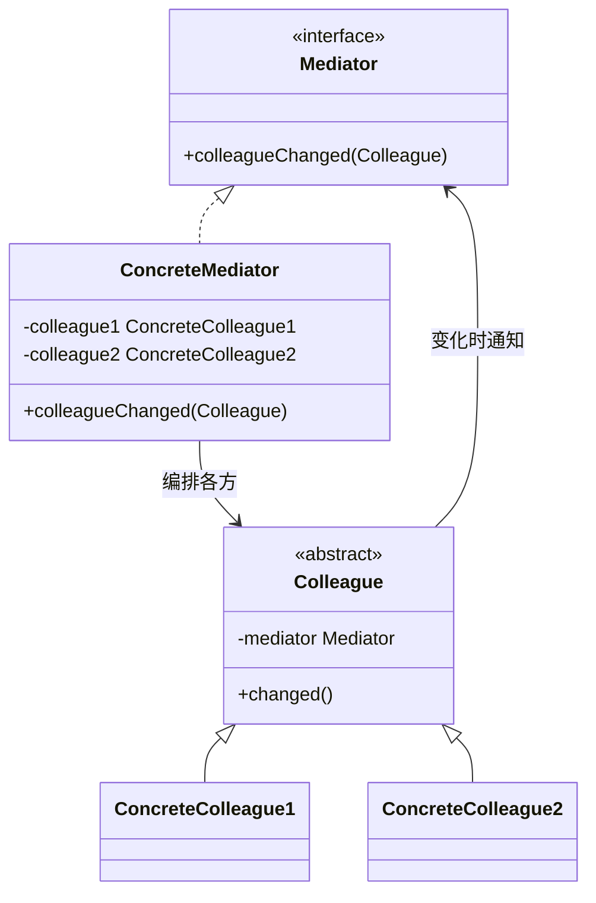
```mermaid
classDiagram
    class Mediator {
        <<interface>>
        +colleagueChanged(Colleague)
    }
    class ConcreteMediator {
        -colleague1 ConcreteColleague1
        -colleague2 ConcreteColleague2
        +colleagueChanged(Colleague)
    }
    class Colleague {
        <<abstract>>
        -mediator Mediator
        +changed()
    }
    class ConcreteColleague1
    class ConcreteColleague2
    Mediator <|.. ConcreteMediator
    Colleague <|-- ConcreteColleague1
    Colleague <|-- ConcreteColleague2
    Colleague --> Mediator : 变化时通知
    ConcreteMediator --> Colleague : 编排各方
```

### Participants

* **Mediator**：定义与 Colleague 通信的接口
* **ConcreteMediator**：协调各 Colleague 实现协作行为；了解并维护各 Colleague
* **Colleague classes**：每个 Colleague 知道自己的 Mediator；与 Mediator 而非其他 Colleague 通信

### Consequences

* **将协作行为局部化**：多方交互的规则集中在一处，替代"分散在各 Colleague 里"的网状逻辑
* **Colleague 解耦**：Colleague 变得通用、可复用（不含特例联动逻辑）
* **简化对象协议**：把多对多的相互作用替换为一对多（Colleague↔Mediator）
* **抽象了协作方式**：从"谁调用谁"变为"发生了什么事件"
* 代价：**Mediator 可能过度集中**成为无所不知的复杂对象（god object）——交互逻辑本身复杂时这是模式固有代价

### Implementation

* Mediator 通常保留一个"Colleague 注册/colleagueChanged"的**单一通知入口**，再分发到具体处理——Colleague 侧接口极简
* Colleague 与 Mediator 的通信可配合 **Observer**：Colleague 作为 Subject 发事件，Mediator 订阅
* 交互规则多的 Mediator 可进一步拆分或用表驱动

### Sample Code（原书字体对话框示例，C++）

原书的例子是一个 FontDialog：字体列表 ListBox、字体名输入框 EntryField、确定/取消按钮 Button，这些 Colleague 间的联动规则全部集中到 FontDialogDirector。先看 Mediator 侧的抽象基类：

```cpp
class DialogDirector {
public:
    virtual ~DialogDirector();

    virtual void ShowDialog();
    virtual void WidgetChanged(Widget*) = 0;

protected:
    DialogDirector();

private:
    virtual void CreateWidgets() = 0;
};
```

Colleague 侧的基类 Widget 只做一件事：记住 Mediator，变化时报告它。**Colleague 之间没有任何引用**：

```cpp
class Widget {
public:
    Widget(DialogDirector*);

    virtual void Changed();

    virtual void HandleMouse(MouseEvent& event);
    // ...

private:
    DialogDirector* _director;
};

void Widget::Changed () {
    _director->WidgetChanged(this);
}
```

具体 Colleague 是可独立复用的通用控件，不含任何对话框特有的联动逻辑。以 ListBox 为例——用户操作落进来后调 Changed() 报告 Mediator：

```cpp
class ListBox : public Widget {
public:
    ListBox(DialogDirector*);

    virtual const char* GetSelection();
    virtual void SetList(List<char*>* listItems);
    virtual void HandleMouse(MouseEvent& event);
    // ...
};

class EntryField : public Widget {
public:
    EntryField(DialogDirector*);

    virtual void SetText(const char* text);
    virtual const char* GetText();
    virtual void HandleMouse(MouseEvent& event);
    // ...
};
```

```cpp
void ListBox::HandleMouse (MouseEvent& event) {
    // ...
    Changed();
    // ...
}
```

ConcreteMediator 持有全部 Colleague 并实现联动规则——"谁该响应谁"的规则全部集中在一个方法里：

```cpp
class FontDialogDirector : public DialogDirector {
public:
    FontDialogDirector();

    virtual ~FontDialogDirector();

    virtual void WidgetChanged(Widget*);
    virtual void CreateWidgets();

private:
    Button* _ok;
    Button* _cancel;
    ListBox* _fontList;
    EntryField* _fontName;
};
```

```cpp
void FontDialogDirector::CreateWidgets () {
    _ok = new Button(this);
    _cancel = new Button(this);
    _fontList = new ListBox(this);
    _fontName = new EntryField(this);

    // fill the listBox with the available font names

    // assemble the widgets in the dialog
}
```

联动逻辑只有一处。选中某个字体时，输入框同步显示所选字体名；其余事件归入 else 分支，原书留白：

```cpp
void FontDialogDirector::WidgetChanged (Widget* theWidget) {
    if (theWidget == _fontList) {
        _fontName->SetText(_fontList->GetSelection());
    } else {
        // operate on the ok and cancel buttons
        // ...
    }
}
```

客户只接触 Mediator；用户操作由框架回调落进 Colleague，Colleague 报告 Mediator，Mediator 再驱动其他 Colleague——ListBox 永远不知道 EntryField 的存在。

### 现代对应

GUI 对话框/表单联动（如 Android 用一个 Activity/ViewModel 充当 Mediator）、消息总线/EventBus、机场塔台调度（概念例子）。

### Related Patterns

与 **Facade** 的区别：Facade 单向（客户→子系统、子系统无感），Mediator 多向协调（Colleague 知道 Mediator 并双向交互、按需替换 Colleague）；Mediator 常借助 **Observer** 实现 Colleague 到 Mediator 的通知；ConcreteMediator 可用 **Observer** 事件解耦。

## Memento（别名 Token）

> 在不破坏封装性的前提下，捕获一个对象的内部状态，并在该对象之外保存这个状态。这样以后就可将该对象恢复到原先保存的状态。
>
> Without violating encapsulation, capture and externalize an object's internal state.

### Motivation

约束求解器/编辑器做 checkpoint：需要把对象内部状态存档以便回滚，但把内部结构公开给外界存取会破坏封装。解法：对象自己把状态打包成 **Memento** 交给外界保管，外界"只许保存、不许查看"——窄接口对 Caretaker，宽接口只对 Originator。

### Applicability

* 必须保存一个对象在某时刻的（部分）状态快照，且之后需要恢复
* 直接用接口读取/保存内部状态会暴露实现细节、破坏封装

### Structure

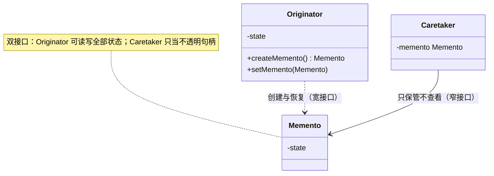
```mermaid
classDiagram
    class Originator {
        -state
        +createMemento() Memento
        +setMemento(Memento)
    }
    class Memento {
        -state
    }
    class Caretaker {
        -memento Memento
    }
    Originator ..> Memento : 创建与恢复（宽接口）
    Caretaker --> Memento : 只保管不查看（窄接口）
    note for Memento "双接口：Originator 可读写全部状态；Caretaker 只当不透明句柄"
```

### Participants

* **Memento**：存储 Originator 内部状态；除 Originator 外不能访问其内容（宽接口 vs 窄接口）
* **Originator**：创建记载自身状态的 Memento，并用 Memento 恢复状态
* **Caretaker**：负责保管 Memento，但不检查其内容；在恰当时机交回 Originator

### Consequences

* **保持封装边界**：外界不必（也不允许）了解 Originator 内部即可存档/恢复，避免暴露实现细节
* **简化 Originator**：状态快照的管理外移给 Caretaker，Originator 只管打包/复原
* 代价：**快照可能昂贵**（大对象的深拷贝）；**长期保管大量 Memento 的内存开销**（undo 深度、checkpoint 频率的权衡）
* 适用语言差异：C++ 用 friend 精确授权；Java/Smalltalk 无 friend，用内部类/双接口近似实现窄接口

### Implementation

* **宽/窄双接口**：Memento 提供 Originator 可用的全套存取（宽）与 Caretaker 可用的不透明句柄（窄）
* **增量 vs 全量快照**：只存差异（delta）可省内存，但恢复逻辑复杂
* Memento 与 Command 配合时，"反向操作（易累积误差） vs 快照恢复（费内存）"是常见取舍

### Sample Code（原书 MoveCommand 与 ConstraintSolver 示例，C++）

原书的示例是图形编辑器的"移动图形"命令：移动一个矩形会破坏它与相邻图形的连线约束，移动后要靠 ConstraintSolver 重新求解、恢复连接。撤销这个移动时，**反向移回去再解一遍未必回到原样**——正确做法是恢复移动前的求解器状态，这正是 Memento 的用武之地。

先看 Originator——求解器（同时是个 Singleton）。它产出 Memento（CreateMemento）也从 Memento 复原（SetMemento），另有大量与模式无关的私有机制：

```cpp
class ConstraintSolver {
public:
    static ConstraintSolver* Instance();

    void Solve();

    void AddConstraint(Graphic*);
    void RemoveConstraint(Graphic*);

    ConstraintSolverMemento* CreateMemento();
    void SetMemento(ConstraintSolverMemento*);

private:
    // lots of private machinery ...
};
```

Memento 对外不透明：构造私有、表示私有，只对 ConstraintSolver 开放友元访问——这就是"窄接口对 Caretaker、宽接口只对 Originator"在 C++ 里的落地：

```cpp
class ConstraintSolverMemento {
public:
    virtual ~ConstraintSolverMemento();

private:
    friend class ConstraintSolver;

    ConstraintSolverMemento();

    // private constraint representation ...
};
```

Caretaker 是 MoveCommand——它在执行前向 Originator 要一份快照，妥善保管、绝不查看：

```cpp
class MoveCommand {
public:
    MoveCommand(Graphic* target, const Point& delta);

    virtual void Execute();
    virtual void Unexecute();

private:
    ConstraintSolverMemento* _state;
    Point _delta;
    Graphic* _target;
};
```

```cpp
void MoveCommand::Execute () {
    ConstraintSolver* solver = ConstraintSolver::Instance();

    _state = solver->CreateMemento(); // create a memento

    _target->Move(_delta);

    solver->Solve();
}

void MoveCommand::Unexecute () {
    ConstraintSolver* solver = ConstraintSolver::Instance();

    _target->Move(-_delta);

    solver->SetMemento(_state); // restore solver state

    solver->Solve();
}
```

执行与撤销对称，差别在撤销侧用快照恢复——这正是原书在 Command 一节提到的权衡：**基于反向操作的 undo 会累积误差，基于快照的恢复不会**，代价是存档的空间。

三个角色各司其职：MoveCommand 是 Caretaker（只存不看），ConstraintSolver 是 Originator（打包/复原），ConstraintSolverMemento 是 Memento（对 Caretaker 不透明）——MoveCommand 全程不知道快照里装了什么，封装因此未被破坏。

### 现代对应

编辑器 undo/redo 的状态快照、游戏存档、事务回滚（rollback）前的镜像；Java 中用序列化/不可变值对象实现快照。

### Related Patterns

常与 **Command** 配合（命令的 undo 状态）；与 **Iterator** 配合做健壮遍历（遍历前快照、期间检测修改）。

## Observer（别名 Dependents、Publish-Subscribe）

> 定义对象间的一种一对多的依赖关系，当一个对象的状态发生改变时，所有依赖于它的对象都得到通知并被自动更新。
>
> Define a one-to-many dependency between objects so that when one object changes state, all its dependents are notified.

### Motivation

同一份数据（电子表格单元）同时驱动表格、柱状图、饼图——数据变，视图都要刷新。让数据做 **Subject**，各视图做 **Observer** 注册订阅，Subject 变化时广播通知，视图再自行拉取所需数据。Smalltalk MVC 的 Model/View 正是此结构。

### Applicability

* 一个抽象有两个方面，其一依赖于另一个——把二者封装在独立对象里独立变化复用
* 一个对象的改变需要同时改变其他对象，且不知道有多少对象待改变
* 对象应能在不假设对方是谁的前提下通知其他对象

### Structure

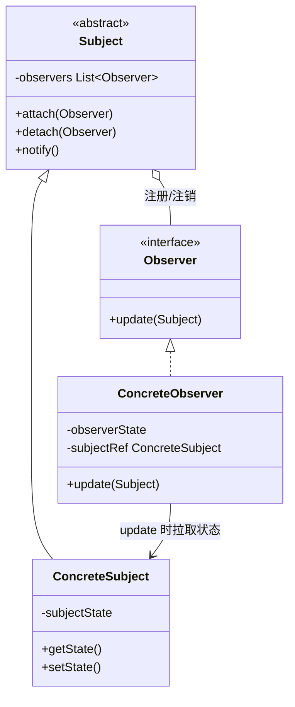
```mermaid
classDiagram
    class Subject {
        <<abstract>>
        -observers List~Observer~
        +attach(Observer)
        +detach(Observer)
        +notify()
    }
    class Observer {
        <<interface>>
        +update(Subject)
    }
    class ConcreteSubject {
        -subjectState
        +getState()
        +setState()
    }
    class ConcreteObserver {
        -observerState
        -subjectRef ConcreteSubject
        +update(Subject)
    }
    Subject <|-- ConcreteSubject
    Observer <|.. ConcreteObserver
    Subject o-- Observer : 注册/注销
    ConcreteObserver --> ConcreteSubject : update 时拉取状态
```

### Participants

* **Subject**：知道其 Observer（任意多个）；提供注册/注销接口；状态变化时通知所有 Observer
* **Observer**：声明 `update(Subject)` 更新接口——传入 Subject，Observer 在 update 里拉取（pull）所需状态
* **ConcreteSubject**：存储状态，状态变化时发出通知
* **ConcreteObserver**：实现 update，向 Subject 查询以同步自身状态

### Consequences

* **抽象耦合**：Subject 只知道 Observer 的抽象接口，双方可在各自一侧独立扩展
* **支持广播通信**：一次通知到达任意多个 Observer，Subject 不需要知道"谁、有多少"
* 代价：**意外的级联更新**：Observer 的 update 又改别的 Subject，可能触发不可预期的连锁，更新链难以追踪
* 代价：Observer **悬空引用**——Subject 持有的 Observer 未注销（尤其对象销毁时），C++ 侧还要防 Subject 删除后 Observer 悬空

### Implementation（push vs pull 是核心）

* **谁触发通知**：由 Subject 的状态修改方法统一调用 `notify()`（保证不漏发）或由客户在合适时机调用（减少碎发）——一致性 vs 粒度的权衡；通知前保证 Subject 状态**自洽**
* **Push 模型 vs Pull 模型**：push——Subject 把变化细节作为参数广播（Observer 省事，但 Subject 臆测了 Observer 的需要）；pull——只发"变了"，Observer 回调时自行查询（Subject 接口要提供查询，Observer 多做一次交互）。两者可混用
* **按方面（aspect）订阅**：attach 时带上感兴趣的事件类别，通知时只发给相关的 Observer，减少无效更新
* **ChangeManager**：当 Subject 与 Observer 是多对多、更新次序有要求时，引入专职对象维护映射与更新顺序——它本身是 **Mediator**（常做成 **Singleton**）
* 多重继承（C++）：ConcreteObserver 常同时继承"领域对象"与"Observer 基类"

### Sample Code（原书 ClockTimer 与数字时钟示例，C++）

原书的示例是时钟：ClockTimer 是走时的 Subject，挂在它上面的数字时钟、模拟时钟表盘是 Observer。先看 Subject 与 Observer 的静态结构——Subject 只知道"有一组 Observer"，不知道它们是谁：

```cpp
class Subject {
public:
    virtual ~Subject();

    virtual void Attach(Observer*);
    virtual void Detach(Observer*);
    virtual void Notify();

protected:
    Subject();

private:
    List<Observer*>* _observers;
};

class Observer {
public:
    virtual ~Observer();

    virtual void Update(Subject* theChangedSubject) = 0;

protected:
    Observer();
};
```

Subject 的实现——登记/注销/广播：

```cpp
void Subject::Attach (Observer* o) {
    _observers->Append(o);
}

void Subject::Detach (Observer* o) {
    _observers->Remove(o);
}

void Subject::Notify () {
    ListIterator<Observer*> i(_observers);

    for (i.First(); !i.IsDone(); i.Next()) {
        i.Current()->Update(this);
    }
}
```

ConcreteSubject 走时。注意 Notify 的时机：**内部状态先改完，再广播**——保证 Observer 来查询时状态自洽：

```cpp
class ClockTimer : public Subject {
public:
    ClockTimer();

    virtual int GetHour();
    virtual int GetMinute();
    virtual int GetSecond();

    void Tick();
};

void ClockTimer::Tick () {
    // update internal time-keeping state
    // ...

    Notify();
}
```

ConcreteObserver 是数字时钟：构造时向 Subject 登记，析构时注销；每次被通知，就从 Subject **拉取**自己需要的数据（pull 模型——Subject 广播时不带数据，Observer 各取所需）。它在原书中同时继承 Widget 与 Observer 两个基类：

```cpp
class DigitalClock : public Widget, public Observer {
public:
    DigitalClock(ClockTimer*);
    virtual ~DigitalClock();

    virtual void Update(Subject*);

    // overrides Widget operation for drawing how the clock looks
    virtual void Draw();

private:
    ClockTimer* _subject;
};

DigitalClock::DigitalClock (ClockTimer* s) {
    _subject = s;
    _subject->Attach(this);
}

DigitalClock::~DigitalClock () {
    _subject->Detach(this);
}

void DigitalClock::Update (Subject* theChangedSubject) {
    if (theChangedSubject == _subject) {
        Draw();
    }
}

void DigitalClock::Draw () {
    // get the new values from the subject

    int hour = _subject->GetHour();
    int minute = _subject->GetMinute();
    // etc.

    // draw the digital clock
}
```

一个 ClockTimer 可以同时挂任意多个 Observer——数字时钟、模拟表盘（AnalogClock）互不干扰：它们都继承 Observer 并在 Update 里 Draw 自己，ClockTimer 不知道它们的类型与数量。

### Known Uses / 现代对应

* 书中：最早也最著名的例子是 Smalltalk 的 Model/View/Controller（MVC）——Model 担任 Subject 角色，View 是 Observer 的基类；Smalltalk、ET++ 和 THINK 类库把 Subject 和 Observer 接口放进系统所有其他类的父类，提供通用的依赖机制；InterViews 显式定义了 Observer 和 Observable 类；Andrew Toolkit 分别称之为"视图"和"数据对象"；Unidraw 把图形编辑器对象分割成 View 和 Subject 两部分
* Java/现代：Swing 与 Android 的各类 Listener、`java.beans.PropertyChangeListener`、RxJava 的 `Observable/Observer`、Spring 事件、消息中间件的 Publish/Subscribe

### Related Patterns

ChangeManager 扮演 **Mediator** 并常为 **Singleton**；Observer 的"一对多广播"与 **Mediator** 的"多方协调"可以互相配合（Colleague 通过事件通知 Mediator）。

## State（别名 Objects for States）

> 允许一个对象在其内部状态改变时改变它的行为。对象看起来似乎修改了它的类。
>
> Allow an object to alter its behavior when its internal state changes.

### Motivation

TCPConnection 的行为随连接状态（LISTEN、ESTABLISHED、CLOSED）而变：同一个 `open()/close()/acknowledge()`，在不同状态下语义完全不同甚至非法。把每个状态做成对象（TCPState 子类），连接把请求委托给当前的 State 对象——状态迁移即"换当前 State 对象"。

### Applicability

* 对象的行为随状态改变而改变，且状态在运行期切换
* 操作中出现**庞大而分散的多部分条件语句**（大量 `switch(state)` 散布各方法），每个分支其实是"某状态下的行为"

### Structure

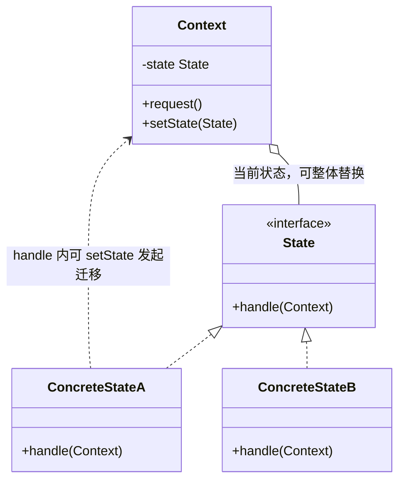
```mermaid
classDiagram
    class Context {
        -state State
        +request()
        +setState(State)
    }
    class State {
        <<interface>>
        +handle(Context)
    }
    class ConcreteStateA {
        +handle(Context)
    }
    class ConcreteStateB {
        +handle(Context)
    }
    State <|.. ConcreteStateA
    State <|.. ConcreteStateB
    Context o-- State : 当前状态，可整体替换
    ConcreteStateA ..> Context : handle 内可 setState 发起迁移
```

### Participants

* **Context**：面向客户的接口；维护一个 ConcreteState 实例作为当前状态
* **State**：声明封装上下文某状态行为的接口
* **ConcreteState subclasses**：实现状态相关行为；（可选）执行状态迁移——决定"下一个状态是谁"

### Consequences

* **将与状态相关的行为局部化**：每个状态一个类，替代散落各方法中的条件分支；新增状态 = 新增类
* **状态迁移显式化**：原来"散在条件里的隐式状态"变成明确的对象切换，迁移路径可读可查
* **State 对象可共享**：无实例字段的状态（大多数）可全局共享一个实例（配合 Flyweight/Singleton）

### Implementation

* **谁定义迁移**：Context 定义（简单、集中，但状态类不自知）；或 State 定义（`Context.setState(this)`，灵活、迁移知识就地局部化——书中倾向后者）
* **表驱动替代**：状态迁移表（当前状态 × 事件 → 次状态/动作）适合迁移规则密集的系统；牺牲类型安全与类的多态表达
* **State 对象的创建**：按需创建后丢弃（状态有实例数据时）；或预先建好共享（无状态时最常见）
* 状态迁移可以发生在 Context 或 State；请求处理前后皆可切换

### Sample Code（原书 TCPConnection 示例，C++）

Context 面向客户：TCPConnection 自己不实现协议行为，把每个事件**委托给当前的 State 对象** `_state`：

```cpp
class TCPConnection {
public:
    TCPConnection();

    void ActiveOpen() {
        _state->ActiveOpen(this);
    }
    void PassiveOpen() {
        _state->PassiveOpen(this);
    }
    void Close() {
        _state->Close(this);
    }
    void Send() {
        _state->Send(this);
    }
    void Acknowledge() {
        _state->Acknowledge(this);
    }
    void Synchronize() {
        _state->Synchronize(this);
    }

    void ProcessOctet(TCPOctetStream*);

    void ChangeState(TCPState*);

private:
    friend class TCPState;

    void Transmit(TCPOctetStream*);

    TCPState* _state;
};
```

State 基类复制了 TCPConnection 的状态改变接口。每一个 TCPState 操作都以一个 TCPConnection 实例作为参数，从而让 TCPState 可以访问 TCPConnection 中的数据和改变连接的状态：

```cpp
class TCPState {
public:
    virtual ~TCPState();

    virtual void ActiveOpen(TCPConnection*);
    virtual void PassiveOpen(TCPConnection*);
    virtual void Close(TCPConnection*);
    virtual void Send(TCPConnection*);
    virtual void Acknowledge(TCPConnection*);
    virtual void Synchronize(TCPConnection*);

protected:
    TCPState();

    void ChangeState(TCPConnection*, TCPState*);

private:
    // ...
};
```

ChangeState 把连接的 `_state` 换成新的 State 对象——状态迁移即"换当前 State 对象"。TCPState 还为各操作提供空缺省实现（"此状态下什么都不做"）：

```cpp
void TCPConnection::ChangeState (TCPState* s) {
    _state = s;
}

void TCPState::Transmit (TCPConnection*, TCPOctetStream*) {
}

void TCPState::Close (TCPConnection*) {
}
```

连接初始处于 CLOSED 状态。TCPClosed 只覆盖自己有意义的操作，其余继承空缺省：

```cpp
TCPConnection::TCPConnection () {
    _state = TCPClosed::Instance();
}
```

```cpp
class TCPClosed : public TCPState {
public:
    static TCPState* Instance();

    virtual void ActiveOpen(TCPConnection*);
    virtual void Close(TCPConnection*);
    // ...
};
```

具体状态在处理事件的同时**发起迁移**——ChangeState 调用就是"换当前 State 对象"。TCPClosed::ActiveOpen 主动打开连接后进入 ESTABLISHED：

```cpp
void TCPClosed::ActiveOpen (TCPConnection* t) {
    // send SYN, receive SYN, ACK, etc.

    ChangeState(t, TCPEstablished::Instance());
}

void TCPClosed::Close (TCPConnection* t) {
}
```

ESTABLISHED 是唯一能发数据的态——Transmit 把工作转发回连接；Close 发 FIN 后进入 LISTEN（TCPListen 与之同理）：

```cpp
class TCPEstablished : public TCPState {
public:
    static TCPState* Instance();

    virtual void Transmit(TCPConnection*, TCPOctetStream*);
    virtual void Close(TCPConnection*);
    virtual void Synchronize(TCPConnection*);
    // ...
};
```

```cpp
void TCPEstablished::Transmit (
    TCPConnection* t, TCPOctetStream* o
) {
    t->Transmit(o);
}

void TCPEstablished::Close (TCPConnection* t) {
    // send FIN, receive ACK of FIN

    ChangeState(t, TCPListen::Instance());
}

void TCPEstablished::Synchronize (TCPConnection* t) {
    // send SYN, receive SYN, ACK, etc.

    ChangeState(t, TCPEstablished::Instance());
}
```

客户全程只对 TCPConnection 说话——同一个 Send，在 CLOSED 下无动作、在 ESTABLISHED 下真正发送，"对象看起来似乎修改了它的类"。State 对象没有实例字段，所以可以共享（TCPState 子类的 Instance() 都是单例，Flyweight 思想）。

### 现代对应

订单/工单流转、游戏 AI 状态机、TCP 连接管理（书中动机本身）；工作流引擎的状态建模。

### Related Patterns

无状态的 State 对象常用 **Flyweight** 共享、常实现为 **Singleton**；与 **Strategy** 结构相同（Context 持有一个可替换的行为对象），但意图不同：**Strategy 由客户选择算法，State 由状态自身驱动迁移**。

## Strategy（别名 Policy）

> 定义一系列的算法，把它们一个个封装起来，并且使它们可相互替换。本模式使得算法可独立于使用它的客户而变化。
>
> Define a family of algorithms, encapsulate each one, and make them interchangeable.

### Motivation

文本排版器可以有多种断行（linebreaking）算法：简单快速、TeX 风格高质量、按列……算法还会继续增加。把每种算法封装为 Compositor（Strategy），排版器（Composition，Context）持有一个 Compositor 并在合适的时机调用——换算法换实例即可，排版器自身不变。

### Applicability

* 许多相关类只是行为有异——用 Strategy 按需配置行为，替代"每行为一个子类"
* 需要一个算法的不同变体（空间换时间等）
* 算法使用了客户不应知道的数据
* 一个类中定义了多种行为且以条件语句切换——把分支搬进各自的 Strategy 类

### Structure

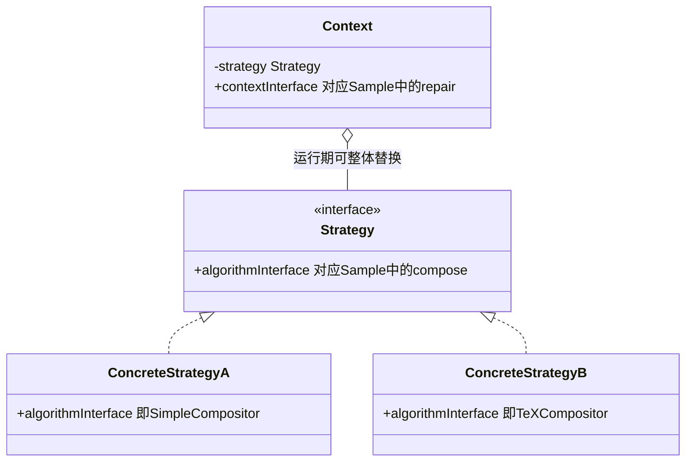
```mermaid
classDiagram
    class Context {
        -strategy Strategy
        +contextInterface 对应Sample中的repair
    }
    class Strategy {
        <<interface>>
        +algorithmInterface 对应Sample中的compose
    }
    class ConcreteStrategyA {
        +algorithmInterface 即SimpleCompositor
    }
    class ConcreteStrategyB {
        +algorithmInterface 即TeXCompositor
    }
    Strategy <|.. ConcreteStrategyA
    Strategy <|.. ConcreteStrategyB
    Context o-- Strategy : 运行期可整体替换
```

### Participants

* **Strategy**：声明所有具体算法的公共接口
* **ConcreteStrategy**：以该接口实现具体算法
* **Context**：持有 Strategy 引用；把工作委托给它（可传自身或数据）

### Consequences

* **算法族**：相关算法形成继承层次，可统一替换
* **替代子类化**：Context 的行为变体用组合注入，避免 Context 子类膨胀
* **消除条件语句**：分支选择变为对象选择
* **提供实现选择**：同一问题可用不同时间/空间权衡的实现
* 代价：**客户必须了解各 Strategy 的差异**才能选择——把实现细节暴露给了客户；对象间通信的开销；策略数量增长

### Implementation

* **Strategy 与 Context 的接口**：算法需要的数据从哪来——参数传入（解耦但接口变化频繁）或把 Context 自身传入（Strategy 调 Context 的查询接口，紧耦合但灵活）——视稳定度选择
* **C++ 模板参数**：把 Strategy 作为模板参数在编译期绑定（静态 Strategy），免去虚调用开销，但失去运行期替换
* Strategy 对象常无状态，最适合做成共享的（Flyweight/无状态单例）

### Sample Code（原书 Compositor 示例，C++）

Strategy 是断行算法的抽象接口——输入每个构件的期望宽度、可伸展/可收缩量与行宽，输出断点位置：

```cpp
class Compositor {
public:
    virtual int Compose(
        Coord natural[], Coord stretchability[], Coord shrinkability[],
        int componentCount, int lineWidth, int breaks[]
    ) = 0;

protected:
    Compositor();
};
```

两个 ConcreteStrategy，差别是算法的**权衡取向**：Simple 填满就断、快速省事；TeX 做整段权衡、质量高但慢。原书只给出两者的声明（算法实现与模式无关）：

```cpp
class SimpleCompositor : public Compositor {
public:
    SimpleCompositor();

    virtual int Compose(
        Coord natural[], Coord stretchability[], Coord shrinkability[],
        int componentCount, int lineWidth, int breaks[]
    );
    // ...
};

class TeXCompositor : public Compositor {
public:
    TeXCompositor();

    virtual int Compose(
        Coord natural[], Coord stretchability[], Coord shrinkability[],
        int componentCount, int lineWidth, int breaks[]
    );
    // ...
};
```

Context 是排版器 Composition：持有构件列表与一个 Compositor：

```cpp
class Composition {
public:
    Composition(Compositor*);

    void Repair();
private:
    Compositor* _compositor;

    Component* _components;    // the list of components
    int _componentCount;       // how many components
    int _lineWidth;            // the Composition's line width
    int* _lineBreaks;          // the position of linebreaks
                               // in components
    int _breakCount;           // the number of linebreaks
};
```

排版主流程 Repair 把断行工作整体委托出去——准备各构件的度量数组、调 Compose 拿到断点、再按断点排布：

```cpp
void Composition::Repair () {
    Coord* natural;
    Coord* stretchability;
    Coord* shrinkability;
    int breakCount;
    Component* lastComponent;

    // prepare arrays with desired width, stretchability,
    // shrinkability of each component

    // ...

    // determine where the breaks are:
    breakCount = _compositor->Compose(
        natural, stretchability, shrinkability,
        _componentCount, _lineWidth, _lineBreaks
    );

    // lay out components according to breaks
    // ...
}
```

同一份内容，换 Strategy 即换排版效果——给 Composition 配 SimpleCompositor 还是 TeXCompositor 的区别只是构造参数；若不用 Strategy，Composition 得为每种算法派生子类（SimpleComposition、TeXComposition……），且换算法必须换对象。Strategy 把"算法选择"变成一个对象引用。

### 现代对应

`Comparator`（排序策略注入）、`ThreadPoolExecutor` 的四种 `RejectedExecutionHandler`、`Map` 的遍历策略参数化。

### Related Patterns

与 **State** 结构相同、意图不同（客户选算法 vs 状态自动迁移）；Strategy 对象适合作为 **Flyweight** 共享。

## Template Method

> 定义一个操作中的算法的骨架，而将一些步骤延迟到子类中。Template Method 使得子类可以不改变一个算法的结构即可重定义该算法的某些特定步骤。
>
> Define the skeleton of an algorithm in an operation, deferring some steps to subclasses.

### Motivation

框架的 Application 打开文档流程固定：检查类型 → 创建文档 → 读入内容 → 恢复视图。步骤顺序是稳定骨架，但"创建什么文档、怎么读"由应用子类决定。把流程写成 `openDocument()`（Template Method），其中的可变步骤留成原语操作（工厂方法/抽象方法）交给子类。

### Applicability

* 一次性实现算法的不变部分，把可变行为留给子类
* 各子类的公共行为应提取、集中到一处（避免代码重复；便于维护时"改一处动全局"）
* 控制子类扩展——模板方法调用的原语操作是受控的扩展点，子类只在该处扩展

### Structure

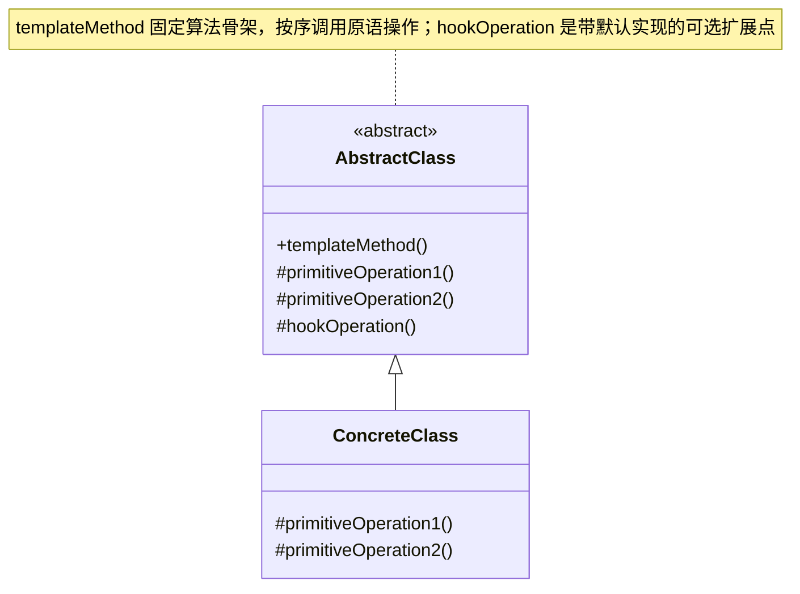
```mermaid
classDiagram
    class AbstractClass {
        <<abstract>>
        +templateMethod()
        #primitiveOperation1()
        #primitiveOperation2()
        #hookOperation()
    }
    class ConcreteClass {
        #primitiveOperation1()
        #primitiveOperation2()
    }
    AbstractClass <|-- ConcreteClass
    note for AbstractClass "templateMethod 固定算法骨架，按序调用原语操作；hookOperation 是带默认实现的可选扩展点"
```

### Participants

* **AbstractClass**：定义抽象原语操作；实现一个模板方法给出算法骨架（调用原语操作）
* **ConcreteClass**：实现原语操作，完成算法中与自身相关的步骤

### Consequences

* **代码复用的基本技术**：不变部分一次性写好（常在框架/基类一侧），可变部分留空给子类——"自顶向下"构造复用
* **反向控制结构（inverted control）**：父类调用子类的操作——即 **Hollywood Principle：*"Don't call us, we'll call you."*（别调用我们，我们会调用你）**——框架掌握流程，应用填空
* 集中了一个算法的可变与不可变部分，每个变体只需覆盖关心的原语

### Implementation

* **C++ 访问控制**：原语操作设为 `protected`（只有模板方法需要调用它们），模板方法设为 `public` 非虚，约定不再被子类覆盖（C++ 无 `final` 的年代靠惯例，Java 应加 `final`）
* **最小化原语操作**：模板方法定义得越多，子类要实现的越多——定义"必要操作"为抽象原语，其余尽量给出默认
* **命名约定**：给"子类应覆盖的原语"一个统一前缀，一眼可辨哪些是扩展点
* **Hook operations（钩子操作）**：提供**默认实现**的原语——子类可覆盖也可不覆盖；比纯抽象原语更宽松，常用于"可选的参与点"

### Sample Code（原书 OpenDocument 骨架，C++）

原书 5.10 复用 Factory Method（3.3）Motivation 的框架例子。模板方法就是 Application::OpenDocument——算法骨架固定：检查、创建、登记、hook、打开、读入、保存，一步不多一步不少：

```cpp
void Application::OpenDocument (const char* name) {
    if (!CanOpenDocument(name)) {
        // cannot handle this document
        return;
    }

    Document* doc = DoMakeDocument();

    _docs->Append(doc);

    AboutToOpenDocument(doc);
    doc->Open();
    doc->DoRead();
    doc->DoSave();
}
```

骨架调用的"原语操作"分两档：**抽象原语**（`DoMakeDocument`，纯虚，子类不实现就没法定稿）与**hook**（`CanOpenDocument`、`AboutToOpenDocument`，带缺省实现、按需覆盖）。Document 侧同构：Open 是骨架里的固定步骤，DoRead/DoSave 留给子类。

客户调的是模板方法，流程由父类主导——这就是反向控制：调用的主动权在基类，子类只提供被调用的原语。这个骨架同时是 Factory Method 的调用方：骨架中的 `DoMakeDocument()` 正是工厂方法——模板方法定"何时创建"，工厂方法定"创建什么"，两个模式在一个流程里分工。

### 现代对应

`HttpServlet#service()` 分发到 `doGet()/doPost()`、`AbstractList` 把 `iterator`/`equals` 等骨架留给具体实现、Spring `JdbcTemplate` 与 Android `AsyncTask` 的回调骨架。

### Related Patterns

模板方法里**调用工厂方法**是常见配合（骨架中的"创建对象"步骤）；与 **Strategy** 都能变化算法——**Template Method 用继承变化（编译期），Strategy 用组合变化（运行期）**。

## Visitor

> 表示一个作用于某对象结构中的各元素的操作。它使你可以在不改变各元素的类的前提下定义作用于这些元素的新操作。
>
> Represent an operation to be performed on the elements of an object structure without changing the classes.

### Motivation

编译器的 AST 节点（AssignmentNode、VariableRefNode…）上要不断添加操作：类型检查、代码生成、格式化打印……每次加操作都要给**所有**节点类加方法，还必须重编译。反转方向：把"操作"做成 Visitor 对象，节点只实现固定的 `accept(visitor)`，新操作 = 新 Visitor 类。原书另一个例子是设备定价/盘点。

### Applicability

* 一个对象结构包含很多类的对象，想对它们实施不依赖具体类的操作
* 需要对结构中的元素做很多**不同且互不相关**的操作，且不想让这些操作"污染"元素类
* 对象结构（元素类）**很少变化**，而作用于其上的**操作经常新增**

### Structure

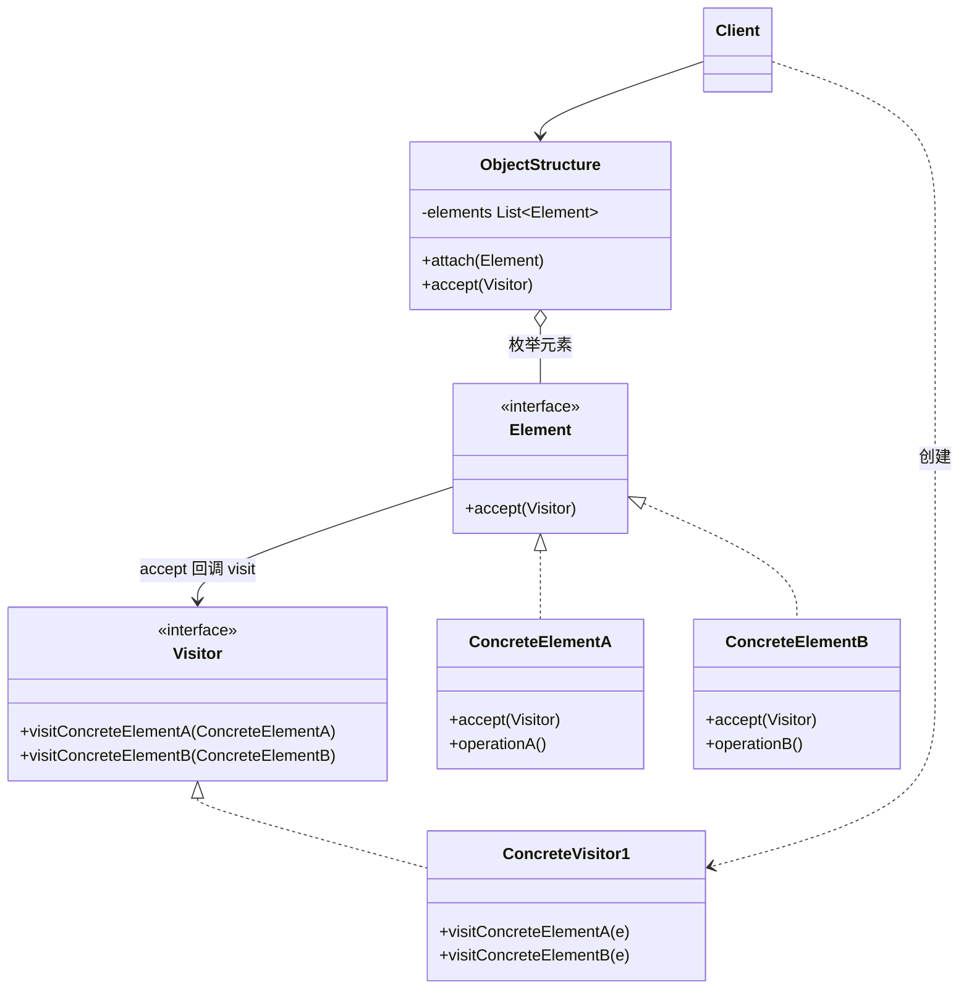
```mermaid
classDiagram
    class Visitor {
        <<interface>>
        +visitConcreteElementA(ConcreteElementA)
        +visitConcreteElementB(ConcreteElementB)
    }
    class ConcreteVisitor1 {
        +visitConcreteElementA(e)
        +visitConcreteElementB(e)
    }
    class Element {
        <<interface>>
        +accept(Visitor)
    }
    class ConcreteElementA {
        +accept(Visitor)
        +operationA()
    }
    class ConcreteElementB {
        +accept(Visitor)
        +operationB()
    }
    class ObjectStructure {
        -elements List~Element~
        +attach(Element)
        +accept(Visitor)
    }
    class Client
    Visitor <|.. ConcreteVisitor1
    Element <|.. ConcreteElementA
    Element <|.. ConcreteElementB
    ObjectStructure o-- Element : 枚举元素
    Element --> Visitor : accept 回调 visit
    Client --> ObjectStructure
    Client ..> ConcreteVisitor1 : 创建
```

### Participants

* **Visitor**：为每个 Element 类声明一个 `visitConcreteElementX()` 操作
* **ConcreteVisitor**：实现这些操作，即作用的具体行为；可累积局部状态
* **Element**：声明 `accept(Visitor)` 接口
* **ConcreteElement**：实现 accept——通常就是一行 `v.visit(this)`
* **ObjectStructure**：能枚举元素的结构（如 Composite），提供高层的 accept 入口
* **Client**：创建 Visitor 并让结构接受它

### Collaborations（double dispatch）

客户让结构迭代元素并调用 `accept(visitor)`；元素在 accept 里回调 `visitor.visit(this)`。两级分派：`accept` 的虚调用由**元素的运行期类型**决定进入哪个 ConcreteElement；其中的 `visit(this)` 因 `this` 的静态类型就是该具体元素类，编译期便选中正确的 visit **重载**，再由 **visitor 的运行期类型**决定执行哪个 ConcreteVisitor 的实现——合起来等价于按「元素类型 × Visitor 类型」两个维度定位操作（double dispatch）。

### Consequences

* **易于新增操作**：一个新 Visitor 类即可，无需触碰任何元素类
* **相关操作集中、无关操作分离**：一个操作的全部逻辑在一个 Visitor 内（局部性好），元素类保持纯净
* 代价：**新增 ConcreteElement 困难**：每加一种元素，Visitor 抽象及所有 Visitor 都要加 `visit` 方法——元素层次稳定是前提
* **可跨类层次访问**：Visitor 只依赖元素接口，可统一处理结构中**不同层次/接口不相关**的元素
* **可累积状态**：Visitor 一边遍历一边收集信息，遍历结束一次性给出结果（而非把中间状态塞进元素）
* 代价：**破坏封装**：Visitor 需要访问元素的状态/内部信息，可能被迫给元素加上本应私有的访问器

### Implementation

* **双分派是实现核心**：accept/visit 的配合替代了 `instanceof` 链
* **由谁遍历**：结构迭代元素逐个 accept（可用 Iterator）；或元素自身递归 accept 子部件（配合 Composite）
* Visitor 的接口按元素具体类型逐一定义——元素越多接口越宽，这正是"元素常变则不宜用 Visitor"的原因

### Sample Code（原书设备结构上的定价与盘点，C++）

原书先用一个通用示例示意 double dispatch 的机制——Element 的 Accept 回调 Visitor 对应的 Visit 操作，具体元素的实现通常只有一行：

```cpp
class Visitor {
public:
    virtual ~Visitor();

    virtual void VisitElementA(ElementA*);
    virtual void VisitElementB(ElementB*);

    // and so on for other concrete elements

protected:
    Visitor();
};

class ElementA : public Element {
public:
    ElementA();

    virtual void Accept(Visitor& v) { v.VisitElementA(this); }
};

class ElementB : public Element {
public:
    ElementB();

    virtual void Accept(Visitor& v) { v.VisitElementB(this); }
};
```

组合节点 CompositeElement 的 Accept 负责让整棵子树都被访问——**先遍历子部件，最后访问自己**：

```cpp
class CompositeElement : public Element {
public:
    virtual void Accept(Visitor&);

private:
    List<Element*>* _children;
};

void CompositeElement::Accept (Visitor& v) {
    ListIterator<Element*> i(_children);

    for (i.First(); !i.IsDone(); i.Next()) {
        i.Current()->Accept(v);
    }
    v.VisitCompositeElement(this);
}
```

接着是设备层次上的真实示例。EquipmentVisitor 为每种设备声明一个 Visit 操作：

```cpp
class EquipmentVisitor {
public:
    virtual ~EquipmentVisitor();

    virtual void VisitFloppyDisk(FloppyDisk*);
    virtual void VisitCard(Card*);
    virtual void VisitChassis(Chassis*);
    virtual void VisitBus(Bus*);
    // and so on

protected:
    EquipmentVisitor();
};
```

Equipment 子类以基本相同的方式定义 Accept——调用 EquipmentVisitor 中对应于接收 Accept 请求的类的操作：

```cpp
void FloppyDisk::Accept (EquipmentVisitor& visitor) {
    visitor.VisitFloppyDisk(this);
}
```

包含其他设备的设备（Composite 一节 CompositeEquipment 的子类）实现 Accept 时，遍历其各个子构件并调用它们各自的 Accept 操作，然后对自己调用 Visit 操作：

```cpp
class Chassis : public CompositeEquipment {
public:
    virtual void Accept(EquipmentVisitor&);
    // ...
};

void Chassis::Accept (EquipmentVisitor& visitor) {
    for (
        ListIterator<Equipment*> i(_equipment);
        !i.IsDone();
        i.Next()
    ) {
        i.Current()->Accept(visitor);
    }
    visitor.VisitChassis(this);
}
```

Visitor 一侧：一个 ConcreteVisitor 就是一个横切操作，边遍历边**累积自己的状态**。PricingVisitor 计算设备结构的价格——简单设备（软盘）取实价，组合设备（Chassis、Bus）取打折价：

```cpp
class PricingVisitor : public EquipmentVisitor {
public:
    PricingVisitor();

    Currency GetTotalPrice();

    virtual void VisitFloppyDisk(FloppyDisk*);
    virtual void VisitCard(Card*);
    virtual void VisitChassis(Chassis*);
    virtual void VisitBus(Bus*);
    // ...

private:
    Currency _total;
};

void PricingVisitor::VisitChassis (Chassis* e) {
    _total += e->DiscountPrice();
}

void PricingVisitor::VisitFloppyDisk (FloppyDisk* e) {
    _total += e->NetPrice();
}

void PricingVisitor::VisitBus (Bus* e) {
    _total += e->DiscountPrice();
}
```

再来一个盘点操作——注意：**新增操作没有碰任何设备类**，这正是 Visitor 存在的理由。InventoryVisitor 为每种设备累计清单（Inventory 类提供 Accumulate 接口，从略）：

```cpp
class InventoryVisitor : public EquipmentVisitor {
public:
    InventoryVisitor();

    Inventory& GetInventory();

    virtual void VisitFloppyDisk(FloppyDisk*);
    virtual void VisitChassis(Chassis*);
    // ...

private:
    Inventory _inventory;
};

void InventoryVisitor::VisitFloppyDisk (FloppyDisk* e) {
    _inventory.Accumulate(e);
}

void InventoryVisitor::VisitChassis (Chassis* e) {
    // do nothing
}
```

同一个结构，按需运行不同的 Visitor；访问过程中由 Accept/Visit 的两级分派（double dispatch）把操作定位到「元素类型 × Visitor 类型」：

```cpp
InventoryVisitor visitor;

equipment->Accept(visitor);
cout << "Inventory=" << visitor.GetInventory();
```

对照：若还想加一个"功耗统计"操作，再写一个 Visitor 即可；但若要加一种新设备（比如显卡 Card），EquipmentVisitor 接口和所有已有的 Visitor 都得改——元素结构稳定、操作常新，才适合这个模式。

### 现代对应

`javax.lang.model.element.ElementVisitor`（注解处理的元素模型）、ASM/Javac 的 AST Visitor、编译器/规则引擎中的结构遍历分析。

### Related Patterns

典型应用对象是 **Composite** 与 **Interpreter** 的 AST；遍历可借 **Iterator** 完成；Visitor 与 **Decorator** 的区别——Decorator 给结构中的对象逐个加职责，Visitor 给整个结构横切地加操作。

## 行为型模式的讨论（原书 5.12）

除少数例外，各个行为模式之间是**相互补充、相互加强**的关系，而不是相互竞争的。本节从四个视角对它们做横向归纳。

### 封装变化

封装变化是很多行为模式的主题。当一个程序的某方面特征经常发生改变时，这些模式就定义一个**封装这方面**的对象，程序的其他部分在依赖这个方面时，都与此对象协作。这些模式通常定义一个抽象类来描述封装变化的对象，并且通常依据这个对象来为模式命名：

* 一个 **Strategy** 对象封装一个算法
* 一个 **State** 对象封装一个与状态相关的行为
* 一个 **Mediator** 对象封装对象间的协议
* 一个 **Iterator** 对象封装对聚集对象中各个构件的访问与遍历方法

这些模式描述了程序中很可能会发生改变的方面。大多数模式都涉及两种对象：封装该方面特征的新对象，以及使用这些新对象的已有对象。如果不使用这些模式，新对象的功能通常就会变成已有对象难以分割的一部分——例如，Strategy 的代码可能会被嵌入它的 Context 类中，而 State 的代码可能会在该状态的 Context 类中直接实现。

但并不是所有的行为模式都这样分割功能。例如 Chain of Responsibility 可以处理**任意数目**的对象（即一条链），而这些对象可能早已存在于系统中。职责链还说明了行为模式之间的另一个不同点：并非所有的行为模式都定义类之间的**静态**通信关系——职责链提供的是在数目**可变**的对象间进行通信的机制；另一些模式则涉及一些**作为参数传递**的对象。

### 对象作为参数

一些模式引入**总是被用作参数**的对象。一个 Visitor 对象就是多态的 Accept 操作的参数，这个操作作用于该 Visitor 所访问的对象。以前常见的做法是把 Visitor 的代码分布在对象结构的各个类中，但 visitor 从来都不是它所访问的对象的一部分。

另一些模式定义一些可以作为**令牌（token）**到处传递、在稍后被调用的对象。Command 和 Memento 都属于这一类：在 Command 中，令牌代表一个请求；而在 Memento 中，令牌代表一个对象在某个特定时刻的内部状态。在这两种情况下，令牌都可以有复杂的内部表示，而客户并不会意识到这一点。二者也有区别：在 Command 中**多态很重要**，因为执行 Command 对象是一个多态的操作；相反，Memento 的接口非常小，以至于备忘录只能作为一个值来传递，因此它很可能根本不给它的客户提供任何多态操作。

### 通信应该被封装还是被分布

Mediator 和 Observer 是**相互竞争**的模式。它们之间的差别是：Observer 通过引入 Observer 和 Subject 对象来**分布**通信，而 Mediator 对象则**封装**了其他对象间的通信。

在 Observer 模式中，不存在一个封装了某个约束的单个对象，而必须由 Observer 和 Subject 对象相互协作来维护这个约束。通信模式由观察者和目标的连接方式决定：一个目标通常有多个观察者，并且有时一个目标的观察者同时也是另一个观察者的目标。Mediator 模式的目的则是集中而不是分布——它把维护一个约束的职责直接放在 Mediator 身上。

权衡是这样的：生成可复用的 Observer 和 Subject，比生成可复用的 Mediator 容易一些。Observer 模式有利于 Observer 和 Subject 间的分割和松耦合，同时这将产生粒度更细从而更易于复用的类。另一方面，相对于 Observer，**Mediator 中的通信流更容易理解**——观察者和目标通常在创建后不久就被连接起来，此后就很难看出它们在程序中是如何连接的。如果你了解 Observer 模式，你会知道观察者和目标间的连接方式很重要、也知道该寻找哪些连接；然而 Observer 引入的间接性仍然会使一个系统难以理解。

原书还观察到一个**语言差异**：Smalltalk 中的 Observer 可以用消息进行参数化以访问 Subject 的状态，因此与 C++ 中的 Observer 相比具有更大的可复用性。这使得 Smalltalk 中 Observer 比 Mediator 更具吸引力——因此 Smalltalk 程序员通常会使用 Observer，而 C++ 程序员则会使用 Mediator。

### 对发送者和接收者解耦

当合作的对象直接互相引用时，它们就变得互相依赖，这可能会对一个系统的分层和复用性产生负面影响。Command、Observer、Mediator 和 Chain of Responsibility 都涉及如何对发送者和接收者解耦，但它们又各有不同的权衡考虑。

**Command** 模式使用一个 Command 对象来定义发送者和接收者之间的绑定关系：Command 对象提供一个提交请求的简单接口（即 Execute 操作）。将发送者和接收者之间的连接定义在一个单独的对象中，使得该发送者可以与不同的接收者一起工作，也就将发送者与接收者解耦、使发送者更易于复用；此外还可以复用 Command 对象，用不同的发送者去参数化一个接收者。虽然该模式描述了避免生成子类的实现技术，但名义上每一个"发送者—接收者"连接都需要一个子类。

**Observer** 模式中的 Subject 和 Observer 接口是为处理目标中发生的变化而设计的，因此当对象间存在数据依赖关系时，最好用观察者模式来对它们解耦——通过定义一个通知目标变化的接口，将发送者（目标）与接收者（观察者）分开。Observer 定义了一个比 Command **更松**的发送者—接收者绑定：一个目标可能有多个观察者，并且观察者的数目可以在运行时变化。

**Mediator** 模式让对象通过一个 Mediator 对象间接地互相引用，从而对它们解耦。一个 Mediator 对象为各 Colleague 对象间的请求提供路由并集中它们的通信，因此各 Colleague 对象仅能通过 Mediator 接口相互交谈。由于这个接口是固定的，为了增加灵活性，Mediator 可能不得不实现它自己的分发策略——可以用某种方式对请求编码并打包参数，使得 Colleague 对象可以请求的操作数目不限。Mediator 模式可以减少一个系统中的子类生成，因为它将通信行为集中到一个类中而不是将其分布在各个子类中；然而，特别的分发策略通常会降低类型安全性。

**Chain of Responsibility** 通过沿一个潜在接收者链传递请求而将发送者与接收者解耦。由于发送者和接收者之间的接口是固定的，职责链可能需要一个定制的分发策略，因此它和 Mediator 一样存在类型安全的问题。如果职责链已经是系统结构的一部分，同时链上的多个对象中总有一个可以处理请求，那么职责链将是一个很好的解耦方法；此外，因为链可以被简单地改变和扩展，这个模式提供了更大的灵活性。

### 总结

行为模式之间相互补充、相互加强。例如，一个职责链中的类可能包含至少一个 Template Method 的应用：该模板方法可以使用原语操作确定该对象是否应处理请求、并选择应该转发的对象。职责链可以使用 Command 模式将请求表示为对象。Interpreter 可以使用 State 模式定义语法分析上下文。迭代器可以遍历一个聚合，而访问者可以对它的每一个元素进行操作。

行为模式也能与其他类模式很好地协同。一个使用 Composite 模式的系统可以用 Visitor 对该组合的各成分进行操作；可以用职责链使各成分通过它们的父类访问某些全局属性；可以用 Decorator 对该组合某些部分的属性进行改写；可以用 Observer 将一个对象结构与另一个对象结构联系起来；可以用 State 使一个构件在状态改变时改变自身的行为。组合本身可以用 Builder 中的方法创建，并且可以被系统中的其他部分当作一个 Prototype。

设计良好的面向对象系统通常有多个模式镶嵌在其中，但其设计者却未必使用这些术语进行思考。然而，**在模式级别——而不是在类或对象级别——上进行系统组装，可以让我们更方便地获取同等的协同性。**
