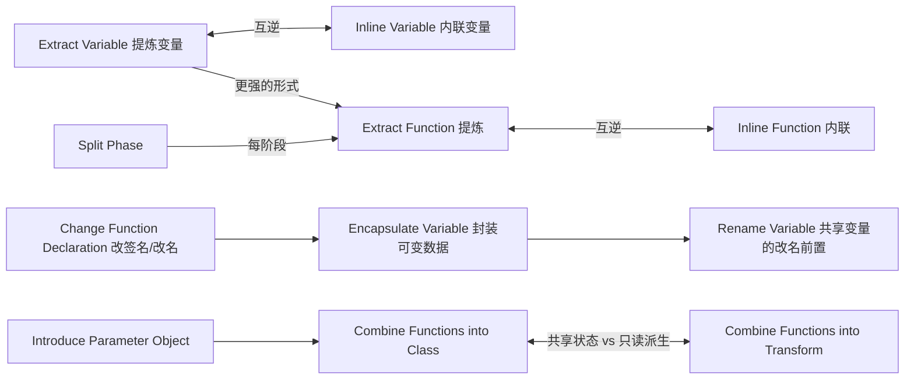

# 第一组重构（A First Set of Refactorings，第 6 章）

第 6 章是全书使用频率最高的一组手法：提炼与内联（函数/变量）、改名与改签名、封装可变数据、共享上下文的两种方式、拆分阶段。它们是其余 50 个手法的"原子操作"。

> 示例用 Java 改写（原书为 JavaScript）。每条按原书条目骨架压缩：意图 → 动机 → 做法 → 示例。

## Extract Function（提炼函数）

> 曾用名：Extract Method（第 1 版）

**意图**：把一段自成一体、能表达一个意图的代码提炼成独立函数，让**函数名说出意图**。

### 动机

* 小函数的价值靠**名字**兑现：读到 `printOwing()` 就不必关心它的 40 行实现。一堆命名良好的短函数读起来像大纲/目录——这比注释更可靠（注释会过期，代码不会）。
* **想写注释的地方，就该提炼函数**：以"时间/步骤"为界的注释段落，逐段提炼。
* 提炼带来复用与覆盖：函数可以被别处调用、被单独测试；超长函数里的局部逻辑无法复用。
* 原书强调：把长函数拆碎**会**带来性能担忧，但几乎总是多虑——小函数反而让优化更容易定位。

### 做法

1. 创建新函数，以它**做的事**命名（"怎么做"留在函数体里）；
2. 把目标代码从源函数拷贝进新函数；检查其中引用的局部变量与源函数后文是否还用；
3. 被提炼代码读取的局部变量 → 作为**参数**传入；只在被提炼代码内修改的临时变量 → 变成新函数内部的临时变量；被提炼代码之后还要用的值 → 用返回值带出（或封装成对象返回）；
4. 编译、测试；逐一替换源函数中的原代码。

> 若被提炼代码要返回**多个**值：先试试提炼出的是否其实是"一个对象"（Introduce Parameter Object / Extract Class），实在不行返回一个小的结果对象。

### 示例

```java
// before
void printOwing(Invoice invoice) {
    Enumeration<Order> e = orders.elements();
    double outstanding = 0.0;
    System.out.print("************************\n***** Customer Owes ****\n************************\n");
    // calculate outstanding
    while (e.hasMoreElements()) {
        Order each = e.nextElement();
        outstanding += each.getAmount();
    }
    System.out.println("name: " + invoice.customer);
    System.out.println("amount: " + outstanding);
}

// after：三个意图各自成函数，主体读起来像目录
void printOwing(Invoice invoice) {
    printBanner();
    double outstanding = calculateOutstanding();
    printDetails(invoice, outstanding);
}

void printBanner() {
    System.out.print("************************\n***** Customer Owes ****\n************************\n");
}

double calculateOutstanding() {
    return orders.stream().mapToDouble(Order::getAmount).sum();
}

void printDetails(Invoice invoice, double outstanding) {
    System.out.println("name: " + invoice.customer);
    System.out.println("amount: " + outstanding);
}
```

要点：`outstanding` 被提炼代码**写**、被主体**读** → 提炼后用返回值接住。

## Inline Function（内联函数）

> 曾用名：Inline Method（第 1 版）

**意图**：函数体与其名字一样清晰（或函数名只是无谓的间接层）时，把身体放回调用处，删掉函数。

### 动机

* 间接本身有成本：跳转、命名误导。当**函数名不能带来超出函数体的信息**，内联让读者直接看到事实；
* 一堆"只转发一下"的小函数构成多层委托链时，内联掉中间层再重新提炼（Extract Function）出真正有价值的边界；
* 它也是 **Split Phase / Extract Class 等大手法的前置清理**：先把无谓结构摊平，再按新边界重组。

### 做法

1. 检查多态：该函数**未被覆写**（子类没有同名 override）才可内联——多态调用点静态看不出来会跑到哪个实现；
2. 找出所有调用点，把函数体替换过去（参数/局部变量按调用点展开）；
3. 删除函数定义，测试。

### 示例

```java
// before
int getRating(Driver driver) {
    return moreThanFiveLateDeliveries(driver) ? 2 : 1;
}
boolean moreThanFiveLateDeliveries(Driver driver) {
    return driver.numberOfLateDeliveries > 5;
}

// after：函数名没有比函数体说出更多
int getRating(Driver driver) {
    return driver.numberOfLateDeliveries > 5 ? 2 : 1;
}
```

## Extract Variable（提炼变量）

> 曾用名：Introduce Explaining Variable（第 1 版）

**意图**：把复杂表达式（或其中一部分）的结果提炼成命名良好的局部变量。

### 动机

* 复杂表达式难以一眼看懂时，把**子表达式**起名，表达式就从"迷宫"变成"公式"；
* 变量名是零成本的文档，且作用域就在眼前；
* 局部变量没有作用域外的副作用顾虑，提炼最安全，常作为更大重构的**垫脚石**。

> 第 2 版的补充：在能方便定义函数的现代语言里，**Extract Function 通常优于 Extract Variable**（函数可复用、不占局部变量空间）；表达式不便于整体成函数（如夹在多层嵌套中间）时，先提炼变量再继续。

### 做法

1. 确认要提炼的表达式**没有副作用**（或副作用可接受/可分离）；
2. 声明不可变的局部变量（Java 用 `final` 语义），把表达式赋给它；
3. 用变量替换原表达式所有出现处，测试。

### 示例

```java
// before
if ((platform.toUpperCase().indexOf("MAC") > -1)
     && (browser.toUpperCase().indexOf("IE") > -1)
     && wasInitialized() && resize > 0) {
    // do something
}

// after
final boolean isMacOs    = platform.toUpperCase().indexOf("MAC") > -1;
final boolean isIEButton = browser.toUpperCase().indexOf("IE") > -1;
final boolean wasResized = resize > 0;
if (isMacOs && isIEButton && wasInitialized() && wasResized) {
    // do something
}
```

## Inline Variable（内联变量）

> 曾用名：Inline Temp（第 1 版）

**意图**：变量名没有比表达式本身更有信息量时，删掉中间变量直接用表达式。

### 动机

* 有时一个临时变量只是把表达式"挪个地方再起个名"，反而多一次跳转；
* 它也常是其他手法的**清障步骤**（如 Replace Temp with Query 之前把无谓的中间变量内联掉）。

### 做法

1. 检查变量的赋值次数：只赋值一次、且**未被按引用传递/别名共享**；
2. 把变量的引用处替换为表达式，删除声明，测试。

### 示例

```java
// before
Order anOrder = orders.get(0);
boolean hasMoreOrders = orders.size() > 1;
return hasMoreOrders ? anOrder.basePrice : basePrice(orders);

// after（名不副实的 hasMoreOrders 不如直接读表达式）
Order anOrder = orders.get(0);
return orders.size() > 1 ? anOrder.basePrice : basePrice(orders);
```

## Change Function Declaration（改变函数声明）

> 曾用名：Rename Method（第 1 版，改名只是它的一部分）

**意图**：修改函数的名字或参数列表——函数的**名字是它的接口文档，参数是它与世界签订的契约**。

### 动机

* **好名字是可理解性的核心**：函数应该"一句话说清它做什么"。发现要写注释才能解释函数时，先改名；
* 参数的形状同样重要：别扭的参数（难构造、易传错、可有可无）会传染所有调用点；很多坏味道（长参数列表、标记参数）的解法最终都落到改签名上；
* 一旦函数是**对外 API**，改签名要走迁移式路线（见做法 2）。

### 做法

1. **简单版**（调用点少、都在掌控内）：改名/改参数，靠编译器找全调用点逐一修正，测试。
2. **迁移版**（调用点多或是已发布 API）：
   1. 若函数体内聚不足，先 **Extract Function** 整理；
   2. 新建一个签名正确的函数，旧函数**转调**新函数（或反之）；
   3. 逐个把调用点改到新签名，每改一批就测试；
   4. 全部迁完后删除旧函数；对外 API 则给旧签名一个 @Deprecated 的宽限期再删。

> 经验：**先加新、再搬家、后删旧**；永远不要"一次全改"——中间每个可提交状态都是健康的。

### 示例

```java
// before：名字缩写含混，参数带单位歧义
double circum(double r) { return 2 * Math.PI * r; }

// after（简单版一步改名）
double circumference(double radius) { return 2 * Math.PI * radius; }

// 迁移版：加参数 precision，旧签名转调新签名过渡
@Deprecated
double circumference(double radius) { return circumference(radius, 1e-6); }
double circumference(double radius, double precision) { ... }
```

## Encapsulate Variable（封装变量）

> 曾用名：Encapsulate Field（第 1 版）

**意图**：把对可变数据结构的直接读写收拢到 getter/setter 函数之后。

### 动机

* **可变数据是多数坏味道的根**（Global Data、Mutable Data）。直接访问的字段无处设防：想加校验、记日志、改内部表示，都无从下手；
* 封装后，读写至少要经过函数这个"关卡"——可以验证、可以通知、可以替换实现；
* 可见性一目了然：谁在读、谁在写可以从调用点查证，这是重构可变数据的第一步；
* 对**不可变**数据无需封装——直接读最省事（能 immutable 就 immutable）。

### 做法

1. 为变量创建取值/设值函数（或使用语言特性）；
2. 把所有直接引用改为调用函数（先改写点，再改读点，或按模块批量）；
3. 收窄变量本身的可见性（private），测试；
4. 若变量是复合结构，继续 **Encapsulate Record**；若重构会跨模块共享，考虑用工厂函数控制访问。

### 示例

```java
// before：全局可变的共享数据，任何角落都能改
public static String defaultOwner = "Mike";

// 调用点直接读写，无人设防
defaultOwner = "Fowler";
String owner = defaultOwner;

// after：读写收拢到关卡之后
private static String defaultOwner = "Mike";

public static String getDefaultOwner()           { return defaultOwner; }
public static void setDefaultOwner(String owner) { defaultOwner = owner; }
```

## Rename Variable（变量改名）

**意图**：给变量起一个能说明其用途的名字。

### 动机

* 好名字是花小钱办大事的可理解性投资，对**数据**尤其重要——变量的用途往往比函数更隐晦；
* 改名要果断：只要有人要问"这个变量是什么意思"，就值得改；
* 作用域越大、越公开，名字越要讲究（公共 API 里的字段名几乎无法再改，此时走 Encapsulate + 迁移路线）。

### 做法

1. 作用域小：直接改名，靠编译器找引用，测试；
2. 变量被广泛共享、无法一步到位：先 **Encapsulate Variable**，再在封装层内改名——外部接口保持稳定。

### 示例

```java
// before：tp / m 都得靠猜
double m = tp * 1.08;
print(m);

// after：只改名，逻辑不动
double totalPrice = ticketPrice * 1.08;
print(totalPrice);
```

## Introduce Parameter Object（引入参数对象）

**意图**：总是结伴出现的一组参数（数据泥团）打包成一个对象。

### 动机

* 一组参数每次都一起传递，说明它们本身构成了一个**概念**（日期范围、坐标、地址……）；
* 成对象的好处立竿见影：签名变短、传错顺序不可能了；而且**行为会长出来**——DateRange 可以校验 start ≤ end，可以回答 overlaps()，这些原本散落在各调用点的 if 里；
* 缩短参数列表是 Long Parameter List 的主力手法。

### 做法

1. 为这组数据声明一个新类（可先用不可变值对象）；
2. 用 **Change Function Declaration（迁移版）** 把这组参数换成新对象，调用点逐个迁移；
3. 每迁完一个函数，观察新类上可以沉淀什么行为（把散落的校验/判断搬进去）。

### 示例

```java
// before：start/end 结伴出现，且做着"范围内"的散装判断
Consumption consumptionInRange(Station station,
                                LocalDate start, LocalDate end) { ... }
void checkRange(LocalDate start, LocalDate end) {
    if (start.isAfter(end)) throw new IllegalArgumentException();
}

// after：泥团成类，校验随之安家
record DateRange(LocalDate start, LocalDate end) {
    DateRange {
        if (start.isAfter(end)) throw new IllegalArgumentException();
    }
    boolean includes(LocalDate day) { ... }
}
Consumption consumptionInRange(Station station, DateRange range) { ... }
```

## Combine Functions into Class（函数组合成类）

> 近似第 1 版的 Replace Method with Method Object（以函数对象取代函数）

**意图**：把一组共享同一批数据（或同一上下文）的函数组织成一个类，数据成为类的字段。

### 动机

* 一组函数操作同一份数据、彼此传递中间结果时，类是最自然的容器：字段替代参数、内部状态显式化、行为与数据同住（Data Class 的反面操作）；
* 常见于"函数内部小函数互相传一堆中间变量"的场景——提升为类后，每一步都能单独测试与重组；
* 与 Combine Functions into Transform 的选择：数据需要**就地共享、可变、分步处理** → 类；只需**一次性派生若干新值** → 变换。

### 做法

1. 把这组函数（及其共享数据）圈出来；创建一个类，以要处理的核心数据命名；
2. 用 **Move Function / Move Field** 把函数与数据搬入类，原来的参数变成字段；
3. 调用点改为创建实例并调用；重复数据搬移直到类完整。

### 示例

```java
// before：三个函数围着同一个 reading 打转，基础费用被算了两遍
double base(Reading reading) { return calculateBaseCharge(reading); }
double taxableCharge(Reading reading) {
    return Math.max(0, base(reading) - taxThreshold(reading.year));
}
double calculateBaseCharge(Reading reading) { ... }

// after：数据成字段，函数成方法，中间结果彼此共享
class ReadingCalculator {
    private final Reading reading;
    ReadingCalculator(Reading reading) { this.reading = reading; }

    double base()              { return calculateBaseCharge(); }
    double taxableCharge()     { return Math.max(0, base() - taxThreshold(reading.year)); }
    private double calculateBaseCharge() { ... }
}
```

## Combine Functions into Transform（函数组合成变换）

**意图**：给出一个（近似不可变的）记录，把若干派生值的计算组合成一个变换函数，返回"原字段 + 派生字段"的丰富副本。

### 动机

* 软件常要对从别处来的数据（JSON、DB 行、API 响应）补齐派生数据再使用。与其让每个使用点各自计算，不如提供**一次变换**；
* 与"组合成类"的区别：变换**不改原数据、不维护可变状态**，产出丰富副本——在数据管道/只读场景更清爽；
* 派生逻辑集中后，往往可以进一步 Replace Derived Variable with Query。

### 做法

1. 创建变换函数，入参是原记录，返回同形状的新记录（副本）+ 新增派生字段；
2. 把各处零散的派生计算逐个 **Move Function** 进变换；
3. 调用点改为使用丰富后的记录，删除零散计算。

### 示例

```java
// before：两个调用点各自做 enrichment，重复且易漂移
Reading base = readingOf("gnarls01");
double baseCharge1 = enrichReading(base).base();
double taxable1 = Math.max(0, baseCharge1 - taxThreshold(base.year));

// after：一次变换，派生字段随副本产出
record EnrichedReading(Reading source, double baseCharge, double taxableCharge) {
    static EnrichedReading enrich(Reading r) {
        double base = calculateBaseCharge(r);
        return new EnrichedReading(r, base, Math.max(0, base - taxThreshold(r.year)));
    }
}
EnrichedReading enriched = EnrichedReading.enrich(readingOf("gnarls01"));
enriched.baseCharge();   // 派生值即取即用
```

## Split Phase（拆分阶段）

**意图**：一段代码在做两件不同的事（如先解析再计算、先计算再渲染），把它们拆成两个独立的阶段，中间用一个中间结构传递。

### 动机

* 看见一段代码里能划出"第 1 步……第 2 步……"时，最 rewarding 的改法往往是**让它们彻底分家**：各阶段只做一件事，中间以明确的数据结构交接；
* 拆开后每一段都更简单、可独立测试，还能各自演化（渲染换 HTML、计算换规则，互不牵连）；
* 导读里剧院账单的"计算/渲染"分家（Split Phase）正是本手法。

### 做法

1. 找出两阶段的边界，确定中间要传递的数据 → 设计中间结构；
2. 用 **Extract Function** 把第二阶段提炼成函数（入参先宽松传入）；
3. 定义中间结构，让第一阶段组装它、第二阶段消费它；逐步把两阶段与原上下文解耦（必要时 **Move Function** 让阶段独立成模块）。

### 示例

```java
// before：一个函数里既算商品定价又算运费（两件事）
double priceOrder(Product product, int quantity, ShippingMethod shippingMethod) {
    double basePrice = product.basePrice * quantity;
    double discount  = Math.max(0, quantity - product.discountThreshold) * product.discountRate;
    double shippingPerCase = basePrice > shippingMethod.discountThreshold
            ? shippingMethod.discountedFee : shippingMethod.feePerCase;
    // ① 价格数据   ② 运费数据 —— 两个阶段搅在一起
    return basePrice - discount + shippingPerCase * quantity;
}

// after：先算价格，再据此算运费；中间用 PriceData 交接
record PriceData(double basePrice, double discount) { }

double priceOrder(Product product, int quantity, ShippingMethod shippingMethod) {
    PriceData data = calculatePricingData(product, quantity);
    return applyShipping(data, shippingMethod, quantity);
}

PriceData calculatePricingData(Product product, int quantity) {
    double basePrice = product.basePrice * quantity;
    double discount  = Math.max(0, quantity - product.discountThreshold) * product.discountRate;
    return new PriceData(basePrice, discount);
}

double applyShipping(PriceData data, ShippingMethod method, int quantity) {
    double shippingPerCase = data.basePrice() > method.discountThreshold
            ? method.discountedFee : method.feePerCase;
    return data.basePrice() - data.discount() + shippingPerCase * quantity;
}
```

---

## 本章手法关系图



下一个自然的问题：数据该怎样封装、值与引用如何取舍 → [03-封装.md](03-封装.md)。
