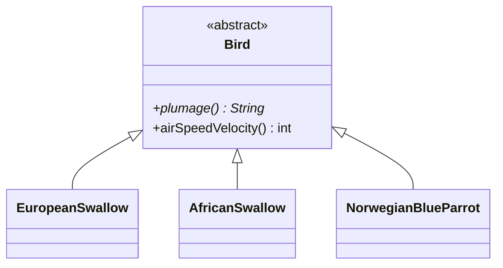

# 简化条件逻辑（Simplifying Conditional Logic，第 10 章）

条件逻辑是最常见的行为分支方式，也是复杂度的主要产地：多层嵌套、跨类重复的 switch、满天飞的 null 检查。本章 6 个手法分别对付：结构（分解/合并/卫语句）、分发（多态）、特例（null 对象）、假设（断言）。

> 示例用 Java 改写（原书为 JavaScript）。

## Decompose Conditional（分解条件表达式）

**意图**：把复杂的条件表达式、then 分支、else 分支各自提炼成命名良好的函数。

### 动机

* 一个含复合逻辑的 if-else 块读起来要同时做三件事：理解条件、理解分支一、理解分支二；
* 分解后，主逻辑读成一句话：`if (isSummer(date)) charge = summerCharge(); else charge = winterCharge();`——**条件和分支的"名字"构成骨架，细节收进各函数**；
* 它是 Extract Function 在条件表达式上的专门应用：条件本身就是个"问题"，值得一个函数名；分支是"回答"，各得其所。

### 做法

1. 对条件表达式 **Extract Function**（以"问题"命名：`isSummer`）；
2. 对 then/else 分支分别 **Extract Function**（以"做什么"命名）；
3. 测试。

### 示例

```java
// before：条件与两个分支都在裸奔
if (date.before(SUMMER_START) || date.after(SUMMER_END)) {
    charge = quantity * winterRate + winterServiceCharge;
} else {
    charge = quantity * summerRate;
}

// after：骨架即注释
if (notInSummer(date)) charge = winterCharge(quantity);
else                   charge = summerCharge(quantity);

boolean notInSummer(Date date) {
    return date.before(SUMMER_START) || date.after(SUMMER_END);
}
double winterCharge(int quantity) { return quantity * winterRate + winterServiceCharge; }
double summerCharge(int quantity) { return quantity * summerRate; }
```

## Consolidate Conditional Expression（合并条件表达式）

**意图**：一串"殊途同归"的条件判断合并成一个条件表达式（再提炼成函数）。

### 动机

* 若干次检查各不相同，但**结论相同**（都返回 0 / 都 continue）——它们其实表达的是同一个"不满足资格"的概念，只是被写散了；
* 合并后用 **Extract Function** 给这个概念起名（如 `isNotEligibleForDisability`），主流程只见概念不见细节；
* 注意前提：这些条件之间**没有副作用、彼此独立**（顺序无所谓）——有顺序依赖时不能合并；若中间夹着其他语句，先把相关语句 **Slide Statements** 聚拢再合并。

### 做法

1. 确认这些条件表达式没有副作用；
2. 用 `&&`/`||` 把它们连成一个布尔表达式（都为真才成立 → `&&`，任一为真即成立 → `||`）；
3. **Extract Function** 给合并后的条件起名，测试。

### 示例

```java
// before：三个检查、同一个结论——其实是同一个概念
double disabilityAmount(Employee emp) {
    if (emp.seniority < 2) return 0;
    if (emp.monthsDisabled > 12) return 0;
    if (emp.isPartTime) return 0;
    // compute the amount ...
}

// after：概念成函数
double disabilityAmount(Employee emp) {
    if (isNotEligibleForDisability(emp)) return 0;
    // compute the amount ...
}

boolean isNotEligibleForDisability(Employee emp) {
    return emp.seniority < 2 || emp.monthsDisabled > 12 || emp.isPartTime;
}
```

## Replace Nested Conditional with Guard Clauses（以卫语句取代嵌套条件表达式）

**意图**：用"条件成立就提前返回"的卫语句（guard clause）取代层层嵌套的条件分支。

### 动机

* 条件嵌套的形式（if-else 套 if-else）暗示"两条路径同等重要"，但多数嵌套的真实结构是：**一个特殊情况 + 一个主干**；
* 卫语句把特殊情况"抢先退货"（early return），主干代码不再缩进到第五层——读者一眼看出"这段才是正题"；
> 很多人被"函数只能有一个出口"的老教条困住。Fowler 明确反对：**"单一出口"规则对短函数毫无意义**——它属于汇编时代长函数的防御术，在处处小函数的现代代码里只会制造嵌套。
* 判断窍门：嵌套的 else 是"不常见的情况"时，用卫语句反转条件先把它请出去。

### 做法

1. 选中最外层的"特殊情况"条件，取反后写成卫语句（提前 return / continue / 抛异常）；
2. 每消除一层嵌套就测试；
3. 全部卫语句立起后，主干通常已经平铺——再视需要 **Extract Function**。

### 示例

```java
// before：主干被三个特殊情况埋进三层嵌套
double payAmount(Employee emp) {
    double result;
    if (emp.isSeparated) {                          // 特殊情况一
        result = separatedAmount();
    } else {
        if (emp.isRetired) {                         // 特殊情况二
            result = retiredAmount();
        } else {
            if (emp.isDead) {                        // 特殊情况三
                result = deadAmount();
            } else {
                result = normalPayAmount();          // ← 主干在最深处
            }
        }
    }
    return result;
}

// after：特殊情况逐个提前退场，主干留在最显眼处
double payAmount(Employee emp) {
    if (emp.isDead)      return deadAmount();
    if (emp.isSeparated) return separatedAmount();
    if (emp.isRetired)   return retiredAmount();
    return normalPayAmount();                        // ← 主干即函数主旨
}
```

## Replace Conditional with Polymorphism（以多态取代条件表达式）

**意图**：按类型分发的条件（switch/if-else 链）换成各类型子类各自实现的多态调用。

### 动机

* 坏味道 Repeated Switches 的终极解法：同一个 type 分支出现在多处（计费一次、积分又一次），每加一个类型都要同步改所有 switch；
* 多态把"分发"交给语言机制：每个类型一个类，各自的变体逻辑写在**自己家**——加类型 = 加子类，改一处逻辑 = 改一个类（对扩展开放，正是 GoF 多态家族的模式所长的用武之地）；
* 前提：没有现成的类型层次时，先走 **Replace Type Code with Subclasses**（或 Extract Superclass / Replace Subclass with Delegate）建层次；导读里剧院账单的最后一步正是本手法；
* **不适用**：只出现一处的 switch（多态反而多出一堆类）、类型在运行期会变（考虑委托，见 [08-处理继承关系.md](08-处理继承关系.md)）。

### 做法

1. 若还没有类层次：先为该类型建子类（Replace Type Code with Subclasses），原类持有工厂函数创建正确子类；
2. 把含条件的函数（或先 Extract Function 出来）搬到**基类**；
3. 在基类中选出一种类型作为默认实现（其余子类覆写），或把基类做成 abstract；
4. 逐个子类覆写：把对应 case 的逻辑搬进子类实现，删除一个分支，测试；重复直到 switch 消失。

### 示例

以原书的"鹦鹉"场景为例（羽毛描述 + 飞行速度，两个 switch 都按鸟种分发）：

```java
// before：两个函数各自按鸟种 switch，加一种鸟要改两处
class Bird {
    String name; String type; int numberOfCoconuts; int voltage; boolean isNailed;

    String plumage() {
        if ("EuropeanSwallow".equals(type)) return "average";
        if ("AfricanSwallow".equals(type))
            return numberOfCoconuts > 2 ? "tired" : "average";
        if ("NorwegianBlueParrot".equals(type))
            return voltage > 100 ? "scorched" : "beautiful";
        return "unknown";
    }

    int airSpeedVelocity() {
        switch (type) {
            case "EuropeanSwallow":     return 35;
            case "AfricanSwallow":      return 40 - 2 * numberOfCoconuts;
            case "NorwegianBlueParrot": return isNailed ? 0 : 10 + voltage / 10;
            default: throw new IllegalStateException(type);
        }
    }
}

// after：分发交给多态——加一种鸟 = 加一个子类，两个函数都不用再碰
abstract class Bird {
    String name;
    abstract String plumage();
    int airSpeedVelocity() { throw new IllegalStateException("unknown"); }  // 默认

    static Bird create(DataPoint data) {          // 工厂取代类型码
        return switch (data.type) {
            case "EuropeanSwallow"     -> new EuropeanSwallow(data);
            case "AfricanSwallow"      -> new AfricanSwallow(data);
            case "NorwegianBlueParrot" -> new NorwegianBlueParrot(data);
            default -> throw new IllegalStateException(data.type);
        };
    }
}
class EuropeanSwallow extends Bird {
    String plumage()          { return "average"; }
    int airSpeedVelocity()    { return 35; }
}
class AfricanSwallow extends Bird {
    int numberOfCoconuts;
    String plumage()          { return numberOfCoconuts > 2 ? "tired" : "average"; }
    int airSpeedVelocity()    { return 40 - 2 * numberOfCoconuts; }
}
class NorwegianBlueParrot extends Bird {
    int voltage; boolean isNailed;
    String plumage()          { return voltage > 100 ? "scorched" : "beautiful"; }
    int airSpeedVelocity()    { return isNailed ? 0 : 10 + voltage / 10; }
}
```



> 建层次的次序技巧：先把**一种**鸟的分支搬进一个子类、删掉一个 case、测试；一种一种地搬。不要一次建齐四个类再搬逻辑——小步原则在这里同样成立。

## Introduce Special Case（引入特例）

> 曾用名：Introduce Null Object（第 1 版）；Null Object 模式正是特例对象的经典应用（见 [../GoF/03-Behavioral-Patterns.md](../GoF/03-Behavioral-Patterns.md) 相关讨论）

**意图**：多处对同一个"特殊值"（最常见是 null）做相同检查时，创建一个代表特例的对象，让它以正常姿态响应同样的接口。

### 动机

* `if (customer == null) ...` 散落各处：查名字时兜底、查账单时兜底、查信用时兜底——同一件事（"未知客户长这样"）写了一百遍；
* 特例对象把"特殊"封装成一个**正常的实例**：它叫 UnknownCustomer，名字返回 "occupant"、账单套餐返回 basic——调用方根本不需要知道它特殊；
* 与多态消除 switch 同理，特例消除的是 null 检查这颗"条件地雷"；一旦特例的行为需要变化，只改一个类。

### 做法

1. 给特例类起一个贴切的名字（NullCustomer、UnknownCustomer、DefaultAddress……），实现与正常类相同的接口；
2. 在"产生 null/特殊值"的地方改为返回特例实例（工厂函数是常见落点）；
3. 逐个删除调用方的 null 检查，改为直接调用；有特判逻辑独有的行为，把它搬进特例类；
4. 若特例需要回答"我是不是特例"，加一个 `isKnown()`/`isNull()` 查询（比 instanceof 干净）。

### 示例

```java
// before：同一个 null 检查在三个调用点重复
class Site {
    Customer customer;
}
String customerName = site.customer == null ? "occupant" : site.customer.name();
BillingPlan plan     = site.customer == null ? BillingPlan.BASIC : site.customer.plan();
int weeksDelinquent  = site.customer == null ? 0 : site.customer.paymentHistory().weeksDelinquentInLastYear();

// after：UnknownCustomer 以正常姿态出现，null 检查整体蒸发
interface Customer {
    String name();
    BillingPlan plan();
    PaymentHistory paymentHistory();
    default boolean isKnown() { return true; }
}

class UnknownCustomer implements Customer {
    public String name()      { return "occupant"; }
    public BillingPlan plan() { return BillingPlan.BASIC; }
    public PaymentHistory paymentHistory() { return PaymentHistory.NULL; }   // 特例可嵌套
    public boolean isKnown()  { return false; }
}

class Site {
    private final Customer customer;
    Site(Customer customer) { this.customer = customer != null ? customer : new UnknownCustomer(); }
    Customer customer() { return customer; }
}

String customerName = site.customer().name();   // 三处调用点统统直取
BillingPlan plan    = site.customer().plan();
```

## Introduce Assertion（引入断言）

**意图**：把"代码假设某个条件此刻必然成立"显式写成断言。

### 动机

* 一段代码常对输入/状态有隐含假设："这里 amount 一定是正数""list 一定已排序"。假设只在作者脑子里，读者靠猜，违反时炸在远处；
> 注释会撒谎（没人更新），**断言不会**——它在每次运行时自我核查。
* 断言的价值在**开发期**：违反假设 = 上游有 bug，当场抓获而不是让脏数据流到下游；它也充当"最强文档"：读断言即知函数的前置条件；
* 与异常校验的分界：断言针对"**不应该发生**"的程序员错误（违反即 bug，修 bug 而不是处理断言）；对外部输入的合法性校验（用户可能输错）仍走正常异常路径，不要用断言替代。

### 做法

1. 找出"只有当 X 成立这段代码才正确"的假设；
2. 在假设生效处写断言（不改变任何逻辑——断言只观察，不影响）；
3. 断言失败的报错信息要能定位假设本身。

### 示例

```java
// before：隐含假设"折扣率非空且小于 1"，但只有作者知道
double applyDiscount(double amount) {
    return amount - amount * customer.discountRate();   // discountRate 为 null 就 NPE
}

// after：假设写在明处（Java 断言默认需 -ea 开启，团队工具链里应打开）
double applyDiscount(double amount) {
    assert customer.discountRate() != null && customer.discountRate() < 1
            : "discountRate 应非空且小于 1: " + customer.discountRate();
    return amount - amount * customer.discountRate();
}

// Java 备注：对"公共入口的契约"更常用显式校验而非 assert
// Objects.requireNonNull(customer, "customer 不能为 null");
// if (rate >= 1) throw new IllegalArgumentException("折扣率必须小于 1");
```

---

## 小结

| 手段 | 对付的条件 |
| --- | --- |
| Decompose / Consolidate | 条件本身的**可读性** |
| Guard Clauses | **嵌套结构**：特殊情况 vs 主干 |
| Polymorphism | 按**类型分发**且分支重复出现 |
| Special Case | 对**同一个特殊值**的重复检查 |
| Assertion | 隐含**假设**的显式化 |

五者常接力使用：先卫语句拍平嵌套，再分解或合并条件，重复的类型分发升级成多态，null 检查沉淀成特例对象。下一章把视线从函数内移到函数间——**API 的形状** → [07-重构API.md](07-重构API.md)。
