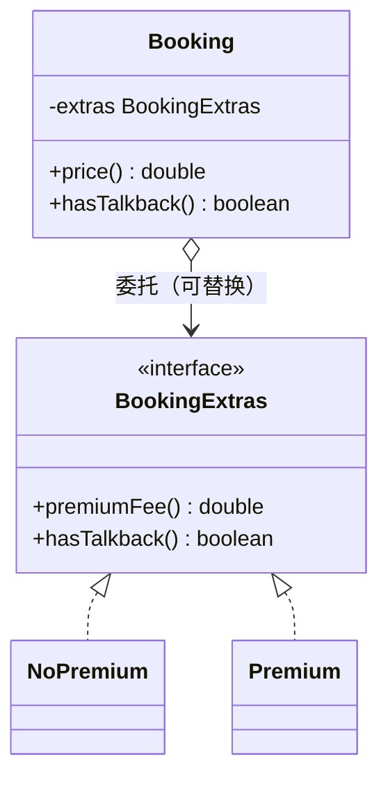

# 处理继承关系（Dealing with Inheritance，第 12 章）

继承是面向对象里最重的结构：建立成本低（一个 extends），改动成本高（层次耦合、单分类轴、运行期不可换）。本章 11 个手法分三组：

* **调整既有层次**：Pull Up / Push Down（函数、字段、构造体）、Collapse Hierarchy；
* **继承的建立与撤销**：Replace Type Code with Subclasses、Remove Subclass、Extract Superclass；
* **以委托取代继承**：Replace Subclass / Superclass with Delegate——继承换组合，GoF *"Favor object composition over class inheritance"* 的重构落地。

> 示例用 Java 改写（原书为 JavaScript）。

## Pull Up Method（函数上移）

**意图**：各子类中完全相同（语义等价）的方法，上移到超类。

### 动机

* 重复的方法散在子类里：改一处忘其余（Duplicated Code 在继承体系中的形态）；
* 有时签名略异但**语义相同**（`getMonthlyCost` vs `getCost`）——先用 Change Function Declaration 统一签名再上移；
* 上移后若子类间还有"看起来相同、细节有异"的逻辑 → 提炼出相同的骨架（Template Method 的雏形，见 [../GoF/03-Behavioral-Patterns.md](../GoF/03-Behavioral-Patterns.md)），差异点做成抽象方法/钩子。

### 做法

1. 检查各子类方法**语义一致**（不只是文本相同——碰巧相同但含义不同的不能合并）；
2. 方法体若有差异：先用 Change Function Declaration / Substitute Algorithm 统一；
3. 上移到超类，从子类删除，测试。

### 示例

```java
// before：两个子类各自实现同样的里程计算
class Car extends Vehicle {
    double range() { return fuel * EFFICIENCY; }
}
class Tank extends Vehicle {
    double range() { return fuel * EFFICIENCY; }
}

// after
class Vehicle {
    double range() { return fuel * EFFICIENCY; }   // 唯一一份
}
```

## Pull Up Field（字段上移）

**意图**：各子类重复持有的同语义字段，上移到超类。

### 动机

* 字段重复往往先于方法重复出现，且常是 Pull Up Method 的前奏：字段上移后，"总在一起用这些字段的方法"更容易看出该上移；
* 分析技巧：子类间重复的**数据**暗示它们本来就在描述同一个概念，超类的抽象可能找错了。

### 做法

1. 确认各子类字段语义一致（名字不同先 Rename Field）；
2. 字段上移（若是 public 字段先 Encapsulate Variable）；
3. 观察随之可以上移的用法，测试。

### 示例

```java
// before
class Car extends Vehicle  { protected double fuel; ... }
class Tank extends Vehicle { protected double fuel; ... }

// after
class Vehicle { protected double fuel; ... }   // 一份数据，全体可用
```

## Pull Up Constructor Body（构造函数本体上移）

**意图**：各子类构造函数中重复的语句，上移到超类构造函数。

### 动机

* 子类构造函数常有一段公共初始化（如都先给 `name` 赋值）——重复且容易漂移；
* Java/JS 构造器不能像普通方法那样整体上移（子类构造器必须先调 `super(...)`），所以上移的是**公共语句段**：让 `super` 承载公共部分，子类构造器只剩差异。

### 做法

1. 超类新建构造函数，收编各子类构造函数中**相同的语句**；
2. 子类构造函数改为 `super(公共参数)` + 各自差异部分；
3. 若公共语句用到子类才有的值：先在超类加抽象方法（工厂/钩子）供构造期取值，或用参数上提，测试。

### 示例

```java
// before：两个子类的构造器都在做"name 赋值"这件事
class Employee {
    String name;
    Employee(String name, String id) { this.name = name; this.id = id; }
    String id;
}
class Department {
    String name;
    List<Staff> staff;
    Department(String name, List<Staff> staff) { this.name = name; this.staff = staff; }
}

// after：name 的初始化上移到 Party
class Party {
    protected String name;
    Party(String name) { this.name = name; }
}
class Employee extends Party {
    String id;
    Employee(String name, String id) { super(name); this.id = id; }          // 只剩差异
}
class Department extends Party {
    List<Staff> staff;
    Department(String name, List<Staff> staff) { super(name); this.staff = staff; }
}
```

## Push Down Method（函数下移）

**意图**：超类中只有某个（或部分）子类需要的方法，下移到真正需要它的子类。

### 动机

* 超类的方法本该是**全体子类的共性**；只对一个子类有意义的方法留在超类，其他子类被迫继承一堆用不上的行为（Refused Bequest 的成因之一）；
* 典型信号：调用方总要 `instanceof` 判断后才敢调超类方法——说明该方法放错了层。

### 做法

1. 确认方法只被某子类的语义需要（其余子类"继承但无意义"）；
2. 在子类建立该方法的实现（超类版本删除或降为抽象）；调用方需要时用类型收窄（cast/模式匹配）调用；
3. 每下移一个方法就测试。

### 示例

```java
// before：只有电话销售用得到 quota，却挂在全体员工头上
abstract class Employee {
    int quota() { return QUOTA; }
}

// after
abstract class Employee { }                 // 超类只留共性
class Telemarketer extends Employee {
    int quota() { return QUOTA; }
}

// 调用方按真实类型使用
if (emp instanceof Telemarketer t) {
    review(t.quota());
}
```

## Push Down Field（字段下移）

**意图**：只被某子类使用的字段，从超类下移到该子类。

### 动机

* 与 Push Down Method 同理：每个子类都背着"别人家的字段"，超类的概念被稀释；
* 字段下移常与方法下移配套：字段走了，围着它转的方法跟着走。

### 做法

1. 确认字段只被一个子类（或明确的子集）使用；
2. 把字段声明挪到子类，删除超类字段，测试。

### 示例

```java
// before
class Employee { String quota; ... }        // 只有销售有配额概念

// after
class Employee { ... }
class Salesman extends Employee { String quota; ... }
```

## Replace Type Code with Subclasses（以子类取代类型码）

**意图**：用类型字段（"engineer"/"salesman"/int 码…）区分子品种的类，改为直接为每个品种建子类，类型分发交给多态。

### 动机

* 类型码是"穷人版多态"：switch/if 分发遍布代码（Repeated Switches），编译器不查穷尽，新增类型靠考古；
* 换成子类后即可用 **Replace Conditional with Polymorphism** 收编所有分发；只有特定类型合法的校验、行为、字段都有了安身处（`Salesman.quota()`）；
* **两个前提**：①类型**运行期不变**（员工不会从工程师变成销售——若会变，改用委托，即 State/Strategy 的思路）；②确实在乎类型带来的行为差异（纯数据的类型区分未必值得子类化，见 Remove Subclass）。

### 做法

1. 用 **Replace Constructor with Factory Function** 把创建点收进工厂；
2. 为一个类型码值建子类，工厂先返回该子类（类型字段暂留）；
3. 把依赖类型码的分支逐个改为多态（Replace Conditional with Polymorphism）；
4. 一个类型一个类型地重复，直到类型字段可删（或仅剩一个"自报类型名"的查询留给序列化用）。

### 示例

```java
// before：type 字段 + 到处 switch
class Employee {
    final String type;                          // "engineer" | "salesman" | "manager"
    Employee(String name, String type) { this.type = type; }

    int monthlySalary() {
        return switch (type) {
            case "engineer" -> baseSalary();
            case "salesman" -> baseSalary() + commission();
            case "manager"  -> baseSalary() + bonus();
            default -> throw new IllegalStateException(type);
        };
    }
}

// after：类型即类，分发即多态；工厂收编创建
abstract class Employee {
    final String name;
    Employee(String name) { this.name = name; }
    abstract int monthlySalary();

    static Employee create(String name, String type) {
        return switch (type) {
            case "engineer" -> new Engineer(name);
            case "salesman" -> new Salesman(name);
            case "manager"  -> new Manager(name);
            default -> throw new IllegalArgumentException(type);
        };
    }
}
class Engineer extends Employee {
    int monthlySalary() { return baseSalary(); }
}
class Salesman extends Employee {
    int monthlySalary() { return baseSalary() + commission(); }
}
class Manager extends Employee {
    int monthlySalary() { return baseSalary() + bonus(); }
}
```

## Remove Subclass（移除子类）

**意图**：子类的差异已消失（或差异只是数据而非行为）时，以超类 + 数据字段取代子类。

### 动机

* 子类的存在理由是"行为/约束的差异"；当差异只剩一个取值（如 `getGenderCode`），维持一堆子类是纯开销：读者要理解整个层次、工厂要分发、每加一个取值要新建类（Speculative Generality 的反面：**过度细分**）；
> 增加子类是为了让系统更易懂——如果它只是在"更像数据字典"，那它就是噪声。
* 与上一手法互为拨盘：行为差异 → 子类化；数据差异 → 字段化。

### 做法

1. 用 **Replace Constructor with Factory Function** 收编子类的创建点；
2. 子类上所有覆写方法：上移为超类的普通方法（差异部分以字段表达），或直接内联；
3. 把"子类身份"变成超类的一个数据字段（构造时传入）；
4. 工厂改为返回超类实例并带上字段值，删除子类，测试。

### 示例

```java
// before：两个子类只为回答一个字母
class Person {
    String name;
}
class Male extends Person   { char getGenderCode() { return 'M'; } }
class Female extends Person { char getGenderCode() { return 'F'; } }

// after：性别是数据不是类型
class Person {
    String name;
    private final char genderCode;
    Person(String name, char genderCode) { this.name = name; this.genderCode = genderCode; }

    char getGenderCode() { return genderCode; }

    static Person create(String name, char code) { return new Person(name, code); }
}
```

## Extract Superclass（提炼超类）

**意图**：两个类有明显的公共特征时，新建超类把公共部分上移。

### 动机

* 相似而不相干的重复（Duplicated Code / Alternative Classes with Different Interfaces）：`Employee` 与 `Department` 都有名字、都要算年度开销——共同点背后是缺一个概念（`Party`，"账单的收件方"）；
* 与 Pull Up 的关系：Extract Superclass 负责**新建骨架**（建类、挂继承），随后逐项 Pull Up Field / Constructor Body / Method；
> 抽象要"薄"：超类只收真正的共性。为了复用而硬塞进超类的成员，会制造新的 Refused Bequest。

### 做法

1. 新建空超类，让目标类 extends 它（先不改任何行为）；
2. 逐个 **Pull Up Field**（数据先行）→ **Pull Up Constructor Body**（公共初始化）→ **Pull Up Method**（公共行为）；
3. 每上移一项就测试；调用方按需改为面向超类编程（Program to an interface，见 [../GoF/00-导读.md](../GoF/00-导读.md)）；
4. 上移完毕后视需要把超类或其中方法标为 abstract（强制子类各自表达）。

### 示例

```java
// before：两个类各自实现"名字 + 年度开销"
class Employee {
    String name; double monthlyCost;
    double annualCost() { return monthlyCost * 12; }
}
class Department {
    String name; List<Staff> staff;
    double annualCost() { return staff.stream().mapToDouble(Staff::annualCost).sum(); }
}

// after：公共概念 Party 浮出水面
abstract class Party {
    protected String name;
    Party(String name) { this.name = name; }
    String name() { return name; }
    abstract double annualCost();               // 共性：会算年度开销
}
class Employee extends Party {
    double monthlyCost;
    Employee(String name, double monthlyCost) { super(name); this.monthlyCost = monthlyCost; }
    double annualCost() { return monthlyCost * 12; }
}
class Department extends Party {
    List<Staff> staff;
    Department(String name, List<Staff> staff) { super(name); this.staff = staff; }
    double annualCost() { return staff.stream().mapToDouble(Staff::annualCost).sum(); }
}
```

## Collapse Hierarchy（折叠继承体系）

**意图**：超类与子类已差异难辨时，把两者合并成一个类。

### 动机

* 层次经过多轮搬移后，子类搬空了、超类膨胀了，两者几乎相同——继续分开维护纯属惯性；
> 层次不是越深越好。当一层只传递、不表达差异时，它该被折叠。

### 做法

1. 选择保留谁（通常留名字更贴切/更常被引用的那个）；
2. 把要消亡一方的成员全部搬进幸存者（Pull Up / Push Down 视方向而定）；
3. 调整引用后删除空类，测试。

### 示例

```java
// before：Department 已被搬空，只剩转发
class Department extends Party { double annualCost() { return staffCost(); } }

// after：合并
class Party { double annualCost() { return staffCost(); } }
```

## Replace Subclass with Delegate（以委托取代子类）

**意图**：子类的变体逻辑改挂到委托对象上：宿主类持有一个"变体接口"的委托字段，行为差异由委托实现。

### 动机

* 继承的两个先天限制在这里爆雷：
  1. **分类轴只有一根**：订单"按时段折扣 × 按客户等级折扣 × 按渠道加价"三个变化轴，单继承只能表达一个——多轴组合要么类爆炸（m × n 个子类），要么把不相关的差异硬塞进一棵树；
  2. **运行期不可换**：对象出生时定了子类就是一辈子（"高级预订"想降级成"普通预订"只能换对象）；
* 委托（组合）两个问题都解：每个变化轴一个委托接口 + 一组实现，宿主可持有任意组合、随时替换——这正是 GoF **Strategy / State** 的结构，也是 *"Favor object composition over class inheritance"* 的重构路径（见 [../GoF/00-导读.md](../GoF/00-导读.md)）；
* 代价：比继承多一层间接。**单轴、类型不变、差异明确**时继承依然是对的选择——别为组合而组合。

### 做法

1. 为变体行为定义接口（若已有子类层次：接口 = 超类中有变体的那些方法）；
2. 创建第一个委托实现（可先从现有子类的逻辑拷贝）；
3. 宿主类加委托字段（可为 null / 默认实现），把变体方法的调用改为经委托转发；
4. 逐个子类逻辑搬进对应委托实现，删掉子类；创建点改为"宿主 + 组装委托"（常配合工厂）；
5. 测试。

### 示例

```java
// before：继承表达"高级预订"——再有一个变化轴（团体/个人）就得 2×2 个子类
class Booking {
    double price() { return basePrice(); }
    boolean hasTalkback() { return date.isAfter(LocalDate.now().plusDays(7)); }
}
class PremiumBooking extends Booking {
    Extras extras;
    double price() { return Math.round(basePrice() + extras.premiumFee()); }
    boolean hasTalkback() { return true; }               // 高级用户永远有答疑
}

// after：变体成为可插拔的委托——多轴各自一个委托字段即可
class Booking {
    private final Show show; private final LocalDate date;
    private BookingExtras extras = BookingExtras.NONE;   // 委托，默认"普通"

    double price() {
        return Math.round(basePrice() + extras.premiumFee());
    }
    boolean hasTalkback() {
        return extras.hasTalkback() || date.isAfter(LocalDate.now().plusDays(7));
    }
    void upgradeToPremium(Extras extras) { this.extras = extras; }   // ← 运行期可切换！
}

interface BookingExtras {                                // 变化轴：预订档位
    double premiumFee();
    boolean hasTalkback();
}
class NoPremium implements BookingExtras {
    public double premiumFee()  { return 0; }
    public boolean hasTalkback() { return false; }
}
class Premium implements BookingExtras {
    private final Extras source;
    public double premiumFee()  { return source.premiumFee(); }
    public boolean hasTalkback() { return true; }
}
```



## Replace Superclass with Delegate（以委托取代超类）

**意图**：子类只是**复用超类实现**、而非真是超类的一种（is-a 不成立）时，把继承改为持有一个超类实例并按需委托。

### 动机

* 继承同时带来三样东西：接口继承（is-a）、实现继承（借用代码）、多态替换（哪里能用超类哪里能用子类）。**只想借用实现**时，另两样是毒药：
  * 子类被迫继承一整套不相关的行为与字段（Refused Bequest 的经典成因）；
  * 外部代码可能把子类当超类用，未来超类演化会波及这些"假子类"；
* 典型症状：`Scroll` extends `CatalogItem` 只为了拿 `id/title/tags`——卷轴**不是**编目条目，它只是**引用了**一个编目条目；
* 改委托后：Scroll 只暴露真正需要的少数方法，CatalogItem 的其余变化不再殃及它。

### 做法

1. 在子类中新建超类实例字段（构造时创建/注入）；
2. 把子类对超类成员的使用逐个改为通过委托字段访问；
3. 对外如确有"当作超类用"的调用方，在子类上保留少量显式委托方法；不再需要 extends 时删除继承关系；
4. 每改一批测试（删除 extends 前，编译器会帮你找出所有残留的隐式依赖）。

### 示例

```java
// before：为借 id/title/tags 而继承——但卷轴并不是编目条目
class Scroll extends CatalogItem {
    LocalDate lastCleaned;
    Scroll(int id, String title, List<String> tags, LocalDate lastCleaned) {
        super(id, title, tags);
        this.lastCleaned = lastCleaned;
    }
    boolean needsCleaning(LocalDate target) {
        int threshold = hasTag("revered") ? 700 : 1500;
        return daysSince(target) > threshold;
    }
}

// after：持有而非继承，只委托真正需要的部分
class Scroll {
    private final CatalogItem catalogItem;          // 组合
    private final LocalDate lastCleaned;

    Scroll(CatalogItem catalogItem, LocalDate lastCleaned) {
        this.catalogItem = catalogItem;
        this.lastCleaned = lastCleaned;
    }

    boolean needsCleaning(LocalDate target) {
        int threshold = catalogItem.hasTag("revered") ? 700 : 1500;
        return daysSince(target) > threshold;
    }
    int id()              { return catalogItem.id(); }       // 按需显式委托
    String title()        { return catalogItem.title(); }
}
```

---

## 小结：继承的三个判断

| 问题 | 答案 | 手法 |
| --- | --- | --- |
| 差异是**行为**还是**数据**？ | 行为 → 子类化；数据 → 字段 | Replace Type Code with Subclasses ↔ Remove Subclass |
| 成员该在**哪一层**？ | 全体共性上移、局部专属下移 | Pull Up / Push Down 一族、Extract Superclass、Collapse Hierarchy |
| 是 **is-a** 还是**只是借用/多轴变化**？ | 借用实现或单轴装不下 → 委托 | Replace Subclass / Superclass with Delegate |

两条互为拨盘的主线贯穿全目录：**提炼 ↔ 内联**（函数、变量、类）、**继承 ↔ 委托**。所有手法的公共底色只有一个——小步、保行为、有测试。

回到 [00-导读.md](00-导读.md)｜坏味道索引见 [01-代码的坏味道.md](01-代码的坏味道.md)
